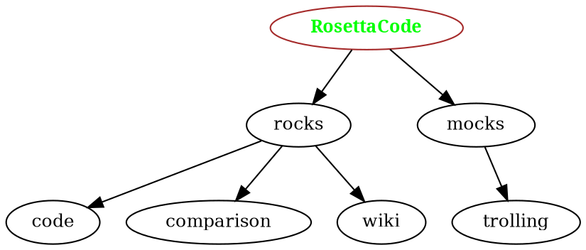

+++
title = "Talk:Tree datastructures"
description = ""
date = 2019-10-20T10:06:27Z
aliases = []
[extra]
id = 22587
[taxonomies]
categories = []
tags = []
+++

==Attribution==
My thanks to Ralf Ebert who asked this [https://stackoverflow.com/q/58398986/10562 question] on Stack Overflow which introduced me to the indent form. I answered his question then thought of RC. --[[User:Paddy3118|Paddy3118]] ([[User talk:Paddy3118|talk]]) 08:28, 17 October 2019 (UTC)

==Good idea for a task – a couple of thoughts.==
This seems a promising kind of task – perhaps worth linking to the Functional Coverage Tree task, so that the latter can use outline parsing routines shaped up here.

A couple of thoughts:

# Perhaps JSON serialisations, both for the nested and numbered data types ?
# Unicode characters beyond the narrowly Anglo-Saxon alphabet ? [[User:Hout|Hout]] ([[User talk:Hout|talk]]) 23:09, 15 October 2019 (UTC)


The simplest nested JSON output (each node a value+list pair) would be:


```txt
[["RosettaCode",[
    ["rocks",[
        ["code",[]],
        ["comparison",[]],
        ["wiki",[]]
    ]],
    ["mocks",[
        ["golfing",[]]
    ]]
]]]
```
 [[User:Hout|Hout]] ([[User talk:Hout|talk]]) 23:43, 15 October 2019 (UTC)


Incidentally, do you feel strongly committed to that particular outline ? For some reason the word 'mock' jars a little (perhaps particularly now that we are beginning to understand more about the destructive potential of digital networks). [[User:Hout|Hout]] ([[User talk:Hout|talk]]) 23:43, 15 October 2019 (UTC)

Similarly, the simplest JSON output list for integer+value tuples would be:


```txt
[[0,"RosettaCode"],
 [1,"rocks"],
 [2,"code"],
 [2,"comparison"],
 [2,"wiki"],
 [1,"mocks"],
 [2,"golfing"]]
```
 [[User:Hout|Hout]] ([[User talk:Hout|talk]]) 23:46, 15 October 2019 (UTC)

:Good Q's. I have a cold (streaming eyes), and will get back to you tomorrow? Thanks. --[[User:Paddy3118|Paddy3118]] ([[User talk:Paddy3118|talk]]) 13:33, 16 October 2019 (UTC)
::Ginger and turmeric are the thing, with hot water in large quantities. [[User:Hout|Hout]] ([[User talk:Hout|talk]]) 13:40, 16 October 2019 (UTC)
:: Appreciated, thanks. --[[User:Paddy3118|Paddy3118]] ([[User talk:Paddy3118|talk]]) 08:24, 17 October 2019 (UTC)

:On those questions.
:JSON: I didn't want to restrict the task that way, as some could make an equal claim for XML or lisp lists - I thought I'd stay more neutral on that point. 
:The outline: There should be one, and only one, blah-de-blah :-) Well actually I loved my rocks/mocks pun too much and just slapped in "golfing" as a bad afterthought. I think it is very useful to have the one tree for all language examples, but I stopped mocking golfing years and years ago - its not for RC, but not for mocking IMHO. I have tried for a late save with a note, but is it too late to ask for all examples to update to use just "trolling"?
::Your task statement sensibly specifies code that is outline-independent, so any change would, if the code is working, be a quick copy-paste.
:: (I can speak for 4 of the 7 current entries, all of which I would very happy to change :-)
::To be honest, I feel a little embarrassed by any 'mocking' / 'trolling' references – people are dying from it at the moment – I think I would feel less uneasy with something a bit more plausible and motivating – maybe something that gave a sense of the contexts in which one might actually want to work with a tree structure, or something related to the content ? [[User:Hout|Hout]] ([[User talk:Hout|talk]]) 08:41, 17 October 2019 (UTC)

::: Let's go for it then. I'll Update the task text to only specify "trolling", and my Python; you update your examples to use "trolling".
::: Could you also put an incomplete box on the other examples informing them of the update?
::: Thanks --[[User:Paddy3118|Paddy3118]] ([[User talk:Paddy3118|talk]]) 08:19, 18 October 2019 (UTC)

::: I'm a little puzzled ... now you want references to 'mocking' *and* to 'trolling' ? Not really an example that I can feel relaxed about. For the moment I will just withdraw my examples. I really don't want to propagate jokes about mocking and trolling  [[User:Hout|Hout]] ([[User talk:Hout|talk]]) 08:37, 18 October 2019 (UTC)

==And when comparison has children?==
--[[User:Nigel Galloway|Nigel Galloway]] ([[User talk:Nigel Galloway|talk]]) 13:03, 16 October 2019 (UTC)

Depends, of course, on the implementation of equality in each language. For JS I have had to hand-write a recursive '''eq'''. Haskell's '''Data.Tree''' module includes a Tree instance for the Eq class.  Python's (==) equality is recursive out of the box. [[User:Hout|Hout]] ([[User talk:Hout|talk]]) 13:27, 16 October 2019 (UTC)

:Hi, I added a note to the task to try and downplay the significance of this part of the task after this query as I would like the datastructures and the conversion between them to be central. --[[User:Paddy3118|Paddy3118]] ([[User talk:Paddy3118|talk]]) 08:40, 18 October 2019 (UTC)

==Deriving a tree from a list of lines with their indent levels==
For what its worth, a declarative description which is also a recursive algorithm might look something like:

```txt
If a forest is understood as a list of trees,
then the forest structure of an indented outline is either
    an empty list,
        (if the outline contains no lines)
    or a list with a tree at its head, and a tail which is a forest.
        The head tree:
            - has the first line of the outline as its value
            - and has a (possibly empty) child list 
                    which is the forest structure of all the lines (if any) which:
                        - follow the first line,
                        - and precede its next peer
                            (the next line that shares the first's indent level)
        The tail forest has the structure of the remaining outline, 
            - from the next line which shares the indent level of the first line, 
            - to the last line of the outline.
```


==Generic tree to indent-type datastructure conversion==
The following is the diagram from the [[Tree traversal]] task annotated with depth information for the nodes:
                     :NODE_DEPTH
          1              :0
         / \
        /   \
       /     \
      2       3          :1
     / \     /
    4   5   6            :2
   /       / \
  7       8   9          :3

A '''preorder''' traversal of the tree outputting <code>(node_depth, node_name)</code> pairs will generate the indent form of this and other rooted trees.  --[[User:Paddy3118|Paddy3118]] ([[User talk:Paddy3118|talk]]) 21:43, 19 October 2019 (UTC)

==Task tree in dot format, and diagram==




* [https://commons.wikimedia.org/wiki/File:RC_Tree_Datastructures_diagram.svg  Diagram of tree shown in task: Tree datastructures]

 --[[User:Paddy3118|Paddy3118]] ([[User talk:Paddy3118|talk]]) 10:06, 20 October 2019 (UTC)
