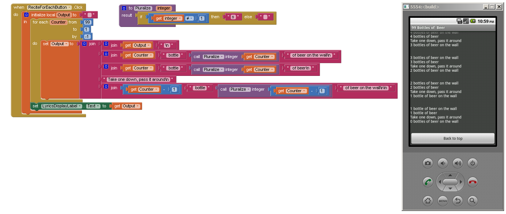
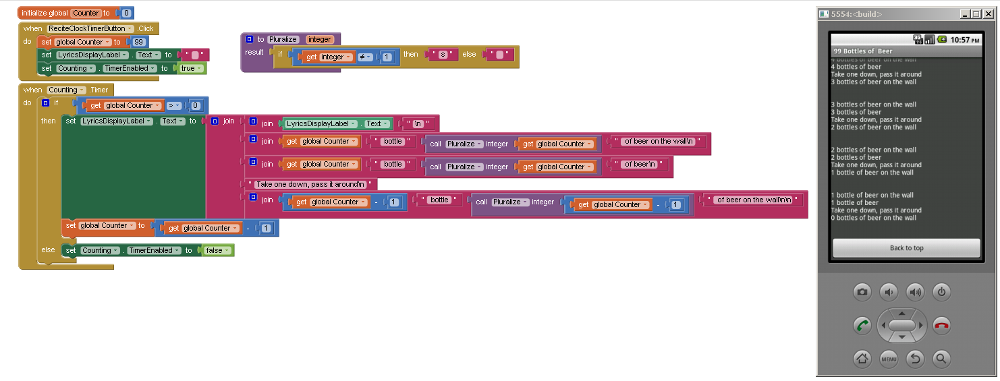

+++
title = "99 Bottles of Beer"
description = ""
date = 2019-10-01T22:11:28Z
aliases = []
[extra]
id = 2663
task = """
  Display the complete lyrics for the song
  "99 Bottles of Beer on the Wall".
"""
[taxonomies]
categories = []
tags = []
+++

The lyrics follow this form:

> 99 bottles of beer on the wall \
> 99 bottles of beer \
> Take one down, pass it around \
> 98 bottles of beer on the wall \
> \
> 98 bottles of beer on the wall \
> 98 bottles of beer \
> Take one down, pass it around \
> 97 bottles of beer on the wall


… and so on, until reaching 0.

Grammatical support for "1 bottle of beer" is optional.

As with any puzzle, try to do it in as creative/concise/comical a way
as possible (simple, obvious solutions allowed, too).


**Related tasks:**

*   [The Twelve Days of Christmas](/tasks/the-twelfe-days-of-christmas)
*   [Old Lady Swallowed a Fly](/tasks/old-lady-swallowed-a-fly)
*   [Mad Libs](/tasks/mad-libs)


**See also:**

*   <http://99-bottles-of-beer.net>
*   <https://en.wikipedia.org/wiki/99_Bottles_of_Beer>


## 0815

See [99 Bottles of Beer/EsoLang](esolang)


## 360 Assembly

See [99 Bottles of Beer/Assembly](assembly)


## 6502 Assembly

See [99 Bottles of Beer/Assembly](assembly)


## 6800 Assembly

See [99 Bottles of Beer/Assembly](assembly)


## 8th


```forth
\ 99 bottles of beer on the wall:
: allout "no more bottles" ;
: just-one "1 bottle"  ;
: yeah!	 dup . " bottles" ;

[
	' allout ,
	' just-one ,
	' yeah! ,
] var, bottles

: .bottles  dup 2 n:min bottles @ swap caseof ;
: .beer     .bottles . " of beer" . ;
: .wall     .beer " on the wall" . ;
: .take     "  Take one down and pass it around" . ;
: beers     .wall ", " . .beer '; putc cr
			n:1- 0 max .take ", " .
			.wall '. putc cr drop ;

' beers 1 99 loop- bye
```


## ABAP

```ABAP
REPORT z99bottles.

DATA lv_no_bottles(2) TYPE n VALUE 99.

DO lv_no_bottles TIMES.
  WRITE lv_no_bottles NO-ZERO.
  WRITE ' bottles of beer on the wall'.
  NEW-LINE.
  WRITE lv_no_bottles NO-ZERO.
  WRITE ' bottles of beer'.
  NEW-LINE.
  WRITE 'Take one down, pass it around'.
  NEW-LINE.
  SUBTRACT 1 FROM lv_no_bottles.
  WRITE lv_no_bottles NO-ZERO.
  WRITE ' bottles of beer on the wall'.
  WRITE /.
ENDDO.
```


or (With ABAP 7.40)


```ABAP
REPORT YCL_99_BOTTLES.

DATA it_99_bottles TYPE TABLE OF string WITH EMPTY KEY.
DATA(cr_lf) = cl_abap_char_utilities=>cr_lf.
it_99_bottles = VALUE #(
    FOR i = 99 THEN i - 1 UNTIL i = 0 ( COND string( LET  lv = ( i - 1 )
                                                          lr = i && | bottles of beer on the wall|
                                                                 && cr_lf
                                                                 && i && | bottles of beer|
                                                                 && cr_lf
                                                                 && |Take one down, pass it around|
                                                                 && cr_lf
                                                                 && lv && | bottles of beer on the wall|
                                                                 && cr_lf IN WHEN 1 = 1 THEN lr )
                                      )
                         ).
cl_demo_output=>write( it_99_bottles ).
cl_demo_output=>display( ).
```


## ACL2

See [99 Bottles of Beer/Lisp](lisp)


## ActionScript

```ActionScript
for(var numBottles:uint = 99; numBottles > 0; numBottles--)
{
	trace(numBottles, " bottles of beer on the wall");
	trace(numBottles, " bottles of beer");
	trace("Take one down, pass it around");
	trace(numBottles - 1, " bottles of beer on the wall\n");
}
```


## Ada

### Simple Version

```ada
with Ada.Text_Io; use Ada.Text_Io;

 procedure Bottles is
 begin
    for X in reverse 1..99 loop
       Put_Line(Integer'Image(X) & " bottles of beer on the wall");
       Put_Line(Integer'Image(X) & " bottles of beer");
       Put_Line("Take one down, pass it around");
       Put_Line(Integer'Image(X - 1) & " bottles of beer on the wall");
       New_Line;
    end loop;
 end Bottles;
```


### Concurrent Version

with 1 task to print out the information
and 99 tasks to specify the number of bottles.

```Ada
with Ada.Text_Io; use Ada.Text_Io;

procedure Tasking_99_Bottles is
   subtype Num_Bottles is Natural range 1..99;
   task Print is
      entry Set (Num_Bottles);
   end Print;
   task body Print is
      Num : Natural;
   begin
      for I in reverse Num_Bottles'range loop
         select
         accept
            Set(I) do -- Rendezvous with Counter task I
               Num := I;
            end Set;
            Put_Line(Integer'Image(Num) & " bottles of beer on the wall");
            Put_Line(Integer'Image(Num) & " bottles of beer");
            Put_Line("Take one down, pass it around");
            Put_Line(Integer'Image(Num - 1) & " bottles of beer on the wall");
            New_Line;
         or terminate; -- end when all Counter tasks have completed
         end select;
      end loop;
   end Print;
   task type Counter(I : Num_Bottles);
   task body Counter is
   begin
      Print.Set(I);
   end Counter;
   type Task_Access is access Counter;

   Task_List : array(Num_Bottles) of Task_Access;

begin
   for I in Task_List'range loop -- Create 99 Counter tasks
      Task_List(I) := new Counter(I);
   end loop;
end Tasking_99_Bottles;
```


## Aime

```aime
integer bottles;

bottles = 99;

do {
    o_(bottles, " bottles of beer on the wall\n");
    o_(bottles, " bottles of beer\n");
    o_("Take one down, pass it around\n");
    o_(bottles -= 1, " bottles of beer on the wall\n\n");
} while (bottles);
```


## Algae

```algae

# 99 Bottles of Beer on the Wall
# in Algae
# bottles.A
for (i in 99:1:1) {
    if (i != 1) {
        printf("%d bottles of beer on the wall\n";i);
        printf("%d bottles of beer...\n";i);
        printf("you take on down and pass it around...\n");
        if ( i == 2) {
            printf("%d bottles of beer on the wall\n\n";i-1);
        else
            printf("%d bottles of beer on the wall\n\n";i-1);
        }
    else
       printf("1 bottle of beer on the wall\n");
       printf("1 bottle of beer...\n");
       printf("you take on down and pass it around..\n");
       printf("no more bottles of beer on the wall!\n\n");
    }
}

```


## ALGOL 68

Works with ALGOL 68|Standard - no extensions to language used.
Works with ALGOL 68G|Any - tested with release mk15-0.8b.fc9.i386.
<!-- {{not works with|ELLA ALGOL 68|Any (with appropriate job cards) -
  tested with release 1.8.8d.fc9.i386 - printf has been removed}} -->

```algol68
main:(
   FOR bottles FROM 99 TO 1 BY -1 DO
     printf(($z-d" bottles of beer on the wall"l$, bottles));
     printf(($z-d" bottles of beer"l$, bottles));
     printf(($"Take one down, pass it around"l$));
     printf(($z-d" bottles of beer on the wall"ll$, bottles-1))
   OD
)
```


## ALGOL-M


```algol

BEGIN

COMMENT PRINT LYRICS TO "99 BOTTLES OF BEER ON THE WALL";

STRING FUNCTION BOTTLE(N); % GIVE CORRECT GRAMMATICAL FORM %
INTEGER N;
BEGIN
   IF N = 1 THEN
      BOTTLE := " BOTTLE"
   ELSE
      BOTTLE := " BOTTLES";
END;

INTEGER N;

N := 99;
WHILE N > 0 DO
   BEGIN
      WRITE(N, BOTTLE(N), " OF BEER ON THE WALL,");
      WRITEON(N, BOTTLE(N), " OF BEER");
      WRITE("TAKE ONE DOWN AND PASS IT AROUND, ");
      N := N - 1;
      IF N = 0 THEN
          WRITEON("NO MORE")
      ELSE
          WRITEON(N);
      WRITEON(BOTTLE(N), " OF BEER ON THE WALL");
      WRITE(" "); % BLANK LINE BETWEEN STANZAS %
   END;
WRITE("THANKS FOR SINGING ALONG!");

END

```


## AmigaE


```amigae
PROC main()
  DEF t: PTR TO CHAR,
      s: PTR TO CHAR,
      u: PTR TO CHAR, i, x
  t := 'Take one down, pass it around\n'
  s := '\d bottle\s of beer\s\n'
  u := ' on the wall'
  FOR i := 99 TO 0 STEP -1
    ForAll({x}, [u, NIL], `WriteF(s, i, IF i <> 1 THEN 's' ELSE NIL,
                           x))
    IF i > 0 THEN WriteF(t)
  ENDFOR
ENDPROC
```


## Apache Ant

Implementation in Apache Ant, due to the limitations of Ant, this requires ant-contrib for arithmetic operations and a dummy target to keep Ant from detecting the loop.

```xml
<?xml version="1.0"?>
<project name="n bottles" default="99_bottles">

  <!-- ant-contrib.sourceforge.net for arithmetic and if -->
  <taskdef resource="net/sf/antcontrib/antcontrib.properties"/>

  <!-- start count of bottles, you can set this with
    e.g. ant -f 99.xml -Dcount=10 -->
  <property name="count" value="99"/>

  <target name="99_bottles">
    <antcall target="bottle">
      	<param name="number" value="${count}"/>
    </antcall>
  </target>

  <target name="bottle">
    <echo message="${number} bottles of beer on the wall"/>
    <echo message="${number} bottles of beer"/>
    <echo message="Take one down, pass it around"/>

    <math result="result" operand1="${number}" operation="-" operand2="1" datatype="int"/>

    <echo message="${result} bottles of beer on the wall"/>

    <if>
      <not><equals arg1="${result}" arg2="0" /></not>
      <then>
        <antcall target="bottleiterate">
          <param name="number" value="${result}"/>
        </antcall>
      </then>
    </if>
  </target>

  <target name="bottleiterate">
    <antcall target="bottle">
      	<param name="number" value="${number}"/>
    </antcall>
  </target>

</project>
```


## Apex

```apex

   for(Integer i = 99; i=0; i--){
      system.debug(i + ' bottles of beer on the wall');
      system.debug('\n');
      system.debug(i + ' bottles of beer on the wall');
      system.debug(i + ' bottles of beer');
      system.debug('take one down, pass it around');
   }

```


## APL

Works with Dyalog APL.

Translated from J.

```apl
  bob  ←  { (⍕⍵), ' bottle', (1=⍵)↓'s of beer'}
  bobw ←  {(bob ⍵) , ' on the wall'}
  beer ←  { (bobw ⍵) , ', ', (bob ⍵) , '; take one down and pass it around, ', bobw ⍵-1}
  ↑beer¨ ⌽(1-⎕IO)+⍳99
```


## App Inventor

### Using a 'for each <number>' block (simplest)

Note that the output label text is not displayed
until the entire lyrics text has been built
and there is some delay between button press and display.




### Using a Clock Timer block (preferrred)

Output can be sent directly to a label with this preferred method
as there is no noticeable delay between button press and output.




## AppleScript

### Iteration

```Applescript
repeat with beerCount from 99 to 1 by -1
  set bottles to "bottles"
  if beerCount < 99 then
    if beerCount = 1 then
      set bottles to "bottle"
    end
    log "" & beerCount & " " & bottles & " of beer on the wall"
    log ""
  end
  log "" & beerCount & " " & bottles & " of beer on the wall"
  log "" & beerCount & " " & bottles & " of beer"
  log "Take one down, pass it around"
end
log "No more bottles of beer on the wall!"
```


### Declaration


```AppleScript
-- BRIEF -----------------------------------------------------------------------
on run
    set localisations to ¬
        {"on the wall", ¬
            "Take one down, pass it around", ¬
            "Better go to the store to buy some more", "bottle"}

    intercalate("\n\n", ¬
        (map(curry(incantation)'s |λ|(localisations), enumFromTo(99, 0))))
end run


-- DECLARATIVE -----------------------------------------------------------------

-- incantation :: [String] -> Int -> String
on incantation(xs, n)
    script asset
        on |λ|(n)
            unwords({(n as string), item -1 of xs & cond(n ≠ 1, "s", "")})
        end |λ|
    end script

    script store
        on |λ|(n)
            unwords({asset's |λ|(n), item 1 of xs})
        end |λ|
    end script

    set {distribute, solve} to items 2 thru 3 of xs
    if n > 0 then
        unlines({store's |λ|(n), asset's |λ|(n), distribute, store's |λ|(n - 1)})
    else
        solve
    end if
end incantation


-- GENERICALLY DYSFUNCTIONAL ---------------------------------------------------

-- cond :: Bool -> a -> a -> a
on cond(bln, f, g)
    if bln then
        f
    else
        g
    end if
end cond

-- curry :: (Script|Handler) -> Script
on curry(f)
    script
        on |λ|(a)
            script
                on |λ|(b)
                    |λ|(a, b) of mReturn(f)
                end |λ|
            end script
        end |λ|
    end script
end curry

-- enumFromTo :: Int -> Int -> [Int]
on enumFromTo(m, n)
    if m > n then
        set d to -1
    else
        set d to 1
    end if
    set lst to {}
    repeat with i from m to n by d
        set end of lst to i
    end repeat
    return lst
end enumFromTo

-- intercalate :: Text -> [Text] -> Text
on intercalate(strText, lstText)
    set {dlm, my text item delimiters} to {my text item delimiters, strText}
    set strJoined to lstText as text
    set my text item delimiters to dlm
    return strJoined
end intercalate

-- map :: (a -> b) -> [a] -> [b]
on map(f, xs)
    tell mReturn(f)
        set lng to length of xs
        set lst to {}
        repeat with i from 1 to lng
            set end of lst to |λ|(item i of xs, i, xs)
        end repeat
        return lst
    end tell
end map

-- Lift 2nd class handler function into 1st class script wrapper
-- mReturn :: Handler -> Script
on mReturn(f)
    if class of f is script then
        f
    else
        script
            property |λ| : f
        end script
    end if
end mReturn

-- unlines :: [String] -> String
on unlines(xs)
    intercalate(linefeed, xs)
end unlines

-- unwords :: [String] -> String
on unwords(xs)
    intercalate(space, xs)
end unwords
```


## Arbre


```Arbre

bottle(x):
  template: '
  $x bottles of beer on the wall.
  $x bottles of beer.
  Take one down and pass it around,
  $y bottles of beer on the wall.
  '

  if x==0
    template~{x: 'No more', y: 'No more'}
  else
    if x==1
      template~{x: x, y: 'No more'}
    else
      template~{x: x, y: x-1}

bottles(n):
  for x in [n..0]
    bottle(x)

99bottles():
  bottles(99) -> io


```


## Argile


```Argile
use std

let X be an int
for each X from 99 down to 1
  prints X bottles of beer on the wall
  prints X bottles of beer
  prints "Take one down, pass it" around
  if X == 1
    echo No more "beer." Call da "amber lamps"
    break
  X--
  prints X bottles of beer on the wall "\n"
  X++
  .:around :. -> text {X>59 ? "around", "to me"}
  .:bottles:. -> text {X> 5 ? "bottles", (X>1 ? "buttles", "wall")}
  .:of beer:. -> text {X>11 ? "of beer", "ov beeer"}
  .:on the wall:. -> text {
    X>17 ? "on the wall", (X>1 ? "on the bwall", "in the buttle")
  }
```


## ARM Assembly

See [99 Bottles of Beer/Assembly](assembly)


## ArnoldC

As ArnoldC does not feature string concatenation, the numbers of bottles and the rest of the parts of the lyrics are printed on separate lines.

```ArnoldC
IT'S SHOWTIME
HEY CHRISTMAS TREE is0
YOU SET US UP @NO PROBLEMO
HEY CHRISTMAS TREE bottles
YOU SET US UP 99
STICK AROUND is0
TALK TO THE HAND bottles
TALK TO THE HAND " bottles of beer on the wall"
TALK TO THE HAND bottles
TALK TO THE HAND " bottles of beer"
TALK TO THE HAND "Take one down, pass it around"
GET TO THE CHOPPER bottles
HERE IS MY INVITATION bottles
GET DOWN 1
ENOUGH TALK
TALK TO THE HAND bottles
TALK TO THE HAND " bottles of beer on the wall"
GET TO THE CHOPPER is0
HERE IS MY INVITATION bottles
LET OFF SOME STEAM BENNET 0
ENOUGH TALK
CHILL
YOU HAVE BEEN TERMINATED
```


## Astro


```python
fun bottles(n): match __args__:
    (0) => "No more bottles"
    (1) => "1 bottle"
    (_) => "$n bottles"

for n in 99..-1..1:
    print @format"""
    {bottles n} of beer on the wall
    {bottles n} of beer
    Take one down, pass it around
    {bottles n-1} of beer on the wall\n
    """
```


## ATS


```ATS
//
#include
"share/atspre_staload.hats"
//
(* ****** ****** *)

fun bottles
  (n0: int): void = let
//
fun loop (n: int): void =
(
  if n > 0 then
  (
    if n0 > n then println! ();
    println! (n, " bottles of beer on the wall");
    println! (n, " bottles of beer");
    println! ("Take one down, pass it around");
    println! (n-1, " bottles of beer on the wall");
    loop (n - 1)
  ) (* end of [if] *)
)
//
in
  loop (n0)
end // end of [bottles]

(* ****** ****** *)

implement main0 () = bottles (99)
```


## AutoHotkey

See [99 Bottles of Beer/Shell](shell)


## AutoIt

See [99 Bottles of Beer/Shell](shell)


## AWK


### Regular version

If you don't want so many beers, here you can specify the starting amount.

For example, just a sixpack:


```awk
# usage:  gawk  -v i=6  -f beersong.awk

function bb(n) {
	b = " bottles of beer"
	if( n==1 ) { sub("s","",b) }
	if( n==0 ) { n="No more" }
	return n b
}

BEGIN {
	if( !i ) { i = 99 }
	ow = "on the wall"
	td = "Take one down, pass it around."
	print "The beersong:\n"
	while (i > 0) {
		printf( "%s %s,\n%s.\n%s\n%s %s.\n\n",
			bb(i), ow, bb(i), td, bb(--i), ow )
		if( i==1 ) sub( "one","it", td )
	}
	print "Go to the store and buy some more!"
}
```

Output:

```txt

The beersong:

99 bottles of beer on the wall,
99 bottles of beer.
Take one down, pass it around.
98 bottles of beer on the wall.

...

3 bottles of beer on the wall,
3 bottles of beer.
Take one down, pass it around.
2 bottles of beer on the wall.

2 bottles of beer on the wall,
2 bottles of beer.
Take one down, pass it around.
1 bottle of beer on the wall.

1 bottle of beer on the wall,
1 bottle of beer.
Take it down, pass it around.
No more bottles of beer on the wall.

Go to the store and buy some more!

```


### Bottled version

See <http://www.99-bottles-of-beer.net/language-awk-1910.html>


## Axe

Pauses are added to accommodate the small calculator screen so all of the text can be read.


```axe
99→B
While B
 Disp B▶Dec," BOTTLES OF","BEER ON THE WALL"
 Disp B▶Dec," BOTTLES OF","BEER",i,i
 getKeyʳ
 Disp "TAKE ONE DOWN",i,"PASS IT AROUND",i
 B--
 Disp B▶Dec," BOTTLES OF","BEER ON THE WALL",i
 getKeyʳ
End
```


## Babel


```babel
-- beer.sp

{b  " bottles of beer"         <
 bi { itoa << }                <
 bb { bi ! b << w << "\n" << } <
 w  " on the wall"             <
 beer
    {<-
        { iter 1 + dup
          <- bb ! ->
          bi ! b << "\n" <<
          "Take one down, pass it around\n" <<
          iter bb ! "\n" << }
    ->
    times}
    < }

-- At the prompt, type 'N beer !' (no quotes), where N is the number of stanzas you desire
```


## BASIC


## Applesoft BASIC

See [99 Bottles of Beer/Basic](basic)


## BaCon

See [99 Bottles of Beer/Basic](basic#BaCon)


## Commodore BASIC

See [99 Bottles of Beer/Basic](basic#Commodore_BASIC)


## FBSL

See [99 Bottles of Beer/Basic](basic)


## FreeBASIC

See [99 Bottles of Beer/Basic](basic)


## FUZE BASIC

See [99 Bottles of Beer/Basic](basic)


## Integer BASIC

See [99 Bottles of Beer/Basic](basic)


## Liberty BASIC

See [99 Bottles of Beer/Basic](basic)


## Microsoft Small Basic

See [99 Bottles of Beer/Basic](basic)


## OxygenBasic

See [99 Bottles of Beer/Basic](basic)


## PowerBASIC

See [99 Bottles of Beer/Basic](basic)


## PureBasic

See [99 Bottles of Beer/Basic](basic)


## REALbasic

See [99 Bottles of Beer/Basic](basic)


## Run BASIC

See [99 Bottles of Beer/Basic](basic)


## Smart BASIC

See [99 Bottles of Beer/Basic](basic)


## TI-83 BASIC

See [99 Bottles of Beer/Basic](basic)


## TI-89 BASIC

See [99 Bottles of Beer/Basic](basic)


## True BASIC

See [99 Bottles of Beer/Basic](basic)


## Visual Basic

See [99 Bottles of Beer/Basic](basic)


## Visual Basic .NET

See [99 Bottles of Beer/Basic](basic)


## ZX Spectrum Basic

See [99 Bottles of Beer/Basic](basic)


## Batch File

See [99 Bottles of Beer/Shell](shell)


## Battlestar


<!--- works with C syntax highlighting --->

```c

const bottle = " bottle"
const plural = "s"
const ofbeer = " of beer"
const wall = " on the wall"
const sep = ", "
const takedown = "Take one down and pass it around, "
const u_no = "No"
const l_no = "no"
const more = " more bottles of beer"
const store = "Go to the store and buy some more, "
const dotnl = ".\n"
const nl = "\n"

// Reserve 1024 bytes in the .bss section
var x 1024

// Write two digits, based on the value in a
fun printnum
    b = a
    a >= 10
        a /= 10
        // modulo is in the d register after idiv
        b = d
        a += 48 // ASCII value for '0'
        print(chr(a))
    end
    a = b
    a += 48 // ASCII value for '0'
    print(chr(a))
end

fun main
    loop 99
        // Save loop counter for later, twice
        c -> stack
        c -> stack

        // Print the loop counter (passed in the a register)
        a = c
        printnum()

        // N, "bottles of beer on the wall, "
        x = bottle
        x += plural
        x += ofbeer
        x += wall
        x += sep
        print(x)

        // Retrieve and print the number
        stack -> a
        printnum()

        // N, "bottles of beer.\nTake one down and pass it around,"
        x = bottle
        x += plural
        x += ofbeer
        x += dotnl
        x += takedown
        print(x)

        // N-1, "bottles of beer on the wall."
        stack -> a
        a--

        // Store N-1, used just a few lines down
        a -> stack
        printnum()
        print(bottle)

        // Retrieve N-1
        stack -> a

        // Write an "s" if the count is not 1
        a != 1
            print(plural)
        end

        // Write the rest + a blank line
        x = ofbeer
        x += wall
        x += dotnl
        x += nl
        print(x)

        // Skip to the top of the loop while the counter is >= 2
        continue (c >= 2)

        // At the last two

        // "1 bottle of beer on the wall,"
        a = 1
        printnum()
        x = bottle
        x += ofbeer
        x += wall
        x += sep
        print(x)

        // "1"
        a = 1
        printnum()

        // "bottle of beer. Take one down and pass it around,"
        // "no more bottles of beer on the wall."
        // Blank line
        // "No more bottles of beer on the wall,"
        // "no more bottles of beer."
        // "Go to the store and buy some more,"
        x = bottle
        x += ofbeer
        x += dotnl
        x += takedown
        x += l_no
        x += more
        x += wall
        x += dotnl
        x += nl
        x += u_no
        x += more
        x += wall
        x += sep
        x += l_no
        x += more
        x += dotnl
        x += store
        print(x)

        // "99"
        a = 99
        printnum()

        // "bottles of beer on the wall."
        x = bottle
        x += plural
        x += ofbeer
        x += wall
        x += dotnl
        print(x)
    end
end

// vim: set syntax=c ts=4 sw=4 et:

```


## Bc

Works with GNU bc 1.06.

```Bc
i = 99;
while ( 1 ) {
     print i , " bottles of beer on the wall\n";
     print i , " bottles of beer\nTake one down, pass it around\n";
     if (i == 2) {
          break
     }
     print --i , " bottles of beer on the wall\n";
}

print --i , " bottle of beer on the wall\n";
print   i , " bottle of beer on the wall\n";
print   i , " bottle of beer\nTake it down, pass it around\nno more bottles of beer on the wall\n";
quit
```


## Beeswax

Straight forward implementation,
displaying the full lyrics given on <http://99-bottles-of-beer.net>

```Beeswax

  >       NN      p
> d#_8~2~(P~3~.~1~>{` bottles of beer on the wall, `{` bottles of beer.`q
d`.llaw eht no reeb fo selttob `{pLM` ,dnuora ti ssap dna nwod eno ekaT`N<
q`.llaw eht no reeb fo elttob ` {<
 >        NN       >{` bottle of beer on the wall, `{` bottle of beer.`N  q
pN `.llaw eht no reeb fo selttob erom on ,dnuora ti ssap dna nwod eno ekaT`<
>N`No more bottles of beer on the wall, no more bottles of beer.`N  q
;`.llaw eht no reeb fo selttob 99 ,erom emos yub dna erots eht ot oG`<

```

A much more “economic” version that tries to avoid repetition
at the price of complicated conditional jumps and self-modifying code
that takes up more place than the actual strings themselves.
Output is the same as in the straightforward version.

```Beeswax

#D@.9~2~@M.7~P9zE       `N`p
DMM@.9@.~2~.++~5zE      `n`>`o`p
>0f1ff#             q   `erom `<           #h3~1z<           #h3~1z<    #h3~1z<
d_8~2~(P~3~.  ~1~>"b{>X^^^` bottle` ` of beer`@g"pX` on the wall`g"pX   `, ` @p #
               > d   <#XL#^^^^^`s`#            #  ##      #        >    `.`NN@  X#
                   b                                             <            <  <
                         >~L#^^^^`s`#      #h3~1zX    #h3~1z<#      #  #      # #
               d             #h3~1z<#            #> `.`   g"pXN @"p `Take one down and `p
>^^^^^^^^^;     .#   b              XgNN                    <       bM` ,dnuora ti ssap`<
d^^^^^^^^^^^^^^^^X~3~P(~2~8` ,erom emos yub dna erots eht ot`` oG`<

```


## Befunge

See [99 Bottles of Beer/EsoLang](esolang)


## BlooP

Output is always in caps in the interpreter I use,
but I typed the input in correct case to spare those whose interpreter
might do lowercase and don't want to have this song shouted at them ;D.

```bloop
DEFINE PROCEDURE ''MINUS'' [A,B]:
BLOCK 0: BEGIN
  IF A < B, THEN:
    QUIT BLOCK 0;
  LOOP AT MOST A TIMES:
  BLOCK 1: BEGIN
    IF OUTPUT + B = A, THEN:
      QUIT BLOCK 0;
    OUTPUT <= OUTPUT + 1;
  BLOCK 1: END;
BLOCK 0: END.

DEFINE PROCEDURE ''BOTTLES'' [COUNT]:
BLOCK 0: BEGIN
	CELL(0) <= COUNT;
	LOOP COUNT + 1 TIMES:

	BLOCK 1: BEGIN

		IF CELL(0) > 1, THEN:
			PRINT[CELL(0), ' bottles of beer on the wall, ', CELL(0), ' bottles of beer. Take one down, pass it around, ', MINUS[CELL(0), 1], ' bottles of beer on the wall.'];

		IF CELL(0) = 1, THEN:
      PRINT['1 botle of beer on the wall, 1 bottle of beer. Take one down, pass it around, No more bottles of beer on the wall.'];

    IF CELL(0) = 0, THEN:
      PRINT['No more bottles of beer on the wall, no more bottles of beer. Go to the store, buy 99 more, 99 bottles of beer on the wall!'];

    CELL(0) <= MINUS[CELL(0), 1];

	BLOCK 1: END;
BLOCK 0: END.

BOTTLES[99];
```


## Bracmat

Copy the code to a file called BottlesOfBeer.bra.
Start Bracmat and after the <code>{?}</code>
prompt write <code>get$"BottlesOfBeer.bra"</code> &lt;Enter&gt;.
Then, after the next prompt, write
<code>!r</code> &lt;Enter&gt;.
Notice that the lyrics has two more lines at the end:


```txt
No more bottles of beer on the wall, no more bottles of beer.
Go to the store and buy some more, 99 bottles of beer on the wall.
```


Code to save to BottlesOfBeer.bra:

```bracmat
{BottlesOfBeer.bra

See http://99-bottles-of-beer.net/}

X=
  new
=   n upper nbottles lyrics
  .   99:?n
    & ( upper
      = .@(!arg:%@?a ?z)&str$(upp$!a !z)
      )
    & ( nbottles
      =
        .   str
          $ ( (   !arg:>0
                &   !arg
                    " bottle"
                    (!arg:1&|s)
              | "no more bottles"
              )
              " of beer"
            )
      )
    & ( lyrics
      =   (upper$(nbottles$!n:?x) " on the wall, " !x ".\n")
          (   !n+-1:?n:~<0
            &   "Take one down and pass it around, "
                nbottles$!n
                " on the wall.

"
                !lyrics
          |   "Go to the store and buy some more, "
              nbottles$99
              " on the wall.
"
          )
      )
    & put$(str$!lyrics);

r=
  get'"BottlesOfBeer.bra"
& rmv$(str$(BottlesOfBeer ".bak"))
& ren$("BottlesOfBeer.bra".str$(BottlesOfBeer ".bak"))
&   put
  $ ( "{BottlesOfBeer.bra

See http://99-bottles-of-beer.net/}

"
    , "BottlesOfBeer.bra"
    , NEW
    )
& lst'(X,"BottlesOfBeer.bra",APP)
& put'(\n,"BottlesOfBeer.bra",APP)
& lst'(r,"BottlesOfBeer.bra",APP)
& put$(str$("\nnew'" X ";\n"),"BottlesOfBeer.bra",APP);

new'X;

```


## Brainfuck

See [99 Bottles of Beer/EsoLang](esolang)


## Brat


```brat
99.to 2 { n |
  p "#{n} bottles of beer on the wall, #{n} bottles of beer!"
  p "Take one down, pass it around, #{n - 1} bottle#{true? n > 2 's' ''} of beer on the wall."
}

p "One bottle of beer on the wall, one bottle of beer!"
p "Take one down, pass it around, no more bottles of beer on the wall."
```


## C

Translated from C++.

###  The simple solution


```c
/*
 * 99 Bottles, C, KISS (i.e. keep it simple and straightforward) version
 */

#include <stdio.h>

int main(void)
{
  int n;

  for( n = 99; n > 2; n-- )
    printf(
      "%d bottles of beer on the wall, %d bottles of beer.\n"
      "Take one down and pass it around, %d bottles of beer on the wall.\n\n",
       n, n, n - 1);

  printf(
      "2 bottles of beer on the wall, 2 bottles of beer.\n"
      "Take one down and pass it around, 1 bottle of beer on the wall.\n\n"

      "1 bottle of beer on the wall, 1 bottle of beer.\n"
      "Take one down and pass it around, no more bottles of beer on the wall.\n\n"

      "No more bottles of beer on the wall, no more bottles of beer.\n"
      "Go to the store and buy some more, 99 bottles of beer on the wall.\n");

      return 0;
}
```


###  A recursive solution


```c
#include <stdio.h>

int main(int argc, char *argv[])
{
        if(argc == 99)
                return 99;
        if(argv[0] != NULL){
                argv[0] = NULL;
                argc = 0;
        }
        argc = main(argc + 1, argv);
        printf("%d bottle%c of beer on the wall\n", argc, argc == 1?'\0': 's');
        printf("%d bottle%c of beer\n", argc, argc == 1?'\0': 's');
        printf("Take one down, pass it around\n");
        printf("%d bottle%c of beer on the wall\n\n", argc - 1, (argc - 1) == 1?'\0': 's');
        return argc - 1;
}
```


###  Code golf


```c
#include <stdio.h>
main(){_=100;while(--_)printf("%i bottle%s of beer in the wall,\n%i bottle%"
"s of beer.\nTake one down, pass it round,\n%s%s\n\n",_,_-1?"s":"",_,_-1?"s"
:"",_-1?(char[]){(_-1)/10?(_-1)/10+48:(_-1)%10+48,(_-1)/10?(_-1)%10+48:2+30,
(_-1)/10?32:0,0}:"",_-1?"bottles of beer in the wall":"No more beers");}
```


###  A preprocessor solution

Of course, with the template metaprogramming solution, the program has still do the conversion of numbers to strings at runtime, and those function calls also cost unnecessary time.
Couldn't we just compose the complete text at compile time,
and just output it at run time?
Well, with the preprocessor, that's indeed possible:


```cpp
#include <iostream>
#include <stdio.h>

#define BOTTLE(nstr) nstr " bottles of beer"

#define WALL(nstr) BOTTLE(nstr) " on the wall"

#define PART1(nstr) WALL(nstr) "\n" BOTTLE(nstr) \
                    "\nTake one down, pass it around\n"

#define PART2(nstr) WALL(nstr) "\n\n"

#define MIDDLE(nstr) PART2(nstr) PART1(nstr)

#define SONG PART1("100") CD2 PART2("0")

#define CD2 CD3("9") CD3("8") CD3("7") CD3("6") CD3("5") \
        CD3("4") CD3("3") CD3("2") CD3("1") CD4("")

#define CD3(pre) CD4(pre) MIDDLE(pre "0")

#define CD4(pre) MIDDLE(pre "9") MIDDLE(pre "8") MIDDLE(pre "7") \
 MIDDLE(pre "6") MIDDLE(pre "5") MIDDLE(pre "4") MIDDLE(pre "3") \
 MIDDLE(pre "2") MIDDLE(pre "1")

int main(void)
{
  (void) printf(SONG);
  return EXIT_SUCCESS;
}
```


An inspection of the generated executable proves that it indeed contains the complete text of the song in one block.


### The bottled version

WYSIWYG (with correct plurals and can buy some more):
```c
      int b =99,u =1;
     #include<stdio.h>
      char *d[16],y[]
      = "#:ottle/ of"
      ":eer_ a_Go<o5"
      "st>y\x20some6"
      "_Take8;down4p"
      "a=1rou7_17 _<"
      "h;_ m?_nd_ on"
      "_085wal" "l_ "
      "b_e _ t_ss it"
      "_?4bu_ore_9, "
      "\060.""@, 9$";
     # define x  c  ^=
    #include <string.h>
   #define or(t,z) else\
  if(c==t && !(c = 0) &&\
 (c =! z)); int p(char *t)
{ char *s = t; int c; for (
d[c = 0] = y; !t && (d[c +1
]= strchr(s = d[c], '_'));*
(d[++c]++) = 0); for(t = s?
s:t;(c= *s++); c && putchar
(c)) { if (!((( x 48)& ~0xf
) && ( x 48)) ) p(d[c]), c=
0 ; or('$', p(b - 99?".\n":
"." ) && p(b - 99? t : ""))
or ('\x40', c && p( d[!!b--
+ 2])) or('/', c && p( b^1?
"s": "")) or ('\043', b++ ?
p("So6" + --b):!printf("%d"
, b ? --b : (b += 99))) or(
'S',!(++u % 3) * 32+ 78) or
('.', puts("."))}return c;}
 int main() {return p(0);}
```


## C++


###  The simple solution

Works with g++ 4.8.1.

```c++
#include <iostream

using std::cout;

int main()
{
  for(int bottles(99); bottles > 0; bottles -= 1){
    cout << bottles << " bottles of beer on the wall\n"
         << bottles << " bottles of beer\n"
         << "Take one down, pass it around\n"
         << bottles - 1 << " bottles of beer on the wall\n\n";
  }
}
```


### An object-oriented solution

See: [99 Bottles of Beer/C++/Object Oriented](c++#object-oriented)


###  A template metaprogramming solution

Of course, the output of the program always looks the same.
One may therefore question why the program
has to do all that tedious subtracting during runtime.
Couldn't the compiler just generate the code to output the text,
with ready-calculated constants?
Indeed, it can, and the technique is called template metaprogramming.
The following short code gives the text without containing a single variable,
let alone a loop:


```c++
#include <iostream
template<int max, int min> struct bottle_countdown
{
  static const int middle = (min + max)/2;
  static void print()
  {
    bottle_countdown<max, middle+1>::print();
    bottle_countdown<middle, min>::print();
  }
};

template<int value> struct bottle_countdown<value, value>
{
  static void print()
  {
    std::cout << value << " bottles of beer on the wall\n"
              << value << " bottles of beer\n"
              << "Take one down, pass it around\n"
              << value-1 << " bottles of beer\n\n";
  }
};

int main()
{
  bottle_countdown<100, 1>::print();
  return 0;
}
```


###  A Recursive solution

```c++
#include <iostream

using namespace std;
void rec(int bottles)
{
if ( bottles!=0)
 {
     cout << bottles << " bottles of beer on the wall" << endl;
        cout << bottles << " bottles of beer" << endl;
        cout << "Take one down, pass it around" << endl;
        cout << --bottles << " bottles of beer on the wall\n" << endl;
    rec(bottles);
 }
}

int main()
 {
rec(99);
system("pause");
return 0;
}
```


###  A preprocessor solution

Of course, with the template metaprogramming solution,
the program has still do the conversion of numbers to strings at runtime,
and those function calls also cost unnecessary time.
Couldn't we just compose the complete text at compile time,
and just output it at run time? Well,
with the preprocessor, that's indeed possible:


```c++
#include <iostream

#include <ostream>

#define BOTTLE(nstr) nstr " bottles of beer"

#define WALL(nstr) BOTTLE(nstr) " on the wall"

#define PART1(nstr) WALL(nstr) "\n" BOTTLE(nstr) \
                    "\nTake one down, pass it around\n"

#define PART2(nstr) WALL(nstr) "\n\n"

#define MIDDLE(nstr) PART2(nstr) PART1(nstr)

#define SONG PART1("100") CD2 PART2("0")

#define CD2 CD3("9") CD3("8") CD3("7") CD3("6") CD3("5") \
        CD3("4") CD3("3") CD3("2") CD3("1") CD4("")

#define CD3(pre) CD4(pre) MIDDLE(pre "0")

#define CD4(pre) MIDDLE(pre "9") MIDDLE(pre "8") MIDDLE(pre "7") \
 MIDDLE(pre "6") MIDDLE(pre "5") MIDDLE(pre "4") MIDDLE(pre "3") \
 MIDDLE(pre "2") MIDDLE(pre "1")

int main()
{
  std::cout << SONG;
  return 0;
}
```


###  Bottled Version

```cpp
                         //>,_
                        //Beer Song>,_
                       #include <iostream>
                      using namespace std;
                     int main(){ for( int
                    b=-1; b<99;  cout <<
                   '\n') for ( int w=0;
                  w<3; cout << ".\n"){
                 if (w==2) cout << ((
                b--) ?"Take one dow"
               "n and pass it arou"
              "nd":"Go to the sto"
             "re and buy some mo"
            "re"); if (b<0) b=99
           ; do{ if (w) cout <<
          ", "; if (b) cout <<
          b;  else  cout << (
         (w) ? 'n' : 'N') <<
         "o more"; cout <<
         " bottle" ;  if
        (b!=1) cout <<
       's' ; cout <<
       " of beer";
      if (w!=1)
     cout  <<
    " on th"
   "e wall"
  ;} while
 (!w++);}
  return
       0
       ;
       }
      //
  // by barrym 2011-05-01
     // no bottles were harmed in the
            // making of this program!!!
```


### C\#

```c#
using System;

class Program
{
    static void Main(string[] args)
    {
        for (int i = 99; i > -1; i--)
        {
            if (i == 0)
            {
                Console.WriteLine("No more bottles of beer on the wall, no more bottles of beer.");
                Console.WriteLine("Go to the store and buy some more, 99 bottles of beer on the wall.");
                break;
            }
            if (i == 1)
            {
                Console.WriteLine("1 bottle of beer on the wall, 1 bottle of beer.");
                Console.WriteLine("Take one down and pass it around, no more bottles of beer on the wall.");
                Console.WriteLine();
            }
            else
            {
                Console.WriteLine("{0} bottles of beer on the wall, {0} bottles of beer.", i);
                Console.WriteLine("Take one down and pass it around, {0} bottles of beer on the wall.", i - 1);
                Console.WriteLine();
            }
        }
    }
}
```


###  C#6 Implementation

Works with C# 6+.

```c#
using System;
class Program
{
    static void Main()
    {
        Func<int, bool, string> f = (x, y) =>
            $"{(x == 0 ? "No more" : x.ToString())} bottle{(x == 1 ? "" : "s")} of beer{(y ? " on the wall" : "")}\r\n";
        for (int i = 99; i > 0; i--)
            Console.WriteLine($"{f(i, true)}{f(i, false)}Take one down, pass it around\r\n{f(i - 1, true)}");
    }
}
```


###  Linq Implementation

Works with C# 3+.


```c#
using System;
using System.Linq;

class Program
{
    static void Main()
    {
        var query = from total in Enumerable.Range(0,100).Reverse()
                    select (total > 0)
                        ? string.Format("{0} bottles of beer on the wall\n{0} bottles of beer\nTake one down, pass it around", total)
                        : string.Format("{0} bottles left", total);

        foreach (var item in query)
        {
            Console.WriteLine(item);
        }
    }
}
```


###  Flexible Version

```c#
using System;
using System.Globalization;
class Program
{
    const string Vessel = "bottle";
    const string Beverage = "beer";
    const string Location = "on the wall";

    private static string DefaultAction(ref int bottles)
    {
        bottles--;
        return "take one down, pass it around,";
    }

    private static string FallbackAction(ref int bottles)
    {
        bottles += 99;
        return "go to the store, buy some more,";
    }

    private static string Act(ref int bottles)
    {
        return bottles > 0 ? DefaultAction(ref bottles) : FallbackAction(ref bottles);
    }

    static void Main()
    {
        Func<int, string> plural = b => b == 1 ? "" : "s";
        Func<int, string> describeCount = b => b == 0 ? "no more" : b.ToString();
        Func<int, string> describeBottles = b => string.Format("{0} {1}{2} of {3}", describeCount(b), Vessel, plural(b), Beverage);
        Action<string> write = s => Console.WriteLine(CultureInfo.CurrentCulture.TextInfo.ToTitleCase(s));
        int bottles = 99;
        while (true)
        {
            write(string.Format("{0} {1}, {0},", describeBottles(bottles), Location));
            write(Act(ref bottles));
            write(string.Format("{0} {1}.", describeBottles(bottles), Location));
            write(string.Empty);
        }
    }
}
```


###  Using Formatting

Works with C# 3+.


```c#
class songs
{
    static void Main(string[] args)
    {
        beer(3);
    }

    private static void beer(int bottles)
    {
        for (int i = bottles; i > 0; i--)
        {
            if (i > 1)
            {
                Console.Write("{0}\n{1}\n{2}\n{3}\n\n",
                    i + " bottles of beer on the wall",
                    i + " bottles of beer",
                    "Take one down, pass it around",
                    (i - 1) + " bottles of beer on the wall");
            }
            else
                Console.Write("{0}\n{1}\n{2}\n{3}\n\n",
                    i + " bottle of beer on the wall",
                    i + " bottle of beer",
                    "Take one down, pass it around",
                    (i - 1) + " bottles of beer on the wall....");
        }
    }
}
```

Output:

```txt
3 bottles of beer on the wall
3 bottles of beer
Take one down, pass it around
2 bottles of beer on the wall

2 bottles of beer on the wall
2 bottles of beer
Take one down, pass it around
1 bottles of beer on the wall

1 bottle of beer on the wall
1 bottle of beer
Take one down, pass it around
0 bottles of beer on the wall....
```


###  Using iterator blocks

Works with C# 3+.

```c#
using System;
using System.Linq;

class Program
{
    static void Main()
    {
        BeerBottles().Take(99).ToList().ForEach(Console.WriteLine);
    }

    static IEnumerable<String> BeerBottles()
    {
        int i = 100;
        String f = "{0}, {1}. Take one down, pass it around, {2}";
        Func<int, bool, String> booze = (c , b) =>
            String.Format("{0} bottle{1} of beer{2}", c>0 ? c.ToString() : "no more", (c==1 ? "" : "s"), b ? " on the wall" : "");

        while (--i >= 1)
            yield return String.Format(f, booze(i, true), booze(i, false), booze(i - 1, true));
    }
}
```


###  A Fun One

```c#
string[] bottles = {
      "80 Shilling",
			"Abita Amber",
			"Adams Broadside Ale",
			"Altenmünster Premium",
			"August Schell's SnowStorm",
			"Bah Humbug! Christmas Ale",
			"Beck's Oktoberfest",
			"Belhaven Wee Heavy",
			"Bison Chocolate Stout",
			"Blue Star Wheat Beer",
			"Bridgeport Black Strap Stout",
			"Brother Thelonius Belgian-Style Abbey Ale",
			"Capital Blonde Doppelbock",
			"Carta Blanca",
			"Celis Raspberry Wheat",
			"Christian Moerlein Select Lager",
			"Corona",
			"Czechvar",
			"Delirium Tremens",
			"Diamond Bear Southern Blonde",
			"Don De Dieu",
			"Eastside Dark",
			"Eliot Ness",
			"Flying Dog K-9 Cruiser Altitude Ale",
			"Fuller's London Porter",
			"Gaffel Kölsch",
			"Golden Horseshoe",
			"Guinness Pub Draught",
			"Hacker-Pschorr Weisse",
			"Hereford & Hops Black Spring Double Stout",
			"Highland Oatmeal Porter",
			"Ipswich Ale",
			"Iron City",
			"Jack Daniel's Amber Lager",
			"Jamaica Sunset India Pale Ale",
			"Killian's Red",
			"König Ludwig Weiss",
			"Kronenbourg 1664",
			"Lagunitas Hairy Eyball Ale",
			"Left Hand Juju Ginger",
			"Locktender Lager",
			"Magic Hat Blind Faith",
			"Missing Elf Double Bock",
			"Muskoka Cream Ale ",
			"New Glarus Cherry Stout",
			"Nostradamus Bruin",
			"Old Devil",
			"Ommegang Three Philosophers",
			"Paulaner Hefe-Weizen Dunkel",
			"Perla Chmielowa Pils",
			"Pete's Wicked Springfest",
			"Point White Biere",
			"Prostel Alkoholfrei",
			"Quilmes",
			"Rahr's Red",
			"Rebel Garnet",
			"Rickard's Red",
			"Rio Grande Elfego Bock",
			"Rogue Brutal Bitter",
			"Roswell Alien Amber Ale",
			"Russian River Pliny The Elder",
			"Samuel Adams Blackberry Witbier",
			"Samuel Smith's Taddy Porter",
			"Schlafly Pilsner",
			"Sea Dog Wild Blueberry Wheat Ale",
			"Sharp's",
			"Shiner 99",
			"Sierra Dorada",
			"Skullsplitter Orkney Ale",
			"Snake Chaser Irish Style Stout",
			"St. Arnold Bock",
			"St. Peter's Cream Stout",
			"Stag",
			"Stella Artois",
			"Stone Russian Imperial Stout",
			"Sweetwater Happy Ending Imperial Stout",
			"Taiwan Gold Medal",
			"Terrapin Big Hoppy Monster",
			"Thomas Hooker American Pale Ale",
			"Tie Die Red Ale",
			"Toohey's Premium",
			"Tsingtao",
			"Ugly Pug Black Lager",
			"Unibroue Qatre-Centieme",
			"Victoria Bitter",
			"Voll-Damm Doble Malta",
			"Wailing Wench Ale",
			"Warsteiner Dunkel",
			"Wellhead Crude Oil Stout",
			"Weyerbacher Blithering Idiot Barley-Wine Style Ale",
			"Wild Boar Amber",
			"Würzburger Oktoberfest",
			"Xingu Black Beer",
			"Yanjing",
			"Younger's Tartan Special",
			"Yuengling Black & Tan",
			"Zagorka Special",
			"Zig Zag River Lager",
			"Zywiec" };


int bottlesLeft = 99;
const int FIRST_LINE_SINGULAR = 98;
const int FINAL_LINE_SINGULAR = 97;
string firstLine = "";
string finalLine = "";


for (int i = 0; i < 99; i++)
{
	firstLine = bottlesLeft.ToString() + " bottle";
	if (i != FIRST_LINE_SINGULAR)
	    firstLine += "s";
	firstLine += " of beer on the wall, " + bottlesLeft.ToString() + " bottle";
	if (i != FIRST_LINE_SINGULAR)
	    firstLine += "s";
	firstLine += " of beer";

	Console.WriteLine(firstLine);
	Console.WriteLine("Take the " + bottles[i] + " down, pass it around,");
	bottlesLeft--;

	finalLine = bottlesLeft.ToString() + " bottle";
	if (i != FINAL_LINE_SINGULAR)
	    finalLine += "s";
	finalLine += " of beer on the wall!";

	Console.WriteLine(finalLine);
	Console.WriteLine();
	Console.ReadLine();
}
```


###  Using recursion

```c#
public static void BottlesSong(int numberOfBottles)
{
    if (numberOfBottles > 0)
    {
        Console.WriteLine("{0} bottles of beer on the wall", numberOfBottles);
        Console.WriteLine("{0} bottles of beer ", numberOfBottles);
        Console.WriteLine("Take one down, pass it around");
        Console.WriteLine("{0} bottles of beer ", numberOfBottles - 1);
        Console.WriteLine();
        BottlesSong(--numberOfBottles);
    }
}
```


###  Using a While Loop

```c#
static void Main(string[] args)
{
    int numBottles = 99;
    while (numBottles > 0)
    {
        if (numBottles > 1)
        {
            WriteLine("{0} bottles of beer on the wall, {0} bottles of beer.", numBottles);
            numBottles -= 1;
            WriteLine("Take one down, pass it around, {0} bottles of beer on the wall.\n", numBottles);
        }
        else
        {
            WriteLine("{0} bottle of beer on the wall, {0} bottle of beer.", numBottles);
            numBottles -= 1;
            WriteLine("Take one down, pass it around, no more bottles of beer on the wall.\n");
        }
    }
    WriteLine("No more bottles of beer on the wall, no more bottles of beer.");
    WriteLine("Go to the store to buy some more, 99 bottles of beer on the wall...");
}
```


## Ceylon

```ceylon
shared void ninetyNineBottles() {

	String bottles(Integer count) =>
			"``count == 0 then "No" else count``
			 bottle``count == 1 then "" else "s"``".normalized;

	for(i in 99..1) {
		print("``bottles(i)`` of beer on the wall
		       ``bottles(i)`` of beer!
		       Take one down, pass it around
		       ``bottles(i - 1)`` of beer on the wall!\n");
	}
}
```


## Clay


```Clay
/* A few options here: I could give n type Int; or specify that n is of any
   numeric type; but here I just let it go -- that way it'll work with anything
   that compares with 1 and that printTo knows how to convert to a string. And
   all checked at compile time, remember. */
getRound(n) {
    var s      = String();
    var bottle = if (n == 1) " bottle " else " bottles ";

    printTo(s,
            n, bottle, "of beer on the wall\n",
            n, bottle, "of beer\n",
            "take one down, pass it around\n",
            n, bottle, "of beer on the wall!\n");

    return s;
}

main() {
    println(join("\n", mapped(getRound, reversed(range(100)))));
}

```


## Clio

```clio
fn bottle n:
  n -> if = 0: 'no more bottles'
     elif = 1:    n + ' bottle'
         else:    n + ' bottles'

[99:0] -> * (@eager) fn i:
  i -> bottle -> print (transform i: sentence-case) 'of beer on the wall,' @ 'of beer.'
  if i = 0:
    'Go to the store, buy some more, 99 bottles of beer on the wall.' -> print
  else:
    i - 1 -> bottle -> print 'Take one down and pass it around,' @ 'of beer on the wall.\n'
```


## Chapel

Copied from <http://99-bottles-of-beer.net/language-chapel-1215.html>,
with minor modifications for chapel 1.7

Works with Chapel 1.7.0.

```Chapel
/***********************************************************************
 * Chapel implementation of "99 bottles of beer"
 *
 * by Brad Chamberlain and Steve Deitz
 * 07/13/2006 in Knoxville airport while waiting for flight home from
 *            HPLS workshop
 * compiles and runs with chpl compiler version 1.7.0
 * for more information, contact: chapel_info@cray.com
 *
 *
 * Notes:
 * o as in all good parallel computations, boundary conditions
 *   constitute the vast bulk of complexity in this code (invite Brad to
 *   tell you about his zany boundary condition simplification scheme)
 * o uses type inference for variables, arguments
 * o relies on integer->string coercions
 * o uses named argument passing (for documentation purposes only)
 ***********************************************************************/

// allow executable command-line specification of number of bottles
// (e.g., ./a.out -snumBottles=999999)
config const numBottles = 99;
const numVerses = numBottles+1;

// a domain to describe the space of lyrics
var LyricsSpace: domain(1) = {1..numVerses};

// array of lyrics
var Lyrics: [LyricsSpace] string;

// parallel computation of lyrics array
[verse in LyricsSpace] Lyrics(verse) = computeLyric(verse);

// as in any good parallel language, I/O to stdout is serialized.
// (Note that I/O to a file could be parallelized using a parallel
// prefix computation on the verse strings' lengths with file seeking)
writeln(Lyrics);


// HELPER FUNCTIONS:

proc computeLyric(verseNum) {
  var bottleNum = numBottles - (verseNum - 1);
  var nextBottle = (bottleNum + numVerses - 1)%numVerses;
  return "\n" // disguise space used to separate elements in array I/O
       + describeBottles(bottleNum, startOfVerse=true) + " on the wall, "
       + describeBottles(bottleNum) + ".\n"
       + computeAction(bottleNum)
       + describeBottles(nextBottle) + " on the wall.\n";
}


proc describeBottles(bottleNum, startOfVerse:bool = false) {
// NOTE: bool should not be necessary here (^^^^); working around bug
  var bottleDescription = if (bottleNum) then bottleNum:string
                                         else (if startOfVerse then "N"
                                                               else "n")
                                              + "o more";
  return bottleDescription
       + " bottle" + (if (bottleNum == 1) then "" else "s")
       + " of beer";
}


proc computeAction(bottleNum) {
  return if (bottleNum == 0) then "Go to the store and buy some more, "
                             else "Take one down and pass it around, ";
}
```


## Chef

See [99 Bottles of Beer/EsoLang](esolang)


## Cind

```cind
execute() {

    // this class provides synchronization
    // to get unique number of the bottle

    class monitor giver {
        int number = 100;
        .get() { return --number; }
    }
    var g = new giver();

    // start 99 concurrently worked threads
    // each thread gets own number of the bottle and prints out his own verse
    // (notice that the output lines from the threads will be mixed together)

    {#[99]
        int nr = g.get(); // get own number
        host.println(nr," bottles of beer on the wall, "+nr+" bottles of beer");
        host.print("Take one down, pass it around,");
        if (nr > 1) {
            host.println((nr-1)," bottles of beer on the wall.");
        }
        else {
            host.println("no more bottles of beer on the wall.");
        }
    }
    host.println("No more bottles of beer on the wall, no more bottles of beer.");
    host.println("Go to the store and buy some more, 99 bottles of beer on the wall.");
    return 0;
}
```


## CLIPS

```clips
(deffacts beer-bottles
  (bottles 99))

(deffunction bottle-count
  (?count)
  (switch ?count
    (case 0 then "No more bottles of beer")
    (case 1 then "1 more bottle of beer")
    (default (str-cat ?count " bottles of beer"))))

(defrule stanza
  ?bottles <- (bottles ?count)
  =>
  (retract ?bottles)
  (printout t (bottle-count ?count) " on the wall," crlf)
  (printout t (bottle-count ?count) "." crlf)
  (printout t "Take one down, pass it around," crlf)
  (printout t (bottle-count (- ?count 1)) " on the wall." crlf crlf)
  (if (> ?count 1) then (assert (bottles (- ?count 1)))))
```


## Clojure

```Clojure
(defn paragraph [num]
  (str num " bottles of beer on the wall\n"
       num " bottles of beer\n"
       "Take one down, pass it around\n"
       (dec num) " bottles of beer on the wall.\n"))

(defn lyrics []
  (let [numbers (range 99 0 -1)
        paragraphs (map paragraph numbers)]
    (clojure.string/join "\n" paragraphs)))


(print (lyrics))
```

Or, using cl-format:
Translated from Common Lisp.

```Clojure
(clojure.pprint/cl-format
  true
  "~{~[~^~]~:*~D bottle~:P of beer on the wall~%~:*~D bottle~:P of beer
Take one down, pass it around,~%~D bottle~:P~:* of beer on the wall.~2%~}"
  (range 99 0 -1))
```


## COBOL

Works with OpenCOBOL 1.1.

### Free form version.

```cobol
identification division.
program-id. ninety-nine.
environment division.
data division.
working-storage section.
01	counter	pic 99.
	88 no-bottles-left value 0.
	88 one-bottle-left value 1.

01	parts-of-counter redefines counter.
	05	tens		pic 9.
	05	digits		pic 9.

01	after-ten-words.
	05	filler	pic x(7) value spaces.
	05	filler	pic x(7) value "Twenty".
	05	filler	pic x(7) value "Thirty".
	05	filler	pic x(7) value "Forty".
	05	filler	pic x(7) value "Fifty".
	05	filler	pic x(7) value "Sixty".
	05	filler	pic x(7) value "Seventy".
	05	filler	pic x(7) value "Eighty".
	05	filler	pic x(7) value "Ninety".
	05	filler	pic x(7) value spaces.

01	after-ten-array redefines after-ten-words.
	05	atens occurs 10 times pic x(7).

01	digit-words.
	05	filler	pic x(9) value "One".
	05	filler	pic x(9) value "Two".
	05	filler	pic x(9) value "Three".
	05	filler	pic x(9) value "Four".
	05	filler	pic x(9) value "Five".
	05	filler	pic x(9) value "Six".
	05	filler	pic x(9) value "Seven".
	05	filler	pic x(9) value "Eight".
	05	filler	pic x(9) value "Nine".
	05	filler	pic x(9) value "Ten".
	05	filler	pic x(9) value "Eleven".
	05	filler	pic x(9) value "Twelve".
	05	filler	pic x(9) value "Thirteen".
	05	filler	pic x(9) value "Fourteen".
	05	filler	pic x(9) value "Fifteen".
	05	filler	pic x(9) value "Sixteen".
	05	filler	pic x(9) value "Seventeen".
	05	filler	pic x(9) value "Eighteen".
	05	filler	pic x(9) value "Nineteen".
	05	filler	pic x(9) value spaces.

01	digit-array redefines digit-words.
	05	adigits occurs 20 times 	pic x(9).

01	number-name pic x(15).

procedure division.
100-main section.
100-setup.
	perform varying counter from 99 by -1 until no-bottles-left
		perform 100-show-number
		display " of beer on the wall"
		perform 100-show-number
		display " of beer"
		display "Take " with no advancing
		if one-bottle-left
			display "it " with no advancing
		else
			display "one " with no advancing
		end-if
		display "down and pass it round"
		subtract 1 from counter giving counter
		perform 100-show-number
		display " of beer on the wall"
		add 1 to counter giving counter
		display space
	end-perform.
	display "No more bottles of beer on the wall"
	display "No more bottles of beer"
	display "Go to the store and buy some more"
	display "Ninety Nine bottles of beer on the wall"
	stop run.

100-show-number.
	if no-bottles-left
		display "No more" with no advancing
	else
		if counter < 20
			display function trim( adigits( counter ) ) with no advancing
		else
			if counter < 100
				move spaces to number-name
				string atens( tens ) delimited by space, space delimited by size, adigits( digits ) delimited by space into number-name
				display function trim( number-name) with no advancing
			end-if
		end-if
	end-if.
	if one-bottle-left
		display " bottle" with no advancing
	else
		display " bottles" with no advancing
	end-if.

100-end.
end-program.
```


Another free-form version, without using <code>DISPLAY NO ADVANCING</code>.

```cobol
identification division.
program-id. ninety-nine.
environment division.
data division.
working-storage section.
01	counter	pic 99.
	88 no-bottles-left value 0.
	88 one-bottle-left value 1.

01	parts-of-counter redefines counter.
	05	tens		pic 9.
	05	digits		pic 9.

01	after-ten-words.
	05	filler	pic x(7) value spaces.
	05	filler	pic x(7) value "Twenty".
	05	filler	pic x(7) value "Thirty".
	05	filler	pic x(7) value "Forty".
	05	filler	pic x(7) value "Fifty".
	05	filler	pic x(7) value "Sixty".
	05	filler	pic x(7) value "Seventy".
	05	filler	pic x(7) value "Eighty".
	05	filler	pic x(7) value "Ninety".
	05	filler	pic x(7) value spaces.

01	after-ten-array redefines after-ten-words.
	05	atens occurs 10 times pic x(7).

01	digit-words.
	05	filler	pic x(9) value "One".
	05	filler	pic x(9) value "Two".
	05	filler	pic x(9) value "Three".
	05	filler	pic x(9) value "Four".
	05	filler	pic x(9) value "Five".
	05	filler	pic x(9) value "Six".
	05	filler	pic x(9) value "Seven".
	05	filler	pic x(9) value "Eight".
	05	filler	pic x(9) value "Nine".
	05	filler	pic x(9) value "Ten".
	05	filler	pic x(9) value "Eleven".
	05	filler	pic x(9) value "Twelve".
	05	filler	pic x(9) value "Thirteen".
	05	filler	pic x(9) value "Fourteen".
	05	filler	pic x(9) value "Fifteen".
	05	filler	pic x(9) value "Sixteen".
	05	filler	pic x(9) value "Seventeen".
	05	filler	pic x(9) value "Eighteen".
	05	filler	pic x(9) value "Nineteen".
	05	filler	pic x(9) value spaces.

01	digit-array redefines digit-words.
	05	adigits occurs 20 times 	pic x(9).

01	number-name pic x(15).

01	stringified pic x(30).
01	outline		pic x(50).
01  other-numbers.
	03	n	pic 999.
	03	r	pic 999.

procedure division.
100-main section.
100-setup.
	perform varying counter from 99 by -1 until no-bottles-left
		move spaces to outline
		perform 100-show-number
		string stringified delimited by "|", space, "of beer on the wall" into outline end-string
		display outline end-display
		move spaces to outline
		string stringified delimited by "|", space, "of beer" into outline end-string
		display outline end-display
		move spaces to outline
		move "Take" to outline
		if one-bottle-left
			string outline delimited by space, space, "it" delimited by size, space, "|" into outline end-string
		else
			string outline delimited by space, space, "one" delimited by size, space, "|" into outline end-string
		end-if
		string outline delimited by "|", "down and pass it round" delimited by size into outline end-string
		display outline end-display
		move spaces to outline
		subtract 1 from counter giving counter end-subtract
		perform 100-show-number
		string stringified delimited by "|", space, "of beer on the wall" into outline end-string
		display outline end-display
		add 1 to counter giving counter end-add
		display space end-display
	end-perform.
	display "No more bottles of beer on the wall"
	display "No more bottles of beer"
	display "Go to the store and buy some more"
	display "Ninety-Nine bottles of beer on the wall"
	stop run.

100-show-number.
	if no-bottles-left
		move "No more|" to stringified
	else
		if counter < 20
			string function trim( adigits( counter ) ), "|" into stringified
		else
			if counter < 100
				move spaces to number-name
				string atens( tens ) delimited by space, space delimited by size, adigits( digits ) delimited by space into number-name end-string
				move function trim( number-name) to stringified
				divide counter by 10 giving n remainder r end-divide
				if r not = zero
					inspect stringified replacing first space by "-"
				end-if
				inspect stringified replacing first space by "|"
			end-if
		end-if
	end-if.
	if one-bottle-left
		string stringified delimited by "|", space, "bottle|" delimited by size into stringified end-string
	else
		string stringified delimited by "|", space, "bottles|" delimited by size into stringified end-string
	end-if.

100-end.
end-program.
```


A more concise version that adheres to the minimum guidelines.  Leading zeros are not suppressed. (OpenCOBOL - 1.1.0)

```cobol
program-id. ninety-nine.
data division.
working-storage section.
01  cnt       pic 99.

procedure division.

  perform varying cnt from 99 by -1 until cnt < 1
    display cnt " bottles of beer on the wall"
    display cnt " bottles of beer"
    display "Take one down, pass it around"
    subtract 1 from cnt
    display cnt " bottles of beer on the wall"
    add 1 to cnt
    display space
  end-perform.
```


## CoffeeScript


```coffeescript

bottlesOfBeer = (n) ->
  "#{n} bottle#{if n is 1 then '' else 's'} of beer"

console.log """
  #{bottlesOfBeer n} on the wall
  #{bottlesOfBeer n}
  Take one down, pass it around
  #{bottlesOfBeer n - 1} on the wall
  \n""" for n in [99..1]

```


With completely different approach...


```coffeescript
for j in [99..1]
    x=''
    x += [j,j-1,'\nTake one down, pass it around\n'," bottles of beer",' on the wall\n'][i] for i in [0,3,4,0,3,2,1,3,4]
    console.log x.replace /(1.+)s/g, '$1'

```


or as a one liner...


```coffeescript
console.log( if (j+2)%4 then (x=Math.round j/4)+" bottle#{if x-1 then 's' else ''} of beer#{if (j+1)%4 then ' on the wall' else ''}" else "Take one down, pass it around" ) for j in [396..1]
```


or another completely different one liner


```coffeescript
((console.log if i is 2 then "Take one down, pass it around" else "#{b-!(i-1%4)} bottle#{if 4*b+i<10 and b-i then '' else 's'} of beer#{if i%3 then ' on the wall' else ''}") for i in [4..1]) for b in [99..1]
```


## ColdFusion


###  Classic tag based CFML


```cfm><cfoutput

  <cfloop index="x" from="99" to="0" step="-1">
    <cfset plur = iif(x is 1,"",DE("s"))>
    #x# bottle#plur# of beer on the wall

    #x# bottle#plur# of beer

    Take one down, pass it around

    #iif(x is 1,DE("No more"),"x-1")# bottle#iif(x is 2,"",DE("s"))# of beer on the wall


  </cfloop>
</cfoutput>
```

or if you prefer:  (identical output, grammatically correct to the last stanza)


###  CFScript


```cfm><cfscript

  for (x=99; x gte 1; x--) {
    plur = iif(x==1,'',DE('s'));
    WriteOutput("#x# bottle#plur# of beer on the wall
#x# bottle#plur# of beer
Take one down, pass it around
#iif(x is 1,DE('No more'),'x-1')# bottle#iif(x is 2,'',DE('s'))# of beer on the wall

");
  }
</cfscript>
```


## Comefrom0x10


```cf0x10
bottles = ' bottles '
remaining = 99
one_less_bottle = remaining
depluralize
  comefrom drinking if one_less_bottle is 1
  bottles = ' bottle '

drinking
  comefrom if remaining is one_less_bottle
  remaining bottles 'of beer on the wall'
  remaining bottles 'of beer'
  'Take one down, pass it around'
  one_less_bottle = remaining - 1
  one_less_bottle bottles 'of beer on the wall`n'
  remaining = remaining - 1

  comefrom if one_less_bottle is 0
  'No more bottles of beer on the wall'
```

Output:

```txt

2 bottles of beer on the wall
2 bottles of beer
Take one down, pass it around
1 bottle of beer on the wall

1 bottle of beer on the wall
1 bottle of beer
Take one down, pass it around
No more bottles of beer on the wall

```


## Common Lisp

See [99 Bottles of Beer/Lisp](lisp)


## Component Pascal

See [99 Bottles of Beer/Pascal](pascal)


## Crystal


```crystal
99.downto(1) do |n|
  puts "#{n} bottle#{n > 1 ? "s" : ""} of beer on the wall"
  puts "#{n} bottle#{n > 1 ? "s" : ""} of beer"
  puts "Take one down, pass it around"
  puts "#{n-1} bottle#{n > 2 ? "s" : ""} of beer on the wall\n\n" if n > 1
end
puts "No more bottles of beer on the wall"

```


## D


###  Simple Solution


Works with D|2.

Based on Steward Gordon's code at: <http://99-bottles-of-beer.net/language-d-721.html>.

```d
import std.stdio;

void main() {
    int bottles = 99;

    while (bottles > 1) {
        writeln(bottles, " bottles of beer on the wall,");
        writeln(bottles, " bottles of beer.");
        writeln("Take one down, pass it around,");
        if (--bottles > 1) {
            writeln(bottles, " bottles of beer on the wall.\n");
        }
    }
    writeln("1 bottle of beer on the wall.\n");

    writeln("No more bottles of beer on the wall,");
    writeln("no more bottles of beer.");
    writeln("Go to the store and buy some more,");
    writeln("99 bottles of beer on the wall.");
}
```


###  CTFE Solution


CTFE (Compile-Time Function Execution) is a feature of D that allows for pure functions of arbitrary complexity to be completely evaluated at compile time when every parameter is known. Note that this is distinct from the template meta-programming tricks used by some other languages, and this bottles() function could just as easily be executed during run-time. The compiled result of this program simply prints the pre-generated lyrics to the song, using a standard compiler pragma directive.


```d
import std.stdio, std.conv;

string bottles(in size_t num) pure {
    static string bottlesRecurse(in size_t num) pure {
        return num.text ~ " bottles of beer on the wall,\n"
               ~ num.text ~ " bottles of beer!\n"
               ~ "Take one down, pass it around,\n"
               ~ (num - 1).text ~ " bottle" ~ ((num - 1 == 1) ? "" : "s")
               ~ " of beer on the wall.\n\n"
               ~ ((num > 2)
                  ? bottlesRecurse(num - 1)
                  : "1 bottle of beer on the wall,\n"
                  ~ "1 bottle of beer!\n"
                  ~ "Take one down, pass it around,\n"
                  ~ "No bottles of beer on the wall!\n\n");
    }

    return bottlesRecurse(num)
           ~ "Go to the store and buy some more...\n"
           ~ num.text ~ " bottles of beer on the wall!";
}

pragma(msg, 99.bottles);
void main() {}
```


=== Template Meta-Programming Solution ===

Uses D template meta-programming and recursion to pre-generate the song lyrics and prints it at compile via pragma(msg,...)


```d

module bottles;

template BeerSong(int Bottles)
{
	static if (Bottles == 1)
	{
		enum BeerSong = "1 bottle of beer on the wall\n" ~
		"1 bottle of beer\ntake it down, pass it around\n" ~ "
		no more bottles of beer on the wall\n";
	}
	else
	{
		enum BeerSong = Bottles.stringof ~ " bottles of beer on the wall\n" ~
		Bottles.stringof ~ " bottles of beer\ntake it down, pass it around\n" ~
		BeerSong!(Bottles-1);
	}
}

pragma(msg,BeerSong!99);

void main(){}

```


## Dart


```dart
main() {
  for(int x=99;x>0;x--) {
    print("$x bottles of beer on the wall");
    print("$x bottles of beer");
    print("Take one down, pass it around");
    print("${x-1} bottles of beer on the wall");
    print("");
  }
}
```


## Dc


Works with GNU dc.
Works with OpenBSD dc.

```Dc
[
  dnrpr
  dnlBP
  lCP
  1-dnrp
  rd2r >L
]sL

[Take one down, pass it around
]sC
[ bottles of beer
]sB
[ bottles of beer on the wall]
99

lLx

dnrpsA
dnlBP
lCP
1-
dn[ bottle of beer on the wall]p
rdnrpsA
n[ bottle of beer
]P
[Take it down, pass it around
]P
[no more bottles of beer on the wall
]P
```


Similar to the program above, but without 'n' and 'r' commands. It prints the numbers on separate lines than the strings.

Works with AT&T dc.

```Dc
[
  plAP
  plBP
  lCP
  1-dplAP
  d2r >L
]sL

[Take one down, pass it around
]sC
[bottles of beer
]sB
[bottles of beer on the wall
]sA
99

lLx

plAP
plBP
lCP
1-
p
[bottle of beer on the wall
]P
p
[bottle of beer
]P
[Take it down, pass it around
]P
[no more bottles of beer on the wall
]P
```


## Delphi

See [99 Bottles of Beer/Pascal](pascal)

## Déjà Vu


```dejavu
plural i:
	if = 1 i "" "s"

bottles i:
	local :s plural i
	!print( to-str i " bottle"s" of beer on the wall, " to-str i " bottle"s" of beer," )
	!print\ "You take one down, pass it around, "
	set :i -- i
	if i:
		set :s plural i
		!print( to-str i " bottle"s" of beer on the wall." )
		bottles i
	else:
		!print "no more bottles of beer on the wall, no more bottles of beer."
		!print "Go to the store and buy some more, 99 bottles of beer on the wall."

bottles 99
```


## Dyalect

Translated from Swift.

```dyalect
for i in 99..1 {
    print("\(i) bottles of beer on the wall, \(i) bottles of beer.")
    const next = if i == 1 {
        "no"
    } else {
        (i - 1).toString()
    }
    print("Take one down and pass it around, \(next) bottles of beer on the wall.")
}
```


## Dylan


```dylan
Module: bottles
define method bottles (n :: <integer>)
  for (n from 99 to 1 by -1)
    format-out("%d bottles of beer on the wall,\n"
               "%d bottles of beer\n"
               "Take one down, pass it around\n"
               "%d bottles of beer on the wall\n",
               n, n, n - 1);
  end
end method
```


## E


```e
def bottles(n) {
  return switch (n) {
    match ==0 { "No bottles" }
    match ==1 { "1 bottle" }
    match _   { `$n bottles` }
  }
}
for n in (1..99).descending() {
  println(`${bottles(n)} of beer on the wall,
${bottles(n)} of beer.
Take one down, pass it around,
${bottles(n.previous())} of beer on the wall.
`)
}
```


## ECL


```ECL

Layout := RECORD
  UNSIGNED1 RecID1;
  UNSIGNED1 RecID2;
  STRING30  txt;
END;
Beers := DATASET(99,TRANSFORM(Layout,
                              SELF.RecID1 := COUNTER,SELF.RecID2 := 0,SELF.txt := ''));

Layout XF(Layout L,INTEGER C) := TRANSFORM
  IsOneNext := L.RecID1-1 = 1;
  IsOne := L.RecID1 = 1;
  SELF.txt := CHOOSE(C,
                     (STRING)(L.RecID1-1) + ' bottle'+IF(IsOneNext,'','s')+' of beer on the wall',
                     'Take one down, pass it around',
                     (STRING)(L.RecID1) + ' bottle'+IF(IsOne,'','s')+' of beer',
                     (STRING)(L.RecID1) + ' bottle'+IF(IsOne,'','s')+' of beer on the wall','');
  SELF.RecID2 := C;
  SELF := L;
END;

Rev := NORMALIZE(Beers,5,XF(LEFT,COUNTER));
OUTPUT(SORT(Rev,-Recid1,-RecID2),{txt},ALL);

```


## Egel


```Egel

import "prelude.eg"
import "io.ego"

using System
using IO

def print_rhyme =
    [ 0 ->
        print "better go to the store, and buy some more\n"
    | N ->
        let _ = print N " bottles of beer on the wall\n" in
        let _ = print N " bottles of beer\n" in
        let _ = print "take one down, pass it around\n" in
            print_rhyme (N - 1) ]

def main = print_rhyme 99

```


## EGL


```EGL
program TestProgram type BasicProgram {}

    function main()
        for (count int from 99 to 1 decrement by 1)
            SysLib.writeStdout( bottleStr( count ) :: " of beer on the wall." );
            SysLib.writeStdout( bottleStr( count ) :: " of beer." );
            SysLib.writeStdout( "Take one down, pass it around." );
            SysLib.writeStdout( bottleStr( count - 1) :: " of beer on the wall.\n");
        end
    end

    private function bottleStr( count int in) returns( string )
        case ( count )
            when ( 1 )
                return( "1 bottle" );
            when ( 0 )
                return( "No more bottles" );
            otherwise
                return( count :: " bottles" );
        end
    end
end
```


## Eiffel


```eiffel

class
	APPLICATION

create
	make

feature {NONE} -- Initialization

	make
		local
			bottles: INTEGER
		do
			from
				bottles := 99
			invariant
				bottles <= 99 and bottles >= 1
			until
				bottles = 1
			loop
				print (bottles)
				print (" bottles of beer on the wall,%N")
				print (bottles)
				print (" bottles of beer.%N")
				print ("Take one down, pass it around,%N")
				bottles := bottles - 1
				if bottles > 1 then
					print (bottles)
					print (" bottles of beer on the wall.%N%N")
				end
			variant
				bottles
			end
			print ("1 bottle of beer on the wall.%N%N");
			print ("No more bottles of beer on the wall,%N");
			print ("no more bottles of beer.%N");
			print ("Go to the store and buy some more,%N");
			print ("99 bottles of beer on the wall.%N");
		end

end

```


An alternative version written using the across-loop construct.

```eiffel

	output_lyrics
			-- Output the lyrics to 99-bottles-of-beer.
		local
			l_bottles: LINKED_LIST [INTEGER]
		do
			create l_bottles.make
			across (1 |..| 99) as ic loop l_bottles.force (ic.item) end
			across l_bottles.new_cursor.reversed as ic_bottles loop
				print (ic_bottles.item)
				print (" bottles of beer on the wall, ")
				print (ic_bottles.item)
				print (" bottles of beer.%N")
				print ("Take one down, pass it around, ")
				if ic_bottles.item > 1 then
					print (ic_bottles.item)
					print (" bottles of beer on the wall.%N%N")
				end
			end
			print ("1 bottle of beer on the wall.%N")
			print ("No more bottles of beer on the wall, no more bottles of beer.%N")
			print ("Go to the store and buy some more, 99 bottles of beer on the wall.%N")
		end


```


## Ela


```Ela
open list

beer 1 = "1 bottle of beer on the wall\n1 bottle of beer\nTake one down, pass it around"
beer 0 = "better go to the store and buy some more."
beer v = show v ++ " bottles of beer on the wall\n"
         ++ show v
         ++" bottles of beer\nTake one down, pass it around\n"

map beer [99,98..0]
```


## Elena

ELENA 4.1 :

```elena
import system'routines;
import extensions;
import extensions'routines;
import extensions'text;

extension bottleOp
{
    bottleDescription()
        = self.Printable + (self != 1).iif(" bottles"," bottle");

    bottleEnumerator() = new Variable(self).doWith:(n)
    {
        ^ new Enumerator::
        {
            bool next() = n > 0;

            get() = new StringWriter()
                    .printLine(n.bottleDescription()," of beer on the wall")
                    .printLine(n.bottleDescription()," of beer")
                    .printLine("Take one down, pass it around")
                    .printLine((n.reduce:1).bottleDescription()," of beer on the wall");

            reset() {}

            enumerable() = __target;
        }
    };
}

public program()
{
    var bottles := 99;

    bottles.bottleEnumerator().forEach:printingLn
}
```
Output:

```txt

5 bottles of beer on the wall
5 bottles of beer
Take one down, pass it around
4 bottles of beer on the wall

4 bottles of beer on the wall
4 bottles of beer
Take one down, pass it around
3 bottles of beer on the wall

3 bottles of beer on the wall
3 bottles of beer
Take one down, pass it around
2 bottles of beer on the wall

2 bottles of beer on the wall
2 bottles of beer
Take one down, pass it around
1 bottle of beer on the wall

1 bottle of beer on the wall
1 bottle of beer
Take one down, pass it around
0 bottles of beer on the wall

```


## Emacs Lisp


```Lisp
 (let ((i 99))
	      (while (> i 0)
		(princ-list i " bottles of beer on the wall" "\n Take one down, pass it around")
		(setq i (1- i))))
```


## Elixir


```Elixir
defmodule Bottles do
  def run do
    Enum.each 99..1, fn idx ->
      IO.puts "#{idx} bottle#{plural(idx)} of beer on the wall"
      IO.puts "#{idx} bottle#{plural(idx)} of beer"
      IO.puts "Take one down, pass it around"
      IO.puts "#{idx - 1} bottle#{plural(idx-1)} of beer on the wall"
      IO.puts ""
    end
  end

  def plural(1), do: ""
  def plural(num), do: "s"
end

Bottles.run
```


## Erlang


```erlang
-module(beersong).
-export([sing/0]).
-define(TEMPLATE_0, "~s of beer on the wall, ~s of beer.~nGo to the store and buy some more, 99
bottles of beer on the wall.~n").
-define(TEMPLATE_N, "~s of beer on the wall, ~s of beer.~nTake one down and pass it around, ~s of
beer on the wall.~n~n").

create_verse(0)      -> {0, io_lib:format(?TEMPLATE_0, phrase(0))};
create_verse(Bottle) -> {Bottle, io_lib:format(?TEMPLATE_N, phrase(Bottle))}.

phrase(0)      -> ["No more bottles", "no more bottles"];
phrase(1)      -> ["1 bottle", "1 bottle", "no more bottles"];
phrase(2)      -> ["2 bottles", "2 bottles", "1 bottle"];
phrase(Bottle) -> lists:duplicate(2, integer_to_list(Bottle) ++ " bottles") ++
[integer_to_list(Bottle-1) ++ " bottles"].

bottles() -> lists:reverse(lists:seq(0,99)).

sing() ->
    lists:foreach(fun spawn_singer/1, bottles()),
    sing_verse(99).

spawn_singer(Bottle) ->
    Pid = self(),
    spawn(fun() -> Pid ! create_verse(Bottle) end).

sing_verse(Bottle) ->
    receive
        {_, Verse} when Bottle == 0 ->
            io:format(Verse);
        {N, Verse} when Bottle == N ->
            io:format(Verse),
            sing_verse(Bottle-1)
    after
        3000 ->
            io:format("Verse not received - re-starting singer~n"),
            spawn_singer(Bottle),
            sing_verse(Bottle)
    end.
```


## Euphoria

Works with Euphoria|4.0.0.

```Euphoria

constant
   bottles = "bottles",
   bottle = "bottle"

procedure beers (integer how_much)
   sequence word1 = bottles, word2 = bottles
   switch how_much do
   case 2 then
      word2 = bottle
   case 1 then
      word1 = bottle
      word2 = bottle
   end switch

   printf (1,
      "%d %s of beer on the wall \n" &
      "%d %s of beer \n" &
      "Take one down, and pass it around \n" &
      "%d %s of beer on the wall \n\n",
      { how_much, word1,
        how_much, word1,
        how_much-1, word2 }
   )
end procedure

for a = 99 to 1 by -1 do
   beers (a)
end for

```


## Extended Brainfuck

See [99 Bottles of Beer/EsoLang](esolang)


## F#

```fsharp
#light
let rec bottles n =
    let (before, after) = match n with
                          | 1 -> ("bottle", "bottles")
                          | 2 -> ("bottles", "bottle")
                          | n -> ("bottles", "bottles")
    printfn "%d %s of beer on the wall" n before
    printfn "%d %s of beer" n before
    printfn "Take one down, pass it around"
    printfn "%d %s of beer on the wall\n" (n - 1) after
    if n > 1 then
        bottles (n - 1)
```


## Factor


```factor
USING: io kernel make math math.parser math.ranges sequences ;

: bottle ( -- quot )
    [
        [
            [
                [ # " bottles of beer on the wall,\n" % ]
                [ # " bottles of beer.\n" % ] bi
            ] keep
            "Take one down, pass it around,\n" %
            1 - # " bottles of beer on the wall\n" %
        ] " " make print
    ] ; inline

: last-verse ( -- )
    "Go to the store and buy some more,"
    "no more bottles of beer on the wall!" [ print ] bi@ ;

: bottles ( n -- )
    1 [a,b] bottle each last-verse ;

! Usage: 99 bottles
```


## Falcon


```falcon
for i in [99:1]
 > i, " bottles of beer on the wall"
 > i, " bottles of beer"
 > "Take one down, pass it around"
 > i-1, " bottles of beer on the wall\n"
end
```


A more robust version to handle plural/not plural conditions

```falcon
for i in [99:1]
 plural = (i != 1) ? 's' : ""
 > @ "$i bottle$plural of beer on the wall"
 > @ "$i bottle$plural of beer"
 > "Take one down, pass it around"
 > i-1, @ " bottle$plural of beer on the wall\n"
end
```


## FALSE

See [99 Bottles of Beer/EsoLang](esolang)


## ferite

copied from <http://99-bottles-of-beer.net/language-ferite-1281.html?PHPSESSID=b563ec9a2791f6c3cc917c22b17dc542>.


```ferite
uses "console";

number bottles = 99;
boolean looping = true;
object counter = closure {
	if (--bottles > 0) {
		return true;
	} else {
		return false;
	}
};

while (looping) {
	Console.println("${bottles} bottles of beer on the wall,");
	Console.println("${bottles} bottles of beer,");
	Console.println("Take one down, pass it around,");

	looping = counter.invoke();

	Console.println("${bottles} bottles of beer on the wall.");
```


## Fexl


```fexl

\suffix=(\n eq n 1 "" "s")
\sing_count=(\n put [n " bottle" (suffix n) " of beer"])
\sing_line1=(\n sing_count n say " on the wall")
\sing_line2=(\n sing_count n nl)
\sing==
	(\n
	le n 0 ();
	sing_line1 n
	sing_line2 n
	say "Take one down, pass it around"
	\n=(- n 1)
	sing_line1 n
	nl
	sing n
	)
sing 3

```

Output:

```txt

3 bottles of beer on the wall
3 bottles of beer
Take one down, pass it around
2 bottles of beer on the wall

2 bottles of beer on the wall
2 bottles of beer
Take one down, pass it around
1 bottle of beer on the wall

1 bottle of beer on the wall
1 bottle of beer
Take one down, pass it around
0 bottles of beer on the wall


```


## Forth


```forth
:noname   dup . ." bottles" ;
:noname       ." 1 bottle"  ;
:noname ." no more bottles" ;
create bottles , , ,

: .bottles  dup 2 min cells bottles + @ execute ;
: .beer     .bottles ."  of beer" ;
: .wall     .beer ."  on the wall" ;
: .take     ." Take one down, pass it around" ;
: .verse    .wall cr .beer cr
         1- .take cr .wall cr ;
: verses    begin cr .verse ?dup 0= until ;

99 verses
```


Version 2: create a beer language and write the program

```forth
DECIMAL
: BOTTLES ( n -- )
        DUP
        CASE
         1 OF    ." One more bottle " DROP ENDOF
         0 OF    ." NO MORE bottles " DROP ENDOF
                 . ." bottles "    \ DEFAULT CASE
        ENDCASE ;

: ,   [CHAR] , EMIT  SPACE 100 MS CR ;
: .   [CHAR] . EMIT  300 MS  CR CR CR ;

: OF       ." of "   ;     : BEER     ." beer " ;
: ON       ." on "   ;     : THE      ." the "  ;
: WALL     ." wall" ;      : TAKE     ." take " ;
: ONE      ." one "  ;     : DOWN     ." down, " ;
: PASS     ." pass " ;     : IT       ." it "   ;
: AROUND   ." around" ;

: POPONE    1 SWAP CR ;
: DRINK     POSTPONE DO ; IMMEDIATE
: ANOTHER   S" -1 +LOOP" EVALUATE ; IMMEDIATE
: HOWMANY   S" I " EVALUATE ; IMMEDIATE
: ONELESS   S" I 1- " EVALUATE ; IMMEDIATE
: HANGOVER    ." :-("  CR QUIT ;

: BEERS ( n -- )   \ Usage:  99 BEERS
      POPONE
      DRINK
         HOWMANY BOTTLES OF BEER ON THE WALL ,
         HOWMANY BOTTLES OF BEER ,
         TAKE ONE DOWN PASS IT AROUND ,
         ONELESS BOTTLES OF BEER ON THE WALL .
      ANOTHER
      HANGOVER ;
```


Forth Console Output

```Forth
2 beers
2 bottles of beer on the wall,
2 bottles of beer ,
take one down, pass it around,
One more bottle of beer on the wall.

One more bottle of beer on the wall,
One more bottle of beer ,
take one down, pass it around,
No more bottles of beer on the wall.

 ok
```


## Fortran


### F90 version


```fortran
program bottlestest

  implicit none

  integer :: i

  character(len=*), parameter   :: bwall = " on the wall", &
                                   bottles = "bottles of beer", &
                                   bottle  = "bottle of beer", &
                                   take = "Take one down, pass it around", &
                                   form = "(I0, ' ', A)"

  do i = 99,0,-1
     if ( i /= 1 ) then
        write (*,form)  i, bottles // bwall
        if ( i > 0 ) write (*,form)  i, bottles
     else
        write (*,form)  i, bottle // bwall
        write (*,form)  i, bottle
     end if
     if ( i > 0 ) write (*,*) take
  end do

end program bottlestest
```


### MPI version


```fortran
program bottlesMPI

  implicit none

  integer :: ierr,rank,nproc

  character(len=*), parameter   :: bwall = " on the wall", &
                                   bottles = "bottles of beer", &
                                   bottle  = "bottle of beer", &
                                   take = "Take one down, pass it around", &
                                   form = "(I0, ' ', A)"

  call mpi_init(ierr)
  call mpi_comm_size(MPI_COMM_WORLD,nproc, ierr)
  call mpi_comm_rank(MPI_COMM_WORLD,rank,ierr)

  if ( rank /= 1 ) then
     write (*,form)  rank, bottles // bwall
     if ( rank > 0 ) write (*,form)  rank, bottles
  else
     write (*,form)  rank, bottle // bwall
     write (*,form)  rank, bottle
  end if
  if ( rank > 0 ) write (*,*) take

  call mpi_finalize(ierr)

end program bottlesMPI
```


Usage:

```txt
mpif90 filename.f90
mpiexec -np 99 a.out
```


### Fortran 2003/2008 OOP version

Works with GNU gfortran 5.0.0 and Intel ifort 15.0.2

```fortran

module song_typedefs
   implicit none

   private ! all
   public :: TBottles

   type, abstract :: TContainer
      integer :: quantity
   contains
      ! deferred method i.e. abstract method =  must be overridden in extended type
      procedure(take_one), deferred, pass :: take_one
      procedure(show_quantity), deferred, pass :: show_quantity
   end type TContainer


   abstract interface
      subroutine  take_one(this)
         import TContainer
         implicit none
         class(TContainer) :: this
      end subroutine take_one
      subroutine  show_quantity(this)
         import TContainer
         implicit none
         class(TContainer) :: this
      end subroutine show_quantity
   end interface

   ! extended derived type
   type, extends(TContainer) :: TBottles
   contains
      procedure, pass :: take_one => take_one_bottle
      procedure, pass :: show_quantity => show_bottles
      final :: finalize_bottles
   end type TBottles

 contains

   subroutine  show_bottles(this)
      implicit none
      class(TBottles) :: this
      ! integer :: show_bottles
      character(len=*), parameter :: bw0 = "No more bottles of beer on the wall,"
      character(len=*), parameter :: bwx = "bottles of beer on the wall,"
      character(len=*), parameter :: bw1 = "bottle of beer on the wall,"
      character(len=*), parameter :: bb0 = "no more bottles of beer."
      character(len=*), parameter :: bbx = "bottles of beer."
      character(len=*), parameter :: bb1 = "bottle of beer."
      character(len=*), parameter :: fmtxdd = "(I2,1X,A28,1X,I2,1X,A16)"
      character(len=*), parameter :: fmtxd = "(I1,1X,A28,1X,I1,1X,A16)"
      character(len=*), parameter :: fmt1 = "(I1,1X,A27,1X,I1,1X,A15)"
      character(len=*), parameter :: fmt0 = "(A36,1X,A24)"

      select case (this % quantity)
       case (10:)
         write(*,fmtxdd) this % quantity, bwx, this % quantity, bbx
       case (2:9)
         write(*,fmtxd) this % quantity, bwx, this % quantity, bbx
       case (1)
         write(*,fmt1) this % quantity, bw1, this % quantity, bb1
       case (0)
         write(*,*)
         write(*,fmt0) bw0, bb0
       case default
         write(*,*)"Warning!  Number of bottles exception, error 42. STOP"
         stop
      end select
      !    show_bottles = this % quantity
   end subroutine show_bottles

   subroutine  take_one_bottle(this) ! bind(c, name='take_one_bottle')
      implicit none
      class(TBottles) :: this
      ! integer :: take_one_bottle
      character(len=*), parameter :: t1 = "Take one down and pass it around,"
      character(len=*), parameter :: remx = "bottles of beer on the wall."
      character(len=*), parameter :: rem1 = "bottle of beer on the wall."
      character(len=*), parameter :: rem0 = "no more bottles of beer on the wall."
      character(len=*), parameter :: fmtx = "(A33,1X,I2,1X,A28)"
      character(len=*), parameter :: fmt1 = "(A33,1X,I2,1X,A27)"
      character(len=*), parameter :: fmt0 = "(A33,1X,A36)"

      this % quantity = this % quantity -1

      select case (this%quantity)
       case (2:)
         write(*,fmtx) t1, this%quantity, remx
       case (1)
         write(*,fmt1) t1, this%quantity, rem1
       case (0)
         write(*,fmt0) t1, rem0
       case (-1)
         write(*,'(A66)') "Go to the store and buy some more, 99 bottles of beer on the wall."
       case default
         write(*,*)"Warning!  Number of bottles exception, error 42. STOP"
         stop
      end select

   end subroutine take_one_bottle

   subroutine  finalize_bottles(bottles)
      implicit none
      type(TBottles) :: bottles
   ! here can be more code
   end subroutine finalize_bottles

end module song_typedefs

!-----------------------------------------------------------------------
!Main program
!-----------------------------------------------------------------------
program    bottles_song
   use song_typedefs
   implicit none
   integer, parameter :: MAGIC_NUMBER = 99
   type(TBottles), target :: BTLS

   BTLS = TBottles(MAGIC_NUMBER)

   call make_song(BTLS)

 contains

   subroutine make_song(bottles)
      type(TBottles) :: bottles
      do while(bottles%quantity >= 0)
         call bottles%show_quantity()
         call bottles%take_one()
      enddo
   end subroutine make_song

end program bottles_song

```


## Frege


Translated from Haskell}} (''identical'' to the Haskell, apart from adding the module declaratio.
Works with Frege|3.21.586-g026e8d7.


```frege
module Beer where

main = mapM_ (putStrLn . beer) [99, 98 .. 0]
beer 1 = "1 bottle of beer on the wall\n1 bottle of beer\nTake one down, pass it around"
beer 0 = "better go to the store and buy some more."
beer v = show v ++ " bottles of beer on the wall\n"
                ++ show v
                ++ " bottles of beer\nTake one down, pass it around\n"
                ++ head (lines $ beer $ v-1) ++ "\n"
```


## friendly interactive shell

See [99 Bottles of Beer/Shell](shell)


## Frink

Frink tracks units of measure through all calculations.  It has a large library of built-in units of measure, including volume.  The following program prints out the remaining volume of beer (assuming we start with 99 bottles of beer, each containing 12 fluid ounces) in different random units of volume, never repeating a unit.

```frink

units = array[units[volume]]
showApproximations[false]

for n = 99 to 0 step -1
{
   unit = units.removeRandom[]
   str = getBottleString[n, unit]

   println["$str of beer on the wall, $str."]

   if (n == 0)
      println["Go to the store and buy some more, 99 bottles of beer on the wall."]
   else
      println["Take one down and pass it around, " + getBottleString[n-1, unit] + " on the wall.\n"]
}

getBottleString[n, unit] := format[n*12 floz, unit, 6] + "s"

```


Sample randomized output:

```txt

0.019386 facecords of beer on the wall, 0.019386 facecords.
Take one down and pass it around, 0.019190 facecords on the wall.

36.750000 quarts of beer on the wall, 36.750000 quarts.
Take one down and pass it around, 36.375000 quarts on the wall.

581539.650545 brminims of beer on the wall, 581539.650545 brminims.
Take one down and pass it around, 575544.396416 brminims on the wall.

10.377148 scotsoatlippys of beer on the wall, 10.377148 scotsoatlippys.
Take one down and pass it around, 10.269053 scotsoatlippys on the wall.

7.416004 cangallons of beer on the wall, 7.416004 cangallons.
Take one down and pass it around, 7.337941 cangallons on the wall.

3335.894135 dessertspoons of beer on the wall, 3335.894135 dessertspoons.
Take one down and pass it around, 3300.405899 dessertspoons on the wall.

0.233105 barrelbulks of beer on the wall, 0.233105 barrelbulks.
Take one down and pass it around, 0.230599 barrelbulks on the wall.

21.766118 magnums of beer on the wall, 21.766118 magnums.
Take one down and pass it around, 21.529530 magnums on the wall.

1092.000000 fluidounces of beer on the wall, 1092.000000 fluidounces.
Take one down and pass it around, 1080.000000 fluidounces on the wall.
...
12.000000 ponys of beer on the wall, 12.000000 ponys.
Take one down and pass it around, 0.000000 ponys on the wall.

0.000000 brfluidounces of beer on the wall, 0.000000 brfluidounces.
Go to the store and buy some more, 99 bottles of beer on the wall.

```


## FunL


```funl
val
  numbers = {1:'one', 2:'two', 3:'three', 4:'four', 5:'five', 6:'six', 7:'seven',
    8:'eight', 9:'nine', 10:'ten', 11:'eleven', 12:'twelve'}
  alt = {3:'thir', 5:'fif'}

def
  suffix( a, b ) = (if a.endsWith( 't' ) then a.substring( 0, a.length()-1 ) else a) + b

  number( n@(13 | 15) ) = suffix( alt(n%10), 'teen' )
  number( 20 ) = 'twenty'
  number( n@(30 | 50) ) = suffix( alt(n\10), 'ty' )
  number( n )
    | n <= 12 = numbers(n)
    | n <= 19 = suffix( numbers(n%10), 'teen' )
    | 10|n = suffix( numbers(n\10), 'ty' )
    | otherwise = number( n\10*10 ) + '-' + number( n%10 )

  cap( s ) = s.substring( 0, 1 ).toUpperCase() + s.substring( 1, s.length() )

  bottles( 0 ) = 'no more bottles'
  bottles( 1 ) = 'one bottle'
  bottles( n ) = number( n ) + ' bottles'

  verse( 0 )   = ('No more bottles of beer on the wall, no more bottles of beer.\n'
                  + 'Go to the store and buy some more, ninety-nine bottles of beer on the wall.')
  verse( n )   = (cap( bottles(n) ) + ' of beer on the wall, ' + bottles( n ) + ' of beer.\n'
                  + 'Take one down and pass it around, ' + bottles( n-1 )
                  + ' of beer on the wall.\n')

for i <- 99..0 by -1 do println( verse(i) )
```


## FutureBasic


```futurebasic

include "ConsoleWindow"

dim as short i

for i = 99 to 1 step -1
   print i; " bottles of beer on the wall,"
   print i; " bottles of beer."
   print
   print "Take one down, pass it around,"
   print i-1; " bottles of beer on the wall."
   print
next

```


## GAP


```gap
Bottles := function(n)
	local line, i, j, u;
	line := function(n)
		s := String(n);
		if n < 2 then
			return Concatenation(String(n), " bottle of beer");
		else
			return Concatenation(String(n), " bottles of beer");
		fi;
	end;
	for i in [1 .. n] do
		j := n - i + 1;
		u := line(j);
		Display(Concatenation(u, " on the wall"));
		Display(u);
		Display("Take one down, pass it around");
		Display(Concatenation(line(j - 1), " on the wall"));
		if i <> n then
			Display("");
		fi;
	od;
end;
```


## Genie


```genie
[indent=4]
def plural(n:uint):string
    return (n == 1) ? "" : "s"
def no(n:uint):string
    return (n == 0) ? "No" : n.to_string()
init
    bottles:uint = 99;
    do
        print "%u bottle%s of beer on the wall", bottles, plural(bottles)
        print "%u bottle%s of beer", bottles, plural(bottles)
        print "Take one down, pass it around"
        --bottles
        print "%s bottle%s of beer on the wall\n", no(bottles), plural(bottles)
    while bottles != 0
```

Output:

```txt
prompt$ valac 99bottles.gs
prompt$ ./99bottles | tail -10
2 bottles of beer on the wall
2 bottles of beer
Take one down, pass it around
1 bottle of beer on the wall

1 bottle of beer on the wall
1 bottle of beer
Take one down, pass it around
No bottles of beer on the wall
```


## gnuplot


```gnuplot
if (!exists("bottles")) bottles = 99
print sprintf("%i bottles of beer on the wall", bottles)
print sprintf("%i bottles of beer", bottles)
print "Take one down, pass it around"
bottles = bottles - 1
print sprintf("%i bottles of beer on the wall", bottles)
print ""
if (bottles > 0) reread
```


## Go

### No sense of humor

```go
package main

import "fmt"

func main() {
	bottles := func(i int) string {
		switch i {
		case 0:
			return "No more bottles"
		case 1:
			return "1 bottle"
		default:
			return fmt.Sprintf("%d bottles", i)
		}
	}

	for i := 99; i > 0; i-- {
		fmt.Printf("%s of beer on the wall\n", bottles(i))
		fmt.Printf("%s of beer\n", bottles(i))
		fmt.Printf("Take one down, pass it around\n")
		fmt.Printf("%s of beer on the wall\n", bottles(i-1))
	}
}
```


### Typoglycemic

With code from RC tasks Number names, Knuth shuffle.

```go
package main

import (
    "fmt"
    "math/rand"
    "strings"
    "time"
)

func main() {
    rand.Seed(time.Now().UnixNano())
    for i := 99; i > 0; i-- {
        fmt.Printf("%s %s %s\n",
            slur(numberName(i), i),
            pluralizeFirst(slur("bottle of", i), i),
            slur("beer on the wall", i))
        fmt.Printf("%s %s %s\n",
            slur(numberName(i), i),
            pluralizeFirst(slur("bottle of", i), i),
            slur("beer", i))
        fmt.Printf("%s %s %s\n",
            slur("take one", i),
            slur("down", i),
            slur("pass it around", i))
        fmt.Printf("%s %s %s\n",
            slur(numberName(i-1), i),
            pluralizeFirst(slur("bottle of", i), i-1),
            slur("beer on the wall", i))
    }
}

// adapted from Number names task
func numberName(n int) string {
    switch {
    case n < 0:
    case n < 20:
        return small[n]
    case n < 100:
        t := tens[n/10]
        s := n % 10
        if s > 0 {
            t += " " + small[s]
        }
        return t
    }
    return ""
}

var small = []string{"no", "one", "two", "three", "four", "five", "six",
    "seven", "eight", "nine", "ten", "eleven", "twelve", "thirteen",
    "fourteen", "fifteen", "sixteen", "seventeen", "eighteen", "nineteen"}
var tens = []string{"ones", "ten", "twenty", "thirty", "forty",
    "fifty", "sixty", "seventy", "eighty", "ninety"}

// pluralize first word of s by adding an s, but only if n is not 1.
func pluralizeFirst(s string, n int) string {
    if n == 1 {
        return s
    }
    w := strings.Fields(s)
    w[0] += "s"
    return strings.Join(w, " ")
}

// p is string to slur, d is drunkenness, from 0 to 99
func slur(p string, d int) string {
    // shuffle only interior letters
    a := []byte(p[1 : len(p)-1])
    // adapted from Knuth shuffle task.
    // shuffle letters with probability d/100.
    for i := len(a) - 1; i >= 1; i-- {
        if rand.Intn(100) >= d {
            j := rand.Intn(i + 1)
            a[i], a[j] = a[j], a[i]
        }
    }
    // condense spaces
    w := strings.Fields(p[:1] + string(a) + p[len(p)-1:])
    return strings.Join(w, " ")
}
```

Output:

```txt
ninety nine bottles of beer on the wall
ninety nine bottles of beer
take one down pass it around
ninety eight bottles of beer on the wall
ninety eight bottles of beer on the wall
ninety eight bottles of beer
take one down pass it around
ninety seven bottles of beer on the wall
ninety seven boetlts of beer on the wall
ninety seven bottles of beer
take one down pass it around
ninety six botelts of beer on the wall
```

Soon,

```txt
eighty four bottles of bere wn the oall
ehigty four bottles of beer
tkae one down pnssti arouad
eihhty tgree bttoles of beer en tho wall
eighty three blottes of beet on rhe wall
eighty three bottles of beer
taen oke down pass it around
eiwyth tgo bttoles of beew on lhr eatl
```

It ends very well, if you're drinking along.

```txt
two btloots ef bre enehta wo ll
two bs tleootf beer
tnoeka e dwon pts ou nsaaird
one bolote tf betwr le ao enhl
one beoo ttlf blwtenr ehoa el
one bltooe tf beer
tne okae down pasaostiu rnd
no bletts oof beloethw r ea nl
```


## Go!

Copied from <http://99-bottles-of-beer.net/language-go!-289.html>
with a minor bug fix.

```go!
--
-- 99 Bottles of Beer in Go!
-- John Knottenbelt
--
-- Go! is a multi-paradigm programming language that is oriented
-- to the needs of programming secure, production quality, agent
-- based applications.
--
--    http://www.doc.ic.ac.uk/~klc/dalt03.html
--

main .. {
  include "sys:go/io.gof".
  include "sys:go/stdlib.gof".

  main() ->
      drink(99);
      stdout.outLine("Time to buy some more beer...").

  drink(0) -> {}.
  drink(i) -> stdout.outLine(
       bottles(i) <> " on the wall,\n" <>
       bottles(i) <> ".\n" <>
       "take one down, pass it around,\n" <>
       bottles(i-1) <> " on the wall.\n");
      drink(i-1).

  bottles(0) => "no bottles of beer".
  bottles(1) => "1 bottle of beer".
  bottles(i) => i^0 <> " bottles of beer".
}
```


## Golo

```golo
module Bottles

augment java.lang.Integer {
	function bottles = |self| -> match {
		when self == 0 then "No bottles"
		when self == 1 then "One bottle"
		otherwise self + " bottles"
	}
}

function main = |args| {
	99: downTo(1, |i| {
		println(i: bottles() + " of beer on the wall,")
		println(i: bottles() + " of beer!")
		println("Take one down, pass it around,")
		println((i - 1): bottles() + " of beer on the wall!")
		println("--------------------------------------")
	})
}
```


## Gosu


```gosu

for (i in 99..0) {

    print("${i} bottles of beer on the wall")

    if (i > 0) {
        print("${i} bottles of beer")
        print("Take one down, pass it around")
    }
    print("");

}

```


## Golfscript


```golfscript
[296,{3/)}%-1%["No more"]+[" bottles":b]294*[b-1<]2*+[b]+[" of beer on the wall\n".8<"\nTake one down, pass it around\n"+1$n+]99*]zip
```


## Groovy


### Basic Solution

With a closure to handle special cardinalities of bottles.

```groovy
def bottles = { "${it==0 ? 'No more' : it} bottle${it==1 ? '' : 's' }" }

99.downto(1) { i ->
    print """
${bottles(i)} of beer on the wall
${bottles(i)} of beer
Take one down, pass it around
${bottles(i-1)} of beer on the wall
"""
}
```


###  Single Print Version

Uses a single print algorithm for all four lines. Handles cardinality on bottles, uses 'No more' instead of 0.

```groovy
298.downto(2) {
    def (m,d) = [it%3,(int)it/3]
    print "${m==1?'\n':''}${d?:'No more'} bottle${d!=1?'s':''} of beer" +
          "${m?' on the wall':'\nTake one down, pass it around'}\n"
}
```


### Bottomless Beer Solution

Using more closures to create a richer lyrical experience.

```groovy
def bottles = { "${it==0 ? 'No more' : it} bottle${it==1 ? '' : 's' }" }

def initialState = {
  """${result(it)}
${resultShort(it)}"""
}

def act = {
  it > 0 ?
      "Take ${it==1 ? 'it' : 'one'} down, pass it around" :
      "Go to the store, buy some more"
}

def delta = { it > 0 ? -1 : 99 }

def resultShort = { "${bottles(it)} of beer" }

def result = { "${resultShort(it)} on the wall" }

// //// uncomment commented lines to create endless drunken binge //// //
// while (true) {
99.downto(0) { i ->
  print """
${initialState(i)}
${act(i)}
${result(i+delta(i))}
"""
}
// Thread.sleep(1000)
// }
```


## GUISS


We will just use the calculator and keep taking one off. We do not get the full text here, but the number of the calculator shows how many bottles we still have left to drink:


```guiss
Start,Programs,Accessories,Calculator,Button:9,Button:9,
Button:[hyphen],Button:1,Button:[equals],Button:[hyphen],Button:1,Button:[equals],
Button:[hyphen],Button:1,Button:[equals],Button:[hyphen],Button:1,Button:[equals],
Button:[hyphen],Button:1,Button:[equals],Button:[hyphen],Button:1,Button:[equals],
Button:[hyphen],Button:1,Button:[equals],Button:[hyphen],Button:1,Button:[equals]

```

We haven't drank all of the bottles at this point, but we can keep going, if we want.

## GW-BASIC


Just a basic loop counting down to one. No big deal. Note that at BOTTLES=1, it is not
grammatically correct.


```qbasic
10 FOR BOTTLES = 99 TO 1 STEP -1
20    PRINT BOTTLES " bottles of beer on the wall"
30    PRINT BOTTLES " bottles of beer"
40    PRINT "Take one down, pass it around"
50    PRINT BOTTLES-1 " bottles of beer on the wall"
60 NEXT BOTTLES

```


## Halon


```halon
$plural = "s";
$x = 99;
while ($x > 0) {
    echo "$x bottle$plural of beer on the wall";
    echo "$x bottle$plural of beer";
    echo "Take one down, pass it around";
    $x -= 1;
    if ($x == 1)
        $plural = "";
    if ($x > 0)
        echo "$x bottle$plural of beer on the wall\n";
    else
        echo "No more bottles of beer on the wall!";
}
```


## Haskell

### Brevity

A relatively concise solution:

```haskell
main = mapM_ (putStrLn . beer) [99, 98 .. 0]
beer 1 = "1 bottle of beer on the wall\n1 bottle of beer\nTake one down, pass it around"
beer 0 = "better go to the store and buy some more."
beer v = show v ++ " bottles of beer on the wall\n"
                ++ show v
                ++" bottles of beer\nTake one down, pass it around\n"
                ++ head (lines $ beer $ v-1) ++ "\n"
```


### List comprehension

As a list comprehension:

```haskell
import qualified Char

main = putStr $ concat
   [up (bob n) ++ wall ++ ", " ++ bob n ++ ".\n" ++
    pass n ++ bob (n - 1) ++ wall ++ ".\n\n" |
    n <- [99, 98 .. 0]]
   where bob n = (num n) ++ " bottle" ++ (s n) ++ " of beer"
         wall = " on the wall"
         pass 0 = "Go to the store and buy some more, "
         pass _ = "Take one down and pass it around, "
         up (x : xs) = Char.toUpper x : xs
         num (-1) = "99"
         num 0    = "no more"
         num n    = show n
         s 1 = ""
         s _ = "s"
```


### Writer monad and Template Haskell

Another version, which uses a Writer monad to collect each part of the song.
It also uses Template Haskell to generate the song at compile time.

```haskell
{-# LANGUAGE TemplateHaskell #-}
-- build with "ghc --make beer.hs"
module Main where
import Language.Haskell.TH
import Control.Monad.Writer

-- This is calculated at compile time, and is equivalent to
-- songString = "99 bottles of beer on the wall\n99 bottles..."
songString =
    $(let
         sing = tell -- we can't sing very well...

         someBottles 1 = "1 bottle of beer "
         someBottles n = show n ++ " bottles of beer "

         bottlesOfBeer n = (someBottles n ++)

         verse n = do
           sing $ n `bottlesOfBeer` "on the wall\n"
           sing $ n `bottlesOfBeer` "\n"
           sing $ "Take one down, pass it around\n"
           sing $ (n - 1) `bottlesOfBeer` "on the wall\n\n"

         song = execWriter $ mapM_ verse [99,98..1]

      in return $ LitE $ StringL $ song)

main = putStr songString
```


### Avoiding append by spelling bottle backwards

Is there something just a little prickly and displeasing about (++) ?
Monoid (<>) is less spiky, but neither is needed when 'bottle' is written backwards.

```haskell
location, distribution, solution :: String
[location, distribution, solution] =
  [ "on the wall"
  , "Take one down, pass it around"
  , "Better go to the store to buy some more"
  ]

asset :: Int -> String
asset n =
  let suffix n
        | 1 == n = []
        | otherwise = ['s']
  in unwords [show n, (reverse . concat) $ suffix n : ["elttob"]]

incantation :: Int -> String
incantation n =
  let inventory = unwords . (: [location]) . asset
  in case n of
       0 -> solution
       _ -> unlines [inventory n, asset n, distribution, inventory $ pred n]

main :: IO ()
main = putStrLn $ unlines (incantation <$> [99,98 .. 0])
```


## Haxe

###  Simple Solution

```haxe
class RosettaDemo
{
    static public function main()
    {
        singBottlesOfBeer(100);
    }

    static function singBottlesOfBeer(bottles : Int)
    {
        var plural : String = 's';

        while (bottles >= 1)
        {
            Sys.println(bottles + " bottle" + plural + " of beer on the wall,");
            Sys.println(bottles + " bottle" + plural + " of beer!");
            Sys.println("Take one down, pass it around,");
            if (bottles - 1 == 1)
            {
                plural = '';
            }

            if (bottles > 1)
            {
                Sys.println(bottles-1 + " bottle" + plural + " of beer on the wall!\n");
            }
            else
            {
                Sys.println("No more bottles of beer on the wall!");
            }
            bottles--;
        }
    }
}
```


###  Macro solution

All those counters, loops and conditinal blocks are pretty expensive in runtime compared to single print of fully inlined text of the song.
Let's generate that print with macro.


```haxe
class Bottles {

    static public function main () : Void {
        singBottlesOfBeer(100);
    }


    macro static public function singBottlesOfBeer (bottles:Int) {
        var lines = [];
        var s : String = 's';

        var song : String = '';
        while( bottles >= 1 ){
            song += '$bottles bottle$s of beer on the wall,\n';
            song += '$bottles bottle$s of beer!\n';
            song += 'Take one down, pass it around,\n';

            bottles --;

            if( bottles > 1 ){
                song += '$bottles bottles of beer on the wall!\n\n';
            }else if( bottles == 1 ){
                s = '';
                song += '$bottles bottle of beer on the wall!\n\n';
            }else{
                song += 'No more bottles of beer on the wall!\n';
            }
        }

        return macro Sys.print($v{song});
    }

}
```


## hexiscript


```hexiscript
fun bottles amount beverage location
  let bottle " bottles of "
  if   amount = 0; let amount "No more"
  elif amount = 1; let bottle " bottle of "; endif
  return amount + bottle + beverage + " " + location
endfun

fun take amount location
  return "Take " + amount + " " + location
endfun

fun pass entity destination
  return ", pass " + entity + " " + destination
endfun

let amount 99
while amount > 0
  println bottles amount "beer" "on the wall"
  println bottles amount "beer" ""
  println take "one" "down" + pass "it" "around"
  println bottles (--amount) "beer" "on the wall\n"
endwhile
```


## HicEst


```hicest
DO x = 99, 1, -1
  WRITE()   x       , "bottles of beer on the wall"
  BEEP("T16 be be be   bH bH   bH be   be be  2be ")

  WRITE()   x       , "bottles of beer"
  BEEP("2p  f f f      c  c    c  2f  ")

  WRITE()  "take one down,  pass it around"
  BEEP("2p  2d   d   d   2p d    d  d 2d  ")

  WRITE()   x     , "bottles of beer on the wall"
  BEEP("2p  #A #A #A c  c    d  #d   #d #d  2#d 2p")
ENDDO
```


## HQ9+

See [99 Bottles of Beer/EsoLang](esolang)


## Huginn


```huginn
#! /bin/sh
exec huginn --no-argv -E "${0}" "${@}"
#! huginn

import Algorithms as algo;

main() {
	x = "{} bottle{} of beer on the wall,\n"
		"{} bottle{} of beer.\n"
		"Take one down, pass it around,\n"
		"{} bottle{} of beer on the wall.\n\n";
	for ( n : algo.range( 99, 0, -1 ) ) {
		bot = n > 0 ? n : "No";
		plu = n != 1 ? "s" : "";
		print( x.format( bot, plu, bot, plu, n > 1 ? n - 1 : "No", n != 2 ? "s" : "" ) );
	}
	print(
		"No bottles of beer on the wall,\n"
		"No bottles of beer.\n"
		"Go to the store, buy some more,\n"
		"99 bottles of beer on the wall.\n"
	);
	return ( 0 );
}
```


## HolyC

The default is 99 bottles, but it can be modified by the parameter.


```holyc
U0 BottlesOfBeer (I64 initial=99) {
	// This is made I64 rather than U64
	// Because, a U64 would overflow
	// At the end of the loop, thus it would loop forever (i-- would be 0-1 so it overflows and is always  greater than or equal to 0)
	I64 i = initial;

	for (; i >= 0; i--) {
		if (i == 1) {
			// Just a string on it's own will pass it to an inbuilt HolyC function that puts it to terminal
			"1 Bottle of Beer on the wall, 1 bottle of beer.\n";
			"Take one down and pass it around, no more bottles of beer on the wall.\n";
		} else if (i == 0) {
			"No more bottles of beer on the wall, no more bottles of beer.\n";
			"Go to the store and buy some more, 99 bottles of beer on the wall.\n";
		} else {
			"%d bottles of beer on the wall, %d bottles of beer.\n",i,i;
			"Take one down and pass it around, %d bottle",(i-1);
			// Only add the s if it's not 1
			if ((i-1) != 1) {
				"s";
			}

			" of beer on the wall.\n";
		}
	}
}

// Calls the function, which goes to the default parameters
BottlesOfBeer;

```


## Icon}} and {{header|Unicon

The default is 99 bottles, but you can change this on the command line for
really long trips...

```icon
procedure main(args)
   numBeers := integer(args[1]) | 99
   drinkUp(numBeers)
end

procedure drinkUp(beerMax)
    static beerMap
    initial {
        beerMap := table(" bottles")
        beerMap[1] := " bottle"
        }

    every beerCount := beerMax to 1 by -1 do {
       writes( beerCount,beerMap[beerCount]," of beer on the wall, ")
       write(  beerCount,beerMap[beerCount]," of beer.")

       writes("Take one down and pass it around, ")
       write(case x := beerCount-1 of {
             0       : "no more bottles"
             default : x||beerMap[x]
             }," of beer on the wall.\n")
       }

    write("No more bottles of beer on the wall, no more bottles of beer.")
    write("Go to the store and buy some more, ",
          beerMax," bottles of beer on the wall.")
end
```


## IDL


```IDL
Pro bottles

for i=1,99 do begin
 print, 100-i, " bottles of beer on the wall.", 100-i, $
 " bottles of beer.", " Take one down, pass it around," , $
 99-i, " bottles of beer on the wall."
endfor
End


```


Since in IDL "FOR"-loops are the embodiment of pure evil (see http://www.idlcoyote.com/tips/forloops.html and http://www.idlcoyote.com/tips/forloops2.html) there is also a loop free IDL way:


```IDL
Pro bottles_noloop
    b=(reverse(shift(sindgen(100),-1)))[1:99]
    b2=reverse(sindgen(99))
    wallT=replicate(' bottles of beer on the wall.', 100)
    wallT2=replicate(' bottles of beer.', 100)
    takeT=replicate('Take one down, pass it around,', 100)
    print, b+wallT+string(10B)+b+wallT2+string(10B)+takeT+string(10B)+b2+wallT+string(10B)
End
```


I found the above example very helpful but overdone. This is a more simple version:


```IDL
Pro bottles_noloop2
    n_bottles=99
    b1 = reverse(SINDGEN(n_bottles,START=1))
    b2= reverse(SINDGEN(n_bottles))
    wallT=replicate(' bottles of beer on the wall.', n_bottles)
    wallT2=replicate(' bottles of beer.', n_bottles)
    takeT=replicate('Take one down, pass it around,', n_bottles)
    print, b1+wallT+string(10B)+b1+wallT2+string(10B)+takeT+string(10B)+b2+wallT+string(10B)
End
```


## Idris


```Idris

beerSong : Fin 100 -> String
beerSong x = verses x where

    bottlesOfBeer : Fin n -> String
    bottlesOfBeer fZ      = "No more bottles of beer"
    bottlesOfBeer (fS fZ) = "1 bottle of beer"
    bottlesOfBeer k       = (show (finToInteger k)) ++ " bottles of beer"

    verse : Fin n -> String
    verse fZ     = ""
    verse (fS n) =
        (bottlesOfBeer (fS n)) ++ " on the wall,\n" ++
        (bottlesOfBeer (fS n)) ++ "\n" ++
        "Take one down, pass it around\n" ++
        (bottlesOfBeer n) ++ " on the wall\n"

    verses : Fin n -> String
    verses fZ     = ""
    verses (fS n) = (verse (fS n)) ++ (verses n)

```


## Inform 6


```inform6
[ Bottles i;
  if(i == 1) return "bottle";

  return "bottles";
];

[ Beer i;
  print i, " ", (string) Bottles(i), " of beer on the wall^";
  print i, " ", (string) Bottles(i), " of beer^";
  print "Take one down, pass it around^";
  i--;
  print i, " ", (string) Bottles(i), " of beer on the wall^^";

  if(i ~= 0) Beer(i);
];

[ Main;
  Beer(99);
];

```


## Inform 7


###  Programmatic solution


```inform7
Beer Hall is a room.

When play begins:
	repeat with iteration running from 1 to 99:
		let N be 100 - iteration;
		say "[N] bottle[s] of beer on the wall[line break]";
		say "[N] bottle[s] of beer[line break]";
		say "Take one down, pass it around[line break]";
		say "[N - 1] bottle[s] of beer on the wall[paragraph break]";
	end the story.
```


###  World model solution

This solution uses in-game objects to represent the wall and the bottles.


```inform7
Beer Hall is a room.

The plural of bottle of beer is bottles of beer. A bottle of beer is a kind of thing.

The wall is a scenery supporter in Beer Hall. 99 bottles of beer are on the wall.

When play begins:
	while something is on the wall:
		say "[what's on the wall] on the wall[line break]";
		say "[what's on the wall][line break]";
		say "Take one down, pass it around[line break]";
		remove a random thing on the wall from play;
		say "[what's on the wall] on the wall[paragraph break]";
	end the story.

To say what's on the wall:
	if more than one thing is on the wall, say list of things on the wall;
	otherwise say "[number of things on the wall in words] bottle[s] of beer".
```


## Intercal

See [99 Bottles of Beer/EsoLang](esolang)


## Io


```io
bottles := method(i,
    if(i==0, return "no more bottles of beer")
    if(i==1, return "1 bottle of beer")
    "" .. i .. " bottles of beer"
)
for(i, 99, 1, -1,
    write(
        bottles(i), " on the wall, ",
        bottles(i), ",\n",
        "take one down, pass it around,\n",
        bottles(i - 1), " on the wall.\n\n"
    )
)
```


## Ioke


```ioke
bottle = method(i,
  case(i,
    0, "no more bottles of beer",
    1, "1 bottle of beer",
    "#{i} bottles of beer"))

(99..1) each(i,
  "#{bottle(i)} on the wall, " println
  "take one down, pass it around," println
  "#{bottle(i - 1)} on the wall.\n" println
)
```


## J

As posted at the <http://www.jsoftware.com/jwiki/Essays/99_Bottles_of_Beer>

```j
bob =: ": , ' bottle' , (1 = ]) }. 's of beer'"_
bobw=: bob , ' on the wall'"_
beer=: bobw , ', ' , bob , '; take one down and pass it around, ' , bobw@<:
beer"0 >:i.-99
```

Output:

```txt
99 bottles of beer on the wall, 99 bottles of beer; take one down and pass it around, 98 bottles of beer on the wall
98 bottles of beer on the wall, 98 bottles of beer; take one down and pass it around, 97 bottles of beer on the wall
...
3 bottles of beer on the wall, 3 bottles of beer; take one down and pass it around, 2 bottles of beer on the wall
2 bottles of beer on the wall, 2 bottles of beer; take one down and pass it around, 1 bottle of beer on the wall
1 bottle of beer on the wall, 1 bottle of beer; take one down and pass it around, 0 bottles of beer on the wall
```


## Java


### Console

MessageFormat's choice operator is used to properly format plurals.

```java
import java.text.MessageFormat;

public class Beer {
    static String bottles(int n) {
        return MessageFormat.format("{0,choice,0#No more bottles|1#One bottle|2#{0} bottles} of beer", n);
    }

    public static void main(String[] args) {
        String bottles = bottles(99);
        for (int n = 99; n > 0; ) {
            System.out.println(bottles + " on the wall");
            System.out.println(bottles);
            System.out.println("Take one down, pass it around");
            bottles = bottles(--n);
            System.out.println(bottles + " on the wall");
            System.out.println();
        }
    }
}
```


'''Optimized for speed and few I/O operations'''

```java
public class Beer {
    public static void main(String[] args) {
        int bottles = 99;
        StringBuilder sb = new StringBuilder();
        String verse1 = " bottles of beer on the wall\n";
        String verse2 = " bottles of beer.\nTake one down, pass it around,\n";
        String verse3 = "Better go to the store and buy some more.";

        while (bottles > 0)
            sb.append(bottles).append(verse1).append(bottles).append(verse2).append(--bottles).append(verse1).append("\n");

        System.out.println(sb.append(verse3));
    }
}
```


'''Recursive'''

```java
public class Beer {
    public static void main(String args[]) {
        song(99);
    }

    public static void song(int bottles) {
        if (bottles >= 0) {
            if (bottles > 1)
                System.out.println(bottles + " bottles of beer on the wall\n" + bottles + " bottles of beer\nTake one down, pass it around\n" + (bottles - 1) + " bottles of beer on the wall.\n");
            else if (bottles == 1)
                System.out.println(bottles + " bottle of beer on the wall\n" + bottles + " bottle of beer\nTake one down, pass it around\n" + (bottles - 1) + " bottles of beer on the wall.\n");
            else
                System.out.println(bottles + " bottles of beer on the wall\n" + bottles + " bottles of beer\nBetter go to the store and buy some more!");
            song(bottles - 1);
        }
    }
}
```


=== An object-oriented solution ===
Translated from C++.

See: [[99 Bottles of Beer/Java/Object Oriented]]


### GUI

{{libheader|Swing}}
{{libheader|AWT}}
This version requires user interaction. The first two lines are shown in a text area on a window. The third line is shown on a button which you need to click to see the fourth line in a message box. The numbers update and the process repeats until "0 bottles of beer on the wall" is shown in a message box, when the program ends.

```java
import java.awt.BorderLayout;
import java.awt.event.ActionEvent;
import javax.swing.JButton;
import javax.swing.JFrame;
import javax.swing.JOptionPane;
import javax.swing.JTextArea;

public class Beer extends JFrame {
    private int x;
    private JTextArea text;

    public static void main(String[] args) {
        new Beer().setVisible(true);
    }

    public Beer() {
        x = 99;

        JButton take = new JButton("Take one down, pass it around");
        take.addActionListener(this::onTakeClick);

        text = new JTextArea(4, 30);
        text.setText(x + " bottles of beer on the wall\n" + x + " bottles of beer");
        text.setEditable(false);

        setLayout(new BorderLayout());
        add(text, BorderLayout.CENTER);
        add(take, BorderLayout.PAGE_END);
        pack();
        setLocationRelativeTo(null);
        setDefaultCloseOperation(JFrame.DISPOSE_ON_CLOSE);
    }

    private void onTakeClick(ActionEvent event) {
        JOptionPane.showMessageDialog(null, --x + " bottles of beer on the wall");
        text.setText(x + " bottles of beer on the wall\n" + x + " bottles of beer");
        if (x == 0) {
            dispose();
        }
    }
}
```


## JavaScript

===ES3-5===

```javascript
var beer = 99;
while (beer > 0) {
  var verse = [
    beer + " bottles of beer on the wall,",
    beer + " bottles of beer!",
    "Take one down, pass it around",
    (beer - 1) + " bottles of beer on the wall!"
  ].join("\n");

  console.log(verse);

  beer--;
}

```


### ES6


```javascript
let beer = 99;
while (beer > 0) {
  let verse = `${beer} bottles of beer on the wall,
  ${beer} bottles of beer!
  Take one down, pass it around
  ${beer-1} bottles of beer on the wall`;

  console.log(verse);
  beer--;
}
```


### Functional / Recursive


```javascript
var bottles = 99;
var songTemplate  = "{X} bottles of beer on the wall \n" +
                    "{X} bottles of beer \n"+
                    "Take one down, pass it around \n"+
                    "{X-1} bottles of beer on the wall \n";

function song(x, txt) {
  return txt.replace(/\{X\}/gi, x).replace(/\{X-1\}/gi, x-1) + (x > 1 ? song(x-1, txt) : "");
}

console.log(song(bottles, songTemplate));
```


### Other Examples

More skilled solution "one-liner" with grammar check

Comment: This being a "one-liner" is arguable. The author has chosen not to put a line break after the declaration of the <code>beer</code> variable. By using the authors definition, most of the other solutions could pass as a "one-liner".

```javascript
// Line breaks are in HTML
var beer; while ((beer = typeof beer === "undefined" ? 99 : beer) > 0) document.write( beer + " bottle" + (beer != 1 ? "s" : "") + " of beer on the wall
" + beer + " bottle" + (beer != 1 ? "s" : "") + " of beer
Take one down, pass it around
" + (--beer) + " bottle" + (beer != 1 ? "s" : "") + " of beer on the wall
" );
```


Legitimate "one-liner" with grammar check, using declarative methods.

```javascript
Array.from(Array(100).keys()).splice(1).reverse().forEach(n => console.log(`${n} bottle${n !== 1 ? 's' : ''} of beer on the wall\n${n} bottle${n !== 1 ? 's' : ''} of beer\nTake one down, pass it around\n${n - 1} bottle${n - 1 !== 1 ? 's' : ''} of beer on the wall\n\n`));
```


Object Oriented

```javascript
function Bottles(count) {
  this.count = count || 99;
}

Bottles.prototype.take = function() {
  var verse = [
    this.count + " bottles of beer on the wall,",
    this.count + " bottles of beer!",
    "Take one down, pass it around",
    (this.count - 1) + " bottles of beer on the wall!"
  ].join("\n");

  console.log(verse);

  this.count--;
};

Bottles.prototype.sing = function() {
  while (this.count) {
    this.take();
  }
};

var bar = new Bottles(99);
bar.sing();
```


An alternative version:


```javascript
function bottleSong(n) {
  if (!isFinite(Number(n)) || n == 0) n = 100;
  var a  = '%% bottles of beer',
      b  = ' on the wall',
      c  = 'Take one down, pass it around',
      r  = '
'
      p  = document.createElement('p'),
      s  = [],
      re = /%%/g;

  while(n) {
    s.push((a+b+r+a+r+c+r).replace(re, n) + (a+b).replace(re, --n));
  }
  p.innerHTML = s.join(r+r);
  document.body.appendChild(p);
}

window.onload = bottleSong;
```


## Joy


```joy
LIBRA

	_beerlib == true ;

HIDE
	beer == "of beer " putchars ;
	wall == "on the wall" putchars ;
	take1 == "Take one down and pass it around, " putchars ;
	dup3 == dup dup dup ;
	comma == ", " putchars ;
	period == '. putch ;
	bottles == [dup small]
		[ [null] [pop "no more bottles " putchars] [put "bottle " putchars] ifte]
		[put "bottles " putchars] ifte ;
	sing-verse == dup3 bottles beer wall comma
		bottles beer ".\n" putchars
		take1 1 - bottles beer wall period newline newline ;
	sing-verse-0 == "No more bottles of beer on the wall, no more bottles of beer\n" putchars
			"Go to the store and buy some more, " putchars
			99 bottles pop beer wall period newline ;

IN
	(* n -- *)
	sing-verses == [null]
			[sing-verse-0]
			[sing-verse 1 -] tailrec .
```


## jq

'''Minimalist:'''

```jq
99
| (. - range(0;.+1) )
| "
\(.) bottles of beer on the wall
\(.) bottles of beer
Take one down, pass it around
\(.) bottles of beer on the wall"
```
Output:

```sh
$ jq -n -r -f 99_bottles.jq
...

2 bottles of beer on the wall
2 bottles of beer
Take one down, pass it around
2 bottles of beer on the wall

1 bottles of beer on the wall
1 bottles of beer
Take one down, pass it around
1 bottles of beer on the wall

0 bottles of beer on the wall
0 bottles of beer
Take one down, pass it around
0 bottles of beer on the wall
```

'''Variant''':

```jq
def sing:
  def s: if . == 1 then "" else "s" end;
  def bottles:
    if . == 0 then "No more"
    else "\(.)"
    end + " bottle\(s)";
  (. - range(0;.+1) )
  | "
\(bottles) of beer on the wall
\(bottles) of beer
Take one down, pass it around
\(bottles) of beer on the wall."
;

$bottles | tonumber | sing
```
Output:

```sh
$ jq -r --arg bottles 99 -f 99_bottles_variant.jq
...
2 bottles of beer on the wall
2 bottles of beer
Take one down, pass it around
2 bottles of beer on the wall.

1 bottle of beer on the wall
1 bottle of beer
Take one down, pass it around
1 bottle of beer on the wall.

No more bottles of beer on the wall
No more bottles of beer
Take one down, pass it around
No more bottles of beer on the wall.
```


## Jsish


```jsish
/* 99 Bottles, in Jsish */
function plural(n:number):string { return (bottles == 1) ? "" : "s"; }
function no(n:number):string { return (bottles == 0) ? "No" : n.toString(); }

var bottles = 99;
do {
    printf("%d bottle%s of beer on the wall\n", bottles, plural(bottles));
    printf("%d bottle%s of beer\n", bottles, plural(bottles));
    puts("Take one down, pass it around");
    bottles--;
    printf("%s bottle%s of beer on the wall\n\n", no(bottles), plural(bottles));
} while (bottles > 0);
```


## Julia

'''one-liner'''

```julia
for i = 99:-1:1 print("\n$i bottles of beer on the wall\n$i bottles of beer\nTake one down, pass it around\n$(i-1) bottles of beer on the wall\n") end
```

another solution, handling grammar cases "No more bottles", "1 bottle", "<n> bottles"

```julia
bottles(n) = n==0 ? "No more bottles" :
             n==1 ? "1 bottle" :
             "$n bottles"

for n = 99:-1:1
    println("""
        $(bottles(n)) of beer on the wall
        $(bottles(n)) of beer
        Take one down, pass it around
        $(bottles(n-1)) of beer on the wall
    """)
end
```

shorter, but more cryptic, version of the previous `bottles` function

```julia
bottles(n) = "$(n==0 ? "No more" : n) bottle$(n==1 ? "" : "s")"
```


## K


```k
`0:\:{x[z],y,a,x[z],a,"Take one down, pass it around",a,x[z-1],y,a,a:"\n"}[{($x)," bottle",:[x=1;"";"s"]," of beer"};" on the wall"]'|1_!100
```


## Kabap


```Kabap

// Loop that spits lyrics to "99 Bottles of Beer"

$n = 99;
$out = "";

:loop;
	$out = $out << $n << " bottles of beer on the wall, " << $n << " bottles of beer. Take one down, pass it around, " << $n - 1 << " bottles of beer on the wall…  ";
	$n = $n - 1;
	if $n > 0;
		goto loop;

return = $out;

```


## Kitten


```kitten
99 bottles_of_beer_on_the_wall

define bottles_of_beer_on_the_wall (Int32 -> +IO):
  -> n;
  n th_verse
  if (n > 1): (n - 1) bottles_of_beer_on_the_wall

define th_verse (Int32 -> +IO):
  -> n;
  n bottles_of_beer on_the_wall       say
  n bottles_of_beer                   say
  take_one_down_pass_it_around        say
  (n - 1) bottles_of_beer on_the_wall say
  newline

define bottles_of_beer (Int32 -> List<Char>):
  bottles " of beer" cat

define on_the_wall (List<Char> -> List<Char>):
  " on the wall" cat

define take_one_down_pass_it_around (-> List<Char>):
  "take one down, pass it around"

define bottles (Int32 -> List<Char>):
  -> n;
  if (n = 0):
    "no more bottles"
  elif (n = 1):
    "one bottle"
  else:
    n show " bottles" cat
```


## Klong


```k
bottles::{:[x=1;"bottle";"bottles"]}
itone::{:[x=1;"it";"one"]}
numno::{:[x=0;"no";x]}
drink::{.d(numno(x));
	.d(" ");
	.d(bottles(x));
	.p(" of beer on the wall");
	.d(numno(x));
	.d(" ");
	.d(bottles(x));
	.p(" of beer");
	.d("take ");
	.d(itone(x));
	.p(" down and pass it round");
	.d(numno(x-1));
	.d(" ");
	.d(bottles(x-1));
	.p(" of beer on the wall");.p("")}
drink'1+|!99
```


## Kotlin


```scala
fun main(args: Array<String>) {
    for (i in 99.downTo(1)) {
        println("$i bottles of beer on the wall")
        println("$i bottles of beer")
        println("Take one down, pass it around")
    }
    println("No more bottles of beer on the wall!")
}
```


## LabVIEW

See [[99 Bottles of Beer/VPL]]


## Lambda Prolog


The signature file:

```Lambda Prolog
sig bottles.

type println      string -> o.
type round        int    -> o.
type bottles_song int    -> o.

```


The module file:

```Lambda Prolog
module bottles.

println Str :- print Str, print "\n".

round N :- M is N - 1,
           NStr is int_to_string N,
           MStr is int_to_string M,
           BOB = " bottles of beer ",
           Line1 is NStr ^ BOB ^ "on the wall",
           Line2 is NStr ^ BOB,
           Line3 is "take one down, pass it around",
           Line4 is MStr ^ BOB ^ "on the wall",
           println Line1,
           println Line2,
           println Line3,
           println Line4.

bottles_song 0.
bottles_song N :- N > 0,
                  round N,
                  M is N - 1,
                  bottles_song M.

```


Then we produce the desired output by setting the system to solve for this goal:


```Lambda Prolog
[bottles] ?- bottles_song 99.
```


## Lasso


###  Simple loop


```Lasso
local(
    beer = 99,
    song = ''
)
while(#beer > 0) => {
    #song->append(
        #beer + ' bottles of beer on the wall\n' +
        #beer + ' bottles of beer\n' +
        'Take one down, pass it around\n' +
        (#beer-1) + ' bottles of beer on the wall\n\n'
    )
    #beer--
}

#song
```


###  Query Expression


```Lasso
(with beer in 99 to 1 by -1 select
    #beer + ' bottles of beer on the wall' +
    #beer + ' bottles of beer\n' +
    'Take one down, pass it around\n' +
    --#beer + ' bottles of beer on the wall\n'
)->join('\n')
```


###  Query Expression with Autocollect


```Lasso
// this example adds an "s" to bottle until there is only 1 bottle left on the wall

local(s = 's')
with n in 99 to 1 by -1 do {^
    #n + ' bottle' + #s + ' of beer on the wall,
'
    #n + ' bottle' + #s + ' of beer,
'
    #n = #n - 1
    #s = (#n != 1 ? 's' | '')
    'Take one down, pass it around,
'
    #n + ' bottle' + #s + ' of beer on the wall.

'
^}
```


## LaTeX


### Recursive


```LaTeX
\documentclass{article}

\newcounter{beer}

\newcommand{\verses}[1]{
  \setcounter{beer}{#1}
  \par\noindent
  \arabic{beer} bottles of beer on the wall,\\
  \arabic{beer} bottles of beer!\\
  Take one down, pass it around---\\
  \addtocounter{beer}{-1}
  \arabic{beer} bottles of beer on the wall!\\
  \ifnum#1>0
    \verses{\value{beer}}
  \fi
}

\begin{document}
\verses{99}
\end{document}
```


### Iterative

The \loop macro is tail-recursive (Knuth 1984, page 219).
Just for fun, this version uses Roman numerals.


```LaTeX
\documentclass{article}

\newcounter{beer}
\newcounter{showC}

\newcommand{\verses}[1]{
  \setcounter{beer}{#1}
  \loop
    \par\noindent
    \Roman{beer} bottles of beer on the wall,\\
    \Roman{beer} bottles of beer!\\
    Take one down, pass it around---\\
    \addtocounter{beer}{-1}
% Romans didn't know how to write zero ;-)
    \ifnum\value{beer}=0 ZERO \else\Roman{beer} \fi
      bottles of beer on the wall!\\
    \ifnum\value{beer}>0
  \repeat
}

\begin{document}
\verses{99}
\end{document}
```


### References


*Knuth, Donald E. (1984). ''The TeXbook'', Addison Wesley.


## lang5


```lang5
: ~ 2 compress "" join ;
: verses(*)
    dup " bottles of beer on the wall\n" ~ .
    dup " bottles of beer\n" ~ .
    "Take one down, pass it around\n" .
    1 - " bottles of beer on the wall\n\n" ~ .
    ;

99 iota 1 + reverse verses
```


## LDPL


```ldpl

DATA:
bottles-in-the-wall is number
plural is text

PROCEDURE:
store 99 in bottles-in-the-wall

sub-procedure check-plural
    if bottles-in-the-wall is not equal to 1 then
        store "s" in plural
    else
        store "" in plural
    end if
end sub-procedure

while bottles-in-the-wall is greater than 0 do
    call sub-procedure check-plural
    display bottles-in-the-wall " bottle" plural " of beer on the wall," crlf
    display bottles-in-the-wall " bottle" plural " of beer." crlf
    display "Take one down, pass it around," crlf
    subtract 1 from bottles-in-the-wall in bottles-in-the-wall
    call sub-procedure check-plural
    if bottles-in-the-wall is greater than 0 then
        display bottles-in-the-wall " bottle" plural " of beer on the wall." crlf crlf
    else
        display "No bottles of beer on the wall." crlf
    end if
repeat

```


## Lhogho


```logo
to bottle :i
    if :i = 0 [output "|No more bottles of beer|]
    if :i = 1 [output "|One bottle of beer|]
    output word :i "| bottles of beer|
end

to it_one :n
    if :n = 1 [output "it][output "one]
end

to verse :i
    (print bottle :i "| on the wall,|)
    (print word bottle :i ".)
    (print "Take it_one :i "|down, pass it round|)
    (print bottle :i - 1 "| on the wall.|)
    print
end

to sing :i
    if :i = 0
    [
    print "|No more bottles of beer on the wall,
No more bottles of beer.
Go to the store and buy some more.
99 bottles of beer on the wall.|
    stop
    ]
    verse :i
    sing :i - 1
end

;Using it:
sing 99
```


## Limbo


```Limbo

implement Beer;

include "sys.m";
include "draw.m";

sys: Sys;

Beer : module
{
	init : fn(ctxt : ref Draw->Context, args : list of string);
};

init (ctxt: ref Draw->Context, args: list of string)
{
	sys = load Sys Sys->PATH;
	beers := 99;
	for (; beers > 1; --beers) {
		sys->print("%d bottles of beer on the wall\n", beers);
		sys->print("%d bottles of beer\n", beers);
		sys->print("Take one down, pass it around,\n");
		sys->print("%d bottles of beer on the wall\n\n", beers-1);
	};
	sys->print("1 bottle of beer on the wall\n1 bottle of beer\n");
	sys->print("Take it down, pass it around\nand nothing is left!\n\n");

}

```


## Lingo


```Lingo
repeat with i = 99 down to 2
    put i & " bottles of beer on the wall"
    put i & " bottles of beer"
    put "Take one down, pass it around"
    put (i-1) & " bottles of beer on the wall"
    put
end repeat

put "1 bottle of beer on the wall"
put "1 bottle of beer"
put "Take one down, pass it around"
put "No more bottles of beer on the wall"
put

put "No more bottles of beer on the wall"
put "No more bottles of beer"
put "Go to the store and buy some more"
put "99 bottles of beer on the wall"
```


## LiveCode


```livecode
function beerMe numberOfBottles
      put "XX bottles of beer on the wall" into verseA
      put "Take one down, pass it around" into verseB
      repeat with N = numberOfBottles down to 1
            put replaceText(verseA,"XX",N) & cr & word 1 to 4 of \
            replaceText(verseA,"XX",N) & cr & verseB & cr & replaceText(verseA,"XX",N-1) \
            & cr & cr after theSong
      end repeat
      return theSong
end beerMe
```


## Lisp

See [99 Bottles of Beer/Lisp](lisp)


## LLVM

See [99 Bottles of Beer/Assembly](assembly)


## Logo


```logo
to bottles :n
  if :n = 0 [output [No more bottles]]
  if :n = 1 [output [1 bottle]]
  output sentence :n "bottles
end
to verse :n
  print sentence bottles :n [of beer on the wall]
  print sentence bottles :n [of beer]
  print [Take one down, pass it around]
  print sentence bottles :n-1 [of beer on the wall]
end
for [n 99 1] [verse :n  (print)]
```


## Logtalk


```logtalk
:- object(bottles).

    :- initialization(sing(99)).

    sing(0) :-
        write('No more bottles of beer on the wall, no more bottles of beer.'), nl,
        write('Go to the store and buy some more, 99 bottles of beer on the wall.'), nl, nl.
    sing(N) :-
        N > 0,
        N2 is N -1,
        beers(N), write(' of beer on the wall, '), beers(N), write(' of beer.'), nl,
        write('Take one down and pass it around, '), beers(N2), write(' of beer on the wall.'), nl, nl,
        sing(N2).

    beers(0) :-
        write('no more bottles').
    beers(1) :-
        write('1 bottle').
    beers(N) :-
        N > 1,
        write(N), write(' bottles').

:- end_object.
```


## LOLCODE

See [99 Bottles of Beer/EsoLang](esolang)


## Lua


```lua
local bottles = 99

local function plural (bottles) if bottles == 1 then return '' end return 's' end
while bottles > 0 do
    print (bottles..' bottle'..plural(bottles)..' of beer on the wall')
    print (bottles..' bottle'..plural(bottles)..' of beer')
    print ('Take one down, pass it around')
    bottles = bottles - 1
    print (bottles..' bottle'..plural(bottles)..' of beer on the wall')
    print ()
end
```


With a numeric for-loop and string formatting:


```lua
verse = [[%i bottle%s of beer on the wall
%i bottle%s of beer
Take one down, pass it around
%i bottle%s of beer on the wall
]]
function suffix(i) return i ~= 1 and 's' or '' end

for i = 99, 1, -1 do
    print(verse:format(i, suffix(i), i, suffix(i), i-1, suffix(i-1)))
end
```


Using Lua relational operators and multiple return values:


```lua
function bottles(i)
  local s = i == 1 and "1 bottle of beer" or
            i == 0 and "no more bottles of beer" or
            tostring(i) .. " bottles of beer"
  return s, s
end

for i = 99, 1, -1 do
  print( string.format("%s on the wall,\n%s,\ntake one down, pass it around,", bottles(i)),
         string.format("\n%s on the wall.\n", bottles(i-1)) )
end
```


## Lucid


```lucid
// Run luval with -s inside the lucid shell script
// The print out is a list of lines. So the output is not separated by new lines, rather
// by '[' and ']' -- I cant figure out how to do string concatenation with numbers in lucid.
// beer(N) ^ bottle(N) ^ wall ^ beer(N) ^ bottle(N) ^ pass ^ beer(N-1) ^ bottle(N-1) ^ wall
// should have worked but doesn't
[%beer(N),bottle(N),wall,beer(N),bottle(N),pass,beer(N-1),bottle(N-1),wall%]
   where
       N = 100 fby N - 1;
       wall = if N > 0 then ` On the wall ' else eod fi;
       pass = `Take one down and pass it around.';
       beer(A) = if A > 0 then A else `No more' fi;
       bottle(A) = if A eq 1 then `bottle of beer' else `bottles of beer' fi;
   end
```


## M4


```m4
define(`BOTTLES', `bottles of beer')dnl
define(`BOTTLE', `bottle of beer')dnl
define(`WALL', `on the wall')dnl
define(`TAKE', `take one down, pass it around')dnl
define(`NINETEEN', `$1 ifelse(`$1',`1',BOTTLE,BOTTLES) WALL
$1 ifelse(`$1',`1',BOTTLE,BOTTLES)
ifelse(`$1',`0',,`TAKE')
ifelse(`$1',`0',,`NINETEEN(eval($1-1))')')dnl
NINETEEN(99)
```


## make


###  BSD make

{{libheader|jot}}
Works with BSD make.

```make
START = 99
UP != jot - 2 `expr $(START) - 1` 1

0-bottles-of-beer: 1-bottle-of-beer
	@echo No more bottles of beer on the wall!

1-bottle-of-beer: 2-bottles-of-beer
	@echo One last bottle of beer on the wall!
	@echo
	@echo One last bottle of beer on the wall,
	@echo One last bottle of beer,
	@echo Take it down, pass it around.

.for COUNT in $(UP)
ONE_MORE != expr 1 + $(COUNT)
$(COUNT)-bottles-of-beer: $(ONE_MORE)-bottles-of-beer
	@echo $(COUNT) bottles of beer on the wall!
	@echo
	@echo $(COUNT) bottles of beer on the wall,
	@echo $(COUNT) bottles of beer,
	@echo Take one down, pass it around.
.endfor

$(START)-bottles-of-beer:
	@echo $(START) bottles of beer on the wall,
	@echo $(START) bottles of beer.
	@echo Take one down, pass it around.
```


Usage: <tt>make</tt> or <tt>make START=99</tt>


###  GNU make

Works with GNU make 3.81.

```make
PRED=`expr $* - 1`

1-bottles: 1-beer pass
	@echo "No more bottles of beer on the wall"

%-bottles: %-beer pass
	@echo "$(PRED) bottles of beer on the wall\n"
	@-$(MAKE) $(PRED)-bottles

1-beer:
	@echo "One bottle of beer on the wall, One bottle of beer"

%-beer:
	@echo "$* bottles of beer on the wall, $* bottles of beer"

pass:
	@echo "Take one down and pass it around,"
```


Usage: `make 99-bottles`

This will fork 99 make processes.
You might need to raise your process limit (`ulimit -p`).


#### Without using a shell command to decrement the counter

Works with GNU make 3.81.

```make
digits:=9 8 7 6 5 4 3 2 1 0
numbers:=$(foreach x,$(filter-out 0,$(digits)),$(foreach y,$(digits),$x$y))
numbers+=$(digits)

bottles=bottle$(if $(findstring /1/,$@),,s)
num=$(if $(findstring /0/,$@),$(empty),$(@F))
action=$(if $(findstring /0/,$@),$(buy),$(pass))

beer:=of beer
wall:=on the wall
empty:=No more
pass:=Take one down and pass it around.
buy:=Go to the store and buy some more.

# Function to generate targets for each verse of the song.
define verse
.PHONY: $1
$1: verse/$1/$1 prelude/$2/$2 $2

.PHONY: $1-bottles
$1-bottles: $1

most?=$1
endef

# Recursive function that loops through the 100 numbers.
define verses
$$(eval $$(call verse,$$(word 1,$1),$$(word 2,$1)))
$$(if $$(word 2,$1),$$(eval $$(call verses,$$(filter-out $$(word 1,$1),$1))))
endef

# Generate the targets for the 100 numbers.
$(eval $(call verses,$(numbers)))


# Main lines in the verse.
.PHONY: verse/%
verse/%:
	@echo "$(num) $(bottles) $(beer) $(wall)."
	@echo "$(num) $(bottles) $(beer)."
	@echo "$(action)"

# Last line of a verse, which is a prelude to the next verse.
.PHONY: prelude/%
prelude/%:
	@echo "$(num) $(bottles) $(beer) $(wall)."
	@echo ""

# Special target for the last line of the song.
.PHONY: prelude/
prelude/:
	@echo "$(most) $(bottles) $(beer) $(wall)!"
	@echo ""

```

Usage: <tt>make</tt> or <tt>make N-bottles</tt> or <tt>make N</tt>


## Malbolge

'''Long version''' (a real loop version made by Hisashi Iizawa)''':'''

```malbolge
b'`;$9!=IlXFiVwwvtPO0)pon%IHGFDV|dd@Q=+^:('&Y$#m!1S|.QOO=v('98$65aCB}0i.Tw+QPU'7qK#I20jiDVgG
S(bt<%@#!7~|4{y1xv.us+rp(om%lj"ig}fd"cx``uz]rwvYnslkTonPfOjiKgJeG]\EC_X]@[Z<R;VU7S6QP2N1LK-I
,GF(D'BA#?>7~;:9y16w43s10)p-,l*#(i&%e#d!~``{tyxZpuXsrTTongOkdMhg`Hd]ba`_^W@[ZYXW9UNSRQPOHMLK
J-++FE''<A$?>=<;:387xw43s10/(-&m*)('&}${d!~}|^zyxwvutmVqpiRQlkjiKafedc\E`_^@\[ZYX;V9NMRQ42NG
LK.IH*F?DCBA$#>7~;{{8xx5uu2rr/oo,ll)ii&f|e"!aw`{z\r[vXnmVTpongPkNihgJ_dcFa`B^]\UZ=RWV8TSLQ4O
N0LE.IHA)E>'BA:?!7~5|38y6/v321q).-&m*)i'&%|{d!~}_{zs\wvutsUqTonPlOjiKgJedFbE`_A]@[Z<X;VU7S6Q
P22GL/JIB+FEDC%;@?>7~;:987w5v32r0)p-,+k)('~g$#"b~w|uz]xwvutsrqTinQlOjLhgfeH]bE`CB]\>ZSXWVUTS
RQPON1LE.I,+*((&&$$""~~||zzxxv4u210/(-n+l)(i&g$ddy~}`u^]\ZvutVlUjSQQOOdMKgfeG]F[DBB@@>><<:VU
T6L5JO200EJ-HG*E>'B%$9>=<|4{2y05v321r).o,mlj(igg|#d!~}`uz]x[ZotWUUjoRmlkNibKJIGGEEZ_B]\?Z=XW
PU876442NM/KD-B+))''%%##!!}}{{yyw5v32s0q.-&+l)j'hff{"caav{^yxwZutslUpSnQOOdiLgfHHcba`Y^A\?Z=
;;PU8SRQ4ONMLEJ-,+))''%%##!=<;{3z1xvvttrrppnnll#j!&g$#d!b}|{zyr[vYtsrTjShQfkNihgJedcba`Y^A\?
Z=;WV9TSRQPOHM0K.-++)ED&B;$9"~<;:z2y0wuussqqoom+ljj!&%$dzcx}`{zy\wvutsrqjSnQPNNLhgIedG\EZCA]
\[=S<Q:886644220L/JIHA*)(&&$@?!=6}4{yywwuus10/o'n%lj('&f|ezcaa__]][wvuWmVkTRnQlkNLLaJIHFbE`_
B]@U>Y<;P9775533H1/KJ,HA*?(&&$$">=<|4{2ywwu321q)p'nl*k('gg${"c~a`^z]xwvYtmrUpSRPlOMMbK`IGGEE
Z_^]?U>S<::8866442200.JIH*@)>C&A@?"=<5|{8y65vtt10/(-n+lk"'&%e{dyb``^^\\ZvutVlUjSQmlkMcLaJHHF
bECCX]\[=S<Q:886R5PON1LKJCH+F)(=BA@"8!6}{{2y0543s+r)pnnlljjhhffddbb`|_zyx[vutslUTSQQOOMihgI_
H]FDDBB@@>><XWV8N7L5331MLK-C,A*(D'BA$""=<;:927xwvt2s0/p-n+*)('~%f#dcaa__]y\ZZotsrTjShQOkjiKa
J_HFFDDBB@@>><X;99NS6QPO2MLKJIHA*E('%%:#8=~;:9z7654321*/p-,m*k(hh}$#dyb}`{zy[qZoXVVTTRnmlNdM
bKIIGGEECCAA?[>YXWP9T76K42200.JI+G@)>'%A@?!7~5|zzx654t,s*qo-n+*jj!h%fec!b}|{^s\[vYWWlqTonQlO
jchKfIHFFDDB^]\>T=R;P9NS6QPO2MLE.-,*FED&<%:#!!}}{{yyw543s+r)pnnl*kii~%f#"caa|{zsx[ZutVrkTinQ
lkNiLgfe^cFEDYBW\[=YR;P977553O200EJIH*@)>C&$$9>!<;|9z7654-tsrppnnll#('&f|ezca}|{]s\qZXtsrTjS
hQOOMihgI_H]FDDB^A\[><<WVUTSLQ43NM/KD-BG*ED'B%@?>=<5:{zy0wuussqqoomm$ki'hff{"c~}`{t]\wvuWmVk
pSnmPNNcLKfIGG\aD_^A\?T=<;99775QPO1G0E.,HG)E>'<%#?"~~5:98x0w.ussq/pnn%*k('hff#z!ba|{z\r[puXs
rUpSnglONihgI_H]FDDYBW\[Z<R;P977553311//--++))'CBA#9"7<}:9z7x54-t1rq(ommkkiiggeecca}|{]s\qZX
tsrTjShQOkjiKaJ_HFFDDB^A\[==XWVOT7R542N1LKJ-HGF?D'B%$""7~5|zzxxv43s1*q(ommk)jhh}$e"!~a|{zyr[
vYXVVTTRRPPNNLLJJHH]FD`_A]V?TY<WVU8SRQPOHM0K.-++))''%%#?"~~5:9y70w.us1r/.-n+*)('~%fedbbw`u^\
xwvXnWlUSSQQOOMMKKIIGGEa`_AW@UZ=XW:U8SRQPONG0/.C,*FED&<%:#!!}}{{yywwuussqqo-n+*k(!h%f#"!aw`u
^\\ZZoXVrqpRhQfOMMKgfeG]F[DBB@\[Z<R;P97S6QP22GL/J-,*F)DCB%:?"!~||zz1x/432r*q(ommkkiiggeeccaa
_{^yx[vYtmVqTSQQOOMMKKIeHFF[`_A]V?T=;;9977553O2MLK.IHAF)('%%##!=~||3876v.u,sq/pnn%*)(h~g|ecc
aa__]][[YuXsrUSSnmleNMhgfH^G\aD_^A\?ZYXQ:98M644220LK-IB+@)''%%#?>=}5|3zxxv4u21r/p-,+*#(i&g$#
c!~av_t][[YutsUkTiRPPNNLLJJHHFFDDB^A\[Z=XWVUTM6Q43HM0..CH+FE''BA@?>=6;|9z765u-t+0q.-,m*)('&%
|#dcb``uzy[wpYnWUUSonmOeNcLJJHHFFDDBB@\?ZY<W:UTSRQPOH1L/.,,**(D'%%:?>=}5|3zxxvvttrrppn,m*)ii
&%$#"!~}v{^y\wvuWmVkpSnmlOjihgfedc\aD_BAV[Z<XQ:OT7RQPI2M0/--++)EDC%;$9"~~||zz1xvv-trrppn,m*)
(!hg$#c!xav_]yxwYoXmVTTRRPPNjihJ`I^GEECCAA??=Y<::OT7RQ4O2G0K.-BGFE'=&;$9"7<}:98y6/4ut10/o'n%
*kii~%f#"c~a|{t]x[ZXXVrqpRhQfOMMKKIIGGEECCA]@[Z<<WVUNS6Q431M0KJI,GFE>C&%$""7~|:9y70w.us10/o'
n%ljjhhffddb~a|{^\\wvutmVUTRnQlkNiLgfed]FE`_A]V?TY<WV977RQPONMF/.I,**?D'BA$?"=<;:981x5vussq/
.-m%l#jh&%$dzcxa_{zy[qZoXVrqpRhQfOMMKgJHH]ba`BXAV?=Y<WV88SRQPONMFK.I,+)E(CBA$?>=<;:927x5vuss
qqo-,+k#j!hffddbb``^^s\qZXXVVTpSQQfkNihg`IHcbaCYBW\?==RW:UT755J321FK.IH+F)>'B%$9"~~||zzxxvvt
210p(o&mkki'&%e{dyb``^z]xwvYtmrUTSQmlkMcLaJHdcbDZCXA?[><<QVUT6L5J31MLK-C,A*((&&$$""~<}:9zxx5
4-tsrp.o,+l)j'&}f#d!~}_u^s\ZZXXVrqpRhQfOMihJf_H]FDDB^]\>T=R;99775Q4ON00KJIBG*E('%A$?>=~;:927
xwvttr0/.n,m$)('g}f{"c~}`{^yxwvoXsVUSShQOkjLhaJ_HFba`BXAV?=YX:VO8M644220L/JI++FEDCB;@#>!<;:z
2y05v321r/.-,+$)j'hgeeccaa__]][wZXXmVkTiRPPNjMhgfIdcba`_XA@?==;;9977L5J31MLK-C,A*((&BA@"8!6}
{{y765u-t+rppn,m*)j'h%$#"!~}v{^y\[YutsUkTiRPPNNLhgfH^G\ECCAA??==;;9UTS5K4IN1LKJC,G*)''%%#?>=
}5|3zxxvvttrrppnnl*k('gg|e"c~a__ty\wvuXmVUTinmlNdMbKIedFb[DYB@\?==RWVU7M6K42N1LK.,,G@E('&$@#
>=~;|927xw4uss*/.n,%l#(i&%f#d!~w`{^][[YYWWlUjonmOeNcLJJHHFFDDB^A\[==XWVOT7R542N1LKJ-HGF?D'&%
:?"=<}:3z7xwuussqqo-,+k#j!h}fddb~}_{t]r[YYWWUqpoQgPeNLLJJHHFFDDBB@@>Z=XWV9N7R54I2GLKJ,B+@)''
%%#?>=}5|3zx654t,s*qoommkkiig%f#"bb}v{^y\wvuWmVkpSnmlOjchKJIGGEaD_^A\?ZYR;V986RQP2H1F/--++))
''%%##!=~;:zz765.3t1rq(-,+k#j!&g$#"c~}|uz]x[ZXtsrTjShQOOMMKKIIGGEECCAA?[><<QV9TSR5PONMF/.-+G
FE'=&;$""~~||zzxxvvttrrp.o,+ljj'&%$#z!ba|_]]rwZutWrUponmlejMLKIIGGEECCX]\[=S<Q:8TSR4J3H1F/DI
,GF)D'BA@?>=6}|9zxx/432r*q(o&mk)j'&g$e"!~}|{zsx[vYXVVTponPfOdMbKIIGG\ECCAA??=YXW9O8MR5PONG0K
.I,**?D'BA@9"=~}4{yywwuussqqoommkki'h%$ddyb}`_ty\ZZotsrTjShmPkjiLaJIHFba`BXAV?==;;9977553311
//-IHG)?(=B%@?"=~;49z7x543s+r)pnnl*)(h~g|ec!b``uzyxZpYnWUqpoQgPeNLLJJHHFFD`C^]??ZYR;V986R5PO
N1LKD-,+))''%%##!=<;{3z1xvvttrrppn,mkk"'&f${dy~a|{^\\wvunsVUpSQQfkNihKfIdcb[`C^A\[Z<R;PUT6RQ
4I2GL/JIH+FEDC<%@#"~~|:98x0w.ussqqoommkkiigge#"!aw`uz]xwYYtsrqpinQlOjMKK`eHcbaD_^]\[TY<;:O86
R5PO2MF/J-,A*((&BA@"8!6}{{yywwu3trr).-,l$k"igge#dbbw|{z\r[pYWsVqpRRgPkNMKgJedcF[D_B]\>ZS<QV9
TS55POH1L/J-++@E(CBA$?>7~;|{y76v4-t+rp.-,l$k"iggeecca}`{z\\wvunsVqTonPleNchKfedGba`Y^A@?==;W
VU7M6K42N1//DIHG)?(=&$$""~~||zzxxv4u21rpp-,+*#ji&geez!b}|_z]xwvunWrUpSQQfkjiKaJ_HFbE`_AA\[ZY
XQV9T764P3NML/JIHGF?D'&%##!=<;{3z1x/v-2s0/p-n+*)('&}f#d!b``uz][[pYnsrqSiRgPNNLLJfedF\EZCA]\[
=S<Q:886644220L/JI++FEDCBA@9>!<}:{yy05v321r/.-,+*)"'hg$e"!b``{zyxwvutmVqToRPlkNihgfedcb[DCBW
@>><<::8TSR4J3H1//--++))''%A@?!7~5:{87x5.u2s0/o-&m$)j'&ff{"c~a|_]]rwZutsVkpSnQPeNchgfH^G\ECC
AA??==;;997S6QPO2MF/J-,A*((&&$$""~~||zzxx/4u210q.-&+l)jig%$d"ybw|_zyx[vunsVUTRnmlNdMbKIIGGEa
`B^W@U><<::88664PON0F/DI,GF)D'BA@9"=~}4{yy0wuus10/o'n%ljjh&%$dzcxa__]][wvXtmVkTRRPPNjMhgIIdc
baZ_B]@[ZY;Q:OT7RQP3NMLKDI,+FED&<%:#!=<|:3z1xvvttrrppnnlljjh&g$#d!b}|{zyr[vYXVrqpRhQfOMMKKII
GGEECCAA??=Y<WV88SRQPONGL/J-HGF(>'<A$?>=~;:9876/4utsq/pnn%*)i'~g|ec!b}|_z]xwvutsrkToRQOkjiKa
J_HFFDDBB@\?==RWV8TM6K42NML.D-B+))'C&A@""=<;:9876/4u2s0/o-&m$)j'&%f#"!~}|{zsx[vuXsVqSShmlOdM
hKJ_HFFDDBB@\[Z<R;P977553311//--++)E(CBA:#"!6}{{yyww.us10/o'n%ljjhhf$#"bxav_]yxwYoXmVTTRRPPN
NLhKfeHFF[DC^]\>T=RW:UT7R5J32M0KJ-++F?D'&A@">7~5:{87xvv32+rq.omm$)j'&g$e"!xa|_^\xwYunWlUSonm
OeNcLJJHHFFDDBB@@>Z=XW99TSRKP3N10.J-HGF)DCB;@#"!6}{{y765u-t+rppn,+*j"i~geeccaa__]][wZutWUUpo
nmfONihgI_H]bE`_B]@[ZYXQ:9T755JO200E.CHGF(>'<A$?>!<}:9876/4utsq/.-m%l#jhhf$#c!xav_]][[YuXsrU
pSnmlkjchKJIGGEa`_AW@U><<::8TS5QJ3H1/KJI+A*?(&&$@#>=~||9876543,1rq.-m+$k"'h%$e"c~}|{zyxqvYXs
VTTinmlNdMbgJedGbE`_^]\[ZYR;:9775QPO1M0EJ-HG*E>'B%$9"~~||zzxxvvttrrppn,m*)ii~%f#d!b``uz]xwvY
nsVqTSQQOkjiKaJ_HFFDDBB@@>><<::886R5PON1LE.-H+))>'<A@?!7~5|z8y65v3t10).onmkkiiggeec!~}_u^s\Z
ZXXVrqSohQfOMMKKIeHcbE`C^]V[>Y<;P977553311//--++)EDC%;$9"7~5:{876w432+rqpnn%lj('g%|ezcaa__]y
\wvYtWrqpohmPkNMKKIIGGEECCAA??==;W:88MR5PON1LKJIHA*)(=&$$">!<;|zz765432+0qpo&+*)i!h}fd"!~`v_
t][[YutsUkTiRPPNNLLJJHdGbaD_B]\[ZYXQV9T76KP3NM//JIHGFED=&A$#8=~||3876v.u,1r/.-n+*)('&%|edcx}
|^zs\qZXXVrqSohQfkNihKf_HGF[`_^@V?TY<::OT7RQ4OH10K.IH+F)>'B%@#!=<}4{z765u-t+r).o,+l)j'~%fedb
~a__ty\wvYtWrkpSRQfkNLLafIdcFaD_^W@?Z=;;PU8SR533NMLEJ-,G*((=B%@?"=~;:927xw43s10q(-,+k#j!hffd
db~}_{t]r[YYWWUUSSQQOkNihKfIdcbaZCBA?[><<QVU7SL5J311//--++))''%%#?"=<}{{87654-2srqo-n+*k(i&%
$#"y~a|_^sxwYunWlUSSQQOkjiKaJ_HFFDDBB@@>><<:V9TSR5PONMLKD-,+@)>C&$$9>!<;|92yx543s+r)p'n%lj(i
&%f#zc~a`u^\\ZZXXVVTTRRPPNNLLafIdcbEZ_B]@?=Y<::OT7RQP3HM0K.-BG*((=B%@?>!<5|{z1xvvt2sqq(-,+k#
j!hffddbb``^^\\ZvuWslUjoRmlOMMhg`eHGbECCX]@[Z=X;VUNS6Q4O200EJ-++@E(CBA$?>=6}:{8yww.3t10pp-,+
*#(i&g$eccx}`{zy\wvutmrUpSnQOOdiLJJ_dGba`C^]\[ZS<W:U866KP3NM//JIHGFE>C&A$?"~~5:{876w43210/(-
n+l)jhh}$eccx}`{zy\wvutsrqjSnQlOMMbgJedFFa`_^]\[ZSX;V9T755JO2MLK.IHGFEDCB;@#"!6}{{y765u3t+0q
.-n+$k(i&geez!b``uz]xwvYnWrUpSQQfkNihJJe^cFaD_B@@UZ=XWV9TMR5P3200..,,**((&&$$""~<;:z2y0w.3t1
0/p-,%l)jiggeecca}|{]s\qZXXVVTponPfOdMKgfeG]F[DBB@@>><<:V9TS55PONGL/J-H+))>C&A@?"=<;49zy6w43
tr*qp-n+*kii~g$e"ca}|_t]x[vuWslUjoRmlNNibgJeHcFDDY^A\[Z=XQV9T76K4INML.D-B+))''%%##!!}}{9z765
v32+rqp'nllj('&f|ezca}|{]s\qZXtsrTjShmPkjMKKfed]bEDCA]@[Z=X;VUTMR5P320LKJ,B+@)''%%##!!}}{{yy
wwu321q)p',m*)(i&%$#zc~a|{]yr[pYWsVqpohQlOjMKK`I^cbD`YBW\?ZYX;PU8S653311//--+GFE'=&;$""~~|:9
y70w.ussqqo-n+*)j!&g$e"!~`v{zyx[voXWrUpoRmPkdMhKJHdGEEZ_^]?U>S<:VUT6L5J311//--++))''%A$?>~~;
:38y6wvt2s0/.o,+$)j'hgeeccaa_{zy[qZoXmVTTRRPPeNLLJJHdGba`C^]\U>=X;VU86L5P32GLKJ,B+@)''%%##!=
~||3876v.u,sqqo-,+k#j!&g$#ccx}`{^y\ZZotWrqpShmPkNMKK`edFb[DYB@@>><<::88664PON0F/D-BG*EDC&A:#
"!}}{{yyw543s+r)p'n%*k('h%f#"y~a|_^\\ZZXXmrqpRhQfOMiLJJ_dcEaZCXA?[ZY;Q:O8664PO1MF/DI,GFE(CBA
:#"=~||38y65v3,srq(-n+*k(i~%f#dcaav_t][wvuWmVkTRRPPNNLLJJHHFFD`CAAV[>YXW:UN7R542N1//D-BG*((=
B%@?>!<;49z7x5vtt+r).-,l$k"'h%$#d!~w|_z]\ZZoXVrqSohQfOMMKgfeG]F[DBB@@>ZYX:P9N75QPO1G0E.,,**(
(&B%@?!!<;:3z7xwu3t10/p-,+$kj'h%$ecc~}|{ty\wZutVrkTinQlkMMhgfed]FaD_B@@UZ=XWV9TSRQPI21LKJ,B+
@)''%%##!!}}{{yyw5v32sqq.-,+*)"'hg$#"bxav{^yx[vYtsrqpohmPONchKII^cFa`C^W@?Z=;;PU8SR5PI2M0/D-
++)EDC%;$9"~~||z876v.u,sqqoommk)j'&ff{d!ba_{^yxwZoXWVkTinmlNdMbgJedGbE`Y^A@?=YXW9O8M6442NM/K
D-B+))''%A$?>!<}:38y6wv-21q/(o&mk)(h&}f{dbb``^^\\ZZXXVVTpSnmOOjihafIdGFD`C^]\?ZYXQV9T7R533HM
LK-C,AF)DCB%@?>=6}|{2ywwuuss*q(om+*)i!h}fddbb``^^\\ZvYtsVTTonmlkdiLKJHdGbaD_B]\[ZYRW:U87L5J3
H1/KJI+A*?D'BA@9"!<}{{2765u-t+0q.-n+l#jih}f{dy~a|{^y\qZuXWlUjonmOeNcLJfIdcbE`Y^A\?><<::88664
PON0F/D-++))'CB$@9"7~||zzx6w432s0).onmk)(h&}f{db~}|^t]r[YYWWUUSSQQOOMMKgJHH]bE`_B]@[ZS<W:977
L53ON0LE.C,**((&B%@?>!<;:38y6w432r*/.-,m*)('~gf#d!~a|_zyxwpYXWUqpoQgPeNLLJJHHFFDDBB@@UZ=XW:U
8SRQPOHM0/.,HG)E>'<%#?"~~5:98x0w.ussq/p-,m*k('&%${"c~a`u^\\qZotWrqSSnmlkjibKfIdcbDZCX]@[ZY<W
VUTSRK4O21//--++)E(&&;@?!=6}4{yywwuussq/p-,+$kjiggeec!~}_u^s\ZZXtsUqjShQOkNihKII^cFEDY^]\>T=
RW:UT7R5JO21L/JI,G*E>'&A$?>!<}:3z7xwu321q)p'nlljjhhffddbb``^zyxZpYnsVqpRRmlejMhKfIGG\aD_^]@[
ZSX;:977553311//--++)E(&&;@?>~6}49z76w4u210)po,mkk"'h%$ecc~}|{ty\[vuWslUjoRmlOjMhgfe^cFaDCXA
?[><<Q:O8MRQP2H1F/--++))''%%##!!};|987x54321*qp-n+*ki!hgfd"!~`|_ty\wvYtmVqTSQmPkjiLafIHG\ECC
AA??==RWVU7M6K42NML.D-B+))'CBA#9"7~||zzxxvvttr0q.-nll)"ih%fddy~a|{^y\wpYXWUUSonmOeNcLJJHHFba
`BXAV?==;;997S6QP311LKDI,+*(D'BA$?"=<5:{z7x54uss0/.'n+l)jh&%f#"!xa`{z\xqZotWrqTRRmlkjchKJeHF
F[`C^]@[>YXWVOT7R542200..,HGF(>'<%:#8!}}{987w/v-2sqq(-n+*)j'&%$#zcb}`{z]x[vutsrqjoRQlOjiLgJe
dcba`Y^A@?=YXW9O8M6K4I20L/--BGFE'=&;@#>=~;|9876543,s0qpnnlljjhhffddbb`|_]]rwZutVVqponmlkjchK
fIdcbDZCX]@[ZY<WVUTSRQPIN1L/.,HGF(>'<%:#!!}}{{2ywwuussq/pnn%*k('&}f#d!b``uz]xwvoXsVUjonPlkNc
LafedF\EZCAA??==;;997SRQ3I2G0..,H+FED'<%$#!!};:9y1x/vttrrppnnlljjh&g$#dbb}v{^]\ZvYtsVqTohmPO
NchgIe^G\EC_^]?U>SX;VU8S6QPI210..,,*FED&<%:#!!}}{{yywwu3t10qoo,+*#(ihge#d!~a|_zyxqvYtWVTTinm
OkdMbKIedFbaDY^]\>T=R;997SR4PI2G0..,HG)E>'<A$?>~~;:981x5vus1r/.-n+*)(!hg$e"!b``{zyxwpuXsVqTR
nmPkjihg`eHcFa`B^W@UZ=XW99TSRQPOH1L/J-++@E(CBA$?>=<;:3zy654t,s*/p-,m*#jih}$#"b~av{^yx[voXWVT
TRRPPNNLhgfH^G\ECCA]\[=S<QV9TS644IN10K.,,AF)DC&A$9>!~;|98y6w4-ts0q.-n+l)"i&gfd"!~`v_t]r[pYWs
VqpoRmlejMLKIIGGEECCAA??==;W:88MRQP2H1FK.IH+F)DCB;$?"!6;|zz16w43ss0/.-&+l)j'hff{"c~}|_zyxwpu
XWVTpSQQfOdMbgfeG]F[DBB@@>><<::88664P311FKJI+A*?D'BA$?"=<;:92yx54t2+r).o,+l)"i&gfd"!~`|_ty\w
vuXmrUTShQOOMMKKIIGGEECCAA?[ZY;Q:OT7RQ4O2MF/.-B+@EDC%;$9>!<;|9z76/4uts*qoommkki'&f${dyb`|{]y
r[pYWsVqpSnQlkdiLKJ_dcbDZCXA??==;;99775QPO1G0E.,,*F)''<A@?!7~5|z8y65vtt10/(onmk)j'&g$e"!~w`_
zyxZpYnWUUSonmOeNcLJfedF\EZCXA??=Y<WV977RQPOHM0/J-++@E(CB%@#>=<;49zyxvvttrrp.-,l$k"iggeeccaa
__]][wvuWmVkpSnmPkNihgfe^GbEDYBW\[Z<R;P97S6QPO2MLKJIHAF)D'&$$""~~||z876v.u,sqqoom+*j(!h}fddb
b`|_zyx[vutsrqjoRQlOMMbgfeG]F[`C^]@[T=<WV8TS6K4IN1LK.IB+*)'CBA#9"7~||zzx654t,s*qoommkkiigge#
d!~a__t]\wvXtmVkpSnmPkNcLKJHHFFD`_^@V?T=;WVU7M6K42200..,,**(D'BA$""=6;|{zx6w43t1r/(-nmljjhhf
fd"caav{zy[qZoXVrqpRhQfOMMKgJHH]ba`BXAV?=Y<WV977RQJ321/K.IH+F)DC<%@#"7~||zzxxvvtt+0qoo&+l)('
h%$#z!b}`_]][[YYWWUqTRRglkMibK`IGcFa`_B]\[TY<W:9N7L533HMLK-C,A*((&&$$""~~||zzx6wuu,1r/.nn+*)
(!h%f#"!aw`uz]xwvYtsrqjSRQOkjiKaJ_H]F[DBB@@>Z=XW:U8SRQPOHM0/.,,**((&&$@?>~6}4{yyw5vtt+0/.n&m
$kiig%$#cybw|_]]rwZutWrUponmlkdMhgJeHcEEZ_^AV?Z=XW9UN7LQ422GL/JIHA*E('%%##!!}}{987w/v-trrppn
nlljjh&g$#ccx}`{^yxZvoXmrUponQfkNMLaJHHFba`BXAV?==;WVU7M6K4220L/--BGFE'=&;@#>=~;|92y6wvttrrp
.-,l*k"'h%$#d!~w|_^yxZvoXmrUSShmPkjMhKfed]FaD_^]?U>S<::8866442200..,H+FE''BA@?8=~;|{y7x543t1
0/.',m*kjh&geez!b}|{t]\wZXXmrqpRhQfOdMKgfeG]F[DBB@\[Z<R;P977553311//-I,**?D'BA$""7~}:98x0w.3
t10q.o&m*kjhhf$#"bxav_]][[YYWWUUSSQmPkjLLg`eHcFaDBBW\?ZYX;VOT7R54I2GLKJ,B+@)''%A$""7<;:z2y0w
uus1r/.-n+*#jihf$e"!b``{zyrwZYXmrUSShmlkMcLaJHHFFDDBB@\?==RW:UT7R5PONGL/J-,**(DCB$:#8!};:9y1
x/vttrrppnnlljjh&geez!b}|^^yxwvoXsVqpoQgPejMhgfIdcbaZCB]@[Z=;;VUTSRKP3N1LK-IB+@E(CB$$?>=<;:3
z7x5vtt+0q.-,m*)('&%|e"!b}`{]]rwvYnWVUSSQQOOMihJf_H]bE`_B]V?Z=<Q:8T755JON0LE.C,*F)DC%%:?"=~;
:9y1x/4u210q(-nml#jh&g$#dbb}|uz]\wvuWmVkpSnmPkNihafIdGFDDBB@\?==R;PUTS5K4I200.JIH*@)>'%%##!=
<|:3z1xvvttr0q.-mm*)(!h%f#"!aw`uz]xwvYtsrkTSRPPNNLhgfH^G\ECCAA??==;;997S6QP311LKJIBG*)DCB$:#
8=~;:{8y6543,1rqp'nl*)i'~g|ec!~}_u^s\ZZXXVVTTRRPPNNLhKfeHcFa`_^]V?>Y<WV97M6542NML.J-BG*ED'B;
$?"!}}{{y76v43t+0/o-&m$kiig%fddy~}_{t]rwZutVVkpSnQPNjMhgfI^cFE`CAAV[ZY;Q:OT755JO2ML/J-HA*)D'
BA$""=<5:{8y654t,10/.o,+$)jihffddbb``^^\\ZZXXVrqpRhQfkNLLafIdcFaD_^]V?>YXW9O8M6442200.JIH*@)
>'%A$?>!}}:98705vutr0q.-n+l)('&}$e"cbw`^zyxZpYnWUUSonmOeNcLJJHdcEaZCXA??==;W:UT66QPONMF/J-HG
F(>'<A$?>=~;:9870w4ut+0/o-&m$kiiggeeccaa__]yxwYoXmrUponQlkjihg`eHcFECCX]@>>SX;VUT7RQPONMFK.I
,+@E(&&;@?>~6}49zxx/4u210)p-n+ljj!&g$#"yb}`_t][wvuWmVkTRRPPNNLLJJHHFFDDB^A\[Z=R;:97SRQ3I2G0.
.,,**((&&;$">=};4{2yw5v32s0q.',m*k('g%|ezcaa__]][[YYWWUUSSQmPNNchKfeGGbaZC^A\[Z<R;PU8SRQ4ONG
0/JIH*@)>'%%:?>=}5|3zx654t,s*qo-n+*k(i&%${"cb}|{]s\qZXXmrqSohQfkNihKfIdcb[`CBAV?=YXW9O8MR5PO
200KJIHA*)(=B%@?"=~;:981xwvt210p(o&+l)(i&}f#dcaa__]][[pYWWUqpRngPeNLLJfedF\EZCAA??==R;9U8SRQ
4IN10/--++)E(CB%##>7~}|3876v.u,sqqoommkkiig%$#cybw|_zy\wZunWVUSoRPPejiKg`I^GEECCAA??=YXW9O8M
64P3NM0..IHAF)('%A$?>!<}:927x5vussqqoom+*j(!h}fddb~}|^t]r[pYnWUqTonPPkjibKfIdcbDZCX]@[ZY<WVU
N7653ONM/K.CH+FE(C&A@?>7<}|{yywwu321q)p'nlljjhhf$#"bxav_]][wZXXmrqpRhQfOMMKgJedGbE`_^]\U>=X;
VU86L5P32GL/JIHA*E('<%:#8=~;:9z16wvus10p.-n%*)i'~g|ecca}`^^sxwYunWlUSoRmlOjMhaJIHFba`BXAV?==
;WV8TM6K4220LKJ,B+@)''%%##!!};|98yww43,1rq.omm$)j'&g$e"!x}`{^yxwYoXmVTTRRPlkjLbK`IGcbaCYBW@>
><<::88664P3NM//JIHA*E(C&$$9>!<;:{876/vutrrppn,m*)jhh%$#"y~a`_tyxwYoXmVTTRnmlNdMbKIIGGEECCA]
@[Z=X;VUTSLQ4O21//-IHG)?(=&$@?>~6}4{yywwuussqqo-n+*jj'&%$#zc~a`^z]xwvYtsrqpiRmPkjiKaJ_HFF[DY
B@\[=YR;PU8SRQJ321/K.,,AFED&<%:#!!}}{{yywwuussq/p-,mkk"'hgfd"c~}`{^sx[ZYWsrqSiRgPNNLLJJHHFFD
`_^@V?T=;;9U8SR5P3NMLKJC,+*((&&$$""~~5:9y70w.3t10q.o,+*)('~%fe"caav_ty\ZZotWrqToRmlkjihafIdG
F[DBB@@U><XWV8N7L53311//--++))'C&$$9>!<;:{8765432+rqpnnl*)(h~g|eccaa__]][[YutsUkTinQlkNibKJe
HFF[`C^]@[T=X;:88M64PON0F/D-++))''%%##!!};|98xx/4u2s0qoo&+l)('h}$edcx}|^zy\qvYtsVqTohQlOjMKK
`eHcbDD_^W\?Z=X;99NS6QPO2MLEJ-,G*((=BA#?8!6;|98y6w432+r/p-nll#(i&%ee"!~}v{^y\wZXXmrUponQlkji
bgJIdGbaD_B]\[ZYR;VU8S6Q332MLKJIB+F)D'%%:?"=<||987654-2s0q.omm$)j'&%f#"!~}|uz]x[vYWWlqpoQgPe
NLLJJHHFFDDBB@@>><X;VUTM65PON0F/D-+GFE'=&;$">=};4{2ywwuussqqoommk)('g}f{"c~}`{^s\wZYWsrTpiRg
lOjiKKf_dGbE`CAAV[>YXW:UNS65P311FKJ,HA*?D'BA$?"=<5|9z7xvv-2s0/oo,+*#(i&g$eccx}`{zy\wvunsVUpS
QQfkjiKaJ_dGbaD_B]\[ZS<W:U866KP3NM//JIHGF?D'B%@#!!6;|987x54321*/po,+*j"i~ge#"b~w`u^\\ZZXXVVT
TRRPPNNLhKfeHcFa`_^]\U>Y<W:88MR5PO11LKJIHGF?D'B%@#!!6;|987x543210/(-nm*kii~%fddybw|{z\r[puXs
rUpiRmPOMMbgfHd]F[DBB@\[Z<R;P977553311//--++)E(CBA$9"!~5|zzxxvv-21q/(o&mkkiiggeeccaa_{^yx[YY
tmrUTonmOeNchKfeHcFaZ_B]@[><<QVUT6L5JO2MLK.IHA*)(&BA@"8!6}{{yywwuussqqoommk)j'&gee"!~w|_^y\Z
ZotWrqToRmlkdiLgJIGGEa`_AW@U><<::8866442200.JIH*@)>C&A@?"=<;:3z7xwuussqqoommkk"iggeec!b``uzy
xZpYnsVqpoRmlkjibgJIH]FDDY^]\>T=R;9977553311//--++)EDC%;$9>!<;|9z765432+rq.o,+l)j'&%$#"!x}`_
^s\ZZXXVVkTRRPlkMibK`IGGEECCAA??=Y<::OT7RQ4O2MLKJIHGF?(CB%@#>~~5:9z1x5vussqqoommk)('g}f{dbb`
`^^\\ZvYWWlqTonmfONiLgfIdG\aDC^A\[>Y<QV9875QPO1G0E.,,**((&&$$""~~||z876v.u,1r/.o,m*#j'h%fddy
~a__t]r[puXsrqTonglONiLJJ_dGEEZ_B]\?Z=XWVO8S6Q422GL/--BG*EDC&A@?>7<}|{yywwuussqqoom+ljj!h}$e
"!b}`{zyxwpYtWrUSShmPNNchKfedGba`_^]V[>=<:VUT6L5J311//-IHG)?(=&$$""~~||z8yww.321q)p',m*)j'h%
$#"!~}v_z]x[YYnsVTTinQlkjMhgfedcbaZ_BA@U>S<QVUT6L5JO2ML/JC,G*)>'%%:?>=}5|3zxxv4uss*/.n,%l#jh
hffddbb``^^\x[YYnsVqpoRgPONLLJfedF\EZCAA?[Z<XQ:O86644220L/JI,**E>C&%@#!!6;|98y6w4-2sr/.-m%l#
jhhffddbb``^^\\ZZXXmrUSShmlkMcLafIdcFaD_^W@?><<::88664422G0..,,*F)''<A@?!7~5:{87x5v321*/p-n+
ljj!&%$dzcxav_ty\wvuXsrqpiRQlOMMbgJHH]bE`_B]@[ZYXWPU8S65331MLK-C,A*(DCB$:#8!}}{{yywwuussq/p-
,+l)('&%${dc~a__ty\ZZotWrqToRmlkjihg`eHcFECCXAV[ZY;Q:OT755JO2MLK.IHGFEDCB;$#>!}}49z76w4-ts0q
oo&+l)(i&g|#d!ba__]][[YYWWUUSSQQOkNLLafedF\EZ_B]\[>YR;:U8SR5P3NMFK.I,+@)''%%:?>=}5|3zxxvvttr
rppnnllj('&f|ez!b}|{^yxwpYtWVkTinQlkjcLKfIGG\aDBBW\?ZY<W:OT7R542200EJIH*@)>'%%##!!}}{{yywwu3
21q)p',m*)(i&}fe"caav{^\\qvYtsVqTonglOjMLJJHHFFDDB^]?[T=R;997755331MLK-C,A*(D'BA@#>=<5|{8yww
.3trr).o,+l)j'&%${"cba__]yxwYoXmVTponPfOdMKKIIGGEECCA]@[Z=;;VUTSRQJO210.J-HG*E(CBA@?>7<}:{zx
xv43s1*q(om+*)i!h}fddbb``^^\\ZZXXVrUponQlkjihgf_HGFD`_A]V?T=;;9UTS5K4I200..,,**((&&$@#>=~;4{
z7xvv-2s0/p-&m*kjhhffddbb``^^s\ZZXXVrUSShmlkMcLafIdcbEZ_BA\[Z<R;P977553311//--++))'C&$$9"7<}
:9z7x5.u2s0qoo&+ljj!&g$#"c~}v{^]xwvXnWlUSonmOeNcLJJHHFFDDBB@@>><<:V9TS6Q4ONMF/J-H+))>C&$$9>!
<;:{8765.3tsr)pnn%*)(h~g|#dbbw|_zy\wZutsrqjSnQlOMMbgJHH]bE`_^A\[ZYXWPU87644220LKJ,B+@)''<%##
!!}}{{yy05v32s0)p-nmkki'&f${dyb`|{]yx[putVrkTiRPlkMibK`IGGEECCAA??=Y<WVU8M6Q4311//--B+)ED&B;
$9"~~||zzxxv432r*q(-n+*)j'~%fedbb``uzyxZpYnWUUSSQQOOMMKKIIGcbaCYBW\?ZY<W:UTM65P3NM0K.IHG@E('
&$@#!!6;:9y1x/vttrrppnnlljjhhffd"c~}`{^yxwvoXsVqTRRglOMMbgJedcFa`_^]V[>=XWV8N7L53ONM/K.CHGF(
>'<A$?>!<}:98765.u2s0qoo&+ljj!&g$#"c~}|{zyxqvYtWrqpRhQfkNihg`IdGF[DBBW\[=YR;P977553311//--+G
FE'=&;@#>=<}4{8yxvvttrrppn,+*j"i~ge#"!aw`u^s\qZXtWrqpSnglONMKKIIGGEECCAA??==;WV8TM6KP311FK.I
H+F)DC<%$?"=<}:{876/4ut10/o'n%ljjhhffddbb``^^sx[vuXsVqpongPkNiLJJ_dGEEZ_B]\[>YXWVUNS65P311FK
.,,AF)DC&A$?>=<;:3z7x5vtt+0qoo&+l)('h%$#"!~}v{^y\[YYnWUUSonPleNcLJJHdGba`YB]@[ZY;Q:O866K4IN1
LKJC,+F)''<A$""7~5:98x0w.3t10qoo&+lk(igg|#d!~a|_ty\[ZXXVVkponPfOdMKKIIGGEECCAA??==;WVU7M6KP3
NM0K.IB+F)(&&$@?!=6}4{yywwuussqqoom+*)i!h}$e"!~a|{ty\[ZoXVVTTinQlkNiLgfe^GbE`CAAV[><<QV9TSR5
PONMFK.I,+))'CBA#9"7~|:98x0w.ussqqoommkki'h%$dd!~}|{zsx[vYXVrUponQlkjihg`eHcFECCAA??TYXW9O8M
6442200..,,**(DCB$:#8!};|987x543210/(o,ml#jh&%e#zcxa__]][[YYWWUUSSQmlkMcLaJ_dGba`C^]\[ZYXWPU
8S6QP2NG0E.,H+FED=&%@#!!6;|zz16w43t1r)p-nmkkiiggeeccaa__]][wvuWmVkpSnmlOjchKJeHFF[`CAAV[>YX;
V9TSL5P3N1//DI,**?D'BA@#>=<5:{8yxvv-trrp.-m+$k"igge#d!~``{zyxwpuXsVqpoQgPejMhgfIdcba`Y^A@[ZY
;Q:O86R533HML.JC,A*((&&$$""~~||zzx654t,s*/p-,m*k('&%$#zc~a`^^\\ZvuWslUjSQQOOMMKKIIGGEaDBBW\?
ZYX;VUTSRQPIN10/D-++))>C&A@#>!<;:98765.u2srp.-,l$k"iggeeccaa__]][[YutsUkTinQlkjcLgJI^cbD`YBW
@>Z=XWV9NS6Q4311F/--+GF(D=&;$">=<|4{2ywwuussqqo-n+*)j'~g$e"!a}v_t][[YutsUkTiRPPNNLLJJHH]FDDB
B@\?ZYX;VUNS6Q4311FKJI+A*?(&&$$""~~||zzxxvvt2sqq(-n+*)j'&%|ed!b}|_z]xwvunsVqTSQQOOMMKgJHH]ba
C_^AV[Z<XQ:O866442200..,H+FED'BA@?>7~}:{87x5v3210/.',ml)('g}f{dbb``^^\\ZZXXVVTponPfOdiLgfIdG
ba`_^]\U>Y<W:88MR533H1FK.IHG*EDCBA@?>7<}:9z7x5uu,10q(onm$ki'&%e{dyb``^^\\ZvutVlUjSQQOOMMKKIe
HFF[`C^]@[T=X;VUT6L5J31M0..C,AFED&<%:?"~~5:{876w.utsqq(ommkkii~%$#cybw`^^\\ZZXXVVTpSnmPkNibg
JeHGEECCAA?[Z<XQ:O866442200..,HGF(>'<A$?>=~;:3zy6wuu,1rpp',m*)j'h%$#z!b}`{zy[qZoXVrqpRhQfOMM
KKIIGGEECCAA??=Y<WVU8SRQPI21L/--BG*((=B%@?"=~;:98705v3tsqqo-,+k#j!hf$#"bxav_]][[YYWWUUSSQmPk
jiLgfedcb[DC^A??TY<::OT7RQ4O2MLKJIHG@E(C&A@?!7~5|z876v4u,10/o'n%*k('&g$#"!~}|{t]\[pYWsrqSoRg
lOjiLg`IdGFDDBB@@>><<::O866442N1//DIHG)?(=B%@?>!6;|9zyww.3trr).-,l$k"ig%$#cybw`^^\\ZZXXVVTTR
RPlOMMbgJedcFaZCBAV?TY<WV9T7RQJO2M0/--++)ED&B;$9"~<;:z2y0wuussqqoo&mkk"'h%$#d!~}v_^y\wvYWmVU
pSQQfkNLLafIdcFaDY^A@?==;;997SRQ3I2G0..,,**(D'%%:#8=~||3876v.u,1r/.o,m*#jihffddbb``^zyxZpYnW
UqpoQgPeNcLaJHdGbaD_B]\UZ=X;VUT6L5J31MLK-C,A*((&&$$""~~||zzxxv4u210q.-,%lk(igg|#dbbw|_zy\wZu
tsrkpSnQPNjihJ`I^GEaDBBW\[=YR;P9775QPO1G0E.,,**((&&$$">!<;:{87654-ts0qoo&+ljj!&g$#d!b}|{zyxq
vYtWVkTRRPPNNcLafedF\EZCAA??==;;997755331M0KJIB+*EDC%;$9"~<}{{2y0543s+r).omm$)j'&g$ezc~a`^^\
\ZZXtsrTjShQOOMMKKIIGGEaD_^]@[TY<;:8866442NM/KD-B+))''%%##!!};:z81x/4u21r/p-,%l)j'hff{"caav{
^yxwZutslqToRQOOdihgI_H]FDDBB@@>><<::88664P311FK.IHG*EDCB;$#>!<;|9z76543,1rq.o,+lj"i&g$#"b~a
v{^yxwpYXWUqpoQgPeNLLJJHHFFDDBB@@>><X;99NS6QP3N1F/.-++))''<%#?>~<5|3zxxvvttrrp.-,l$k"'h%$e"c
~w|_^][[putsUkTiRPlkjLbK`IGcbD`YBW@>><<::8866442N1//DI,GF)D'BA:#"!}}{{yy0wu32r0)p'nlljjhhffd
"!~`v_ty\wvYtWrqpinQPkjiKaJ_HFbECCXAV[ZY;Q:OT755JO2ML/J-HGFE>'&%##!!}}{{yyww.ussqqo-nll#('&f
|ez!b}|_z]xwvutmrUTSQQOkjLhaJ_HFbaC_^AV[Z<XQ:O86RQP2H1F/--++))''%A$?>!<}:98765.ut10p.'n%*kii
~g|#d!~a|_zyxwvutmrUpoRmPkMMbgfI^GFEC_^]?U>S<::8866442200..,H+FE(C<%@#"7~5:98x0w.us10/o'n%lj
jh&%e#zcxa__]][[YYWWUqpoQgPejMhgfI^GFEC_B@@UZ=XW:U8SLQ4O21F/--BG*((=BA@"8!6;|987x54-ts0qoo&+
ljj!&g$#d!b}|{ty\wZYWWUUSSQQOOMMKKIIGcbD`YBW\?==RW:UTS6QPONG0/J-HG*E(CBA@?8=~;|987w5v-2s0/.'
nmljj!&%$dzcxa_{zy[qZoXVrqSohQfOMMKKIIGGEECCA]\[=S<QV9TS6Q4I2M0KJI+A*?(&&$@?>~6}4{yyw543s+r)
pnnlljjhhffd"c~}|_zsx[ZuXVVkpSQQfOdMbgJedGbE`_XA\?Z=;;PU866KP3NML/JIHAF)D'&$$">=<|4{2ywwu321
q)p'nlljjhhff{"c~}|_zyxwpYtWVTTRRPPNNLLJJ_dcbDZCXA??==;;99775Q4ONM0KJIHG@E('BA@"8!6}{987w/v-
trrppnnlljjhhffddb~a|{^y\wvutsrkToRQOkNLLaJ_H]ba`BXAV?==;;9977553311//-I,GFE>'B%$""~~||z876v
.u,sqqoommkkiig%f#"!bw|_z]\ZZoXVrqpRhQfOMMKKIIGGEECCAA?[><<QV9TSR5PI2M0/-IH*F?(=&$$""~~||zzx
6wuu,s*qoommk)j'&%f#"y~a`_]yxwYoXmVTpSQQfkjLhaJ_HFFD`_^@V?T=;;997755331M0KJ-H+FED=&A$?"~~5:{
yy05v321r/.-,%*kji~geeccx}`{z]x[vutsrkToRmPNNchKII^cFa`_B]\[ZYXQV9TS6Q4O11FKJ-B+F)(&&$$">=<|
4{2yw543s+r)pnnlljjhhf$e"!~w`_z][[puXVVkTinQlkNLLafIHcbD`YBW\?ZY<W:OT7R5P311FKJ,HG*?D'BA@#>7
~;|{yywwuussqq(-,+k#j!hffddbb``^^\x[vutWrqjoRmPOMihgI_H]FDDB^]\>T=R;9977553311//--BG*EDC&A@?
8!~}4{2ywwuus10p.'n%ljjhhffddbb``^zyxZpYnsVqpSnQlkjibgJIdcbDZCXA?[><<Q:OTSR4J3HM0..CH+FE(C&A
@?>=6}|{yywwuussqqoo&mkkiig%fddy~}|^t]rwZutWrUponmlkdiLgJedFb[DYB@\[Z<R;P977553311//--++))'C
&A@?"=<;:9870wv32r0)p'nl*kii~%f#"c~w`_^\\ZZXXVVTTRRPPNNLhKII^cbaCYBW\?ZY<W:OT7R54220LK-IB+@)
''%A@?!7~5|zzxxvvttr0q.-,m*#ji&geez!b``uz]xwZuXsrkpSnQPNjihJ`I^GEECCAA??==;;99775Q422GL/JIH+
FED=&A$#8!6;|9870wv3trr).omm$)j'&g$ez!b}`_]]rwvuWmVkTRRPPNjihJ`I^GEECCAA??=Y<::OTSR4J3HM0KJI
,G@)(C&$$9>!}}49z76w4u21*/ponlljjh&geez!~}_u^s\ZvutVlUjSQQOOMMKKIeHcbECC^]\[TY<;:8T7RQ4O2MLK
JCH+FE(C&A##8=<}4{8y65u3,10/.'nml#jhhff{"!~`v_t][[YutsUkTiRPPNNLLJJHHFFD`C^]@[>S<;V977LQ4ON1
//JCHGF)D&&;@#>=~;|92765vussq/.-m%l#jhhf$#"bxav_]y\ZZoXW2qjiR.-e=)KgJ%^]F!~C}W@[ZY;WPbTSqK#m
2k}ih,gTF)bPO%:"K7I54zW7gvv-sr*N.'JI[6FE&fUeAR>P+u:9[[pYW3lkS/.QyON*bKJ%dcF!m_^W@>-<;W:sN6%4
]n[MjEWz,GFd'&s`#L]~6;|WW7UBeuc1qNpLJIk6FEgD1{zyQ=|*:([775WVrUSoAQ,Od*KJJ%HFF!!}}|?.Z=;QPtTq
%4o31kj/WIyfSRbC<`MLo\<|k{2V0fv-Qb=q.o&JH#G4~V$Bdy>P_;](x8vH5"3UpSh.fe=ib(J%7cF!`2B{i.Z<wuPt
'qLQn"2~YK-hBG)ccC<NM]K7}|Y{i1U/Ad2sO/LoJIkZFEhf$TA!~>+{]]88Y6XslT0B.zl,=<;(J%d]F!`}BW@yyY+d
tO8Mq5PINkjih-BTecQCa`qp>J~5XzW165eR,bO/L^m8[6j'D%UBdc>}`N^9x&vonF2qCSRmf>M*;J&8^]\n~}}@?[xY
+:Pt8S6o]3l~Y..,,*@RQ
```


'''Short version''' (a just printing out the lyrics version made by Johannes E. Schindelin)''':'''

```malbolge>DCBA@?
!}}{{yywwuussqqL-,+*)('&%$#c!a>v{z99wv5Ws3DpoA-lON*hg`_dc#a~_^Az>Z<;;uUN7
R5nO2~L/JzHe@ED'`N$?\7<;:W87C54us1N`.-nm*GF43gU#dRx=_N)sK&vo4Vrqji.z,Odvh'&e7Fb"
DlkAVhZS+Q9(7M_$o"110EhzgxFccbBNqLo\}}Y9z7gT4us1*/LKn87G(!&VeT/c?w|_M(xwY5XmVTjo
QP-O*LLt9rHGF4C}k@@y-YXut(87p5oON1Li.zf*)?DaO%@^]~~5X9zh05eu?sO/.oJlHGi'~ff0z??`
|{tL\[YYnWVkjihP,ON<L'`r^]F!~_^|V>y,<utbNSR5Pn[kY|.h+eFccCs`@?"!}|:WW7gT4t210/.o
K+kkihWf|B"bx}`;tyK86uGWU~S|{g-edihK9_76o[~_X0?>yweW:sNSRo#31GLi.CB+*?u&Or@]]=~}
{9zy6Setc1r/o-JII)jh~%B#dyb=|_tsxJZYnV2kSSRQ,k+<ugf_d]Fn~Y1|z[>x<Q:sT6%Qo"Nk/.--
fG))bPB__9\!Z}{ziy6BvtQsq)M',l7)(!3%f{/y-a<_)]\[Y5#WUDjRnz,Od)btfe^cb!3~1{@?=xvu
cUr7p5oIl0FKJI,Gd)b'`;#?\[~}{3y705vuc+0q_L]Il#"i~Ce{A@?Pv{MyK7I$t3V1Co{-Pxjiu'`_
G]"E3B1jV>-fwQtU7qL4]2HMLEW,gGdcbta$$]\~~5Y9W70vu@csONLnm8*)iX&De#@cxav_]]\qpYnW
!~SinmPkMi(K&eHp"E~CA0\.Zf+:PsrqLK33N10.h,yGSEDPO$$98=mZ|XWD6S43cOqq_:,+lk(E&C|{
A!bav_]y'[vHnFrTjS.Q,+N)KK9edc#!~~^0V>gwvd)98rqp3mN1L|Jz+G@?(a`r@9"!~5{{2hxwAdsr
q<p-JJl#i'hD$Bd!-}`{z\rJvYXW3T10R@,+N*;(f_76E4Z}^A{?g,wu)88Spp3nNGYKi-U+@(ua`$:"
K7ZZY3EVxBedcbNq_:n+*ZiiWg|Tc!ba`^tyK[6Y4F2qTi.Pfxj)LJs%q]Fn3}X]?zT,;;:9N7qQ]nN0
}KhIUedcu=&_:#][<H:XiyxTA-,Orq.K&8l)ih~}eezc~>=*:\\JI64WlTSS{Q?e=iLJJe$cF!D_X@?>
y=vW9sTSRQ#ON0FKWgU+F)bC<$$?\\IYGWz7x5uut1*q;nKI*Z5'Wg${cb?}<;:y\qY6nmVUToQQ?k+i
KKs_$c5D~2}@/.>=+::9N&RQ#I!l}ihCHe*E''B_$9"!}HY{Eyx5.3ts0/_-KmlZY'EVCB/b~}`^zLKq
voGm!qjRQQy,NLbKJ&Hc5EmB|{{?g<Xdu9N&RQ#32~LEWC,xS(D'&;M#>\<Z|{zVwTv@2sr`L:,+l)jF
~fUBd?Q=_^^L9qZons3qpo.@lewiKJ'ed#bE~CX{?>-x;utb7Mp$4"l1}i{,yG))Da``:]"n<;{{EUx/
4-QOrq;n,+*jjF3gBT"!Q,`*)sKJv5XFr~TRnQ,xj<bJJ_qcEDm~k|/[Tw<ut(rS55J2!k0i{CHf))('
B_:]]=65:{W10T43c1*q_LnIl)F!h}|#dc>av^:yr[7onF31poh@lNdi;as%7cEE~BXA{UxY<:t8NSqQ
4n!1F..-,GFEDC&Nq?!7~Zk9WygTAt2baM.Kn8*kj'EV$eA.>``<ML[JZYWFlk0R.@f>*)ha'I7c#!!l
^A@.-x<dVO7764P3!1jE.,BTF)(&%%M">!}HkFiyxTS3Qbr<L-Km7)YX~%$Tz!~a<^]]9J%u5W31S0RQ
lxdMuaIrH#\!!2^]zzTwXd:98rR5JmHkjjJIHfev(a`NML!=<Y:9iyx/4@2rNponnI7ZYhhV$T/RxwvN
^99wZX4s2D}/AmlNMvh''eH]"!D~XA?hTf;W:s87p5PO!1LXJg+G*((a&`#9K![l|zz7xv4-P1rN_K]m
*ZY'~ffezRbav*]9r[ZuGWUqj/A@l,NMu:'ed6#4`~|]?UZfe::8s6p4JO21Lii-H**E'=&`_^\~}ZYX
y7wv4uQbO/L-,mkkj'EV|B@!bw`;^y\ZYoX"EqT/{mlxj*)gfrqG"[~~}{{y-x;ucUNS5^o3N~Li.-ff
*)cPa%@?Kn}}kX8ywv4uQb0/Ln,mlkjiEVUB@!bw`;z99ZYYX"rqT/h-lxN*):'rqc"a~~^{{[-x;QcU
NS6^o3N~ki.,fA*)c'a%M^Kn6YkXVV6v4utO=<o-J\kH5'Wff#"?a}`*)y8ZYY4V!qTB{m?ej*u:f_^6
En~~|{{ygYXuVtTM6Q3I!ZFKhzBeFcbt<;:?"[<l:zzUxwuts1rMM-,mlG"!~%$0@!b,v_]\rJZ55FrT
}0RzPN*c)'98dc5"~_|A?U>=XW:UNSp4PI[l}KiCffwEbPBA^]>=Z}GFW105vuQr0/;:Klkj('h}${z!
~w+u]9xq%YX43q0o/Q,xNM)KfHG#5ECC|j\hZSeu)8TSp53nNGYihgB+*Eu'B%#9>7<Z|3EVwBetcbrq
_:9lHHiiDg|A/b>aO;^y[[I5t"2qpi.PlkjiLJseGpEaZ}^j\y>YvQ)UN7qQ]nN0}KJIUGFE(C&_:?>~
}5:9z7x/Rt21*q.^m+lZ"'EC$Adb~}`<zy[qpo5sUk1oQg-Nd*hJ`&G]\"`BX|VUy<Rv9ONr5KJIm0Fj
-Cg*@d'=<`:98\}543W10T43s+Op(L&%Ij"!Ef|Bcyx>_u;sr8Yon4lkj0Qgf,dc)a`_%]\"ZY}WVz=S
RvV8Nr5Ko2HGkEi,Bf)?>=a$:^!76Z43Wx0T.-Q+Op(Lm%Ij"Fg}|Bzyx>_u;yrqp6Wml2pi/Pf,Mc)J
`_%F\[!YX|?UTx;QPtNMqQ3Im0FEiIH*@d'=<`#98\}54Xy1Uv.-Q+*N.n&Jk#"Fg}|{A!~`=^ts9wp6
tm3Tjih.Oed*Ka'H^]#aCY}WVzZSRvPOs6Lp3Im0Fj-CBAe(>bB;:^!76Z432Vw/S3s+Op(Lm%Ij"F&f
|Bcy?}_ut:[q7Xnm3Tji/gfe+Lb(`_%cE[!BX|\>TxX:PtTS5Ko2HGkEiCBf@d'=a$:^>~[54Xy10Tu-
Qr*N.-m%Ij(!E}|B"!aw=^t:[qp6tVl2ji/Pf,dc)J`&G]#DZ~XW{UTSwW9Os6LKJnNM/EiCBf)?>b%;
:^!76Z{3Wx0Tu-Qr*No'K%$Hi!~De{z@aw=^ts9Zp6Wm3Tjih.Oed*hgI_%F\"CY}@VzZY;Qu8NMLp3I
m0FEiIBf)?>b<;_"8\<|43Wx0Tu-,+Op(Lm%I#G!~D|{z@aw=^t:xZpo5m3Tjih.lNd*hJ`&G]#DZY}]
?Uy<RQuONr5KoImGFEi,Bf@?c=<`@?!\}5Yz2V6v.Rs+O)(L&Jk#"Fg}C#"bx>vu;sr8Yo5Vlkj0Qg-N
d*Ka'H^]#DZY}@Vz=SRv9Os6LKoIHlFEi,BAe?>b<;_9]=65Yz21Uv.Rs+*N(L,l$#Gh~}Cdz@aw=^ts
9Zpon4rTj0Qg-kMc)a`&G]\"ZYX|?UySRvPOs6Lp3ImGFEi,Bf@?>b%;_"87[;{X21Uv.Rs+O)M'&%Ij
"!E}|B"bx>v<]s9wYo5sUkj0hg-Nd*hJ`_%F\[!BX|VzZ<Rv9ONMqQ3IHlFEi,Bf@?c=<`#98\<|4X81
0Tu-Qr*No'Kl$Hi!~D|{Abx>_u;\r8Yonm3Tji/Pfe+iKa`&d]#DZY}]?UTxXQuOs6LpJIm0FEiCBf)?
>bB;_?!7[|43Wx0T.-Qr*No'&J$#"Fg}|B"bxw=ut:r8po5ml2poQg-kMc)J`&d]#[Z~^]?zTSwQuOsS
R4o2HlLK-Cg*@dD&<`#98\<;{3Wx0/S3s+*N.nK%$H"!Ef|{Ayx>_u;\r8vXnm3kj0hg-Nd*hJ`&G]#D
ZY}]VUy<RvVONr5KJn1GFj-CgA@d>=aA#9]~65Y32Vw/.R,+Op('K%$H"!Ef|Bcy?`v<]s9Z7on4Ukj0
Qgf,jLb(I_%]\"CYX|VUySRv9ONMq4Jn1GFj-Cg*@?c&<;_"8\}54X21U/.R,P*)Mn&%IjGh~}Cdz@x>
_ut:[q7Xn4Ukj0hg-ed*Ka'eG]#DZY}@Vz=SRv9ONr5KJnHGkK-Cg*@?>b<;_"87[|43W10/St,+OpM-
m%Ij"F~D|{Abxw=^t:xZp6Wm3kj0Qgf,Mcb(I_^$E[Z~AW{>TSw:PtT6Lp3IHlLEiCg*@d'=aA#9]~65
Y9y10T4-Qr*No'&J*j"Fg}|Bcyx>vu;sr8pon4rTj0Qgf,dc)a`&G]#[!BXW{UTx;QPt7Mq4JIHl/EiC
Bf)?>b%;:^87[|43Wx0/S-Qr*No'&Jk#G'g}|Bzy?`v<]sr8Yon4Ukj0nPfe+Lb(`_%F\"CY}]?UyY;v
POsMq4JnHGk.Dh+Ae(>=a$:9]76Z{32Vw/.R2r*No'Kl$H"!Ef|{Ayx>|^t:xZp6tVlk1oQ.fed*Ka'e
G]#DZY}@VUySw:PtT6LpJIHl/jDCg*@dD=a$:^!7[|43W10T.-Qr*)M'&Jk#"F~}C#cy?`v<]s9Zpo5m
lk1Rhg-ed*Ka`&G]\"CY}WVz=SRvV8NrRKo2HGk.DCg*@?cC%;_"8\}543Wx0Tu-,P*)M-m%$Hi!E}|B
cy?`=^zs9Zp6Wml2ji/gfe+Lba'_^$bD!YX|VUy<RvV8NrLKo2HGk.DCgA@d>=aA#9]~65Y9y1Uv.Rs+
Op(Lm%$H"!E}|Bcy?`v<]sr8Yon4rqSi/Pf,jLb(feG$E[!_AW{UySRv9Os6LKoIm0Fj-CgG)d>=a$_9
87[|4X8x0T4t,P0p(Lm%$H"!E}|Bcy?`v<]sr8Yon4rqSi/Pf,jLb(feG$E[!_AW{UySRv9Os6LKoIm0
Fj-CgG)d>=a$_987[|4X8x0T4t,P0/oLm%$Hi!E}|{Ay?`v<zy[q7uWm3qSi/gfe+Lba'H^$E[Z~XW{>
Tx;Qu8NMqQ3nHlFEi,BAe?>bB$:^!7[|43W10Tu-,Pq)Mn&%I#"!E%e{z@xw={]sr8po5Vlk1Rhg-kMc
)J`_%cE[!YX|?Uy<RQu8NrLKo2HGk.DCgG)?cC<`#98\65Yz2V6v.-Qr*)M'&Jk#G!~De{z@~`v<]sr8
po5ml2ji/Pfe+Lb(I_^$E[Z~AWVz=SRvPt7MqQ3IHlFEi,Bf@?c&<;_?>~[;:3W10Tu-Qr*No'Kl$Hi!
~DeB"bx>_u;\rq7onm3qSih.fe+iKa`&d]#DZY}@VUy<RvPtNMqKJIm0FEiCBf)?>bB;_"87[|43W7w/
.R,+Op('&J*j"Fg}Cdzy?wv<tsr8vXnWlk1oQgfe+iba`_^$ba`_AWVzZY;WVUTSRKJnNGFEDhHGFE'=
aA:^!765Y9210T43,+*No-&Jk#"!E%${A!~`|{zsr8po5srqpoQg-kjihgfH%cE[ZY}@\[ZYRvV8NMq4
POHGFEiCBfFE'C<`@987[|43Wx0/.-Q10/.-,+kH('&%|{A!~wvu;yxwYonm3qSihgfe+iK(`_^]\[Z~
AWVUTxXWPOsS5KJIHlLKJI+Ae(DC<`@?>=<;{3210T43s1*)M-,l$#"!Ef$#"yx>|ut:[qpo5slkj0nm
lkjLb(fedcba`_AWVUyYRQPt7MLKJnHGkKJ,BAeEDCBA@?!765Y9y10T.-,+*N.-,+*jG'&}|Bcy?}|{
zyxZpo5Vrqj0hgfed*Kgfe^$E[ZYX|VUTSwQPtT6LKJnNM/EiIHGFE>=<`@?>=<;:98x0/.-Q10/o'&J
*j"!~De#zyxwvu;yxwvutsUk1onPfedc)a`&d]\[!B^WVz=SRvPONrRQJnHGkK-CBA@?cCBA#987[543
2V65432r*N.-,+*jG'~}C#cyxwv<]srq7uWml2Sihgf,jihJ'H^]\"CY}W{UTSRQuUTS5KJn1MLKDhBA
@d'=aA@98\}54X210/S-,+O/('K%$H"!~D$#"b?`v<tsrqp6tsUqj0nmlN+iKa'edF\[Z~^WVUyYXWVU
TSRQJImMFEDCBfFE>=a$:98\<;{321U5.-Q10/o'&%$H(!~}|B"!~`|ut:xwvutsUqji/mlkjiha'edc
bDZ~^]?[TSRvV8NMqQPO1GkK-CBf@?cC<;_987[;:z2Vw/.R21*)Mn&%$H(h~}|Bc!~wv<zyr8vXnm3T
pi/mlNd*hgfedcbaC_^WVzZY;QPONr5Ko2HGFj-IHA@?cC<;:987[;:z810/.R2r*)M'&J*j"!~D$dzy
xw=^tsrqp6Wm3kj0hgfe+ihgfedcEa`Y}@\Uy<RQPOsSLKo2HGFjJ,BA@?cC<;:9]=<;:z21U/.-Q1q)
M'&%I)('g}|{A!~`v<zyxwvX5srqSihgf,jiba'_^]#DZY}]?Uy<RvV8TMq4JIHGk.Dh+A@dDCB;_?>=
<|43W70/.R,+Op(L,l$#"!E%$dAyx>vu;yr8vun4rk1oh.Oe+ihgfeG]\"ZYXW{[=SRvVUTS5KoO1GFE
DhH*@?>=aA@?!=6543Wx0T4321q)(L,l*#"!E}|{z@~`|ut:xwvXnm3qjih.fe+iKg`&dcbD`YX|\>TS
RvV8NMq4POHGFEiIHG)?>=aA@?!765Y9210TuR210/.n&%$H"!~}C#z@~}v<t:xwvuWmlk1oQgfed*hJ
fed]#a`_^]\>Tx;WVUNMqQPO1GFEDhH*@?c&<;:98\65Y921U54321*)Mn&%I)(h~}|{z@a}vuts9wYo
n4rqSihg-kjLhg`&dcba`BXWVzZYXWPOs6LKJnNM/EDCg*@?cC<;_?!76Z:z870/S3s10/('K+k#"Fg%
|{A!~w=uts9wvXtmlkji/mlNdcba'e^]#a`BXW{>ZYXQuUNrRKoOHGFjJCBfFED&B;:9]=654321U543
210/.-,+k#"!E}|{Ab~}|{t:xwvXn4lk1ongfe+Lha'edF\"C_XWVUyYRQPOsS5KJnHGkKJCBf)?>=aA
#?87[;{9810T43s1*)M-,+*)i!~D$dA!~}|^;yxwvutsrT1ohg-kMcb(`_^]#DZ~AWVUTxRQPtTS5KJI
HlFEi,BA@dD&B;_?>765Yz21U54t,+*N.-&%I)('&%$dz@~}|{z\9Zpon4lkj0nmOe+iKa'edcba`_^@
VzZ<w:PONrRQPImM/EDhBA@dD=<`#?>=<;432V65432r0/.'&J*j"!~}|{z@~}|^;y[qpo5srqS0Qmf,
jL)gf_^]#D`_^]VUTxXQPtNMLpPIHGk.DhHGFE>bBA#9876Z:9810T43210/o'K+k#"!~D$#"!a}vut:
xwvo5srqpih.Oedcba'Hd]\"`BX|VUy<RvVUT6qQJIHlLEiI+A@?>=aA@"8\654X87w5.R21*N.-,+k#
"F&%e{zyx>|{zsr8vXtslkji/Pfe+ihgI_^$E[Z~^]?UTxX:VUNMq4oONMLKJIHG)?>=aA@"876Z{3W7
w/.Rs1*)('&J*j"F&f|B"!~`|ut:xZvonm3qji/mlkMc)gf_%cE[!_^]\[=SwWV8NMqQ3IHGkK-CBA@d
DCBA@">=<54X8x0T4321q)M-,+k#"F&f$#zyx>|{]s9wvonmlk1ongfedcb(feG]\[Z~^]?UyY;QuONr
RQPO1GFEDh+A@dDCBA@98\65Y9y1Uv.-,+*N.-,%Ij(!~}C#zyxw=^zsrqp6nm3qpoQmlkd*Ka`&G]\[
Z~^]\UyYX:VOs6qQJIm0k.DhHG)?cCBA#98\<|432V65.-Q+*No-&%I)('g}Cdzyxw=^zyxq7on4rTji
h.ledcba'_^$o
```


## Maple

```Maple
seq( printf( "%d %s of beer on the wall,\n%d %s of beer.\nTake one down, pass it around,\n%d %s of beer on the wall.\n\n",
             i, `if`( i<>1, "bottles", "bottle" ),
             i, `if`( i<>1, "bottles", "bottle" ),
             i-1, `if`( i-1<>1, "bottles", "bottle") ),
i = 99..1, -1 );
```


## Mathematica / Wolfram Language

```Mathematica
Bottle[n_] := ToString[n] <> If[n==1," bottle"," bottles"] <> " of beer"

BottleSong[n_] := Speak[
  Bottle[n] <> " on the wall," <>
  Bottle[n] <>
  ", take one down, pass it around," <>
  Bottle[n-1] <> " on the wall."
]

BottleSong /@ Range[99,1,-1]
```


## MATLAB


```MATLAB
function ninetyNineBottlesOfBeer()

    disp( [ sprintf(['%d bottles of beer on the wall, %d bottles of beer.\n'...
        'Take one down, pass it around...\n'],[(99:-1:2);(99:-1:2)])...
        sprintf(['1 bottle of beer on the wall, 1 bottle of beer.\nTake'...
        'one down, pass it around;\nNo more bottles of beer on the wall.']) ] );

    %The end of this song makes me sad. The shelf should always have more
    %beer...like college.

end
```


## Maxima

```maxima
bottles(n) := for i from n thru 1 step -1 do (
  printf(true, "~d bottle~p of beer on the wall~%", i, i),
  printf(true, "~d bottle~p of beer~%", i, i),
  printf(true, "Take one down, pass it around~%"),
  printf(true, "~d bottle~p of beer on the wall~%", i - 1, i - 1),
  disp(""))$

bottles(3);
/*

3 bottles of beer on the wall
3 bottles of beer
Take one down, pass it around
2 bottles of beer on the wall

2 bottles of beer on the wall
2 bottles of beer
Take one down, pass it around
1 bottle of beer on the wall

1 bottle of beer on the wall
1 bottle of beer
Take one down, pass it around
0 bottles of beer on the wall

*/
```


## MAXScript


```maxscript
escapeEnable  = true
resetMaxFile #noPrompt
viewport.setType #view_top
max tool maximize
viewport.SetRenderLevel #smoothhighlights
delay = 1.6
a = text size:30
a.wirecolor = white
theMod = extrude()
addModifier a theMod

for i in 99 to 1 by -1 do -- this will iterate through 99 times use the escape key to terminate.
(
    a.text = (i as string + " bottles of beer on the wall")
    redrawViews()
    sleep delay
    a.text = (i as string + " bottles of beer")
    redrawViews()
    sleep delay
    a.text = "Take one down, pass it around"
    redrawViews()
    sleep delay
    a.text = ((i-1) as string + " bottles of beer on the wall")
    redrawViews()
    sleep delay
)
```


=== A one-line version ===
Since MAXscript is an expression based language (everything returns a value), it is relatively easy to write long expressions that are only one line long. the following single-line snippet (broken for clarity on the webpage) produces a grammatically correct printout of the song.


```maxscript
for i = 99 to 1 by -1 do (print (i as string + (if i == 1 then " bottle" else " bottles") + " of beer on the wall\n" + i as string +\
(if i == 1 then " bottle" else " bottles") + " of beer\nTake one down, pass it around\n" + (i - 1) as string + (if i - 1 == 1 then "\
bottle" else " bottles") + " of beer on the wall\n" + (if i - 1 == 0 then "\nno more beer" else "")))
```


## Mercury


```Mercury

% file: beer.m
% author:
%   Fergus Henderson <fjh@cs.mu.oz.au> Thursday 9th November 1995
% Re-written with new syntax standard library calls:
%   Paul Bone <paul@mercurylang.org> 2015-11-20
%
% This beer song is more idiomatic Mercury than the original, I feel bad
% saying that since Fergus is a founder of the language.

:- module beer.
:- interface.
:- import_module io.

:- pred main(io::di, io::uo) is det.

:- implementation.

:- import_module int.
:- import_module list.
:- import_module string.

main(!IO) :-
    beer(99, !IO).

:- pred beer(int::in, io::di, io::uo) is det.

beer(N, !IO) :-
    io.write_string(beer_stanza(N), !IO),
    ( N > 0 ->
        io.nl(!IO),
        beer(N - 1, !IO)
    ;
        true
    ).

:- func beer_stanza(int) = string.

beer_stanza(N) = Stanza :-
    ( N = 0 ->
        Stanza = "Go to the store and buy some more!\n"
    ;
        NBottles = bottles_line(N),
        N1Bottles = bottles_line(N - 1),
        Stanza =
            NBottles ++ " on the wall.\n" ++
            NBottles ++ ".\n" ++
            "Take one down, pass it around,\n" ++
            N1Bottles ++ " on the wall.\n"
    ).

:- func bottles_line(int) = string.

bottles_line(N) =
    ( N = 0 ->
        "No more bottles of beer"
    ; N = 1 ->
        "1 bottle of beer"
    ;
        string.format("%d bottles of beer", [i(N)])
    ).

```


## min

Works with min|0.19.3.

```min
(swap quote interpolate puts!) :line

(
  (
    ("$1 bottles of beer on the wall" line)
    ("$1 bottles of beer" line)
    (pop "Take one down, pass it around" puts!)
    (pred dup "$1 bottles of beer on the wall" line newline)
  ) cleave
) :verse

99 'verse over times
```


## MiniScript

Going for the simple/obvious solution here...

```MiniScript
bottles = function(n)
    if n == 0 then return "no bottles"
    if n == 1 then return "1 bottle"
    return n + " bottles"
end function

verse = function(n)
    print bottles(n) + " of beer on the wall"
    print bottles(n) + " of beer"
    print "Take one down, pass it around"
    print bottles(n-1) + " of beer on the wall"
    print
end function

for i in range(99, 1)
    verse i
end for
```
Output:

```txt
99 bottles of beer on the wall
99 bottles of beer
Take one down, pass it around
98 bottles of beer on the wall

98 bottles of beer on the wall
98 bottles of beer
Take one down, pass it around
97 bottles of beer on the wall

...

2 bottles of beer on the wall
2 bottles of beer
Take one down, pass it around
1 bottle of beer on the wall

1 bottle of beer on the wall
1 bottle of beer
Take one down, pass it around
no bottles of beer on the wall
```


## MIPS Assembly


```mips

##################################
# 99 bottles of beer on the wall #
# MIPS Assembly targeting MARS   #
# By Keith Stellyes              #
# August 24, 2016                #
##################################

#It is simple, a loop that goes as follows:

#if accumulator is not 1:
#PRINT INTEGER: accumulator
#PRINT lyrica
#PRINT INTEGER: accumulator
#PRINT lyricb
#PRINT INTEGER: accumulator
#PRINT lyricc
#DECREMENT accumulator

#else:
#PRINT FINAL LYRICS

.data
	lyrica: .asciiz " bottles of beer on the wall, "
	lyricb: " bottles of beer.\nTake one down and pass it around, "
	lyricc: " bottles of beer on the wall. \n\n"

	#normally, I don't like going past 80 columns, but that was done here.
	# there's an argument to be had for breaking this up. I chose not to
	# for simpler instructions.
	final_lyrics: "1 bottle of beer on the wall, 1 bottle of beer.\nTake one down and pass it around, no more bottles of beer on the wall.\n\nNo more bottles of beer on the wall, no more bottles of beer.\nGo to the store and buy some more, 99 bottles of beer on the wall."

.text
	#lw $a0,accumulator #load address of accumulator into $a0 (or is it getting val?)
	li $a1,99 #set the inital value of the counter to 99

loop:
	###99
	li $v0, 1 #specify print integer system service
	move $a0,$a1
	syscall #print that integer

	### bottles of beer on the wall,
	la $a0,lyrica
	li $v0,4
	syscall

	###99
	li $v0, 1 #specify print integer system service
	move $a0,$a1
	syscall #print that integer

	### bottles of beer.\n Take one down and pass it around,
	la $a0,lyricb
	li $v0,4
	syscall

	###99
	li $v0, 1 #specify print integer system service
	move $a0,$a1
	syscall #print that integer

	### "bottles of beer on the wall. \n\n"
	la $a0,lyricc
	li $v0,4
	syscall

	#decrement counter, if at 1, print the final and exit.
	subi $a1,$a1,1
	bne $a1,1,loop

### PRINT FINAL LYRIC, THEN TERMINATE.
final:  la $a0,final_lyrics
	li $v0,4
	syscall

	li $v0,10
	syscall

```


## Mirah


```Mirah
plural = 's'
99.downto(1) do |i|
  puts "#{i} bottle#{plural} of beer on the wall,"
  puts "#{i} bottle#{plural} of beer"
  puts "Take one down, pass it around!"
  plural = '' if i - 1 == 1
  if i > 1
    puts "#{i-1} bottle#{plural} of beer on the wall!"
    puts
  else
    puts "No more bottles of beer on the wall!"
  end
end

```


## mIRC Scripting Language


```mirc
var %x = 99
while (%x) {
  echo -ag %x bottles of beer on the wall
  echo -ag %x bottles of beer
  echo -ag Take one down, pass it around
  dec %x
  echo -ag %x bottles of beer on the wall
}
```


## mLite


```sml
val NL = implode [#"newline"]

fun itone 1 = "it"
        | n = "one"

fun plural (s, 0) = ("no " @ s @ "s")
         | (s, 1) = ("1 " @ s)
         | (s, n) = (ntos n @ " " @ s @ "s")

fun verse 0 = "no bottles of beer on the wall" @ NL @
	      "no bottles of beer" @ NL @
	      "go to the store and buy some more" @ NL @
	      "99 bottles of beer on the wall" @ NL @ NL
        | x = plural ("bottle",x) @ " of beer on the wall" @ NL @
	      plural ("bottle",x) @ " of beer" @ NL @
	      "take " @ (itone x) @ " down and pass it round" @ NL @
	      plural ("bottle", (x-1)) @ " of beer on the wall" @ NL @ NL

fun bottles x = map (print o verse) (rev (0 :: iota (1, x)))

fun default (false, y) = y | (x, _) = x

;
bottles ` ston ` default (argv 0, "99")
```

Allows for number of bottles to be specified on command line with the default being 99, viz

```txt
mlite -f 99bob.m 2
```

Which, having specified 2 bottles, gives

```txt
2 bottles of beer on the wall
2 bottles of beer
take one down and pass it round
1 bottle of beer on the wall

1 bottle of beer on the wall
1 bottle of beer
take it down and pass it round
no bottles of beer on the wall

no bottles of beer on the wall
no bottles of beer
go to the store and buy some more
99 bottles of beer on the wall
```


## ML/I


###  Simple iterative version


```ML/I
MCSKIP "WITH" NL
"" 99 bottles - simple iterative version
MCSKIP MT,<>
MCINS %.
"" Macro to generate singular or plural bottle(s)
MCDEF BOT WITHS () AS <bottle<>MCGO L0 IF %A1. EN 1
s>
"" Main macro - argument is initial number of bottles
MCDEF BOTTLES NL AS <MCSET T1=%A1.
%L1.%T1. BOT(%T1.) of beer on the wall
%T1. BOT(%T1.) of beer
Take one down, pass it around
MCSET T1=T1-1
%T1. BOT(%T1.) of beer on the wall
MCGO L0 IF T1 EN 0

MCGO L1
>
"" Do it
BOTTLES 99
```


###  Recursive version


```ML/I
MCSKIP "WITH" NL
"" 99 bottles - recursive version
MCSKIP MT,<>
MCINS %.
"" Macro to generate singular or plural bottle(s)
MCDEF BOT WITHS () AS <bottle<>MCGO L0 IF %A1. EN 1
s>
"" Main macro - recurses for each verse - argument is initial number of bottles
MCDEF BOTTLES NL AS <MCSET T1=%A1.
%T1. BOT(%T1.) of beer on the wall
%T1. BOT(%T1.) of beer
Take one down, pass it around
MCSET T1=T1-1
%T1. BOT(%T1.) of beer on the wall
MCGO L0 IF T1 EN 0

BOTTLES %T1.
>
"" Do it
BOTTLES 99
```


###  Macro Processing generalized version

This version demonstrates the macro text replacement capabilities central to ML/I.

The code defines a macro

'''Sing''' ''n'' ''containers'' '''of''' ''contents'' ''somewhere'' ''':''' ''deed'' '''!''' ''replenish'' '''.'''

where the text (macro call)

'''Sing''' ''99'' ''bottles'' '''of''' ''beer'' '''on''' ''the wall''''':''' ''Take one down, pass it around'' '''!''' ''Go to the store and buy some more'' '''.'''

is macro substituted with the specified 99 bottles of beer song. The text

'''Sing''' ''7'' ''bottles'' '''of''' ''Armagnac'' '''on''' ''the table''''':''' ''Take a swig, throw it down'' '''!''' ''Emilie vists, she brings some more'' '''.'''

would be substituted with a shorter, more expensive, less social and sexier lyric.

Internal macros define English word replacements for decimal numbers from 0 to 99.


```ML/I

MCSKIP - WITH - NL
-- The line above defines the comment syntax: -- through to newline is completely deleted.
-- 99 Bottles of beer in 99 lines of ML/I by Parzival Herzog.
-- ML/I is P.J. Brown's famous general purpose macro processor designed in 1967.
--
-- Define nestable quotes {...}, replaced by the unevaluated text within:
MCSKIP MT, {}
-- Define non-nestable quotes "...", replaced by the unevaluated text within:
MCSKIP T, ""
-- Define the argument insertion and expression evaluation syntax:
-- ?e. is replaced by the value of macro expression e:
MCINS ?.
--
-- Top level macro: Sing N CONTAINERS of CONTENTS SOMEWHERE : DO THE DEED! REPLENISH.
MCDEF "Sing WITH SPACE  SPACE  of WITH SPACE  SPACE  :  !  ." AS --
{MCDEF "CONTAINERS" AS "{"?A2."}"
MCDEF "CONTAINER" AS "{"MCSUB(CONTAINERS,1,-1)"}"
MCDEF "CONTENTS" AS "{"?A3."}"
MCDEF "SOMEWHERE" AS "{"?A4."}"
MCDEF "DO WITHS THE WITHS DEED" AS "{"?A5."}"
MCDEF "REPLENISH" AS "{"?A6."}"
MCSET T1 = ?A1.
MCDEF "n" AS "("?T1.")"
MCDEF "N" AS "{"n"}"
?L1.n of CONTENTS SOMEWHERE,
    n of CONTENTS.
MCGO L2 UNLESS ?T1. GR 0
MCSET T1 = T1 - 1
MCDEF "n" AS "("?T1.")"
DO THE DEED:
    n of CONTENTS SOMEWHERE.

MCGO L1
?L2.REPLENISH:
    N of CONTENTS SOMEWHERE!}
--
-- (n): Wordify 0 to 99 CONTAINERS
MCDEF "()" AS {MCSET T1=?A1.
MCGO L1 UNLESS T1 GR 99
?T1. CONTAINERS-- Return the decimal number instead of words.
MCGO L0
?L1.MCGO L2 IF T1 GR 9
MCDEF "0units" AS ?T1."Unit"
MCGO L3
?L2.MCSET T3 = T1 - T1/10*10
MCDEF "0units" AS ?T3."unit"
MCSET T1 = T1 / 10
MCDEF "0tens" AS ?T1."Ten"
0tens?L3.0units CONTAINERS}
-- Exceptions:
MCDEF "(WITH 0 WITH)" AS {"No more" CONTAINERS}
MCDEF "(WITH 1 WITH)" AS {"One more" CONTAINER}
MCDEF "(WITH 11 WITH)" AS {"Eleven" CONTAINERS}
MCDEF "(WITH 12 WITH)" AS {"Twelve" CONTAINERS}
MCDEF "(WITH 13 WITH)" AS {"Thirteen" CONTAINERS}
MCDEF "(WITH 14 WITH)" AS {"Fourteen" CONTAINERS}
MCDEF "(WITH 15 WITH)" AS {"Fifteen" CONTAINERS}
MCDEF "(WITH 16 WITH)" AS {"Sixteen" CONTAINERS}
MCDEF "(WITH 17 WITH)" AS {"Seventeen" CONTAINERS}
MCDEF "(WITH 18 WITH)" AS {"Eighteen" CONTAINERS}
MCDEF "(WITH 19 WITH)" AS {"Nineteen" CONTAINERS}
-- Regular cases:
MCDEF "2Unit" AS {"Two"}
MCDEF "3Unit" AS {"Three"}
MCDEF "4Unit" AS {"Four"}
MCDEF "5Unit" AS {"Five"}
MCDEF "6Unit" AS {"Six"}
MCDEF "7Unit" AS {"Seven"}
MCDEF "8Unit" AS {"Eight"}
MCDEF "9Unit" AS {"Nine"}
MCDEF "0unit" AS
MCDEF "1unit" AS {" one"}
MCDEF "2unit" AS {" two"}
MCDEF "3unit" AS {" three"}
MCDEF "4unit" AS {" four"}
MCDEF "5unit" AS {" five"}
MCDEF "6unit" AS {" six"}
MCDEF "7unit" AS {" seven"}
MCDEF "8unit" AS {" eight"}
MCDEF "9unit" AS {" nine"}
MCDEF "1Ten" AS {"Ten"}
MCDEF "2Ten" AS {"Twenty"}
MCDEF "3Ten" AS {"Thirty"}
MCDEF "4Ten" AS {"Forty"}
MCDEF "5Ten" AS {"Fifty"}
MCDEF "6Ten" AS {"Sixty"}
MCDEF "7Ten" AS {"Seventy"}
MCDEF "8Ten" AS {"Eighty"}
MCDEF "9Ten" AS {"Ninety"}
--
-- The specified song:
Sing 99 bottles of beer on the wall: Take one down, pass it around! --
Go to the store and buy some more.
--
--
-- Try uncommenting the next two lines:
-- Sing 7 flasks of Armagnac on the table: Take a swig, throw it down!
-- Emilie vists, she brings some more.
```

Usage: <tt>ml1 "Bottles of Beer.ml1"</tt>

Output:

```ML/I

Ninety nine bottles of beer on the wall,
    Ninety nine bottles of beer.
Take one down, pass it around:
    Ninety eight bottles of beer on the wall.

Ninety eight bottles of beer on the wall,
    Ninety eight bottles of beer.
Take one down, pass it around:
    Ninety seven bottles of beer on the wall.

    ...


One more bottle of beer on the wall,
    One more bottle of beer.
Take one down, pass it around:
    No more bottles of beer on the wall.

No more bottles of beer on the wall,
    No more bottles of beer.
Go to the store and buy some more:
    Ninety nine bottles of beer on the wall!


```


## Modula-2

```modula2
MODULE b99;
IMPORT  InOut;

VAR     nr      : CARDINAL;

BEGIN
  nr := 99;
  REPEAT
    InOut.WriteCard (nr, 4);
    InOut.WriteString (" bottles of beer on the wall");
    InOut.WriteLn;
    InOut.WriteCard (nr, 4);
    InOut.WriteString (" bottles of beer");
    InOut.WriteLn;
    InOut.WriteString ("Take one down, pass it around");
    InOut.WriteLn;
    DEC (nr);
    InOut.WriteCard (nr, 4);
    InOut.WriteString (" bottles of beer on the wall");
    InOut.WriteLn;
    InOut.WriteLn
  UNTIL nr = 0
END b99.
```


## Modula-3


```modula3
MODULE Bottles EXPORTS Main;

IMPORT IO, Fmt;

BEGIN
  FOR i := 99 TO 1 BY -1 DO
    IO.Put(Fmt.Int(i) & " bottles of beer on the wall\n");
    IO.Put(Fmt.Int(i) & " bottles of beer\n");
    IO.Put("Take one down, pass it around\n");
    IO.Put(Fmt.Int(i - 1) & " bottles of beer on the wall\n");
    IO.Put("\n");
  END;
END Bottles.
```


## Monkey

Tic's every one and a half seconds and sings(text's) the song out.
<Lang monkey>

Import mojo

Function Main ()
	New NintyNineBottles
End


Class NintyNineBottles Extends App

	Field _bottles:Int = 99
	Field _y:Int=640
	Field tic:Int
	Field duration:Int = 1500
	Field lyric:Int = 1
	Method OnCreate ()
		SetUpdateRate 60
	End

	  ' Stuff to do while running...
	Method OnUpdate ()
		If Millisecs()-Self.tic > Self.duration
			Self.tic=Millisecs()
			If Self.lyric= 4 Then Self._bottles-=1
			Self.lyric+=1


		End If
	End

	  ' Drawing code...

	Method OnRender ()
		Cls

		Select Self.lyric
			Case 1
				DrawText(_bottles+" bottles of beer on the wall",10,10)
			Case 2
				DrawText(_bottles+" bottles of beer",10,10)
			Case 3
				If Self._bottles > 1
					DrawText("take one down",10,10)
				Else
					DrawText("take it down",10,10)
				End If
			Case 4
				DrawText("Pass it around",10,10)
			Case 5
				If Self._bottles>0
					DrawText(Self._bottles+" bottles of beer on the wall",10,10)
				Else
					DrawText("no more bottles of beer on the wall",10,10)
				End If
			Case 6
				If Self._bottles>0
					Self.lyric=1'DrawText(Self._bottles+" bottles of beer on the wall",10,10)
				Else
					DrawText("no more bottles of beer",10,10)
				End if
			Case 7
				DrawText("go to the store",10,10)

			Case 8
				DrawText("and buy some more",10,10)
			Case 9
				Self._bottles=99
				DrawText(_bottles+" more bottles of beer on the wall",10,10)
			Case 10
				Self.lyric=1
		End Select

	End


End


```
## MOO


```moo
bottles = 99;
while (bottles > 0)
  unit = (bottles == 1 ? "bottle" | "bottles");
  player:tell(bottles, " ", unit, " of beer on the wall.");
  player:tell(bottles, " ", unit, " of beer.");
  player:tell("Take one down, pass it around.");
  bottles = bottles - 1;
endwhile
player:tell("0 bottles of beer on the wall.");
```


## MoonScript

```moonscript
p = (i) ->
	i != 1 and 's' or ''

for b = 99,1,-1
	for i = 1,4
		print if i == 3
			'Take one down, pass it around'
		else
			string.format '%s bottle%s of beer%s',
				i < 4 and b or b-1,
				i < 4 and (p b) or (p b-1),
				i%3 == 1 and ' on the wall' or ''
	io.write '\n'
```


## MUMPS

### Recursive

```MUMPS
beer(n)	If n<1 Write "No bottles of beer on the wall... " Quit
	Write !!,n," bottle",$Select(n=1:"",1:"s")," of beer on the wall."
	Write !,n," bottle",$Select(n=1:"",1:"s")," of beer."
	Write !,"Take one down, pass it around."
	Do beer(n-1)
	Quit

Do beer(99)
```


### Iterative


```MUMPS
beer(n)	If n<1 Write "No bottles of beer on the wall... " Quit
	Write !!,n," bottle",$Select(n=1:"",1:"s")," of beer on the wall."
	Write !,n," bottle",$Select(n=1:"",1:"s")," of beer."
	Write !,"Take one down, pass it around."
	Quit

For ii=99:-1:0 Do beer(ii)
```


===Brain-damaging===

```MUMPS
bottles
 set template1="i_n_""of beer on the wall.  ""_i_n_"" of beer.  """
 set template2="""Take""_n2_""down, pass it around.  """
 set template3="j_n3_""of beer on the wall."""
 for i=99:-1:1 do  write ! hang 1
 . set:i>1 n=" bottles ",n2=" one " set:i=1 n=" bottle ",n2=" it "
 . set n3=" bottle " set j=i-1 set:(j>1)!(j=0) n3=" bottles " set:j=0 j="No"
 . write @template1,@template2,@template3

repeat
 write "One more time!",! hang 5
 goto bottles
```


## MontiLang


```MontiLang
99 VAR i .

WHILE i
    i TOSTR OUT . | bottles of beer on the wall| PRINT .
    i TOSTR OUT . | bottles of beer| PRINT .
    |Take one down, pass it around| PRINT .

    i 1 - VAR i .
ENDWHILE
```


Another way to solve the task that shows some more features of the language.


```MontiLang
&DEFINE botellas 99&

def rima
    OUT | bottles of beer on the wall| PRINT .
    OUT | bottles of beer| PRINT .
enddef

botellas
for :
    rima
    |Take one down, pass it around| PRINT .
    1 -
endfor

|No more| rima

|Press ENTER to end | INPUT clear
```


Infinite loop


```MontiLang
99 var botellas .

def rima  /# n -- n #/
    OUT | bottles of beer on the wall| PRINT .
    OUT | bottles of beer| PRINT .
enddef

def song  /# n -- #/
    for :
        rima
        |Take one down, pass it around| PRINT .
        1 -
    endfor
    |No more| rima
    clear
enddef

while 1
    botellas
    song
    |Go to the store and buy some more, | print
    botellas out | bottles of beer on the wall.| print
    |Press ENTER to continue | INPUT clear
endwhile
```


## MyDef

Compile with:
<div>
mydef_page -mgeneral bottles.def
<div>
It outputs bottles.txt, which contains the lyrics.


```MyDef
bottles
$(for:i in 99-1)
    $(i) bottles of beer on the wall
    $(i) bottles of beer
    Take one down, pass it around
    $(set:i-=1)
    $(i) bottles of beer on the wall
    NEWLINE

```


## N/t/roff


### Classical version

Compatible with classical Bell Lab's TROFF.

Subroutine `L1` calls upon itself recursively.

Works with All TROFF.

```N/t/roff
.nr BS 99 1
.de L1
.ie \\n(BS>1 \{ \
\\n(BS bottles of beer on the wall,
\\n(BS bottles of beer.\c
\}
.el \{ \
\\n(BS bottle of beer on the wall,
\\n(BS bottle of beer.\c
\}
Take one down, pass it around,
\\n-(BS bottles of beer on the wall.

.if \\n(BS>0 .L1
..
.nf
.L1
.fi
```


### New version

Compatible only with GNU TROFF.

Instead of recursion, a `while` construct can be used instead,
to achieve the same results.
Technically, the program runs differently.

Works with GNU TROFF 1.22.2.

```N/t/roff
.nr beers 99 1
.nf
.while \n[beers]>0 \{ \
.ie \n[beers]>1 \{ \
\n[beers] bottles of beer on the wall,
\n[beers] bottles of beer.\c
\} \" ie \n[beers]>1
.el \{ \
\n[beers] bottle of beer on the wall,
\n[beers] bottle of beer.\c
\} \" el
Take one down, pass it around,
\n-[beers] bottles of beer on the wall.
\} \" while \n[beers]>0
.fi
```


## Nanoquery

Translated from Ursa.

```nanoquery
//
// 99 bottles of beer
//

for ($bottles = 99) ($bottles > 0) ($bottles = $bottles-1)
	$bottlestr = ""

	if $bottles = 1
		$bottlestr = "bottle"
	else
		$bottlestr = "bottles"
	end if

	println ($bottles + " " + $bottlestr + " of beer on the wall")
	println ($bottles + " " + $bottlestr + " of beer")
	println "Take one down, pass it around."

	if !($bottles = 2)
		println ($bottles - 1 + " bottles of beer on the wall.\n")
	else
		println "1 bottle of beer on the wall.\n"
	end if
end for
```


## NASL


```nasl
bottles = 99;
repeat {
  display(bottles, ' bottles of beer on the wall\n');
  display(bottles, ' bottles of beer\n');
  display('Take one down, pass it around\n');
  display(--bottles, ' bottles of beer on the wall\n\n');
} until bottles < 1;
```


## Neko


```ActionScript
/**
  <doc>
    <h3>RosettaGit, 99 bottles of beer on the wall, in Neko</h3>

    <pre>
    Tectonics:
      nekoc 99bottles.neko
      neko 99bottles
    </pre>
  </doc>
**/

var message = " of beer on the wall\n";
var beers = 99;

var plural = function(n) {
  return if (n == 1) " bottle" else " bottles";
}

var nonesome = function(n) {
  return if (n > 0) n else "No more";
}

while (beers > 0) {
  $print(nonesome(beers), plural(beers), message);
  $print(nonesome(beers), plural(beers), " of beer\n");
  $print("Take one down, pass it around\n");
  beers -= 1;
  $print(nonesome(beers), plural(beers), message);
  if (beers > 0) $print("\n");
}
```

Output:

```txt

prompt$ nekoc 99bottles.neko
prompt$ neko 99bottles | { head -n 4; echo "..."; tail -n 4; }
99 bottles of beer on the wall
99 bottles of beer
Take one down, pass it around
98 bottles of beer on the wall
...
1 bottle of beer on the wall
1 bottle of beer
Take one down, pass it around
No more bottles of beer on the wall
```


## Nemerle

```Nemerle
using System;
using System.Console;

module Bottles
{
    Sing(x : int, bev = "beer", surface = "wall") : void
    {
        match(x)
        {
            |0 => WriteLine($"No more bottles of $bev on the $surface, no more bottles of $bev");
                  WriteLine($"Go to the store and get some more $bev, 99 bottles of $bev on the $surface")
            |1 => WriteLine($"One bottle of $bev on the $surface, one bottle of $bev");
                  WriteLine($"Take it down, pass it around, no more bottles of $bev on the $surface")
            |_ => WriteLine($"$x bottles of $bev on the $surface, $x bottles of $bev");
                  WriteLine($"Take one down and pass it around, $(x-1) bottles of $bev on the $surface")
        }
    }

    Main() : void
    {
        foreach (i in [99, 98 .. 0])
            Sing(i)
    }
}
```


## NetRexx

```netrexx
beer = "bottles of beer on the wall"
removeOne = "Take one down, pass it arround,"
say 99 beer","
say 99 beer.subword(1,3)","
loop i = 98 to 2 by -1
  say removeOne
  say i beer"."
  say
  say i beer","
  say i beer.subword(1,3)","
end
lastCall = "bottle" beer.delword(1,1)
say removeOne
say i lastCall"."
say
say i lastCall","
say i lastCall.subword(1,3)","
say removeOne
say "No more" beer
```


## NewLISP

See [99 Bottles of Beer/Lisp](lisp)


## Nial

```nial
line is fork [
  0=, 'No more bottles of beer' first,
  1=, 'One bottle of beer' first,
  link [string,' bottles of beer' first]
]

verse is link [
  line, ' on the wall, ' first,line,
  '. Take it down and pass it around, ' first,
  line (-1+),'on the wall. ' first
]

bottles is iterate (write verse) reverse count
```


## Nim


```nim
proc GetBottleNumber(n: int): string =
  var bs: string
  if n == 0:
    bs = "No more bottles"
  elif n == 1:
    bs = "1 bottle"
  else:
    bs = $n & " bottles"
  return bs & " of beer"

for bn in countdown(99, 1):
  var cur = GetBottleNumber(bn)
  echo(cur, " on the wall, ", cur, ".")
  echo("Take one down and pass it around, ", GetBottleNumber(bn-1), " on the wall.\n")

echo "No more bottles of beer on the wall, no more bottles of beer."
echo "Go to the store and buy some more, 99 bottles of beer on the wall."
```


other:


```nim
from strutils import format

for i in countdown(99, 1):
  case i
  of 3..99:
    echo format("""$1 bottles of beer on the wall
$1 bottles of beer
Take one down, pass it around
$2 bottles of beer on the wall""", i, i-1)
  of 2:
    echo format("""$1 bottles of beer on the wall
$1 bottles of beer
Take one down, pass it around
$2 bottle of beer on the wall""", i, i-1)
  of 1:
    echo format("""$1 bottle of beer on the wall
$1 bottle of beer
Take one down, pass it around
No more bottles of beer on the wall""", i)
  else:
    discard
```


compact:


```nim
from strutils import format

proc pluralize(a: int): string =
  if a > 1 or a == 0: return "s"
  else: return ""

for i in countdown(99, 1):
    echo format("""$1 bottle$3 of beer on the wall
$1 bottle$3 of beer
Take one down, pass it around
$2 bottle$4 of beer on the wall""", i, i-1, pluralize(i), pluralize(i-1))
```


organized:


```nim
from strutils import format

var verse = """$1 bottle$3 of beer on the wall
$1 bottle$3 of beer
Take one down, pass it around
$2 bottle$4 of beer on the wall"""

proc pluralize(a: int): string =
  if a > 1 or a == 0: return "s"
  else: return ""

for i in countdown(99, 1):
  echo format(verse, i, i-1, pluralize(i), pluralize(i-1))
```


## NS-HUBASIC

With grammatical support for "1 bottle of beer":

```NS-HUBASIC
10 WALL$=" ON THE WALL"
20 FOR BOTTLES=99 TO 1 STEP -1
30 BOTTLES$=" BOTTLES OF BEER"
40 IF BOTTLES=1 THEN BOTTLE$=" BOTTLE OF BEER"
50 PRINT BOTTLES BOTTLES$ WALL$
60 PRINT BOTTLES BOTTLES$
70 PRINT "TAKE ONE DOWN, PASS IT AROUND"
80 IF BOTTLES-1=1 THEN BOTTLE$=" BOTTLE OF BEER"
90 IF BOTTLES-1=0 THEN BOTTLE$=" BOTTLES OF BEER"
100 PRINT BOTTLES-1 BOTTLES$ WALL$
110 NEXT
```

Without grammatical support for "1 bottle of beer":

```NS-HUBASIS
10 BOTTLES$=" BOTTLES OF BEER"
20 WALL$=" ON THE WALL"
30 FOR BOTTLES=99 TO 1 STEP -1
40 PRINT BOTTLES BOTTLES$ WALL$
50 PRINT BOTTLES BOTTLES$
60 PRINT "TAKE ONE DOWN, PASS IT AROUND"
70 PRINT BOTTLES-1 BOTTLES$ WALL$
80 NEXT
```


## OASYS

```oasys_oac
class player {}

int count

property int dummy

method quit verbs {{quit}} {
  quit
}

method beer verbs {{beer}} {
  count = 99
  while count {
    print count
    print " bottles of beer on the wall.\n"
    print count
    print " bottles of beer.\nTake one down and pass it around,\n"
    count = count - 1
    if count {
      print count
      print " bottles of beer on the wall.\n\n"
    }
  }
  print "No more bottles of beer on the wall.\n"
}

method init {
  player = create player
  print "Type 'beer' for beer.\nType 'quit' to quit.\n"
}

```


## OASYS Assembler

See [99 Bottles of Beer/Assembly](assembly)


## Objeck


```objeck

class Bottles {
  function : Main(args : String[]) ~ Nil {
    bottles := 99;
    do {
      "{$bottles} bottles of beer on the wall"->PrintLine();
      "{$bottles} bottles of beer"->PrintLine();
      "Take one down, pass it around"->PrintLine();
      bottles--;
      "{$bottles} bottles of beer on the wall"->PrintLine();
    } while(bottles > 0);
  }
}
```


## Objective-C


```objc>#import <Foundation/Foundation.h


int main()
{
    @autoreleasepool {
        int bottles = 99;
        do
        {
            NSLog(@"%i bottles of beer on the wall\n", bottles);
            NSLog(@"%i bottles of beer\n", bottles);
            NSLog(@"Take one down, pass it around\n");
            NSLog(@"%i bottles of beer on the wall\n\n", --bottles);
        } while (bottles > 0);

    }
    return 0;
}
```


## Oberon-2


```oberon2
MODULE b99;

IMPORT  Out;

VAR     nr      : INTEGER;

BEGIN
  nr := 99;
  REPEAT
    Out.Int (nr, 4);
    Out.String (" bottles of beer on the wall");
    Out.Ln;
    Out.Int (nr, 4);
    Out.String (" bottles of beer");
    Out.Ln;
    Out.String ("Take one down, pass it around");
    Out.Ln;
    DEC (nr);
    Out.Int (nr, 4);
    Out.String (" bottles of beer on the wall");
    Out.Ln;
    Out.Ln
  UNTIL nr = 0
END b99.
```


## OCaml

===For-loop===

```ocaml
for n = 99 downto 1 do
  Printf.printf "%d bottles of beer on the wall\n" n;
  Printf.printf "%d bottles of beer\n" n;
  Printf.printf "Take one down, pass it around\n";
  Printf.printf "%d bottles of beer on the wall\n\n" (pred n);
done
```


### Recursive

Recursive version that handles plurals.


```ocaml
let verse n =
    let
        line2 = function
            | 0 -> "No more bottles of beer"
            | 1 -> "1 bottle of beer"
            | n -> string_of_int n ^ " bottles of beer"
    in
        let
            line1or4 y = line2 y ^ " on the wall"
        in
            let
                line3 = function
                | 1 -> "Take it down, pass it around"
                | _ -> "Take one down, pass it around"
            in
                line1or4 n ^ "\n" ^
                line2 n ^ "\n" ^
                line3 n ^ "\n" ^
                line1or4 (n-1) ^ "\n";;

let rec beer n =
    print_endline (verse n);
    if n > 1 then beer (n-1);;

beer 99;;
```


### Monadic

Monadic version, expressing actions which evolve the program state and log output. Special cases and grammar rules are handled.


```ocaml
(* A basic "Writer" monoid with emit *)
module Writer = struct
  type 'a t = 'a * string
  let ( >>= ) (x,s) f = let (y,s') = f x in (y, s ^ s')
  let return x = (x,"")
  let emit (x,s) = print_string s; x
end

(* Utility functions for handling strings and grammar *)
let line s    = (String.capitalize s) ^ ".\n"
let count     = function 0 -> "no more" | n -> string_of_int n
let plural    = function 1 -> "" | _ -> "s"
let specify   = function 1 -> "it" | _ -> "one"
let bottles n = count n ^ " bottle" ^ plural n ^ " of beer"

(* Actions, expressed as an int * string, for Writer *)
let report n  = (n, line (bottles n ^ " on the wall, " ^ bottles n))
let take n    = (n-1, "Take " ^ specify n ^ " down and pass it around")
let summary n = (n, ", " ^ bottles n ^ " on the wall.\n\n")
let shop      = (99, "Go to the store and buy some more")

let rec verse state =
  Writer.(state >>= report >>= function 0 -> shop >>= summary (* ends here *)
                                      | n -> take n >>= summary |> verse)
let sing start =
  Writer.(emit (verse (return start)))
```


Output for initial beer-count of two:

<lang># sing 2;;
2 bottles of beer on the wall, 2 bottles of beer.
Take one down and pass it around, 1 bottle of beer on the wall.

1 bottle of beer on the wall, 1 bottle of beer.
Take it down and pass it around, no more bottles of beer on the wall.

No more bottles of beer on the wall, no more bottles of beer.
Go to the store and buy some more, 99 bottles of beer on the wall.

- : int = 99
```


Note the output value is 99... reflecting the state at termination.


## Octave


```octave
function bottles(n)
  bottle = "bottle";
  ofbeer = "of beer";
  wall = "on the wall";
  for i = n:-1:0
    if ( i == 1 )
      s = "";
    else
      s = "s";
    endif
    for j = 0:1
      w = wall;
      if ( j == 1 )
	w = "";
      endif
      printf("%d %s%s %s %s\n",\
	     i, bottle, s, ofbeer, w);
    endfor
    printf("Take one down, pass it around\n");
  endfor
endfunction

bottles(99);
```


## Oforth


```Oforth
"bottles of beer on the wall\n" const: B
"bottles of beer\nTake one down, pass it around\n" const: T

#[ 100 swap - dup . B print dup . T print 1- . B .cr ] 99 each
```


## Ol

See [99 Bottles of Beer/Lisp](lisp)


## Onyx


```Onyx
$Bottles {
  dup cvs ` bottle' cat exch 1 ne {`s' cat} if
  ` of beer' cat
} def

$GetPronoun {
  1 eq {`it'}{`one'} ifelse cat
} def

$WriteStanza {
  dup dup Bottles ` on the wall. ' cat exch Bottles `.\n' cat cat
  exch `Take ' 1 idup GetPronoun ` down. Pass it around.\n' cat
  exch dec Bottles ` on the wall.\n\n' 3 {cat} repeat print flush
} def

99 -1 1 {WriteStanza} for
```


Output:

```txt

99 bottles of beer on the wall. 99 bottles of beer.
Take one down. Pass it around.
98 bottles of beer on the wall.
. . .
2 bottles of beer on the wall. 2 bottles of beer.
Take one down. Pass it around.
1 bottle of beer on the wall.

1 bottle of beer on the wall. 1 bottle of beer.
Take it down. Pass it around.
0 bottles of beer on the wall.

```


## OOC


```ooc

sing_line: func (b: Int, suffix: Bool) {
  "#{b > 0 ? "#{b}" : "No more"} bottle#{b == 1 ? "" : "s"}" print()
  " of beer#{suffix ? " on the wall" : ""}" println()
}

sing_verse: func (b: Int) {
  println()
  sing_line(b, true)
  sing_line(b, false)
  if (b > 0) {
    "Take one down, pass it around" println()
  } else {
    "Go to the store and buy some more" println()
    b += 100
  }
  sing_line(b-1, true)
}

main: func {
  b := 100
  while (b > 0) {
    sing_verse(--b)
  }
}

```


## ooRexx

The rexx example below runs unchanged on ooRexx


## OpenEdge/Progress

```Progress (Openedge ABL)
DEFINE VARIABLE amountofbottles AS INTEGER NO-UNDO INITIAL 99.
&GLOBAL-DEFINE bbm bottles of beer
&GLOBAL-DEFINE bbs bottle of beer
&GLOBAL-DEFINE otw on the wall
&GLOBAL-DEFINE tow Take one down and pass it around,
&GLOBAL-DEFINE gts Go to the store and buy some more,
FUNCTION drinkBottle RETURNS INTEGER PRIVATE (INPUT bc AS INTEGER) FORWARD.

OUTPUT TO OUTPUT.txt.
drinkBottle(amountofbottles).
OUTPUT CLOSE.

FUNCTION drinkBottle RETURNS INTEGER.
    IF bc >= 0 THEN DO:
        CASE bc:
        WHEN 2 THEN
            PUT UNFORMATTED bc " {&bbm} {&otw}, " bc " {&bbm}" SKIP
                            "{&tow} " bc - 1 " {&bbs} {&otw}" SKIP.
        WHEN 1 THEN
            PUT UNFORMATTED bc " {&bbs} {&otw}, " bc " {&bbs}" SKIP
                            "{&tow} no more {&bbm} {&otw}" SKIP.
        WHEN 0 THEN
            PUT UNFORMATTED "no more" " {&bbm} {&otw}, no more {&bbm}" SKIP
                            "{&gts} " amountofbottles " {&bbm} {&otw}" SKIP.
        OTHERWISE
            PUT UNFORMATTED bc " {&bbm} {&otw}, " bc " {&bbm}" SKIP
                            "{&tow} " bc - 1 " {&bbm} {&otw}" SKIP.
        END CASE.
        drinkBottle(bc - 1).
        RETURN bc.
    END.
    RETURN 0.
END FUNCTION.
```


## Order

These examples are taken directly from a much longer tutorial in the Order documentation, which explains the construction of the solution to this problem in great detail.


### "Pure" Order

This solution uses only Order language constructs to generate and manipulate tokens:

```c
#include "order/interpreter.h"

ORDER_PP
(8let((8B, 8fn(8N,
               8cond((8greater(8N, 1),
                      8separate(8N, 8quote(bottles)))
                     (8equal(8N, 1),
                      8quote(1 bottle))
                     (8else,
                      8quote(no more bottles))))),
      8for_each_in_range
      (8fn(8N,
           8print(8ap(8B, 8N) (of beer on the wall,) 8space
                  8ap(8B, 8N) (of beer,) 8space
                  (take one down, pass it around,) 8space
                  8ap(8B, 8dec(8N)) (of beer on the wall.))),
       100, 1)))
```


### C Preprocessor

...but since most of the logic is simple substitution, it makes more sense (and is significantly more efficient) to make the C Preprocessor do most of the work without the help of the Order interpreter. This version shows how to integrate normal C Preprocessor macros into an Order program:

```c
#include "order/interpreter.h"

#define GEN_phrase(N_bottles, N_minus_1_bottles)    \
  N_bottles of beer on the wall,                    \
  N_bottles of beer, take one down, pass it around, \
  N_minus_1_bottles of beer on the wall.

#define ORDER_PP_DEF_8bottles                          \
ORDER_PP_FN(8fn(8N,                                    \
                8cond((8greater(8N, 1),                \
                       8separate(8N, 8quote(bottles))) \
                      (8equal(8N, 1),                  \
                       8quote(1 bottle))               \
                      (8else,                          \
                       8quote(no more bottles)))))

ORDER_PP(8for_each_in_range
         (8fn(8N,
              8emit(8quote(GEN_phrase),
                    8tuple(8bottles(8N),
                           8bottles(8dec(8N))))),
          100, 1))

#undef GEN_phrase
```


Either example could obviously also form the core of a C solution (demonstrating the intended use of Order).


## Oxygene


```oxygene

namespace ConsoleApplication2;

interface

type
  ConsoleApp = class
  public
    class method Main(args: array of String);
  end;

implementation

method bottles(number: Integer): String;
begin
    if (number = 1) then
        Result := "bottle"
    else
        Result := "bottles";
end;

class method ConsoleApp.Main(args: array of String);
begin
  for n: Integer := 99 downto 1 do
  begin
      Console.WriteLine("{0} {1} of beer on the wall,",n,bottles(n));
      Console.WriteLine("{0} {1} of beer,",n,bottles(n));
      Console.WriteLine("Take one down, and pass it around,");
      Console.WriteLine("{0} {1} of beer on the wall.",n-1,bottles(n-1));
      Console.WriteLine();
  end;
  Console.ReadKey();
end;

end.

```


## Oz


###  Constraint Programming

Note: In real life, you would never solve a simple iterative task like this with constraint programming. This is just for fun.

```oz
declare
  %% describe the possible solutions of the beer 'puzzle'
  proc {BeerDescription Solution}
     N = {FD.int 1#99} %% N is an integer in [1, 99]
  in
    %% distribute starting with highest value
    {FD.distribute generic(value:max) [N]}

     Solution =
     {Bottles N}#" of beer on the wall\n"#
     {Bottles N}#" bottles of beer\n"#
     "Take one down, pass it around\n"#
     {Bottles N-1}#" of beer on the wall\n"
  end

  %% pluralization
  proc {Bottles N Txt}
     cond N = 1 then Txt ="1 bottle"
     else Txt = N#" bottles"
     end
  end
in
  %% show all solutions to the 'puzzle'
  {ForAll {SearchAll BeerDescription}
   System.showInfo}
```


###  Iterative


```oz
declare
  fun {Bottles N}
     if N == 1 then "1 bottle"
     else N#" bottles"
     end
  end
in
  for I in 99..1;~1 do
     {System.showInfo
      {Bottles I}#" of beer on the wall\n"#
      {Bottles I}#" bottles of beer\n"#
      "Take one down, pass it around\n"#
      {Bottles I-1}#" of beer on the wall\n"}
  end
```


## PARI/GP


```parigp
forstep(n=99,3,-1,
  print(n" bottles of beer on the wall");
  print(n" bottles of beer");
  print("Take one down, pass it around");
  print(n-1," bottles of beer on the wall\n")
);
print("2 bottles of beer on the wall\n2 bottles of beer\nTake one down, pass it around\n1 bottle of beer on the wall\n");
print("1 bottle of beer on the wall\n1 bottle of beer\nTake one down, pass it around\nNo more bottles of beer on the wall")
```


## Pascal

See [99 Bottles of Beer/Pascal](pascal)


## Perl


```perl
#!/usr/bin/perl -w

my $verse = <<"VERSE";
100 bottles of beer on the wall,
100 bottles of beer!
Take one down, pass it around!
99 bottles of beer on the wall!

VERSE

{
    $verse =~ s/(\d+)/$1-1/ge;
    $verse =~ s/\b1 bottles/1 bottle/g;
    my $done = $verse =~ s/\b0 bottle/No bottles/g; # if we make this replacement, we're also done.

    print $verse;
    redo unless $done;
}
```


Alternatively:

```perl
for $n (reverse(0..99))
{
    $bottles = sprintf("%s bottle%s of beer on the wall\n",(($n==0)?"No":$n), (($n==1)?"":"s"));
    print( (($n==99)?"":"$bottles\n") .
	   (($n==0)?"":(substr(${bottles}x2,0,-12) . "\nTake one down, pass it around\n")) );
}
```


Correct grammar and nice spacing in modern perl:

```perl
use 5.10.0;

$num = 99;
while ($num > 0) {
    my $s = "s" unless ($num == 1);
    say "$num bottle$s of beer on the wall, $num bottle$s of beer";
    $num--;
    my $s = "s" unless ($num == 1);
    $num = "No more" if ($num == 0);
    say "Take one down, pass it around, $num bottle$s of beer on the wall\n"
}

say "No more bottles of beer on the wall, no more bottles of beer.";
say "Go to the store and buy some more, 99 bottles of beer on the wall.";
```

Using Perl 5 as a DSL factory leveraging $\_'s global nature:

```perl

#!/usr/bin/env perl
use strict;
use warnings;

sub bottles() { sprintf qq{%s bottle%s of beer}
               , $_ || 'No'
               , $_==1 ? '' : 's';
               }
sub store() { $_=99; qq{Go to the store, buy some more...\n}; }
sub wall() { qq{ on the wall\n} }
sub take() { $_-- ? qq{Take one down, pass it around\n} : store }
do { print bottles, wall
         , bottles, qq{\n}
         , take
         , bottles, qq{\n\n}
   } for reverse 0..99;
```


## Perl 6

###  A Simple Way

```perl6
my $b = 99;

repeat while --$b {
    say "{b $b} on the wall";
    say "{b $b}";
    say "Take one down, pass it around";
    say "{b $b-1} on the wall";
    say "";
}

sub b($b) {
    "$b bottle{'s' if $b != 1} of beer";
}
```


###  A Clearer Way

Similar to "A Simple Way", but with proper variable and subroutine naming,
declarator documentation, strongly-typed function definition,
better code reuse, and external ternary logic.

```perl6
for 99...1 -> $bottles {
    sing $bottles, :wall;
    sing $bottles;
    say  "Take one down, pass it around";
    sing $bottles - 1, :wall;
    say  "";
}

#| Prints a verse about a certain number of beers, possibly on a wall.
sub sing(
    Int $number, #= Number of bottles of beer.
    Bool :$wall, #= Mention that the beers are on a wall?
) {
    my $quantity = $number == 0 ?? "No more"      !! $number;
    my $plural   = $number == 1 ?? ""             !! "s";
    my $location = $wall        ?? " on the wall" !! "";
    say "$quantity bottle$plural of beer$location"
}
```


###  A More Extravagant Way


Works with Rakudo 2015.09.

```perl6
my @quantities = flat (99 ... 1), 'No more', 99;
my @bottles = flat 'bottles' xx 98, 'bottle', 'bottles' xx 2;
my @actions = flat 'Take one down, pass it around' xx 99,
              'Go to the store, buy some more';

for @quantities Z @bottles Z @actions Z
    @quantities[1 .. *] Z @bottles[1 .. *]
    -> ($a, $b, $c, $d, $e) {
    say "$a $b of beer on the wall";
    say "$a $b of beer";
    say $c;
    say "$d $e of beer on the wall\n";
}
```


## Phix

```phix
constant ninetynine = 99 -- (set this to 9 for testing)

function bottles(integer count)
    if count=0 then     return "no more bottles "
    elsif count=1 then  return "1 bottle " end if
    if count=-1 then count = ninetynine end if
    return sprintf("%d bottles ",count)
end function

function bob(integer count)
    return bottles(count)&"of beer"
end function

function up1(string bob)
-- Capitalise sentence start (needed just the once, "no more"=>"No more")
    bob[1] = upper(bob[1])
    return bob
end function

string this = bob(ninetynine)
string that = "Take one down, pass it around,\n"
    for i=ninetynine to 0 by -1 do
        puts(1,up1(this)&" on the wall,\n")
        puts(1,this&".\n")
        if i=0 then that = "Go to the store, buy some more,\n"
        elsif i=1 then that[6..8] = "it" end if
        this = bob(i-1)
        puts(1,that&this&" on the wall.\n\n")
    end for
    if getc(0) then end if

```


## PHL

Translated from C.


```phl
module bottles;
extern printf;

@Integer main [
  @Integer bottles = 99;
  do
  {
    printf("%u bottles of beer on the wall\n", bottles);
    printf("%u bottles of beer\n", bottles);
    printf("Take one down, pass it around\n");
    bottles = bottles::dec;
    printf("%u bottles of beer on the wall\n\n", bottles);
  } while(bottles > 0);
  return 0;
]
```


## PHP

```php
<?php
$plural = 's';
foreach (range(99, 1) as $i) {
    echo "$i bottle$plural of beer on the wall,\n";
    echo "$i bottle$plural of beer!\n";
    echo "Take one down, pass it around!\n";
    if ($i - 1 == 1)
        $plural = '';

    if ($i > 1)
        echo ($i - 1) . " bottle$plural of beer on the wall!\n\n";
    else
        echo "No more bottles of beer on the wall!\n";
}
?>
```

### Shorter way


```php
<?php
foreach(range(99,1) as $i) {
    $p = ($i>1)?"s":"";
    echo <<< EOV
$i bottle$p of beer on the wall
$i bottle$p of beer
Take one down, pass it around


EOV;
}
echo "No more Bottles of beer on the wall";
?>
```

### Modifing way


```php
<?php
$verse = <<<VERSE
100 bottles of beer on the wall,
100 bottles of beer!
Take one down, pass it around!
99 bottles of beer on the wall!


VERSE;

foreach (range(1,99) as $i) { // loop 99 times
    $verse = preg_replace('/\d+/e', '$0 - 1', $verse);
    $verse = preg_replace('/\b1 bottles/', '1 bottle', $verse);
    $verse = preg_replace('/\b0 bottle/', 'No bottles', $verse);

    echo $verse;
}
?>
```

### Ultra compact alternative

supports grammar and has no leading and trailing new lines or spaces.
Also one does not have to close the <?php tag, it is even recommended not to close it, if closing it is not necessary

```php
<?php
  for($i=100;$i>0;$i--){
    $p2=$i." bottle".(($i>1)?"s":"")." of beer";
    $p1=$p2." on the wall\n";
    $p3="Take one down, pass it around\n";
    echo (($i<100)?$p1."\n":"").$p1.$p2."\n".$p3.(($i<2)?($i-1).substr($p1,1,28):"");
  }
```

### Gettext alternative

Supports grammar and translations.


```php
<?php

$bottles = 99;

while ($bottles > 0) {
	printf(ngettext('%d bottle', '%d bottles', $bottles) . " of beer on the wall\n", $bottles);		//X bottles of beer on the wall
	printf(ngettext('%d bottle', '%d bottles', $bottles) . " of beer\n", $bottles);				//X bottles of beer
	printf("Take one down, pass it around\n");										//Take one down, pass it around

	$bottles--;

	if ($bottles > 0) {
		printf(ngettext('%d bottle', '%d bottles', $bottles) . " of beer on the wall\n\n", $bottles);	//X bottles of beer on the wall
	}
}
printf('No more bottles of beer on the wall');											//No more bottles of beer on the wall
```


### Using printf

Fun with HEREDOC and printf placeholders


```php
<?php

$lyrics = <<<ENDVERSE
%2\$d bottle%1\$s of beer on the wall
%2\$d bottle%1\$s of beer
Take one down, pass it around
%4\$s bottle%3\$s of beer on the wall


ENDVERSE;

$x = 99;
while ( $x > 0 ) {
   printf( $lyrics, $x != 1 ? 's' : '', $x--, $x != 1 ? 's' : '', $x > 0 ? $x : 'No more' );
}
```

Output:

```txt
99 bottles of beer on the wall
99 bottles of beer
Take one down, pass it around
98 bottles of beer on the wall

98 bottles of beer on the wall
98 bottles of beer
Take one down, pass it around
97 bottles of beer on the wall

97 bottles of beer on the wall
97 bottles of beer
Take one down, pass it around
96 bottles of beer on the wall

96 bottles of beer on the wall
96 bottles of beer
Take one down, pass it around
95 bottles of beer on the wall

95 bottles of beer on the wall
95 bottles of beer
Take one down, pass it around
94 bottles of beer on the wall

<!-- yada -->

4 bottles of beer on the wall
4 bottles of beer
Take one down, pass it around
3 bottles of beer on the wall

3 bottles of beer on the wall
3 bottles of beer
Take one down, pass it around
2 bottles of beer on the wall

2 bottles of beer on the wall
2 bottles of beer
Take one down, pass it around
1 bottle of beer on the wall

1 bottle of beer on the wall
1 bottle of beer
Take one down, pass it around
No more bottles of beer on the wall
```


## Picat

```Picat

beer1(N) =>
   Beer = N,
   while (Beer > 0)
       printf("%d bottles of beer on the wall,\n", Beer),
       printf("%d bottles of beer.\n", Beer),
       printf("Take one down, pass it around.\n"),
       printf("%d bottles of beer.\n", Beer-1),
       Beer := Beer -1
   end,
   print("0 more bottles of beer on the wall.\n"),
   nl.

% With plurals.
beer2(B) = S =>
   BS = B.to_string(),
   BB = " bottle",
   BT = BB,
   if B > 1 then BB := BB ++ "s" end,
   OB = " of beer",
   NL = "\n",
   BW = OB ++ " on the wall." ++ NL,
   T = "Take one down, pass it around." ++ NL,
   S1 =  BS ++ BT ++ BW ++ BS ++ BT ++ OB ++ T ++
        cond(B > 0, (B-1).to_string() ++ BT ++ BW ++ NL, ""),
   S = S1.

```


## Piet

See [99 Bottles of Beer/EsoLang](esolang)


## Pike


```pike
int main(){
   for(int i = 99; i > 0; i--){
      write(i + " bottles of beer on the wall, " + i + " bottles of beer.\n");
      write("Take one down and pass it around, " + (i-1) + " bottles of beer on the wall.\n\n");
   }
   write("No more bottles of beer on the wall, no more bottles of beer.\n");
   write("Go to the store and buy some more, 99 bottles of beer on the wall.\n");
}
```


alternate version:

```Pike
// disclaimer: i prefer gingerale

void main()
{
  array numbers = ({ "no more", "one", "two", "three", "four", "five", "six", "seven",
                     "eight", "nine", "ten", "eleven", "twelve", "thirteen", "fourteen",
                     "fifteen", "sixteen", "seventeen", "eighteen", "nineteen" });
  array decades = ({ "twenty", "thirty", "fourty", "fifty", "sixty", "seventy", "eighty",
                     "ninety" });

  foreach (decades;; string decade)
  {
    numbers += decade+(({ "" }) + numbers[1..9])[*];
  }
  numbers = reverse(numbers);

  array bottles = ((numbers[*]+" bottles of ale on the wall, ")[*] +
                   (numbers[*]+" bottles of ale.\n")[*]);

  bottles[-2] = replace(bottles[-2], "one bottles", "one bottle");

  string song = bottles * "take one down, pass it around,\n";
  write(song);
}
```


## PIR


Works with Parrot|Tested with 2.4.0.


```pir
.sub sounding_smart_is_hard_after_drinking_this_many
  .param int b
  if b == 1 goto ONE
  .return(" bottles ")
ONE:
  .return(" bottle ")
  end
.end

.sub main :main
  .local int bottles
  .local string b
  bottles = 99
LUSH:
  if bottles == 0 goto DRUNK
  b = sounding_smart_is_hard_after_drinking_this_many( bottles )
  print bottles
  print b
  print "of beer on the wall\n"
  print bottles
  print b
  print "of beer\nTake one down, pass it around\n"
  dec bottles
  b = sounding_smart_is_hard_after_drinking_this_many( bottles )
  print bottles
  print b
  print "of beer on the wall\n\n"
  goto LUSH
DRUNK:
  end
.end
```


## PlainTeX


```tex
\def\ifbeer{\ifnum\number\bottles}
\def\beers{
	\par\ifbeer>0 \the\bottles~\else No more \fi
	bottle\ifbeer=1\else s\fi~of beer%
}

\def\take #1 down,{
	\par\advance\bottles by -#1
	Take #1 down, pass it around,\par
}

\long\def\verse{
	\beers~on the wall, \beers.
	\take 1 down,		% curious TeX \def syntax
	\beers~on the wall.
	\bigskip
}

\newcount\bottles\bottles99
\loop\verse
	\ifnum\number\bottles>0\repeat

\bye
```


## Pop11


```pop11
define bootles(n);
    while n > 0 do
        printf(n, '%p bottles of beer on the wall\n');
        printf(n, '%p bottles of beer\n');
        printf('Take one down, pass it around\n');
        n - 1 -> n;
        printf(n, '%p bottles of beer on the wall\n');
    endwhile;
enddefine;

bootles(99);
```


## PostScript


```PostScript
%!PS
/Helvetica findfont 9 scalefont setfont

/printBeer {
    dup
    20 string cvs show
    ( bottle) show
    1 ne
    { (s) show } if
    ( of beer) show
} def

/printVerse {
    dup
    dup
    dup
    7 mul
    50 add
    /yPos exch def
    15 yPos moveto
    printBeer
    ( on the wall, ) show
    printBeer
    (. ) show
    (Take one down, pass it around, ) show
    1 sub
    printBeer
    ( on the wall. ) show
} def

/song {
    100 -1 1 { printVerse } for
} def

song
showpage
%%EOF
```


## PowerShell

See [99 Bottles of Beer/Shell](shell)


## Processing


### Simple approach


```Processing
for (int i = 99; i > 0; i--) {
  print(i + " bottles of beer on the wall\n" + i + " bottles of beer\nTake one down, pass it around\n" + (i - 1) + " bottles of beer on the wall\n\n");
}
```


## ProDOS

See [99 Bottles of Beer/Shell](shell)


## Prolog

See [99 Bottles of Beer/Prolog](prolog)


## Python

===Python 3, a readable version===
Most people solving this task iterate from 99 to 0. But 2, 1 and 0 are special cases, therefore they write conditional expressions to split flow control. Anyway the "if" instruction is unnecessary at all. The special cases could be excluded as separate block outside loop. A "busisness logic" to write bottle/bottles (and to recognize that 0 bottles should be "no more") would be not so simple to code. Therefore a copy-paste of the last three verses of the song is much more KISS. It is enough to focus on the first 97 verses to achieve essential savings.

```Python

"""Pythonic 99 beer song (readability counts)."""

regular_verse = '''\
{n} bottles of beer on the wall, {n} bottles of beer
Take one down and pass it around, {n_minus_1} bottles of beer on the wall.

'''

ending_verses = '''\
2 bottles of beer on the wall, 2 bottles of beer.
Take one down and pass it around, 1 bottle of beer on the wall.

1 bottle of beer on the wall, 1 bottle of beer.
Take one down and pass it around, no more bottles of beer on the wall.

No more bottles of beer on the wall, no more bottles of beer.
Go to the store and buy some more, 99 bottles of beer on the wall.

'''

# @todo: It is possible to refactor the code to avoid n-1 in the code,
#        notice that the last line of any verse and the first line of the next
#        verse share the same number of bottles. Nevertheless the code
#        would be less readliable.

for n in range(99, 2, -1):
    print(regular_verse.format(n=n, n_minus_1=n - 1))
print(ending_verses)
```


=== Python 3, solution without unnecessary subtraction===

```c

"""Pythonic 99 beer song (readability counts)."""

first = '''\
99 bottles of beer on the wall, 99 bottles of beer
'''

middle = '''\
Take one down and pass it around, {n} bottles of beer on the wall.

{n} bottles of beer on the wall, {n} bottles of beer
'''

last = '''\
Take one down and pass it around, 1 bottle of beer on the wall.

1 bottle of beer on the wall, 1 bottle of beer.
Take one down and pass it around, no more bottles of beer on the wall.

No more bottles of beer on the wall, no more bottles of beer.
Go to the store and buy some more, 99 bottles of beer on the wall.
'''

print(first)
for n in range(98, 1, -1):
    print(middle.format(n=n))
print(last)
```


===Python 3 (dys)Functional===
Translated from Haskell.
Works with Python|3.7.

```python
'''99 Units of Disposable Asset'''


from itertools import chain


# main :: IO ()
def main():
    '''Modalised asset dispersal procedure.'''

    # localisation :: (String, String, String)
    localisation = (
        'on the wall',
        'Take one down, pass it around',
        'Better go to the store to buy some more'
    )

    print(unlines(map(
        incantation(localisation),
        enumFromThenTo(99)(98)(0)
    )))


# incantation :: (String, String, String) -> Int -> String
def incantation(localisation):
    '''Versification of asset disposal
       and inventory update.'''

    location, distribution, solution = localisation

    def inventory(n):
        return unwords([asset(n), location])
    return lambda n: solution if 0 == n else (
        unlines([
            inventory(n),
            asset(n),
            distribution,
            inventory(pred(n))
        ])
    )


# asset :: Int -> String
def asset(n):
    '''Quantified asset.'''
    def suffix(n):
        return [] if 1 == n else 's'
    return unwords([
        str(n),
        concat(reversed(concat(cons(suffix(n))(["elttob"]))))
    ])


# GENERIC -------------------------------------------------

# concat :: [[a]] -> [a]
# concat :: [String] -> String
def concat(xxs):
    '''The concatenation of all the elements in a list.'''
    xs = list(chain.from_iterable(xxs))
    unit = '' if isinstance(xs, str) else []
    return unit if not xs else (
        ''.join(xs) if isinstance(xs[0], str) else xs
    )


# cons :: a -> [a] -> [a]
def cons(x):
    '''Construction of a list from x as head,
       and xs as tail.'''
    return lambda xs: [x] + xs if (
        isinstance(xs, list)
    ) else chain([x], xs)


# enumFromThenTo :: Int -> Int -> Int -> [Int]
def enumFromThenTo(m):
    '''Integer values enumerated from m to n
       with a step defined by nxt-m.'''
    def go(nxt, n):
        d = nxt - m
        return list(range(m, d + n, d))
    return lambda nxt: lambda n: (
        go(nxt, n)
    )


# pred ::  Enum a => a -> a
def pred(x):
    '''The predecessor of a value. For numeric types, (- 1).'''
    return x - 1 if isinstance(x, int) else (
        chr(ord(x) - 1)
    )


# unlines :: [String] -> String
def unlines(xs):
    '''A single string derived by the intercalation
       of a list of strings with the newline character.'''
    return '\n'.join(xs)


# unwords :: [String] -> String
def unwords(xs):
    '''A space-separated string derived from
       a list of words.'''
    return ' '.join(xs)


if __name__ == '__main__':
    main()
```


===Python 3, functional pythonic version===
Inspired by the "(dys)Functional" version but follows Python's best practices. Main function accepts a number of parameters, so you can specify a name of the drink, its container and other things as can be seen in the example output.

```python
"""99 Bottles of Beer on the Wall made functional"""
from functools import partial
from typing import Callable


def regular_plural(noun: str) -> str:
    """Regular rule to get the plural form of a word"""
    return noun + "s"


def beer_song(*,
              location: str = 'on the wall',
              distribution: str = 'Take one down, pass it around',
              solution: str = 'Better go to the store to buy some more!',
              container: str = 'bottle',
              plurifier: Callable[[str], str] = regular_plural,
              liquid: str = "beer",
              initial_count: int = 99) -> None:
    """
    Displays the lyrics of the beer song
    :param location: initial location of the drink
    :param distribution: specifies the process of its distribution
    :param solution: what happens when we run out of drinks
    :param container: bottle/barrel/flask or other containers
    :param plurifier: function converting a word to its plural form
    :param liquid: the name of the drink in the given container
    :param initial_count: how many containers available initially
    """
    verse = partial(get_verse,
                    location=location,
                    distribution=distribution,
                    solution=solution,
                    container=container,
                    plurifier=plurifier,
                    liquid=liquid)
    verses = map(verse, range(initial_count, -1, -1))
    print(*verses, sep='\n\n')


def get_verse(count: int,
              *,
              location: str,
              distribution: str,
              solution: str,
              container: str,
              plurifier: Callable[[str], str],
              liquid: str) -> str:
    """Returns the verse for the given initial amount of drinks"""
    inventory = partial(get_inventory,
                        location=location)
    asset = partial(get_asset,
                    container=container,
                    plurifier=plurifier,
                    liquid=liquid)
    initial_asset = asset(count)
    final_asset = asset(count - 1)
    standard_verse = '\n'.join([inventory(initial_asset),
                                initial_asset,
                                distribution,
                                inventory(final_asset)])
    return solution if count == 0 else standard_verse


def get_inventory(asset: str,
                  *,
                  location: str) -> str:
    """
    Used to return the first or the fourth line of the verse

    >>> get_inventory("10 bottles of beer", location="on the wall")
    "10 bottles of beer on the wall"
    """
    return ' '.join([asset, location])


def get_asset(count: int,
              *,
              container: str,
              plurifier: Callable[[str], str],
              liquid: str) -> str:
    """
    Quantified asset

    >>> get_asset(0, container="jar", plurifier=regular_plural, liquid='milk')
    "No more jars of milk"
    """
    containers = container if count == 1 else plurifier(container)
    spelled_out_quantity = "No more" if count == 0 else str(count)
    return ' '.join([spelled_out_quantity, containers, "of", liquid])


if __name__ == '__main__':
    beer_song()

```
Output:

```txt

>>> beer_song(liquid='milk',
              location='in the fridge',
              container='jug',
              distribution='Take one out, pass it around',
              initial_count=2)
2 jugs of milk in the fridge
2 jugs of milk
Take one out, pass it around
1 jug of milk in the fridge

1 jug of milk in the fridge
1 jug of milk
Take one out, pass it around
No more jugs of milk in the fridge

Better go to the store to buy some more!

```


###  Other solutions

See  [[99 Bottles of Beer/Python]]


## Q


```q
bobw:{[n] {x," bottles of beer on the wall\n",x," bottles of beer\nTake one down, pass it around\n",y," bottles of beer on the wall\n\n"} . string (n;n-1)}
-1 bobw each reverse 1 + til 99
```


## QB64


```QB64

SCREEN _NEWIMAGE(800, 600, 32)
CONST BottleSpeed = 3

PLAY "<"
MakeBottle
ScaleImage bottle&, .5, .5
t1 = _FREETIMER
ON TIMER(t1, 0.01) DrawBottle
TIMER(t1) ON
FOR x = 99 TO 1 STEP -1
    CLS
    LOCATE , 35: PRINT x; "bottles of beer on the wall"
    : PLAY "e-8e-8e-8<b-8b-8b-8>e-8e-8e-8e-4"
    LOCATE , 35: PRINT x; "bottles of beer"
    PLAY "f8f8f8c8c8c8f4"
    LOCATE , 35: PRINT " Take one down, pass it around"
    PLAY "d4d8d8  d8d8d8d4"
    LOCATE , 35: PRINT x - 1; "bottles of beer on the wall"
    PLAY "<a+8a+8a+8>c8c8d8d+8d+8d+8d+4"
    IF INKEY$ <> "" THEN SYSTEM
NEXT x

CLS
LOCATE , 35: PRINT "Da fatman drunk all da beer on the wall!"
PLAY "e-8e-8e-8<b-8b-8b-8>e-8e-8e-8e-4"
LOCATE , 35: PRINT "Da fatman drunk it all!"
PLAY "f8f8f8c8c8c8f4"
LOCATE , 35: PRINT "Cuss da fatman, send him for more!"
PLAY "d4d8d8  d8d8d8d4"
LOCATE , 35: PRINT "Someone show him the way out the door!"
PLAY "<a+8a+8a+8>c8c8d8d+8d+8d+8d+4"


SUB MakeBottle
SHARED bottle&
bottle& = _NEWIMAGE(56, 144, 32)
_DEST bottle&
LOCATE 1, 1: PRINT "  [=]";
LOCATE 2, 1: PRINT "  | |";
LOCATE 3, 1: PRINT "  }@{";
LOCATE 4, 1: PRINT " /   \";
LOCATE 5, 1: PRINT ":_____;";
LOCATE 6, 1: PRINT "|&&&&&|";
LOCATE 7, 1: PRINT "|&&&&&|";
LOCATE 8, 1: PRINT "|-----|";
LOCATE 9, 1: PRINT "'-----'";
_DEST 0
END SUB

SUB ScaleImage (Image AS LONG, xscale AS SINGLE, yscale AS SINGLE)
w = _WIDTH(Image): h = _HEIGHT(Image)
w2 = w * xscale: h2 = h * yscale
NewImage& = _NEWIMAGE(w2, h2, 32)
_PUTIMAGE , Image&, NewImage&
_FREEIMAGE Image&
Image& = NewImage&
END SUB

SUB DrawBottle
SHARED x
SHARED bottle&
STATIC angle
LINE (0, 150)-(800, 600), _RGB32(0, 0, 0), BF
angle = angle + BottleSpeed
FOR i = 1 TO 20
    FOR h = 1 TO 5
        IF (h - 1) * 20 + (i - 1) < x THEN DisplayImage bottle&, i * 40 - 20, h * 75 + 150, angle, 0
    NEXT
NEXT
_DISPLAY
END SUB

SUB DisplayImage (Image AS LONG, x AS INTEGER, y AS INTEGER, angle AS SINGLE, mode AS _BYTE)
'Image is the image handle which we use to reference our image.
'x,y is the X/Y coordinates where we want the image to be at on the screen.
'angle is the angle which we wish to rotate the image.
'mode determines HOW we place the image at point X,Y.
'Mode 0 we center the image at point X,Y
'Mode 1 we place the Top Left corner of oour image at point X,Y
'Mode 2 is Bottom Left
'Mode 3 is Top Right
'Mode 4 is Bottom Right


DIM px(3) AS INTEGER, py(3) AS INTEGER, w AS INTEGER, h AS INTEGER
DIM sinr AS SINGLE, cosr AS SINGLE, i AS _BYTE
w = _WIDTH(Image): h = _HEIGHT(Image)
SELECT CASE mode
    CASE 0 'center
        px(0) = -w \ 2: py(0) = -h \ 2: px(3) = w \ 2: py(3) = -h \ 2
        px(1) = -w \ 2: py(1) = h \ 2: px(2) = w \ 2: py(2) = h \ 2
    CASE 1 'top left
        px(0) = 0: py(0) = 0: px(3) = w: py(3) = 0
        px(1) = 0: py(1) = h: px(2) = w: py(2) = h
    CASE 2 'bottom left
        px(0) = 0: py(0) = -h: px(3) = w: py(3) = -h
        px(1) = 0: py(1) = 0: px(2) = w: py(2) = 0
    CASE 3 'top right
        px(0) = -w: py(0) = 0: px(3) = 0: py(3) = 0
        px(1) = -w: py(1) = h: px(2) = 0: py(2) = h
    CASE 4 'bottom right
        px(0) = -w: py(0) = -h: px(3) = 0: py(3) = -h
        px(1) = -w: py(1) = 0: px(2) = 0: py(2) = 0
END SELECT
sinr = SIN(angle / 57.2957795131): cosr = COS(angle / 57.2957795131)
FOR i = 0 TO 3
    x2 = (px(i) * cosr + sinr * py(i)) + x: y2 = (py(i) * cosr - px(i) * sinr) + y
    px(i) = x2: py(i) = y2
NEXT
_MAPTRIANGLE (0, 0)-(0, h - 1)-(w - 1, h - 1), Image TO(px(0), py(0))-(px(1), py(1))-(px(2), py(2))
_MAPTRIANGLE (0, 0)-(w - 1, 0)-(w - 1, h - 1), Image TO(px(0), py(0))-(px(3), py(3))-(px(2), py(2))
END SUB

```


## Qore


### Simple Solution


```qore
#!/usr/bin/env qore

%enable-all-warnings

for (my $i = 99; $i > 0; $i--) {
    printf("%d bottles of beer on the wall\n", $i);
    printf("%d bottles of beer\n", $i);
    printf("take one down, pass it around\n");
    printf("%d bottles of beer on the wall\n", $i);
}
```


===Concurrent (Unordered) Solution===


```qore
#!/usr/bin/env qore

%enable-all-warnings
%require-types

# global variables (truly shared among threads) must be declared with "our" keyword
%require-our

our Counter $count();

sub t() {
  on_exit {
        $count.dec();
  }
  my int $i = gettid()-1;
  printf("%d bottles of beer on the wall\n", $i);
  printf("%d bottles of beer\n", $i);
  printf("take one down, pass it around\n");
  printf("%d bottles of beer on the wall\n", $i);
}

#-- following run by main thread
for (my int $i = 99; $i > 0; $i--)  {
  $count.inc();
  background t();
}

$count.waitForZero();
```


## Quill


```quill
bottles := void(int count) {
  (count > 0) if {
    new_count := count - 1;
    (
      count, " bottles of beer on the wall", nl,
      count, " bottles of beer", nl,
      "Take one down, pass it around", nl,
      new_count, " bottles of beer on the wall"
    ) print;
    new_count bottles
  } else {
    "No more bottles of beer on the wall!" print
  }
};
99 bottles
```


## R


### Simple looping solution


```rsplus
#a naive function to sing for N bottles of beer...

song = function(bottles){

  for(i in bottles:1){ #for every integer bottles, bottles-1 ... 1

    cat(bottles," bottles of beer on the wall \n",bottles," bottles of beer \nTake one down, pass it around \n",
        bottles-1, " bottles of beer on the wall \n"," \n" ,sep="")       #join and print the text (\n means new line)

        bottles = bottles - 1 #take one down...

  }

}

song(99)#play the song by calling the function
```


### Vector solutions


```rsplus
#only one line!
cat(paste(99:1,ifelse((99:1)!=1," bottles"," bottle")," of beer on the wall\n",99:1,ifelse((99:1)!=1," bottles"," bottle")," of beer\n","Take one down, pass it around\n",98:0,ifelse((98:0)!=1," bottles"," bottle")," of beer on the wall\n\n",sep=""),sep="")

#alternative
cat(paste(lapply(99:1,function(i){paste(paste(rep(paste(i,' bottle',if(i!=1)'s',' of beer',sep=''),2),collapse =' on the wall\n'),'Take one down, pass it around',paste(i-1,' bottle',if(i!=2)'s',' of beer on the wall',sep=''), sep='\n')}),collapse='\n\n'))
```


## Ra


```Ra

class BottlesOfBeer
	**Prints the "99 Bottles of Beer" song"**

	on start

		args := program arguments

		# If no arguments given, print the song once
		if args empty
			.printSong

		# Otherwise, print the song the given number of times
		else
			.printSong(integer.parse(args[0]))

	shared

		define printSong(times := 1)
			**Print the song the given number of times**

			for times, _printSong

		define _printSong
			**Print the song**

			# Print for bottles 99 to 1
			for bottle in 99 to 0 by -1

				print "[_bottles(bottle)] of beer on the wall
				[_bottles(bottle)] of beer
				Take one down, pass it around
				[_bottles(bottle - 1)] of beer on the wall
				"

			print "No more bottles of beer on the wall
			No more bottles of beer
			Go to the store, buy some more
			99 bottles of beer on the wall"

		define _bottles(bottle as integer) as String
			**
			If bottle is 0, returns "No more bottles"
			If bottle is 1, returns "1 bottle"
			Otherwise, returns "[bottle] bottles"
			**

			if bottle = 0, return "No more bottles"
			if bottle = 1, return "1 bottle"
			return "[bottle] bottles"

```


## Racket


```racket

#lang racket
(define (sing bottles)
  (define (plural n) (~a n " bottle" (if (= n 1) "" "s")))
  (printf "~a of beer on the wall\n~a of beer\n~
           Take one down, pass it around\n~a of beer on the wall\n\n"
          (plural bottles) (plural bottles) (plural (sub1 bottles)))
  (unless (= 1 bottles) (sing (sub1 bottles))))
(sing 99)

```


## RapidQ


```RapidQ

dim nBott as integer
    nBott = 99

While nBott > 0
   Print(str$(nBott ) + " bottle" + iif(nBott=1, "", "s") + " of beer on the wall")
   Print(str$(nBott ) + " bottle" + iif(nBott=1, "", "s") + " of beer")
   Print("Take one down, pass it around")
   nBott--
   Print(str$(nBott ) + " bottle" + iif(nBott=1, "", "s") + " of beer on the wall" + chr$(10))
Wend

while inkey$="":wend
end

```


## Rascal


```rascal

module demo::basic::Bottles

import IO;

str bottles(0)     = "no more bottles";
str bottles(1)     = "1 bottle";
default str bottles(int n) = "<n> bottles";

public void sing(){
  for(n <- [99 .. 1]){
       println("<bottles(n)> of beer on the wall, <bottles(n)> of beer.");
       println("Take one down, pass it around, <bottles(n-1)> of beer on the wall.\n");
  }
  println("No more bottles of beer on the wall, no more bottles of beer.");
  println("Go to the store and buy some more, 99 bottles of beer on the wall.");
}

```


## Raven


```raven
99 0 1 range each as $i
    $i 1 = if
        "bottle" as $b
    else
        "bottles" format as $b
    $b $i "%d %s of beer on the wall,\n" print
    $b $i "%d %s of beer,\n" print
    "Take one down, pass it around,\n" print
    $i 2 = if
        "1 bottle"
    else
         $i 1 - "%d bottles" format
    "%s of beer on the wall.\n\n" print
```
Output:
Last couple of stanzas are:

```txt
3 bottles of beer on the wall,
3 bottles of beer,
Take one down, pass it around,
2 bottles of beer on the wall.

2 bottles of beer on the wall,
2 bottles of beer,
Take one down, pass it around,
1 bottle of beer on the wall.

1 bottle of beer on the wall,
1 bottle of beer,
Take one down, pass it around,
0 bottles of beer on the wall.
```


## REBOL


```REBOL
rebol [
    Title: "99 Bottles of Beer"
    URL: http://rosettacode.org/wiki/99_Bottles_of_Beer
]

; The 'bottles' function maintains correct grammar.

bottles: func [n /local b][
	b: either 1 = n ["bottle"]["bottles"]
	if 0 = n [n: "no"]
	reform [n b]
]

for n 99 1 -1 [print [
	bottles n  "of beer on the wall" crlf
	bottles n  "of beer" crlf
	"Take one down, pass it around" crlf
	bottles n - 1  "of beer on the wall" crlf
]]
```


Output ''(selected highlights)'':


```txt

99 bottles of beer on the wall    2 bottles of beer on the wall
99 bottles of beer                2 bottles of beer
Take one down, pass it around     Take one down, pass it around
98 bottles of beer on the wall    1 bottle of beer on the wall

...Continues...                   1 bottle of beer on the wall
                                  1 bottle of beer
                                  Take one down, pass it around
                                  no bottles of beer on the wall


```


This one prints with proper grammar.  "Bottles" changed to "bottle" at the end of the 2 line, and throughout the 1 line.  0 changed to "No" in the last line:


```REBOL
for i 99 1 -1 [
     x: rejoin [
         i b: " bottles of beer" o: " on the wall. " i b
         ". Take one down, pass it around. " (i - 1) b o "^/"
     ]
     r: :replace j: "bottles" k: "bottle"
     switch i [1 [r x j k r at x 10 j k r x "0" "No"] 2 [r at x 40 j k]]
     print x
] halt
```


Here's a simple 1 line console version:


```REBOL
for i 99 1 -1[print rejoin[i b:" bottles of beer"o:" on the wall. "i b". Take one down, pass it around. "(i - 1)b o"^/"]]
```


## Red


```Red
Red [
  Title: "99 Bottles of Beer"
  Original-Author: oofoe
]

; The 'bottles' function maintains correct grammar.

bottles: function [n] [
  b: either 1 = n ["bottle"]["bottles"]
  if 0 = n [n: "no"]
  form reduce [n b]
]

repeat x 99 [
  n: 100 - x
  print [
    bottles n "of beer on the wall"     crlf
    bottles n "of beer"                 crlf
    "Take one down, pass it around"     crlf
    bottles n - 1 "of beer on the wall" crlf
  ]]
```


## Retro

This is based on the [[Forth]] example.


```Retro
# 99 Bottles

Display the text for the *99 Bottles of Beer* song.

~~~
{ 'bottle 'bottles 'of 'beer 'on 'the 'wall 'no 'more
  'Take 'one 'down, 'pass 'it 'around }
[ dup ':%s_'%s_s:put_sp_; s:format s:evaluate ] a:for-each

{ [ no more bottles      ]
  [ #1 n:put sp bottle   ]
  [ dup n:put sp bottles ]
} 'BOTTLES const

:number-bottles
  dup #2 n:min BOTTLES swap a:fetch call ;

:display-verse
  number-bottles of beer on the wall  nl
  number-bottles of beer              nl
  n:dec Take one down, pass it around nl
  number-bottles of beer on the wall  nl ;

:verses (n-)
  repeat 0; nl display-verse again ;

#99 verses
~~~
```


## REXX

Complete with a PSA   (<u>P</u>ublic <u>S</u>ervice <u>A</u>nnouncement)   comment.

```rexx
/*REXX program displays lyrics to the infamous song   "99 Bottles of Beer on the Wall". */
parse arg N .;     if N=='' | N==","  then N=99  /*allow number of bottles be specified.*/
                                                 /* [↓]  downward count of beer bottles.*/
     do #=N  by -1  for N                        /*start the countdown and singdown.    */
     say #  'bottle's(#)  "of beer on the wall," /*sing the number bottles of beer.     */
     say #  'bottle's(#)  "of beer."             /*     ··· and also the song's refrain.*/
     say 'Take one down, pass it around,'        /*take a beer bottle  ─── and share it.*/
     m= # - 1                                    /*M:  the number of bottles we have now*/
     if m==0  then m= 'no'                       /*use word  "no"  instead of numeric 0.*/
     say m  'bottle's(m)  "of beer on the wall." /*sing the beer bottle inventory.      */
     say                                         /*show a blank line between the verses.*/
     end   /*#*/                                 /*PSA:   Please drink responsibly.     */
                                                 /*Not quite tanked?   Then sing it.    */
say 'No more bottles of beer on the wall,'       /*Finally!            The last verse.  */
say 'no more bottles of beer.'                   /*this is sooooooo sad and forlorn ··· */
say 'Go to the store and buy some more,'         /*obtain replenishment of the beer.    */
say  N    'bottles of beer on the wall.'         /*all is well in the ole town tavern.  */
exit                                             /*we're all done,  and also sloshed !. */
/*──────────────────────────────────────────────────────────────────────────────────────*/
s:  if arg(1)=1  then return '';    return 's'   /*simple pluralizer for gooder English.*/
```

{{out|output|text=    Below is the first and last three verses of the song:}}

```txt

99 bottles of beer on the wall,
99 bottles of beer.
Take one down, pass it around,
98 bottles of beer on the wall.

98 bottles of beer on the wall,
98 bottles of beer.
Take one down, pass it around,
97 bottles of beer on the wall.

97 bottles of beer on the wall,
97 bottles of beer.
Take one down, pass it around,
96 bottles of beer on the wall.

  ∙
  ∙
  ∙

2 bottles of beer on the wall,
2 bottles of beer.
Take one down, pass it around,
1 bottle of beer on the wall.

1 bottle of beer on the wall,
1 bottle of beer.
Take one down, pass it around,
no bottles of beer on the wall.

No more bottles of beer on the wall,
no more bottles of beer.
Go to the store and buy some more,
99 bottles of beer on the wall.

```


## Ring

This is a simple solution

```ring
for i = 99 to 0 step -1
switch i
on 0
see "No more bottles of beer on the wall,
no more bottles of beer.
Go to the store and buy some more, 99 bottles of beer on the wall."
on 1
see "1 bottle of beer on the wall,
1 bottle of beer.
Take one down and pass it around,
No more bottles of beer on the wall.

"
other
see string(i) + " bottles of beer on the wall,
" + string(i) + " bottles of beer.
Take one down and pass it around,
" + string(i-1) + " bottles of beer on the wall.

"
off
next
```
Output:

```txt

99 bottles of beer on the wall,
99 bottles of beer.
Take one down, pass it around,
98 bottles of beer on the wall.

  ∙
  ∙
  ∙

1 bottle of beer on the wall,
1 bottle of beer.
Take one down, pass it around,
no bottles of beer on the wall.

No more bottles of beer on the wall,
no more bottles of beer.
Go to the store and buy some more, 99 bottles of beer on the wall.

```


## Rockstar


Rockstar solution without special cases for the last 2 verses.


```rockstar
Love is " bottles of beer on the wall"
Problems are " bottles of beer"
Carol says Take one down, pass it around
The beers were numbering fa'too'many
While the beers ain't nothing
Shout it with Love
Shout it with Problems
Say Carol,
Knock the beers down
Say it with Love

```


## RPG


Works with RPGIII|.


```RPG
     H/TITLE 99 Bottles of Beer on the Wall - RPGIII (IBM System/38)
     F********************************************************************
     F*
     F* Lines with an asterisk in column 7 (such as this one) are comments.
     F*
     F* The character in column 6 specifies the form type. Before the first
     F* use of each form type is a comment with the template for the form.
     F*
     F********************************************************************
     F* File Description Specifications
     F*
     F* Specify a default printer file for output, program described,
     F* 132 columns wide, and an overflow indicator OV. The overflow
     F* indicator is turned on when data is output to the last usable
     F* line (line 60, for the default printer file QSYSPRT).
     F*
     F*ilenameIPEAF....RlenLK1AIOvKlocEDevice+......KExit++Entry+A....U1
     FQSYSPRT O   F     132     OV     PRINTER
     F*
     C********************************************************************
     C* If there were an input file, the RPG cycle would automatically
     C* execute the output lines; since there is no input file, output
     C* lines are produced as "exception" output with the EXCPT opcode.
     C*
     C* Calculation Specifications
     C* vvvvvvvvv-- conditionally executes lines if indicators are on/off
     C*0N01N02N03Factor1+++OpcdeFactor2+++ResultLenDHHiLoEqComments+++++++
     C*
     C* Zero, then add 99 to a variable named #BOTLS, which is defined
     C* as packed decimal, 3 positions, 0 decimal places.
     C                     Z-ADD99        #BOTLS  30
     C*
     C* Do until #BOTLS = 0. Each loop produces one complete verse.
     C           #BOTLS    DOUEQ0
     C*
     C* When the overflow indicator is turned on, start a new page.
     C* The indicator is automatically turned on when the overflow
     C* line is printed on, and it is automatically turned off
     C* when the heading is printed.
     C   OV                EXCPTNEWPAG
     C*
     C* Print exception lines with names "LYRIC1" and "LYRIC2".
     C                     EXCPTLYRIC1
     C                     EXCPTLYRIC2
     C*
     C* Subtract 1 from #BOTLS, and turn on indicator LR (Last Record)
     C* if the result is equal to zero (Eq); if LR is on, the program
     C* will terminate at the end of the current cycle.
     C                     SUB  1         #BOTLS         LR
     C*
     C* Compare #BOTLS to 1, and turn on indicator 01 if equal.
     C           #BOTLS    COMP 1                        01
     C*
     C* Print exception lines with name "LYRIC1".
     C                     EXCPTLYRIC1
     C*
     C* If LR is not on, print exception lines with name "SKIPLN"
     C* (which, in this case, will produce a blank line between verses).
     C  NLR                EXCPTSKIPLN
     C*
     C                     END                             end do
     C*
     O********************************************************************
     O* Output Specifications
     O*       .-- E means "Exception" ("H" Header, "D" Detail, "T" Total)
     O*       v   vv-- before printing, skip to line # 1 (of the next page)
     O*ame++++DFBASbSaN01N02N03Excnam...........................................
     OQSYSPRT E    1           NEWPAG
     O*          v-- space 1 line after printing
     O        E  1             LYRIC1
     O*
     O*               .........-- conditionally print lines if indicators on/off
     O*               vvvvvvvvv      v-- edit code Z (suppress leading Zeroes)
     O*...............N01N02N03Field+YBEnd+PConstant/editword+++++++++
     O                         #BOTLSZ    3
     O                N01NLR             11 'bottles'
     O                N01NLR             31 'of beer on the wall'
     O                 01NLR             10 'bottle'
     O                 01NLR             30 'of beer on the wall'
     O                 LR                16 'No more bottles'
     O                 LR                36 'of beer on the wall'
     O        E  1             LYRIC2
     O                         #BOTLSZ    3
     O                N01                19 'bottles of beer'
     O                 01                18 'bottle of beer'
     O        E  1             LYRIC2
     O                                   14 'Take one down'
     O        E  1             LYRIC2
     O                                   15 'Pass it around'
     O        E  1             SKIPLN

```


## RPL/2


### Simple solution


```rpl/2
BEER
<<
    99 do
        dup ->str PLURAL " on the wall," + disp
        dup ->str PLURAL "." + disp
        "Take one down, pass it around," disp
        1 -
        if dup then
            dup ->str
        else
            "No more"
        end
        PLURAL " on the wall." + disp
        "" disp
    until dup 0 == end
    drop
>>

PLURAL
<<
    " bottle" + over if 1 <> then "s" + end " of beer" +
>>
```


### Recursive and multithreaded solution


```rpl/2
BOTTLES
<<
        // Child process is started.
        100 'RECURSIVE' detach
        -> PROC
        <<
                do PROC recv until end drop2

                do
                        // Parent waits for datas sent by child.
                        do PROC recv until end
                        list-> drop dup " on the wall," + disp "." + disp
                        "Take one down, pass it around," disp

                        if dup 1 same not then
                                do PROC recv until end list-> drop
                        else
                                1 "No more bottles of beer"
                        end
                        " on the wall." + disp drop "" disp
                until
                        1 same
                end

                // Parent waits for Child's death.
                PROC wfproc
        >>
>>

RECURSIVE
<<
        while
                dup
        repeat
                1 - dup dup ->str
                if over 1 > then " bottles " else " bottle " end +
                "of beer" + 2 ->list dup
                // Child send datas to parent process.
                send send
                // Recursive function is caught.
                RECURSIVE
        end
>>
```


## Ruby


```ruby
plural = 's'
99.downto(1) do |i|
  puts "#{i} bottle#{plural} of beer on the wall,"
  puts "#{i} bottle#{plural} of beer"
  puts "Take one down, pass it around!"
  plural = '' if i - 1 == 1
  if i > 1
    puts "#{i-1} bottle#{plural} of beer on the wall!"
    puts
  else
    puts "No more bottles of beer on the wall!"
  end
end
```


Ruby has variable traces, so we can do

```ruby
trace_var :$bottle_num do |val|
  $bottles = %Q{#{val == 0 ? 'No more' : val.to_s} bottle#{val == 1 ? '' : 's'}}
end

($bottle_num = 99).times do
  puts "#{$bottles} of beer on the wall"
  puts "#{$bottles} of beer"
  puts "Take one down, pass it around"
  $bottle_num -= 1
  puts "#{$bottles} of beer on the wall"
  puts ""
end
```

or...

```ruby
def bottles(of_beer, ending)
  puts "#{of_beer} bottle#{ending} of beer on the wall,"
  puts "#{of_beer} bottle#{ending} of beer"
  puts "Take one down, pass it around!"
end

99.downto(0) do |left|
  if left > 1
    bottles(left, "s")
  elsif left == 1
    bottles(left, "")
  else
    puts "No more bottles of beer on the wall!"
  end
end
```

or...

```ruby
def bottles(beer, wall = false)
  "#{beer>0 ? beer : "no more"} bottle#{"s" if beer!=1} of beer#{" on the wall" if wall}"
end

99.downto(0) do |remaining|
  puts "#{bottles(remaining,true).capitalize}, #{bottles(remaining)}."
  if remaining==0
    print "Go to the store and buy some more"
    remaining=100
  else
    print "Take one down, pass it around"
  end
  puts ", #{bottles(remaining-1,true)}.\n\n"
end
```


### Simple solution


```ruby

99.downto(1) do |bottles|
  puts "#{bottles} bottle#{"s" if bottles != 1} of beer on the wall.",
       "#{bottles} bottle#{"s" if bottles != 1} of beer.",
       "Take one down, pass it around.",
       "#{bottles - 1} bottle#{"s" if bottles - 1 != 1} of beer on the wall.\n\n"
end

```


## Rust


### Simple Solution


```rust
fn main() {
	for n in (0..100).rev() {
		match n {
			0 => {
				println!("No more bottles of beer on the wall, no more bottles of beer.");
				println!("Go to the store and buy some more, 99 bottles of beer on the wall.");
			},
			1 => {
				println!("1 bottle of beer on the wall, 1 bottle of beer.");
				println!("Take one down and pass it around, no more bottles of beer on the wall.\n");
			},
			_ => {
				println!("{0:?} bottles of beer on the wall, {0:?} bottles of beer.", n);
				println!("Take one down and pass it around, {} bottles of beer on the wall.\n", n-1);
			},
		}
	}
}
```


### Using a trait and impl


```rust
trait Bottles {
	fn bottles_of_beer(&self) -> Self;
	fn on_the_wall(&self);
}

impl Bottles for u32 {
	fn bottles_of_beer(&self) -> u32 {
		match *self {
			0 => print!("No bottles of beer"),
			1 => print!("{} bottle of beer", self),
			_ => print!("{} bottles of beer", self)
		}
		*self   // return a number for chaining
	}

	fn on_the_wall(&self) {
		println!(" on the wall!");
	}
}

fn main() {
	for i in (1..100).rev() {
		i.bottles_of_beer().on_the_wall();
		i.bottles_of_beer();
		println!("\nTake one down, pass it around...");
		(i - 1).bottles_of_beer().on_the_wall();
		println!("-----------------------------------");
	}
}
```


## Sather


```sather
class MAIN is
  main is
    s :STR;
    p1 ::= "<##> bottle<#> of beer";
    w  ::= " on the wall";
    t  ::= "Take one down, pass it around\n";
    loop i ::= 99.downto!(0);
      if i /= 1 then s := "s" else s := ""; end;
      #OUT + #FMT(p1 + w + "\n", i, "s");
      #OUT + #FMT(p1 + "\n", i, "s");
      if i > 0 then #OUT + t; end;
    end;
  end;
end;
```


## S-BASIC


```basic

rem - print lyrics to "99 Bottles of Beer on the Wall"

$constant maxbottles = 99

function bottle_str(n = integer) = string
    var b = string
    if n = 1 then
        b = " bottle"
    else
        b = " bottles"
end = b

procedure delay
    var i = integer
    for i = 1 to 500 do
        rem - nothing
    next
end

rem - begin main program

var n = integer
n = maxbottles
while n > 0 do
   begin
       print n; bottle_str(n); " of beer on the wall,";
       print n; bottle_str(n); " of beer"
       print "Take one down, and pass it around,";
       n = n - 1
       if (n = 0) then
           print " No more bottles";
       else
           print n; bottle_str(n);
       print " of beer on the wall"
       print
       delay
    end
rem - finish up
print "No more bottles of beer on the wall, no more bottles of beer"
print "Go to the store and buy some more,";
print maxbottles; " bottles of beer on the wall"

end

```


## Scala

See [[99 Bottles of Beer/Scala]]


## Scheme

Works with Chicken Scheme.

```scheme
(define (bottles x)
	(format #t "~a bottles of beer on the wall~%" x)
	(format #t "~a bottles of beer~%" x)
	(format #t "Take one down, pass it around~%")
	(format #t "~a bottles of beer on the wall~%" (- x 1))
	(if (> (- x 1) 0)
		(bottles (- x 1))))
```


## Scheme


```scheme

(define (sing)
 (define (sing-to-x n)
  (if (> n -1)
    (begin
        (display n)
        (display "bottles of beer on the wall")
        (newline)
        (display "Take one down, pass it around")
        (newline)
        (sing-to-x (- n 1)))
    (display "would you wanna me to sing it again?")))
 (sing-to-x 99))

```


## Scratch

See [[99 Bottles of Beer/VPL]]


## sed


```sed
s/.*/99 bottles of beer on the wall/
h
: b
s/^0//
/^0/q
s/^1 bottles/1 bottle/
p
s/on.*//
p
s/.*/Take one down, pass it around/
p
g
/^.[1-9]/{
h
s/^.//
y/123456789/012345678/
x
s/^\(.\).*$/\1/
G
s/\n//
h
bb
}
y/0123456789/9012345678/
h
bb
```


## Seed7


```seed7
$ include "seed7_05.s7i";

const proc: main is func
  local
    var integer: number is 0;
  begin
    for number range 99 downto 2 do
      write(   number <& " bottles of beer on the wall, ");
      writeln( number <& " bottles of beer.");
      write(  "Take one down and pass it around, ");
      writeln( pred(number) <& " bottles of beer on the wall.");
      writeln;
    end for;
    writeln("1 bottle of beer on the wall, 1 bottle of beer.");
    writeln("Take one down and pass it around, no more bottles of beer on the wall.");
    writeln;
    writeln("No more bottles of beer on the wall, no more bottles of beer.");
    writeln("Go to the store and buy some more, 99 bottles of beer on the wall.")
  end func;
```


## SequenceL


```sequencel>import <Utilities/Conversion.sl
;
import <Utilities/Sequence.sl>;

main(args(2)) :=
	join(phrase(reverse(0 ... 99)));

phrase(num) :=
	let
		action :=
				"Take one down and pass it around" when num > 0
			else
				"Go to the store and buy some more";
	in
		describeCount(num, true) ++ " on the wall, " ++
		describeCount(num, false) ++ ".\n" ++
		action ++ ", " ++
		describeCount(num - 1, false)  ++ " on the wall.\n\n";

describeCount(num, capitalize) :=
	let
		count :=
				intToString(num) when num > 0
			else
				intToString(99) when num < 0
			else
				("N" when capitalize else "n") ++ "o more";

		plural := "s" when num /= 1 else "";
	in
		count ++ " bottle" ++ plural ++ " of beer";
```


## Set lang

<lang Set_lang>set l 10
set s 32
set m 44
set t 48
set a 57
set b 57
set e (a-c)
set f (b-d)
[i=4] set i 0
set ! e
set ! f
set ! s
set ! B
set ! O
set ! T
set ! T
set ! L
set ! E
set ! S
set ! s
set ! O
set ! F
set ! s
set ! B
set ! E
set ! E
set ! R
[i=1] set ? 49
set ! s
set ! O
set ! N
set ! s
set ! T
set ! H
set ! E
set ! s
set ! W
set ! A
set ! L
set ! L
set ! l
[k=1] set ? 97
[i=3] set i 4
[i=4] set ! l
[i=4] set ? 9
[i/2] set i 1
[i=1] set ? 9
[i=2] set ? 87
set ! l
set ! T
set ! A
set ! K
set ! E
set ! s
set ! O
set ! N
set ! E
set ! s
set ! D
set ! O
set ! W
set ! N
set ! m
set ! s
set ! P
set ! A
set ! S
set ! S
set ! s
set ! I
set ! T
set ! s
set ! A
set ! R
set ! O
set ! U
set ! N
set ! D
set ! l
set i 2
[d=9] set d l
[d/l] set d (d+1)
[d=l] set c (c+1)
[d=l] set d 0
set e (a-c)
set f (b-d)
[e=f] set ? 93
[c=l] set ? 91
[i=2] set i 3
[i=3] set ? 9
[d=l] set ? 93
[d/l] set ? 88
[e=t] set ? 95
set ? 88
set k 1
set ? 9
> EOF
```


## Shiny


```shiny
for 99 i:99-a
    s: if i > 1 's' end

    if i > 0 and i < 99 switch
        if i = 6  say "A six-pack on the wall!\n" break
        if i = 24 say "A carton on the wall!\n"   break
        say "$i bottle$s of beer on the wall!\n"
    ends

    say "$i bottle$s of beer on the wall,"
    say "$i bottle$s of beer!"
    say "Take one down, pass it around!"
end
say "Aww...no more bottles of beer on the wall... it must be your shout :)"
```


## Sidef


```ruby
for i in (100 ^.. 0) {
    var bottles = "#{i == 0 ? 'No' : i} bottle#{i == 1 ? '' : 's'}"
    var sentence = "#{bottles} of beer on the wall" -> say
    if (i > 0) {
        say sentence.substr(0, bottles.length + 8)
        say "Take one down, pass it around\n"
    }
}
```


'''Simpler:'''

```ruby
for n in (100 ^.. 2) {
  say "#{n} bottles of beer on the wall, #{n} bottles of beer!"
  say "Take one down, pass it around, #{n - 1} bottle#{n > 2 ? 's' : ''} of beer on the wall.\n"
}

say "One bottle of beer on the wall, one bottle of beer!"
say "Take one down, pass it around, no more bottles of beer on the wall."
```


## Simula


```simula
COMMENT HTTP://99-BOTTLES-OF-BEER.NET ;
COMMENT AUTHOR: TIM GOODWIN ;
COMMENT DATE: 04/20/05 ;
BEGIN

    PROCEDURE BOTTLES(N); INTEGER N;
    BEGIN
        IF N = 0 THEN OUTTEXT("NO MORE BOTTLES") ELSE
        IF N = 1 THEN OUTTEXT("ONE BOTTLE") ELSE
        BEGIN
            OUTINT(N, 0);
            OUTTEXT(" BOTTLES");
        END;
        OUTTEXT(" OF BEER");
    END OF BOTTLES;

    PROCEDURE BEER(N); INTEGER N;
    BEGIN
        WHILE N > 0 DO BEGIN
            BOTTLES(N);
            OUTTEXT(" ON THE WALL");
            OUTIMAGE;
            BOTTLES(N);
            OUTIMAGE;
            OUTTEXT( "TAKE ONE DOWN, PASS IT AROUND");
            OUTIMAGE;
            BOTTLES(N - 1);
            OUTTEXT( " ON THE WALL");
            OUTIMAGE;
            OUTIMAGE;
            N := N - 1;
        END;
    END OF BEER;

    BEER(99);
END;

```

'''Simpler:'''

```simula
COMMENT http://99-bottles-of-beer.net
        author: Jack Leunissen
        date: 03/10/07;
BEGIN
    INTEGER BOTTLES;
    INTEGER NUM;

    NUM := 2;
    FOR BOTTLES := 99 STEP -1 UNTIL 1 DO
    BEGIN
        IF BOTTLES < 10 THEN
            NUM := 1;
        OUTINT(BOTTLES, NUM);
        OUTTEXT(" BOTTLE(S) OF BEER ON THE WALL, ");
        OUTINT(BOTTLES, NUM);
        OUTTEXT(" BOTTLE(S) OF BEER");
        OUTIMAGE;
        OUTTEXT("TAKE ONE DOWN, PASS IT AROUND, ");
        OUTINT(BOTTLES - 1, NUM);
        OUTTEXT(" BOTTLE(S) OF BEER ON THE WALL.");
        OUTIMAGE;
        OUTIMAGE;
    END;
    OUTTEXT("1 BOTTLE OF BEER ON THE WALL, ONE BOTTLE OF BEER.");
    OUTIMAGE;
    OUTTEXT("TAKE ONE DOWN, PASS IT AROUND, ");
    OUTTEXT("NO MORE BOTTLES OF BEER ON THE WALL.");
    OUTIMAGE;
END;

```


## SkookumScript


```javascript
!bottles: (Integer num) [num.String += if num=1 [" bottle"] else [" bottles"]]
99.to 1
  [
  print(
    bottles(idx) " of beer on the wall\n"
    bottles(idx) " of beer\n"
    "Take one down, pass it around\n"
    bottles(idx-1) " of beer on the wall\n")
  ]
```


## Slate


```slate
n@(Integer traits) bottleVerse
[| nprinted |
  nprinted: n printString ; ' bottle' ; (n > 1 ifTrue: ['s'] ifFalse: ['']) ; ' of beer'.
  inform: nprinted ; ' on the wall.'.
  inform: nprinted.
  inform: 'Take one down, pass it around.'.
  inform: nprinted ; ' on the wall.'.
].

x@(Integer traits) bottles
[
  x downTo: 0 do: #bottleVerse `er
].

99 bottles.
```


## Smalltalk

A straightforward approach:

```smalltalk
Smalltalk at: #sr put: 0 ; at: #s put: 0 !
sr := Dictionary new.
sr at: 0 put: ' bottle' ;
   at: 1 put: ' bottles' ;
   at: 2 put: ' of beer' ;
   at: 3 put: ' on the wall' ;
   at: 4 put: 'Take one down, pass it around' !
99 to: 0 by: -1 do: [:v | v print.
         ( v == 1 ) ifTrue: [ s := 0. ]
	            ifFalse: [ s := 1. ].
	 Transcript show: (sr at:s) ; show: (sr at:2) ; show: (sr at:3) ; cr.
	            v print.
	 Transcript show: (sr at:s) ; show: (sr at:2) ; cr.
		    (v ~~ 0) ifTrue: [ Transcript show: (sr at:4) ; cr. ].
   ].
```


## SmileBASIC

Pretty comical version. MML tunes based on QB64 version.

```smilebasic
DEF NUM(N)
 IF N==-1 THEN
  RETURN "99"
 ELSEIF N==0 THEN
  RETURN "No more"
 ELSE
  RETURN STR$(N)
 ENDIF
END

DEF BTL(N)
 IF N==1 THEN
  RETURN " bottle"
 ELSE
  RETURN " bottles"
 ENDIF
END

DEF ACT(N)
 IF N==0 THEN
  RETURN "Go to the store, buy some more,"
 ELSEIF N==1 THEN
  RETURN "Take it down, pass it around,"
 ELSE
  RETURN "Take one down, pass it around,"
 ENDIF
END

DEF WAITPLAY TUNE
 BGMPLAY TUNE
 WHILE BGMCHK(0):WEND
END

BGMSET 128,"T180@6E-8E-8E-8>B-8B-8B-8<E-8E-8E-8E-4R8"
BGMSET 129,"T180@6F8F8F8C8C8C8F4R4."
BGMSET 130,"T180@6D4D8D8R4D8D8D8D4R8"
BGMSET 131,"T180@6>A+8A+8A+8<C8C8D8D+8D+8D+8D+4R8"

FOR I=99 TO 0 STEP -1
 CLS
 PRINT NUM(I);BTL(I);" of beer on the wall,"
 WAITPLAY 128
 PRINT NUM(I);BTL(I);" of beer."
 WAITPLAY 129
 PRINT ACT(I)
 WAITPLAY 130
 PRINT NUM(I-1);BTL(I-1);" of beer on the wall."
 WAITPLAY 131
NEXT
```


## SNOBOL4


```snobol
	x = 99
again	output = X " bottles of beer on the wall"
	output = X " bottles of beer"  ?eq(X,0)	:s(zero)
	output = "Take one down, pass it around"
	output = (X = gt(x,0) X - 1) " bottle of beer on the wall..." :s(again)
zero	output = "Go to store, get some more"
	output = "99 bottles of beer on the wall"
end
```


### Function

Works with Macro Spitbol.
Works with CSnobol.
Function version with string composition. Function returns one verse for x bottles. Correctly handles bottle/bottles.

```SNOBOL4
        define('bottles(x)')
        nl = char(13) char(10) ;* Win/DOS, change as needed
        s2 = ' of beer'; s3 = ' on the wall'
        s4 = 'Take one down, pass it around'
        s5 = 'Go to the store, get some more' :(bottles_end)
bottles s1 = (s1 = ' Bottle') ne(x,1) 's'
        output = nl x s1 s2 s3 nl x s1 s2
        x = gt(x,0) x - 1 :f(done)
        s1 = (s1 = ' Bottle') ne(x,1) 's'
        output = s4 nl x s1 s2 s3 :(return)
done    output = s5 nl 99 s1 s2 s3 :(return)
bottles_end

*       # Test and display, only 2 bottles!
        n = 2
loop    bottles(n); n = gt(n,0) n - 1 :s(loop)
end
```


Output:

```txt
2 Bottles of beer on the wall
2 Bottles of beer
Take one down, pass it around
1 Bottle of beer on the wall

1 Bottle of beer on the wall
1 Bottle of beer
Take one down, pass it around
0 Bottles of beer on the wall

0 Bottles of beer on the wall
0 Bottles of beer
Go to the store, get some more
99 Bottles of beer on the wall
```


## SNUSP

See [99 Bottles of Beer/EsoLang](esolang)


## Sparkling


```sparkling
var bottles = 99;

do {
    printf("%u bottles of beer on the wall\n", bottles);
    printf("%u bottles of beer\n", bottles);
    printf("Take one down, pass it around\n");
    printf("%u bottles of beer on the wall\n\n", --bottles);
} while(bottles > 1);

printf("1 bottle of beer on the wall\n1 bottle of beer\nTake it down, pass it around\n0 bottles of beer on the wall\n");
```


## SQL


```SQL

select
        ( 100 - level ) || ' bottle' || case when level != 99 then 's' end || ' of beer on the wall'
        || chr(10)
        || ( 100 - level ) || ' bottle' || case when level != 99 then 's' end || ' of beer'
        || chr(10)
        || 'Take one down, pass it around'
        || chr(10)
        || ( 99 - level ) || ' bottle' || case when level != 98 then 's' end || ' of beer on the wall'
        from dual connect by level <= 99;

```


```SQL


DELIMITER $$
DROP PROCEDURE IF EXISTS bottles_$$
CREATE pROCEDURE `bottles_`(inout bottle_count int, inout song  text)
BEGIN
declare bottles_text varchar(30);


IF bottle_count > 0   THEN


    if bottle_count != 1 then
    set bottles_text :=  ' bottles of beer ';
    else set bottles_text = ' bottle of beer ';
    end if;

    SELECT concat(song, bottle_count, bottles_text, ' \n') INTO song;
    SELECT concat(song, bottle_count, bottles_text,  'on the wall\n') INTO song;
    SELECT concat(song, 'Take one down, pass it around\n') into song;
    SELECT concat(song, bottle_count -1 , bottles_text,  'on the wall\n\n') INTO song;
    set bottle_count := bottle_count -1;
    CALL bottles_( bottle_count, song);
  END IF;
END$$

set @bottles=99;
set max_sp_recursion_depth=@bottles;
set @song='';
call bottles_( @bottles, @song);
select @song;

```


This Statement does also work with T-SQL, but only up to 32 beers


```SQL

CREATE PROCEDURE bottles
	@bottle_count int,
	@song varchar(MAX)

AS
BEGIN

declare @bottles_text VARCHAR(MAX);


IF @bottle_count > 0
 BEGIN
    IF @bottle_count != 1
		BEGIN
		SET @bottles_text =  ' bottles of beer ';
    END
    ELSE
    BEGIN
		SET @bottles_text = ' bottle of beer ';
	END


    SET @song = @song + CAST(@bottle_count AS VARCHAR) + @bottles_text + '\n';

    SET @song = @song + CAST(@bottle_count AS VARCHAR) + @bottles_text +  'on the wall\n'
    SET @song = @song + 'Take one down, pass it around\n'
    SET @song = @song + CAST((@bottle_count - 1) AS VARCHAR) + @bottles_text +  'on the wall\n'


    SET @bottle_count = (@bottle_count - 1);


   EXEC bottles @bottle_count, @song

END
ELSE
	    select @song AS 'RESULT'
END

/*****
AND IN ORDER TO CALL PROCEDURE:
****/
EXECUTE bottles  31, '';


```


```SQL


/*These statements work in PostgreSQL (tested in 9.4)*/

SELECT generate_series || ' bottles of beer on the wall' || chr(10) ||
generate_series || ' bottles of beer' || chr(10) ||
'Take one down, pass it around' || chr(10) ||
coalesce(lead(generate_series) OVER (ORDER BY generate_series DESC),0) || ' bottles of beer on the wall' AS song
FROM generate_series(1,99)
ORDER BY generate_series DESC;

/*The next statement takes also into account the grammatical support for "1 bottle of beer".*/

SELECT generate_series || ' bottle' || CASE WHEN generate_series>1 THEN 's' ELSE '' END || ' of beer on the wall' || chr(10) ||
generate_series || ' bottle' || CASE WHEN generate_series>1 THEN 's' ELSE '' END || ' of beer' || chr(10) ||
'Take one down, pass it around' || chr(10) ||
coalesce(lead(generate_series) OVER (ORDER BY generate_series DESC),0) || ' bottle' || CASE WHEN coalesce(lead(generate_series) OVER (ORDER BY
generate_series DESC),0) <>1 THEN 's' ELSE '' END || ' of beer on the wall' AS song
FROM generate_series(1,99)
ORDER BY generate_series DESC;

/*The next statement uses recursive query.*/

WITH RECURSIVE t(n) AS (
    VALUES (1)
  UNION ALL
    SELECT n+1 FROM t WHERE n < 99
)
SELECT n || ' bottle' || CASE WHEN n>1 THEN 's' ELSE '' END || ' of beer on the wall' || chr(10) ||
n || ' bottle' || CASE WHEN n>1 THEN 's' ELSE '' END || ' of beer' || chr(10) ||
'Take one down, pass it around' || chr(10) ||
coalesce(lead(n) OVER (ORDER BY n DESC),0) || ' bottle' ||
CASE WHEN coalesce(lead(n) OVER (ORDER BY n DESC),0) <>1 THEN 's' ELSE '' END || ' of beer on the wall' AS song
FROM t
ORDER BY n DESC;


```


## Squirrel


```squirrel

function rec(bottles)
{
    if (bottles > 0)
    {
        print(bottles+" bottles of beer on the wall\n")
        print(bottles+" bottles of beer\n");
        print("Take one down, pass it around\n");
        print(--bottles+" bottles of beer on the wall\n\n")
        return rec(bottles);
    }
    print("No more bottles of beer on the wall, no more bottles of beer\n");
    print("Go to the store and get some more beer, 99 bottles of beer on the wall\n");
}

rec(99);

```


## Standard ML


```sml
fun bottles 0 = ()
  | bottles x = ( print (Int.toString x ^ " bottles of beer on the wall\n");
                  print (Int.toString x ^ " bottles of beer\n");
                  print "Take one down, pass it around\n";
                  print (Int.toString (x-1) ^ " bottles of beer on the wall\n");
                  bottles (x-1)
                )
```


## Stata


```stata
program drink
	local s s
	forvalues i=`1'(-1)0 {
		if `i'>0 {
			display "`i' bottle`s' of beer on the wall"
			display "`i' bottle`s' of beer"
			display "Take one down, pass it around"
			if `i'==2 {
				local s ""
			}
			if `i'>1 {
				display "`=`i'-1' bottle`s' of beer on the wall..."
			}
			else {
				display "No more bottles of beer on the wall"
			}
			display
		}
		else {
			display "No more bottles of beer on the wall"
			display "No more bottles of beer"
			display "Go to the store and buy some more"
			display "`1' bottles of beer on the wall..."
		}
	}
end

drink 2
2 bottles of beer on the wall
2 bottles of beer
Take one down, pass it around
1 bottle of beer on the wall...

1 bottle of beer on the wall
1 bottle of beer
Take one down, pass it around
No more bottles of beer on the wall

No more bottles of beer on the wall
No more bottles of beer
Go to the store and buy some more
2 bottles of beer on the wall...
```


## Suneido


```Suneido
i = 99
while (i > 0)
    {
    Print(i $ ' bottles of beer on the wall')
    Print(i $ ' bottles of beer')
    Print('Take one down, pass it around')
    --i
    if i is 0
        Print('Ahh poo, we are out of beer\n')
    else
        Print(i $ ' bottles of beer on the wall\n')
    }
```


## Swift


```swift

for i in (1...99).reversed() {
	print("\(i) bottles of beer on the wall, \(i) bottles of beer.")
	let next = i == 1 ? "no" : (i-1).description
	print("Take one down and pass it around, \(next) bottles of beer on the wall.")
}

```


## SuperCollider


```SuperCollider
// post to the REPL directly
(
(99..0).do { |n|
	"% bottles of beer on the wall\n% bottles of beer\nTake one down, pass it around\n% bottles of beer on the wall\n".postf(n, n, n)
};
)

// post over time
(
fork {
	100.reverseDo { |n|
		n.post; " bottles of beer on the wall".postln; 0.5.wait;
		n.post; " bottles of beer".postln; 0.5.wait;
		"Take one down, pass it around".postln; 0.5.wait;
		n.post; " bottles of beer on the wall".postln; 0.5.wait;
		1.wait;
	};
}
)

```


## Symsyn


```symsyn

BBW : ' Bottles of beer on the wall '
TOD : 'Take one down and pass it around '

 if 99 GT 0       | numbers are variables initialized to value
    ~ 99 $S       | convert to string
    + BBW $S      | add phrase to end of string
    + $S $S       | add string to itself
    #$S N         | size to N
    - 12 N        | decrement size by 12
    N #$S         | change size of string
    $S []         | output string
    - 99          | decrement counter
    TOD $S        | phrase to string
    ~ 99 $R       | convert to string
    + $R $S       | add to end of string $S
    + BBW $S      | add phrase to end of $S
    $S []         | output string
    goif          | go back to if
 endif

```


## Tailspin


```tailspin

templates sayBottleCount
  <1>
    '1 bottle' !
  <0>
    'No bottles' !
  <>
    '$; bottles' !
end sayBottleCount

99..1:-1 ->
'$->sayBottleCount; of beer on the wall,
$->sayBottleCount; of beer.
Take one down, pass it around,
$:$ - 1 -> sayBottleCount; of beer on the wall.

' -> !OUT::write

```
Output:

```txt

99 bottles of beer on the wall,
99 bottles of beer.
Take one down, pass it around,
98 bottles of beer on the wall.

...

2 bottles of beer on the wall,
2 bottles of beer.
Take one down, pass it around,
1 bottle of beer on the wall.

1 bottle of beer on the wall,
1 bottle of beer.
Take one down, pass it around,
No bottles of beer on the wall.

```


## Tcl


See [[99 Bottles of Beer/Tcl]]


## Thyrd

See [[99 Bottles of Beer/VPL]]


## TIScript


```javascript

var beer = 99;
while (beer > 0)
{
 stdout.printf( "%d bottles of beer on the wall\n", beer);
 stdout.printf( "%d bottles of beer\n", beer);
 stdout.println( "Take one down, pass it around" );
 stdout.printf( "%d bottles of beer on the wall\n", --beer );
}

```


## TorqueScript


```TorqueScript

for(%i = 99; %i >= 0; %i--)
{
	%n = %i - 1;
	echo(%i SPC (%n == 1 ? "bottle" : "bottles") SPC "of beer on the wall ~");
	echo("Take one down, pass it around,");
	echo(%n SPC (%i == 1 ? "bottle" : "bottles") SPC "of beer on the wall.");
}

```


## TUSCRIPT


```tuscript

$$ MODE TUSCRIPT
LOOP bottle=1,100
SET bottlenr=100-bottle
IF (bottlenr==0) THEN
PRINT "no bottle of beer on the wall"
EXIT
ELSEIF (bottlenr==1) THEN
PRINT bottlenr, " bottle of beer on the wall"
PRINT bottlenr, " bottle of beer"
ELSE
PRINT bottlenr, " bottles of beer on the wall"
PRINT bottlenr, " bottles of beer"
ENDIF
PRINT "Take one down, pass it around"
ENDLOOP

```


## TypeScript

```typescript
function beerSong(){
    function nbottles(howMany:number){
        return `${howMany?howMany:'no'} bottle${howMany!=1?'s':''}`;
    }
    let song=[];
    let beer = 99;
    while (beer > 0) {
        song.push(`
            ${nbottles(beer)} of beer on the wall,
            ${nbottles(beer)} of beer!
            Take one down, pass it around
            ${nbottles(--beer)} of beer on the wall
        `);
    }
    return song.join('');
}

console.log(beerSong());
```


## TXR

The `(range 99 -1 -1)` expression produces a lazy list of integers
from 99 down to -1.
The `mapcar*` function lazily maps these numbers to strings,
and the rest of the code treats this lazy list as text stream to process,
extracting the numbers with some pattern matching cases
and interpolating them into the song's text.
Functional programming with lazy semantics meets text processing,
pattern matching and here documents.


```txr
@(next :list @(mapcar* (fun tostring) (range 99 -1 -1)))
@(collect)
@number
@  (trailer)
@number_less_1
@  (cases)
@    (bind number "1")
@    (output)
1 bottle of beer one the wall
1 bottle of beer
@    (end)
@  (or)
@    (output)
@number bottles of beer one the wall
@number bottles of beer
@    (end)
@  (end)
@  (cases)
@    (bind number "0")
@    (output)
Go to the store and get some more,
99 bottles of beer on the wall!

@    (end)
@  (or)
@    (output)
Take one down and pass it around
@number_less_1 bottles of beer on the wall

@    (end)
@  (end)
@(end)
```


To make the song repeat indefinitely, change the first line to:


```txr
@(next :list @(mapcar* (fun tostring) (repeat (range 99 0 -1))))
```


Now it's processing an infinite lazy lists consisting of
repetitions of the integer sequences 99 98 ... 0.


## uBasic/4tH

A very vanilla BASIC implementation.

```basic
0005 LET I=99
0006 PRINT "Lyrics of the song 99 Bottles of Beer"

0010 REM main
0011 IF I>2 THEN GOTO 20
0012 IF I=2 THEN GOTO 30
0013 IF I=1 THEN GOTO 40
0014 GOTO 50

0020 REM if greater than two
0021 PRINT I;" Bottles of beer on the wall, ";I;" bottles of beer."
0022 LET I=I-1
0023 PRINT "Take one down and pass it around, ";
0024 PRINT I;" bottles of beer on the wall."
0025 GOTO 10

0030 REM if equals two
0031 PRINT I;" Bottles of beer on the wall, ";I;" bottles of beer."
0032 LET I=I-1
0033 PRINT "Take one down and pass it around, ";
0034 PRINT I;" bottle of beer on the wall."
0035 GOTO 10

0040 REM if equals one
0041 PRINT I;" Bottle of beer on the wall, ";I;" bottle of beer."
0042 LET I=I-1
0043 PRINT "Take one down and pass it around,";
0044 PRINT " no more bottles of beer on the wall."
0045 GOTO 10

0050 REM if equals zero then exit
0051 PRINT "No more bottles of beer on the wall.  No more bottles of beer..."
0052 PRINT "Go to the store and buy some more...99 bottles of beer."
```


## UNIX Shell

See [99 Bottles of Beer/Shell](shell)


## UnixPipes

See [99 Bottles of Beer/Shell](shell)


## Ursa

```ursa
#
# 99 bottles of beer
#

decl int bottles
decl string bottlestr

for (set bottles 99) (> bottles 0) (dec bottles)
        if (= bottles 1)
                set bottlestr "bottle"
        else
                set bottlestr "bottles"
        end if

        out bottles " " bottlestr " of beer on the wall" endl console
        out bottles " " bottlestr " of beer" endl console
        out "Take one down, pass it around." endl console

        if (not (= bottles 2))
                out (int (- bottles 1)) " bottles of beer on the wall." endl endl console
        else
                out (int (- bottles 1)) " bottle of beer on the wall." endl endl console
        end if
end for
```


## Ursala

```Ursala
#import nat

# each function takes a natural number to a block of text

quantity = # forms the plural as needed

~&iNC+ --' of beer'+ ~&?(
   1?=/'1 bottle'! --' bottles'+ ~&h+ %nP,
   'no more bottles'!)

verse =

^(successor,~&); ("s","n"). -[
   -[quantity "s"]- on the wall, -[quantity "s"]-,
   Take one down and pass it around, -[quantity "n"]- on the wall.]-

refrain "n" =

-[
   No more bottles of beer on the wall, -[quantity 0]-.
   Go to the store and buy some more, -[quantity "n"]- on the wall.]-

whole_song "n" = ~&ittt2BSSL (verse*x iota "n")--<refrain "n">

#show+

main = whole_song 99
```


## UTFool


```UTFool
···
http://rosettacode.org/wiki/99_Bottles_of_Beer
···
■ BottlesOfBeer
  § static
    ▶ main
    • args⦂ String[]
      ∀ bottles ∈ 99 ⋯> 0
        System.out.println ‷
          ⸨x bottles⸩ on the wall
          ⸨x bottles⸩
          Take one down, pass it around
          ⸨x bottles - 1⸩ on the wall
          ‴
    ▶ x⦂ String
    • many⦂ int
      s⦂ String: many > 1 ? "s" ! ""
      return "⸨many⸩ bottle⸨s⸩ of beer"
```


## V

```v
[bottles
  [newline '' puts].
  [beer
    [0 =] ['No more bottles of beer' put] if
    [1 =] ['One bottle of beer' put] if
    [1 >] [dup put ' bottles of beer' put] if].
  [0 =] [newline]
    [beer ' on the wall, ' put beer newline
    'Take one down and pass it around, ' put pred beer ' on the wall' puts newline]
  tailrec].

99 bottles
```


## Vala


```vala
void main() {
    uint bottles = 99;
    do {
        print("%u bottles of beer on the wall.\n", bottles);
        print("%u bottles of beer!\n", bottles);
        print("Take one down, pass it around!\n");
        --bottles;
        if (bottles == 0) {
            print("No bottles");
        }
        else if (bottles == 1) {
            print("1 bottle");
        }
        else {
            print("%u bottles", bottles);
        }
        print(" of beer on the wall!\n\n");
    } while (bottles != 0);
}
```


## VBA

See [99 Bottles of Beer/Basic](basic)


## VBScript

See [99 Bottles of Beer/Basic](basic)


## Verbexx


```Verbexx
fb @FN [x] { @IF (x == 1) then:{ 'bottle } else:{ 'bottles } };

@LOOP init:{@VAR n = 99} until:(n == 0)
{
    @SAY n (@fb n) "of beer on the wall"   ;
    @SAY n (@fb n) "of beer."              ;
    n--                                    ;
    @SAY "Take one down, pass it around"   ;
    @SAY n (@fb n) "of beer on the wall\n" ;
};
```


## Visual Prolog

See [99 Bottles of Beer/Prolog](prolog)


## Viua VM assembly

```asm

.function: bottles_of_beer_text/1
    .name: %iota number_of_bottles
    arg %number_of_bottles %0

    .name: %iota bottles_of_beer
    ; support for "1 bottle of beer" and "N bottles of beer"
    if (eq %iota %number_of_bottles (istore %iota 1)) +1 +3
    text %bottles_of_beer " bottle of beer"
    jump +2
    text %bottles_of_beer " bottles of beer"

    move %0 %bottles_of_beer
    return
.end

.function: first_print/1
    ; this function prints the
    ;
    ;   N bottles of beer on the wall
    ;   N bottles of beer
    ;   Take one down, pass it around
    ;
    .name: %iota number_of_bottles
    arg %number_of_bottles %0

    .name: %iota bottles_of_beer
    frame ^[(param %0 %number_of_bottles)]
    call %bottles_of_beer bottles_of_beer_text/1

    echo %number_of_bottles
    echo %bottles_of_beer
    print (text %iota " on the wall")
    echo %number_of_bottles
    print %bottles_of_beer
    print (text %iota "Take one down, pass it around")

    return
.end

.function: second_print/1
    ; this function prints the
    ;
    ;   No more bottles of beer on the wall /
    ;   N bottles of beer on the wall
    ;
    ; i.e. the last line of a paragraph
    .name: %iota number_of_bottles
    arg %number_of_bottles %0

    .name: %iota bottles_of_beer
    frame ^[(param %0 %number_of_bottles)]
    call %bottles_of_beer bottles_of_beer_text/1

    .name: %iota on_the_wall
    text %on_the_wall " on the wall"

    ; say "No more" instead of "0 bottles"
    if %number_of_bottles +1 +3
    echo %number_of_bottles
    jump +3
    echo (text %iota "No more")

    echo %bottles_of_beer
    print %on_the_wall

    if %number_of_bottles +1 +3
    print (text %iota "")

    return
.end

.function: bottles_of_beer/1
    .name: %iota total_number_of_bottles
    arg %total_number_of_bottles %0

    ; display first three lines of a paragraph
    frame ^[(param %0 %total_number_of_bottles)]
    call void first_print/1

    ; decrement the number of bottles
    idec %total_number_of_bottles

    ; display last line of a paragraph
    frame ^[(param %0 %total_number_of_bottles)]
    call void second_print/1

    ; immediately return if there are no more bottles
    if %total_number_of_bottles theres_more +1
    return

    .mark: theres_more
    ; if there are more bottles
    ; call the function once more
    frame ^[(pamv %0 %total_number_of_bottles)]
    tailcall bottles_of_beer/1
.end

.function: main/0
    .name: %iota total_number_of_bottles
    istore %total_number_of_bottles 9

    frame ^[(pamv %0 %total_number_of_bottles)]
    call void bottles_of_beer/1

    izero %0 local
    return
.end


```


## Vox


```vox

// translated from <http://rosettacode.org/wiki/99_Bottles_of_Beer#JavaScript>

local beer;
while((beer = typeof beer == "null" ? 99 : beer) > 0)
    println(
        beer + " bottle" +
        (beer != 1 ? "s" : "") +
        " of beer on the wall\n" + beer + " bottle" +
        (beer != 1 ? "s" : "") +
        " of beer\nTake one down, pass it around\n" +
        (--beer) + " bottle" +
        (beer != 1 ? "s" : "") + " of beer on the wall\n"
    );

```


## Wart

See [99 Bottles of Beer/Lisp](lisp)


## Whenever

See [99 Bottles of Beer/EsoLang](esolang)


## Wortel


```wortel
!console.log @unlines ~!* 99..0 !? {
  0 "0 bottles of beer on the wall\n0 bottles of beer\nbetter go to the store and buy some more."
  "{@x} bottle{@?@x{1 @e 's}} of beer on the wall\n{@x} bottle{@?@x{1 @e 's}} of beer\nTake one down, pass it around"
}
```


## Wrapl


```wrapl
MOD Bottles;

IMP IO.Terminal USE Out;
IMP Std.String;

VAR i, s <- "s", ob <- "of beer", otw <- "on the wall",
    more <- "Take one down and pass it around", verse <- [];

EVERY i <- 99:to(0,-1) DO (
    (i = 1) & (s <- "");
    (i = 0) & (s <- "s"; i <- "No more"; more <- "Go to the store and buy some more");
    verse:put('. {i} bottle{s} {ob} {otw}.\n');
    verse:put('\n{i} bottle{s} {ob} {otw}, {(i@String.T):lower} bottle{s} {ob}.\n{more}');
);

Out:write(verse[2,0]@(String.T, "") + verse[1]);

END Bottles.
```


## Wren


```wren
for (i in 99...0) {
  System.print("%(i) bottles of beer on the wall,")
  System.print("%(i) bottles of beer,")
  System.print("Take one down, pass it around,")
  System.print("%(i - 1) bottles of beer on the wall.\n")
}
```


## X86 Assembly

See [99 Bottles of Beer/Assembly](assembly)


## xEec

[99 Bottles of Beer/EsoLang](esolang)


## Xojo

Place the following in the '''Run''' event handler of a Console application:

```vb
Dim bottles As Integer = 99
While bottles > 0
   Print(bottles.ToText + " bottles of beer on the wall,")
   Print(bottles.ToText + " bottles of beer.")
   Print("Take one down, pass it around.")
   bottles = bottles - 1
   Print(bottles.ToText + " bottles of beer on the wall.")
   Print ""
Wend
```


## XPL0


```XPL0
code IntOut=11, Text=12;
int B;
[B:= 99;
repeat  IntOut(0, B);  Text(0, " bottles of beer on the wall^M^J");
        IntOut(0, B);  Text(0, " bottles of beer^M^J");
        Text(0, "Take one down, pass it around^M^J");
        B:= B-1;
        IntOut(0, B);  Text(0, " bottles of beer on the wall^M^J^J");
until   B=0;
]
```


## XPath


A solution written in pure XPath 3.0 (using XSLT as a host language).


```xml
<xsl:stylesheet xmlns:xsl="http://www.w3.org/1999/XSL/Transform" version="3.0">
    <xsl:output method="text"/>
    <xsl:template match="/">
        <xsl:value-of
            select="
                for $x in reverse(1 to 99)
                return
                    let $suf := if ($x = 1) then '' else 's'
                    return
                        concat($x, ' bottle', $suf, ' of beer on the wall&#10;',
                        $x, ' bottle', $suf, ' of beer&#10;Take one down, pass it around&#10;',
                        $x - 1, ' bottle', if ($x = 2) then '' else 's', ' of beer on the wall')" separator="&#10;&#10;"
        />
    </xsl:template>
</xsl:stylesheet>
```


## XSLT


### XSLT 1.0


To run, transform any document with this stylesheet (the input document is ignored).


```xml
<?xml version="1.0" ?>
<xsl:stylesheet xmlns:xsl="http://www.w3.org/1999/XSL/Transform" version="1.0">
    <xsl:output method="text" encoding="utf-8"/>

    <!-- Main procedure -->
    <xsl:template match="/">
        <!-- Default parameters are used -->
        <xsl:call-template name="sing-all-verses-in-range"/>
    </xsl:template>

    <!-- Calls sing-verse-starting-with-number over each value in a range. -->
    <xsl:template name="sing-all-verses-in-range">
        <!-- Default parameters: From 99 through 1 -->
        <xsl:param name="first" select="99"/>
        <xsl:param name="final" select="1"/>

        <!-- Simulate a loop with tail recursion. -->
        <xsl:if test="$first &gt;= $final">
            <!-- Process $first -->
            <xsl:call-template name="sing-verse-starting-with-number">
                <xsl:with-param name="n" select="$first"/>
            </xsl:call-template>

            <!-- Process $first - 1 through $final -->
            <xsl:call-template name="sing-all-verses-in-range">
                <xsl:with-param name="first" select="$first - 1"/>
                <xsl:with-param name="final" select="$final"/>
            </xsl:call-template>
        </xsl:if>
    </xsl:template>

    <!-- Outputs a single verse. Each verse starts with $n bottles and ends with $n - 1 bottles. -->
    <xsl:template name="sing-verse-starting-with-number">
        <xsl:param name="n"/>

        <!-- "$n bottles of beer on the wall" -->
        <xsl:call-template name="sing-line-containing-number">
            <xsl:with-param name="n" select="$n"/>
        </xsl:call-template>

        <!-- "$n bottles of beer" -->
        <xsl:call-template name="sing-line-containing-number">
            <xsl:with-param name="n" select="$n"/>
            <!-- For the second line, specify blank suffix -->
            <xsl:with-param name="suffix"/>
        </xsl:call-template>

        <xsl:text>Take one down, pass it around&#10;</xsl:text>

        <!-- "($n - 1) bottles of beer on the wall" -->
        <xsl:call-template name="sing-line-containing-number">
            <!-- End verse with one less bottle -->
            <xsl:with-param name="n" select="$n - 1"/>
        </xsl:call-template>

        <xsl:text>&#10;</xsl:text>
    </xsl:template>

    <!-- Outputs "[number] bottle[s] of beer[ on the wall]" -->
    <xsl:template name="sing-line-containing-number">
        <xsl:param name="n"/>
        <!-- If no suffix is specified, use " on the wall" -->
        <xsl:param name="suffix"> on the wall</xsl:param>

        <xsl:value-of select="$n"/>
        <xsl:text> bottle</xsl:text>
        <!-- Add "s" iff appropriate -->
        <xsl:if test="$n != 1">s</xsl:if>
        <xsl:text> of beer</xsl:text>
        <xsl:value-of select="$suffix"/>
        <xsl:text>&#10;</xsl:text>
    </xsl:template>

</xsl:stylesheet>
```


### XSLT 3.0

To run, transform any document with this stylesheet.

There are fewer XSLT 3 parsers out there than for XSLT 1, but it is '''so''' much less painful to program with XSLT 3 (or 2). This code uses several features not available in XSLT 1 to
produce output identical to that for the XSLT 1 code provided.

* xsl:iterate, more versatile than xsl:for-each [first available in XSLT 3.0]
* reverse() function [first available in XPath 2.0 / XSLT 2]
* "if ... then ... else" construction [ditto]
* use of text value templates (using "{ XPath code }") [first available XSLT 3, see https://www.w3.org/TR/xslt-30/#text-value-templates]


```xml
<?xml version="1.0" ?>
<xsl:stylesheet xmlns:xsl="http://www.w3.org/1999/XSL/Transform"
  xmlns:xs="http://www.w3.org/2001/XMLSchema" exclude-result-prefixes="xs" version="3.0">

  <xsl:output method="text"/>

  <xsl:variable name="startingNumberOfBottles" select="99"/>

  <!-- Main procedure.  -->
  <xsl:template match="/" expand-text="true">
    <xsl:iterate select="reverse(1 to $startingNumberOfBottles)">
      <xsl:variable name="currentBottles" select="." as="xs:integer"/>
      <xsl:variable name="newBottles" select=". - 1" as="xs:integer"/>
      <xsl:text>{$currentBottles} bottle{if ($currentBottles ne 1) then 's' else ()} of beer on the wall&#10;</xsl:text>
      <xsl:text>{$currentBottles} bottle{if ($currentBottles ne 1) then 's' else ()} of beer&#10;</xsl:text>
      <xsl:text>Take one down, pass it around&#10;</xsl:text>
      <xsl:text>{$newBottles} bottle{if ($newBottles ne 1) then 's' else ()} of beer on the wall&#10;&#10;</xsl:text>
    </xsl:iterate>
  </xsl:template>
</xsl:stylesheet>
```


## Yabasic


```Yabasic
sub bottle$(i)
    if i=0 return "no more bottles of beer"
    if i=1 return "1 bottle of beer"
    return str$(i) + " bottles of beer"
end sub

for i = 99 to 1 step -1
    print bottle$(i), " on the wall, \n", bottle$(i), "\n", "take one down, pass it around,\n", bottle$(i - 1), " on the wall.\n"
next
```


## Yorick


###  Looped version


```yorick
bottles = 99;
while(bottles) {
    write, format=" %d bottles of beer on the wall\n", bottles;
    write, format=" %d bottles of beer\n", bottles;
    write, "Take one down, pass it around";
    write, format=" %d bottles of beer on the wall\n\n", --bottles;
}
```


###  Vectorized version


```yorick
song = "%d bottles of beer on the wall\n";
song += "%d bottles of beer\n";
song += "Take one down, pass it around\n";
song += "%d bottles of beer on the wall\n";
beer = indgen(99:1:-1);
write, format=song, beer, beer, beer-1;
```


## Z80 Assembly

See [99 Bottles of Beer/Assembly](assembly)


## zkl


```zkl
[99..0,-1].pump(fcn(n){
   println(beers(n), " on the wall, ", beers(n).toLower(), ".\n",
      n==0 and ("Go to the store and buy some more, 99 bottles of beer") or
      ("Take one down and pass it around, " + beers(n-1).toLower()),
      " on the wall.\n")
});
fcn beers(n){
    (n==0 and "No more bottles" or (n==1 and "1 bottle" or "" + n + " bottles"))
    + " of beer"
}
```
Output:

```txt

99 bottles of beer on the wall, 99 bottles of beer.
Take one down and pass it around, 98 bottles of beer on the wall.
...
1 bottle of beer on the wall, 1 bottle of beer.
Take one down and pass it around, no more bottles of beer on the wall.

No more bottles of beer on the wall, no more bottles of beer.
Go to the store and buy some more, 99 bottles of beer on the wall.

```

