+++
title = "Voronoi Diagram"
date = 2019-09-23T18:56:14Z
[extra]
task = """
Demonstrate how to generate and display a Voroni diagram.
"""
id = 10114
[taxonomies]
categories = ["task"]
tags = ["geometry"]
+++

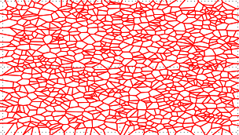

A Voronoi diagram is a diagram consisting of a number of sites.
Each Voronoi site "s"
also has a Voronoi cell consisting of all points closest to "s".

See algorithm [K-means++ clustering](./k-means___clustering).

---

## C

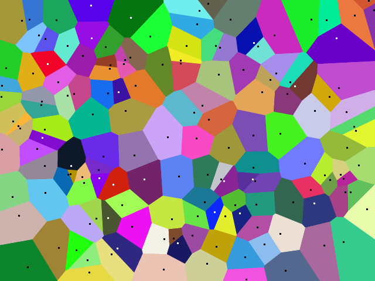

C code drawing a color map of a set of Voronoi sites.
Image is in PNM P6, written to stdout.
Run as <code>a.out > stuff.pnm</code>.

```c
#include <stdio.h>
#include <stdlib.h>
#include <string.h>

#define N_SITES 150
double site[N_SITES][2];
unsigned char rgb[N_SITES][3];

int size_x = 640, size_y = 480;

inline double sq2(double x, double y)
{
  return x * x + y * y;
}

#define for_k for (k = 0; k < N_SITES; k++)
int nearest_site(double x, double y)
{
  int k, ret = 0;
  double d, dist = 0;
  for_k {
    d = sq2(x - site[k][0], y - site[k][1]);
    if (!k || d < dist) {
      dist = d, ret = k;
    }
  }
  return ret;
}

/* see if a pixel is different from any neighboring ones */
int at_edge(int *color, int y, int x)
{
  int i, j, c = color[y * size_x + x];
  for (i = y - 1; i <= y + 1; i++) {
    if (i < 0 || i >= size_y) continue;

    for (j = x - 1; j <= x + 1; j++) {
      if (j < 0 || j >= size_x) continue;
      if (color[i * size_x + j] != c) return 1;
    }
  }
  return 0;
}

#define AA_RES 4 /* average over 4x4 supersampling grid */
void aa_color(unsigned char *pix, int y, int x)
{
  int i, j, n;
  double r = 0, g = 0, b = 0, xx, yy;
  for (i = 0; i < AA_RES; i++) {
    yy = y + 1. / AA_RES * i + .5;
    for (j = 0; j < AA_RES; j++) {
      xx = x + 1. / AA_RES * j + .5;
      n = nearest_site(xx, yy);
      r += rgb[n][0];
      g += rgb[n][1];
      b += rgb[n][2];
    }
  }
  pix[0] = r / (AA_RES * AA_RES);
  pix[1] = g / (AA_RES * AA_RES);
  pix[2] = b / (AA_RES * AA_RES);
}

#define for_i for (i = 0; i < size_y; i++)
#define for_j for (j = 0; j < size_x; j++)
void gen_map()
{
  int i, j, k;
  int *nearest = malloc(sizeof(int) * size_y * size_x);
  unsigned char *ptr, *buf, color;

  ptr = buf = malloc(3 * size_x * size_y);
  for_i for_j nearest[i * size_x + j] = nearest_site(j, i);

  for_i for_j {
    if (!at_edge(nearest, i, j))
      memcpy(ptr, rgb[nearest[i * size_x + j]], 3);
    else  /* at edge, do anti-alias rastering */
      aa_color(ptr, i, j);
    ptr += 3;
  }

  /* draw sites */
  for (k = 0; k < N_SITES; k++) {
    color = (rgb[k][0]*.25 + rgb[k][1]*.6 + rgb[k][2]*.15 > 80) ? 0 : 255;

    for (i = site[k][1] - 1; i <= site[k][1] + 1; i++) {
      if (i < 0 || i >= size_y) continue;

      for (j = site[k][0] - 1; j <= site[k][0] + 1; j++) {
        if (j < 0 || j >= size_x) continue;

        ptr = buf + 3 * (i * size_x + j);
        ptr[0] = ptr[1] = ptr[2] = color;
      }
    }
  }

  printf("P6\n%d %d\n255\n", size_x, size_y);
  fflush(stdout);
  fwrite(buf, size_y * size_x * 3, 1, stdout);
}

#define frand(x) (rand() / (1. + RAND_MAX) * x)
int main()
{
  int k;
  for_k {
    site[k][0] = frand(size_x);
    site[k][1] = frand(size_y);
    rgb [k][0] = frand(256);
    rgb [k][1] = frand(256);
    rgb [k][2] = frand(256);
  }

  gen_map();
  return 0;
}
```


## C++

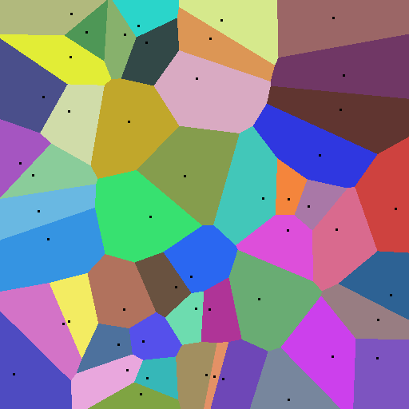

```cpp
#include <windows.h>
#include <vector>
#include <string>

using namespace std;

//////////////////////////////////////////////////////
struct Point {
  int x, y;
};

//////////////////////////////////////////////////////
class MyBitmap {
 public:
  MyBitmap() : pen_(nullptr) {}
  ~MyBitmap() {
    DeleteObject(pen_);
    DeleteDC(hdc_);
    DeleteObject(bmp_);
  }

  bool Create(int w, int h) {
    BITMAPINFO  bi;
    ZeroMemory(&bi, sizeof(bi));

    bi.bmiHeader.biSize = sizeof(bi.bmiHeader);
    bi.bmiHeader.biBitCount = sizeof(DWORD) * 8;
    bi.bmiHeader.biCompression = BI_RGB;
    bi.bmiHeader.biPlanes = 1;
    bi.bmiHeader.biWidth = w;
    bi.bmiHeader.biHeight = -h;

    void *bits_ptr = nullptr;
    HDC dc = GetDC(GetConsoleWindow());
    bmp_ = CreateDIBSection(dc, &bi, DIB_RGB_COLORS, &bits_ptr, nullptr, 0);
    if (!bmp_) return false;

    hdc_ = CreateCompatibleDC(dc);
    SelectObject(hdc_, bmp_);
    ReleaseDC(GetConsoleWindow(), dc);

    width_ = w;
    height_ = h;

    return true;
  }

  void SetPenColor(DWORD clr) {
    if (pen_) DeleteObject(pen_);
    pen_ = CreatePen(PS_SOLID, 1, clr);
    SelectObject(hdc_, pen_);
  }

  bool SaveBitmap(const char* path) {
    HANDLE file = CreateFile(path, GENERIC_WRITE, 0, nullptr, CREATE_ALWAYS, FILE_ATTRIBUTE_NORMAL, nullptr);
    if (file == INVALID_HANDLE_VALUE) {
      return false;
    }

    BITMAPFILEHEADER fileheader;
    BITMAPINFO infoheader;
    BITMAP bitmap;
    GetObject(bmp_, sizeof(bitmap), &bitmap);

    DWORD* dwp_bits = new DWORD[bitmap.bmWidth * bitmap.bmHeight];
    ZeroMemory(dwp_bits, bitmap.bmWidth * bitmap.bmHeight * sizeof(DWORD));
    ZeroMemory(&infoheader, sizeof(BITMAPINFO));
    ZeroMemory(&fileheader, sizeof(BITMAPFILEHEADER));

    infoheader.bmiHeader.biBitCount = sizeof(DWORD) * 8;
    infoheader.bmiHeader.biCompression = BI_RGB;
    infoheader.bmiHeader.biPlanes = 1;
    infoheader.bmiHeader.biSize = sizeof(infoheader.bmiHeader);
    infoheader.bmiHeader.biHeight = bitmap.bmHeight;
    infoheader.bmiHeader.biWidth = bitmap.bmWidth;
    infoheader.bmiHeader.biSizeImage = bitmap.bmWidth * bitmap.bmHeight * sizeof(DWORD);

    fileheader.bfType = 0x4D42;
    fileheader.bfOffBits = sizeof(infoheader.bmiHeader) + sizeof(BITMAPFILEHEADER);
    fileheader.bfSize = fileheader.bfOffBits + infoheader.bmiHeader.biSizeImage;

    GetDIBits(hdc_, bmp_, 0, height_, (LPVOID)dwp_bits, &infoheader, DIB_RGB_COLORS);

    DWORD wb;
    WriteFile(file, &fileheader, sizeof(BITMAPFILEHEADER), &wb, nullptr);
    WriteFile(file, &infoheader.bmiHeader, sizeof(infoheader.bmiHeader), &wb, nullptr);
    WriteFile(file, dwp_bits, bitmap.bmWidth * bitmap.bmHeight * 4, &wb, nullptr);
    CloseHandle(file);

    delete[] dwp_bits;
    return true;
  }

  HDC hdc() { return hdc_; }
  int width() { return width_; }
  int height() { return height_; }

 private:
  HBITMAP bmp_;
  HDC hdc_;
  HPEN pen_;
  int width_, height_;
};

static int DistanceSqrd(const Point& point, int x, int y) {
  int xd = x - point.x;
  int yd = y - point.y;
  return (xd * xd) + (yd * yd);
}

//////////////////////////////////////////////////////
class Voronoi {
 public:
  void Make(MyBitmap* bmp, int count) {
    bmp_ = bmp;
    CreatePoints(count);
    CreateColors();
    CreateSites();
    SetSitesPoints();
  }

 private:
  void CreateSites() {
    int w = bmp_->width(), h = bmp_->height(), d;
    for (int hh = 0; hh < h; hh++) {
      for (int ww = 0; ww < w; ww++) {
        int ind = -1, dist = INT_MAX;
        for (size_t it = 0; it < points_.size(); it++) {
          const Point& p = points_[it];
          d = DistanceSqrd(p, ww, hh);
          if (d < dist) {
            dist = d;
            ind = it;
          }
        }

        if (ind > -1)
          SetPixel(bmp_->hdc(), ww, hh, colors_[ind]);
        else
          __asm nop // should never happen!
        }
    }
  }

  void SetSitesPoints() {
    for (const auto& point : points_) {
      int x = point.x, y = point.y;
      for (int i = -1; i < 2; i++)
        for (int j = -1; j < 2; j++)
          SetPixel(bmp_->hdc(), x + i, y + j, 0);
    }
  }

  void CreatePoints(int count) {
    const int w = bmp_->width() - 20, h = bmp_->height() - 20;
    for (int i = 0; i < count; i++) {
      points_.push_back({ rand() % w + 10, rand() % h + 10 });
    }
  }

  void CreateColors() {
    for (size_t i = 0; i < points_.size(); i++) {
      DWORD c = RGB(rand() % 200 + 50, rand() % 200 + 55, rand() % 200 + 50);
      colors_.push_back(c);
    }
  }

  vector<Point> points_;
  vector<DWORD> colors_;
  MyBitmap* bmp_;
};

//////////////////////////////////////////////////////
int main(int argc, char* argv[]) {
  ShowWindow(GetConsoleWindow(), SW_MAXIMIZE);
  srand(GetTickCount());

  MyBitmap bmp;
  bmp.Create(512, 512);
  bmp.SetPenColor(0);

  Voronoi v;
  v.Make(&bmp, 50);

  BitBlt(GetDC(GetConsoleWindow()), 20, 20, 512, 512, bmp.hdc(), 0, 0, SRCCOPY);
  bmp.SaveBitmap("v.bmp");

  system("pause");

  return 0;
}

```


## D

Translated from Go.

```d
import std.random, std.algorithm, std.range, bitmap;

struct Point { uint x, y; }

enum randomPoints = (in size_t nPoints, in size_t nx, in size_t ny) =>
    nPoints.iota
    .map!((int) => Point(uniform(0, nx), uniform(0, ny)))
    .array;

Image!RGB generateVoronoi(in Point[] pts,
                          in size_t nx, in size_t ny) /*nothrow*/ {
    // Generate a random color for each centroid.
    immutable rndRBG = (int) => RGB(uniform!"[]"(ubyte.min, ubyte.max),
                                    uniform!"[]"(ubyte.min, ubyte.max),
                                    uniform!"[]"(ubyte.min, ubyte.max));
    const colors = pts.length.iota.map!rndRBG.array;

    // Generate diagram by coloring pixels with color of nearest site.
    auto img = new typeof(return)(nx, ny);
    foreach (immutable x; 0 .. nx)
        foreach (immutable y; 0 .. ny) {
            immutable dCmp = (in Point a, in Point b) pure nothrow =>
                ((a.x - x) ^^ 2 + (a.y - y) ^^ 2) <
                ((b.x - x) ^^ 2 + (b.y - y) ^^ 2);
            // img[x, y] = colors[pts.reduce!(min!dCmp)];
            img[x, y] = colors[pts.length - pts.minPos!dCmp.length];
        }

    // Mark each centroid with a white dot.
    foreach (immutable p; pts)
        img[p.tupleof] = RGB.white;
    return img;
}

void main() {
    enum imageWidth = 640,
         imageHeight = 480;
    randomPoints(150, imageWidth, imageHeight)
    .generateVoronoi(imageWidth, imageHeight)
    .savePPM6("voronoi.ppm");
}
```


## Go

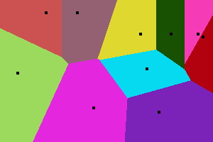

```go
package main

import (
    "fmt"
    "image"
    "image/color"
    "image/draw"
    "image/png"
    "math/rand"
    "os"
    "time"
)

const (
    imageWidth  = 300
    imageHeight = 200
    nSites      = 10
)

func main() {
    writePngFile(generateVoronoi(randomSites()))
}

func generateVoronoi(sx, sy []int) image.Image {
    // generate a random color for each site
    sc := make([]color.NRGBA, nSites)
    for i := range sx {
        sc[i] = color.NRGBA{uint8(rand.Intn(256)), uint8(rand.Intn(256)),
            uint8(rand.Intn(256)), 255}
    }

    // generate diagram by coloring each pixel with color of nearest site
    img := image.NewNRGBA(image.Rect(0, 0, imageWidth, imageHeight))
    for x := 0; x < imageWidth; x++ {
        for y := 0; y < imageHeight; y++ {
            dMin := dot(imageWidth, imageHeight)
            var sMin int
            for s := 0; s < nSites; s++ {
                if d := dot(sx[s]-x, sy[s]-y); d < dMin {
                    sMin = s
                    dMin = d
                }
            }
            img.SetNRGBA(x, y, sc[sMin])
        }
    }
    // mark each site with a black box
    black := image.NewUniform(color.Black)
    for s := 0; s < nSites; s++ {
        draw.Draw(img, image.Rect(sx[s]-2, sy[s]-2, sx[s]+2, sy[s]+2),
            black, image.ZP, draw.Src)
    }
    return img
}

func dot(x, y int) int {
    return x*x + y*y
}

func randomSites() (sx, sy []int) {
    rand.Seed(time.Now().Unix())
    sx = make([]int, nSites)
    sy = make([]int, nSites)
    for i := range sx {
        sx[i] = rand.Intn(imageWidth)
        sy[i] = rand.Intn(imageHeight)
    }
    return
}

func writePngFile(img image.Image) {
    f, err := os.Create("voronoi.png")
    if err != nil {
        fmt.Println(err)
        return
    }
    if err = png.Encode(f, img); err != nil {
        fmt.Println(err)
    }
    if err = f.Close(); err != nil {
        fmt.Println(err)
    }
}
```


## Haskell

Uses the repa and repa-io libraries.

```haskell
-- Compile with: ghc -O2 -fllvm -fforce-recomp -threaded --make
{-# LANGUAGE BangPatterns #-}
module Main where

import System.Random

import Data.Word
import Data.Array.Repa as Repa
import Data.Array.Repa.IO.BMP

{-# INLINE sqDistance #-}
sqDistance :: Word32 -> Word32 -> Word32 -> Word32 -> Word32
sqDistance !x1 !y1 !x2 !y2 = ((x1-x2)^2) + ((y1-y2)^2)

centers :: Int -> Int -> Array U DIM2 Word32
centers nCenters nCells =
    fromListUnboxed (Z :. nCenters :. 2) $ take (2*nCenters) $
      randomRs (0, fromIntegral nCells) (mkStdGen 1)

applyReduce2 arr f =
    traverse arr (\(i :. j) -> i) $ \lookup (Z:.i) ->
        f (lookup (Z:.i:.0)) (lookup (Z:.i:.1))

minimize1D arr = foldS f h t
  where
    indexed arr = traverse arr id (\src idx@(Z :. i) -> (src idx, (fromIntegral i)))
    (Z :. n) = extent arr
    iarr = indexed arr
    h = iarr ! (Z :. 0)
    t = extract (Z :. 1) (Z :. (n-1)) iarr

    f min@(!valMin, !iMin ) x@(!val, !i) | val < valMin = x
                                         | otherwise = min

voronoi :: Int -> Int -> Array D DIM2 Word32
voronoi nCenters nCells =
    let
      {-# INLINE cellReducer #-}
      cellReducer = applyReduce2 (centers nCenters nCells)
      {-# INLINE nearestCenterIndex #-}
      nearestCenterIndex = snd . (Repa.! Z) . minimize1D
    in
      Repa.fromFunction (Z :. nCells :. nCells :: DIM2) $ \ (Z:.i:.j) ->
          nearestCenterIndex $
            cellReducer (sqDistance (fromIntegral i) (fromIntegral j))

genColorTable :: Int -> Array U DIM1 (Word8, Word8, Word8)
genColorTable n = fromListUnboxed (Z :. n) $ zip3 l1 l2 l3
    where
      randoms = randomRs (0,255) (mkStdGen 1)
      (l1, rest1) = splitAt n randoms
      (l2, rest2) = splitAt n rest1
      l3 = take n rest2

colorize
  :: Array U DIM1 (Word8, Word8, Word8)
  -> Array D DIM2 Word32
  -> Array D DIM2 (Word8, Word8, Word8)
colorize ctable = Repa.map $ \x -> ctable Repa.! (Z:. fromIntegral x)

main = do
  let nsites = 150
  let ctable = genColorTable nsites
  voro <- computeP $ colorize ctable (voronoi nsites 512)
            :: IO (Array U DIM2 (Word8, Word8, Word8))
  writeImageToBMP "out.bmp" voro
```


## Icon and Unicon

The sample images to the right show the screen size,
number of sites, and metric used in the title bar.

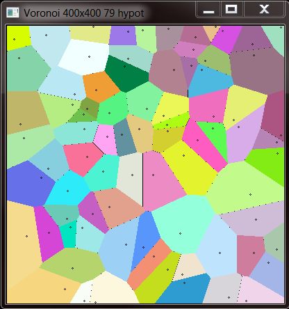
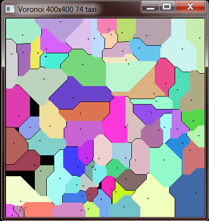

```Icon
link graphics,printf,strings

record site(x,y,colour)  # site data position and colour
invocable all            # needed for string metrics

procedure main(A)  # voronoi

&window := open("Voronoi","g","bg=black") | stop("Unable to open window")

WAttrib("canvas=hidden")   # figure out maximal size width & height
WAttrib(sprintf("size=%d,%d",WAttrib("displaywidth"),WAttrib("displayheight")))
WAttrib("canvas=maximal")
height := WAttrib("height")
width  := WAttrib("width")

metrics := ["hypot","taxi","taxi3"]  # different metrics

while case a := get(A) of {          # command line arguments
  "--sites"  | "-s" : sites  := 0 < integer(a := get(A)) | runerr(205,a)
  "--height" | "-h" : height := 0 < (height >= integer(a := get(A))) | runerr(205,a)
  "--width"  | "-w" : width  := 0 < (width  >= integer(a := get(A))) | runerr(205,a)
  "--metric" | "-m" : metric := ((a := get(A)) == !metrics) | runerr(205,a)
  "--help"   | "-?" : write("Usage:\n voronoi [[--sites|-s] n] ",
          "[[--height|-h] pixels] [[--width|-w] pixels]",
          "[[--metric|-m] metric_procedure]",
          "[--help|-?]\n\n")
  }

/metric := metrics[1]                     # default to normal
/sites := ?(r := integer(.1*width)) + r   # sites = random .1 to .2 of width if not given

WAttrib(sprintf("label=Voronoi %dx%d %d %s",width,height,sites,metric))
WAttrib(sprintf("size=%d,%d",width,height))

x := "0123456789abcdef"    # hex for random sites (colour)
siteL := []
every 1 to sites do        # random sites
  put(siteL, site(?width,?height,cat("#",?x,?x,?x,?x,?x,?x)))

VoronoiDiagram(width,height,siteL,metric)  # Voronoi-ize it
WDone()
end

procedure hypot(x,y,site)  # normal metric
return sqrt((x-site.x)^2 + (y-site.y)^2)
end

procedure taxi(x,y,site)   # "taxi" metric
return abs(x-site.x)+abs(y-site.y)
end

procedure taxi3(x,y,site)  # copied from a commented out version (TCL)
return (abs(x-site.x)^3+abs(y-site.y)^3)^(.3)
end

procedure VoronoiDiagram(width,height,siteL,metric)
   /metric := hypot
   every y := 1 to height & x := 1 to width do {
      dist := width+height         # anything larger than diagonal
      every site := !siteL do {
         if dist < (dt :=  metric(x,y,site)) then next  # skip
         else if dist >:= dt then Fg(site.colour)       # site
         else Fg("#000000")                             # unowned
         DrawPoint(x,y)
         }
      }

   Fg("Black")
   every site := !siteL do                              # mark sites
      DrawCircle(site.x,site.y,1)
end
```

[printf.icn provides the printf family](http://www.cs.arizona.edu/icon/library/src/procs/printf.icn)

[graphics.icn provides graphics support](http://www.cs.arizona.edu/icon/library/src/procs/graphics.icn)

[strings.icn provides cat](http://www.cs.arizona.edu/icon/library/src/procs/strings.icn)


## J

###  Explicit version

A straightforward solution:
Generate random points and for each pixel find the index of the least distance.
Note that the square root is avoided to improve performance.

```j
NB. (number of points) voronoi (shape)
NB. Generates an array of indices of the nearest point
voronoi =: 4 :0
  p =. (x,2) ?@$ y
  (i.<./)@:(+/@:*:@:-"1&p)"1 ,"0/&i./ y
)

load'viewmat'
viewmat 25 voronoi 500 500
```

Another solution generates Voronoi cells from Delaunay triangulation.
The page [[Voronoi diagram/J/Delaunay triangulation]] also contains a convex hull algorithm.
This is a vector based approach instead of a pixel based approach and is about twice as fast for this task's example.


###  Tacit version

This a direct reformulation of the explicit version.

```j
Voronoi=. ,"0/&i./@:] (i. <./)@:(+/@:*:@:-"1)"1 _ ] ?@$~ 2 ,~ [
viewmat 25 Voronoi 500 500 [ load'viewmat'
```


## Delphi

```delphi
procedure TForm1.Voronoi;
const
   p = 3;
   cells = 100;
   size = 1000;

var
  aCanvas : TCanvas;
  px, py: array of integer;
  color: array of Tcolor;
  Img: TBitmap;
  lastColor:Integer;
  auxList: TList<TPoint>;
  poligonlist : TDictionary<integer,TList<TPoint>>;
  pointarray : array of TPoint;

  n,i,x,y,k,j: Integer;
  d1,d2: double;

  function distance(x1,x2,y1,y2 :Integer) : Double;
  begin
    result := sqrt((x1 - x2) * (x1 - x2) + (y1 - y2) * (y1 - y2)); ///Euclidian
    // result :=  abs(x1 - x2) + abs(y1 - y2); // Manhattan
    // result := power(power(abs(x1 - x2), p) + power(abs(y1 - y2), p), (1 / p)); // Minkovski
  end;

begin

    poligonlist := TDictionary<integer,TList<Tpoint>>.create;

    n := 0;
    Randomize;

    img := TBitmap.Create;
    img.Width :=1000;
    img.Height :=1000;

    setlength(px,cells);
    setlength(py,cells);
    setlength(color,cells);

    for i:= 0 to cells-1 do
    begin
      px[i] := Random(size);
      py[i] := Random(size);

      color[i] := Random(16777215);
      auxList := TList<Tpoint>.Create;
      poligonlist.Add(i,auxList);
    end;

    for x := 0 to size - 1 do
    begin
      lastColor:= 0;
      for y := 0 to size - 1 do
      begin
        n:= 0;

        for i := 0 to cells - 1 do
        begin
          d1:= distance(px[i], x, py[i], y);
          d2:= distance(px[n], x, py[n], y);

          if d1 < d2 then
          begin
            n := i;
    end;
        end;
        if n <> lastColor then
        begin
           poligonlist[n].Add(Point(x,y));
           poligonlist[lastColor].Add(Point(x,y));
           lastColor := n;
        end;
      end;

      poligonlist[n].Add(Point(x,y));
      poligonlist[lastColor].Add(Point(x,y));
      lastColor := n;
    end;

    for j := 0 to  cells -1 do
    begin

      SetLength(pointarray, poligonlist[j].Count);
      for I := 0 to poligonlist[j].Count - 1 do
      begin
        if Odd(i) then
        pointarray[i] := poligonlist[j].Items[i];
      end;
      for I := 0 to poligonlist[j].Count - 1 do
      begin
        if not Odd(i) then
        pointarray[i] := poligonlist[j].Items[i];
      end;
      Img.Canvas.Pen.Color := color[j];
      Img.Canvas.Brush.Color := color[j];
      Img.Canvas.Polygon(pointarray);

      Img.Canvas.Pen.Color := clBlack;
      Img.Canvas.Brush.Color := clBlack;
      Img.Canvas.Rectangle(px[j] -2, py[j] -2, px[j] +2, py[j] +2);
    end;
    Canvas.Draw(0,0, img);
end;


```


## Java

```java
import java.awt.Color;
import java.awt.Graphics;
import java.awt.Graphics2D;
import java.awt.geom.Ellipse2D;
import java.awt.image.BufferedImage;
import java.io.File;
import java.io.IOException;
import java.util.Random;

import javax.imageio.ImageIO;
import javax.swing.JFrame;

public class Voronoi extends JFrame {
  static double p = 3;
  static BufferedImage I;
  static int px[], py[], color[], cells = 100, size = 1000;

  public Voronoi() {
    super("Voronoi Diagram");
    setBounds(0, 0, size, size);
    setDefaultCloseOperation(EXIT_ON_CLOSE);
    int n = 0;
    Random rand = new Random();
    I = new BufferedImage(size, size, BufferedImage.TYPE_INT_RGB);
    px = new int[cells];
    py = new int[cells];
    color = new int[cells];
    for (int i = 0; i < cells; i++) {
      px[i] = rand.nextInt(size);
      py[i] = rand.nextInt(size);
      color[i] = rand.nextInt(16777215);

    }
    for (int x = 0; x < size; x++) {
      for (int y = 0; y < size; y++) {
        n = 0;
        for (byte i = 0; i < cells; i++) {
          if (distance(px[i], x, py[i], y) < distance(px[n], x, py[n], y)) {
            n = i;

          }
        }
        I.setRGB(x, y, color[n]);

      }
    }

    Graphics2D g = I.createGraphics();
    g.setColor(Color.BLACK);
    for (int i = 0; i < cells; i++) {
      g.fill(new Ellipse2D .Double(px[i] - 2.5, py[i] - 2.5, 5, 5));
    }

    try {
      ImageIO.write(I, "png", new File("voronoi.png"));
    } catch (IOException e) {

    }

  }

  public void paint(Graphics g) {
    g.drawImage(I, 0, 0, this);
  }

  static double distance(int x1, int x2, int y1, int y2) {
    double d;
      d = Math.sqrt((x1 - x2) * (x1 - x2) + (y1 - y2) * (y1 - y2)); // Euclidian
  //  d = Math.abs(x1 - x2) + Math.abs(y1 - y2); // Manhattan
  //  d = Math.pow(Math.pow(Math.abs(x1 - x2), p) + Math.pow(Math.abs(y1 - y2), p), (1 / p)); // Minkovski
      return d;
  }

  public static void main(String[] args) {
    new Voronoi().setVisible(true);
  }
}
```


## JavaScript

### Version 1

The obvious route to this in JavaScript would be to use Mike Bostock's D3.js library.

There are various examples of Voronoi tesselations,
some dynamic:

<https://bl.ocks.org/mbostock/d1d81455dc21e10f742f>

some interactive:

<https://bl.ocks.org/mbostock/4060366>

and all with source code, at <https://bl.ocks.org/mbostock>


### Version 2

I would agree: using D3.js library can be very helpful.
But having stable and compact algorithm in Python (Sidef) made it possible to develop looking the same Voronoi diagram in "pure" JavaScript.
A few custom helper functions simplified code, and they can be used for any other applications.


```html
<!-- VoronoiD.html -->
<html>
<head><title>Voronoi diagram</title>
<script>
// HF#1 Like in PARI/GP: return random number 0..max-1
function randgp(max) {return Math.floor(Math.random()*max)}
// HF#2 Random hex color
function randhclr() {
  return "#"+
  ("00"+randgp(256).toString(16)).slice(-2)+
  ("00"+randgp(256).toString(16)).slice(-2)+
  ("00"+randgp(256).toString(16)).slice(-2)
}
// HF#3 Metrics: Euclidean, Manhattan and Minkovski 3/20/17
function Metric(x,y,mt) {
  if(mt==1) {return Math.sqrt(x*x + y*y)}
  if(mt==2) {return Math.abs(x) + Math.abs(y)}
  if(mt==3) {return(Math.pow(Math.pow(Math.abs(x),3) + Math.pow(Math.abs(y),3),0.33333))}
}
// Plotting Voronoi diagram. aev 3/10/17
function pVoronoiD() {
  var cvs=document.getElementById("cvsId");
  var ctx=cvs.getContext("2d");
  var w=cvs.width, h=cvs.height;
  var x=y=d=dm=j=0, w1=w-2, h1=h-2;
  var n=document.getElementById("sites").value;
  var mt=document.getElementById("mt").value;
  var X=new Array(n), Y=new Array(n), C=new Array(n);
  ctx.fillStyle="white"; ctx.fillRect(0,0,w,h);
  for(var i=0; i<n; i++) {
    X[i]=randgp(w1); Y[i]=randgp(h1); C[i]=randhclr();
  }
  for(y=0; y<h1; y++) {
    for(x=0; x<w1; x++) {
      dm=Metric(h1,w1,mt); j=-1;
      for(var i=0; i<n; i++) {
        d=Metric(X[i]-x,Y[i]-y,mt)
        if(d<dm) {dm=d; j=i;}
      }//fend i
      ctx.fillStyle=C[j]; ctx.fillRect(x,y,1,1);
    }//fend x
  }//fend y
  ctx.fillStyle="black";
  for(var i=0; i<n; i++) {
    ctx.fillRect(X[i],Y[i],3,3);
  }
}
</script></head>
<body style="font-family: arial, helvatica, sans-serif;">
  <b>Please input number of sites: </b>
  <input id="sites" value=100 type="number" min="10" max="150" size="3">
  <b>Metric: </b>
  <select id="mt">
    <option value=1 selected>Euclidean</option>
    <option value=2>Manhattan</option>
    <option value=3>Minkovski</option>
  </select>
  <input type="button" value="Plot it!" onclick="pVoronoiD();">
  <h3>Voronoi diagram</h3>
  <canvas id="cvsId" width="640" height="640" style="border: 2px inset;"></canvas>
</body>
</html>

```

Output:

```txt
Page demonstrating Voronoi diagram for any reasonable number of sites and selected metric.
Right clicking on canvas with image allows you to save it as png-file, for example.
```


## Julia

First version generates an image with random colors as centroids for the voronoi tesselation:

```julia
using Images
function voronoi(w, h, n_centroids)
    dist = (point,vector) -> sqrt.((point[1].-vector[:,1]).^2 .+ (point[2].-vector[:,2]).^2)
    dots = [rand(1:h, n_centroids) rand(1:w, n_centroids) rand(RGB{N0f8}, n_centroids)]
    img  = zeros(RGB{N0f8}, h, w)
    for x in 1:h, y in 1:w
        distances = dist([x,y],dots) # distance
        nn = findmin(distances)[2]
        img[x,y]  = dots[nn,:][3]
    end
    return img
end
img = voronoi(800, 600, 200)
```


Second version takes an image as an input, samples random centroids for the voronoi cells,
and assigns every pixel within that cell the color of the centroid:


```julia
using TestImages, Images
function voronoi_img!(img, n_centroids)
    n,m = size(img)
    w   = minimum([n,m])
    dist = (point,vector) -> sqrt.((point[1].-vector[:,1]).^2 .+ (point[2].-vector[:,2]).^2)
    dots = [rand(1:n, n_centroids) rand(1:m, n_centroids)]
    c = []
    for i in 1:size(dots,1)
        p = dots[i,:]
        append!(c, [img[p[1],p[2]]])
    end
    dots = [dots c]

    for x in 1:n, y in 1:m
        distances = dist([x,y],dots) # distance
        nn = findmin(distances)[2]
        img[x,y]  = dots[nn,:][3]
    end
end
img = testimage("mandrill")
voronoi_img!(img, 300)
```


## Kotlin

Translated from Java.

```scala
// version 1.1.3

import java.awt.Color
import java.awt.Graphics
import java.awt.Graphics2D
import java.awt.geom.Ellipse2D
import java.awt.image.BufferedImage
import java.util.Random
import javax.swing.JFrame

fun distSq(x1: Int, x2: Int, y1: Int, y2: Int): Int {
    val x = x1 - x2
    val y = y1 - y2
    return x * x + y * y
}

class Voronoi(val cells: Int, val size: Int) : JFrame("Voronoi Diagram") {
    val bi: BufferedImage

    init {
        setBounds(0, 0, size, size)
        defaultCloseOperation = EXIT_ON_CLOSE
        val r = Random()
        bi = BufferedImage(size, size, BufferedImage.TYPE_INT_RGB)
        val px = IntArray(cells) { r.nextInt(size) }
        val py = IntArray(cells) { r.nextInt(size) }
        val cl = IntArray(cells) { r.nextInt(16777215) }
        for (x in 0 until size) {
            for (y in 0 until size) {
                var n = 0
                for (i in 0 until cells) {
                    if (distSq(px[i], x, py[i], y) < distSq(px[n], x, py[n], y)) n = i
                }
                bi.setRGB(x, y, cl[n])
            }
        }
        val g = bi.createGraphics()
        g.color = Color.BLACK
        for (i in 0 until cells) {
            g.fill(Ellipse2D.Double(px[i] - 2.5, py[i] - 2.5, 5.0, 5.0))
        }
    }

    override fun paint(g: Graphics) {
        g.drawImage(bi, 0, 0, this)
    }
}

fun main(args: Array<String>) {
    Voronoi(70, 700).isVisible = true
}
```


## Liberty BASIC

For first site it fills the table with distances to that site.
For other sites it looks at vertical lines left and right from its location.
If no place on a vertical line is closer to the current site, then there's no point looking further left or right.
Don't bother square-rooting to get distances..

```lb
WindowWidth  =600
WindowHeight =600

sites = 100
xEdge = 400
yEdge = 400
graphicbox #w.gb1, 10, 10, xEdge, yEdge

open "Voronoi neighbourhoods" for window as #w

#w     "trapclose quit"
#w.gb1 "down ; fill black ; size 4"
#w.gb1 "font courier_new 12"

dim townX( sites), townY( sites), col$( sites)

for i =1 to sites
    townX( i) =int( xEdge *rnd( 1))
    townY( i) =int( yEdge *rnd( 1))
    col$( i) = int( 256 *rnd( 1)); " "; int( 256 *rnd( 1)); " "; int( 256 *rnd( 1))
    #w.gb1 "color "; col$( i)
    #w.gb1 "set "; townX( i); " "; townY( i)
next i

#w.gb1 "size 1"

dim nearestIndex(xEdge, yEdge)
dim dist(xEdge, yEdge)

start = time$("ms")

'fill distance table with distances from the first site
for x = 0 to xEdge - 1
    for y = 0 to yEdge - 1
        dist(x, y) = (townX(1) - x) ^ 2 + (townY(1) - y) ^ 2
        nearestIndex(x, y) = 1
    next y
next x

#w.gb1 "color darkblue"
'for other towns
for i = 2 to sites
    'display some progress
    #w.gb1 "place 0 20"
    #w.gb1 "\computing: "; using("###.#", i / sites * 100); "%"
    'look left
    for x = townX(i) to 0 step -1
        if not(checkRow(i, x,0, yEdge - 1)) then exit for
    next x
    'look right
    for x = townX(i) + 1 to xEdge - 1
        if not(checkRow(i, x, 0, yEdge - 1)) then exit for
    next x
    scan
next i

for x = 0 to xEdge - 1
    for y =0 to yEdge - 1
        #w.gb1 "color "; col$(nearestIndex(x, y))
        startY = y
        nearest = nearestIndex(x, y)
        for y = y + 1 to yEdge
            if nearestIndex(x, y) <> nearest then y = y - 1 : exit for
        next y
        #w.gb1 "line "; x; " "; startY; " "; x; " "; y + 1
    next y
next x

#w.gb1 "color black; size 4"
for i =1 to sites
    #w.gb1 "set "; townX( i); " "; townY( i)
next i
print time$("ms") - start
wait

sub quit w$
    close #w$
    end
end sub

function checkRow(site, x, startY, endY)
    dxSquared = (townX(site) - x) ^ 2
    for y = startY to endY
         dSquared = (townY(site) - y) ^ 2 + dxSquared
         if dSquared <= dist(x, y) then
             dist(x, y) = dSquared
             nearestIndex(x, y) = site
             checkRow = 1
         end if
    next y
end function
```


## Lua

Works with LÖVE 0.10.1.
Translated from Python.

```lua
function love.load( )
  love.math.setRandomSeed( os.time( ) ) --set the random seed
  keys = { } --an empty table where we will store key presses
  number_cells = 50 --the number of cells we want in our diagram
  --draw the voronoi diagram to a canvas
  voronoiDiagram = generateVoronoi( love.graphics.getWidth( ), love.graphics.getHeight( ), number_cells )
end

function hypot( x, y )
  return math.sqrt( x*x + y*y )
end

function generateVoronoi( width, height, num_cells )
  canvas = love.graphics.newCanvas( width, height )
  local imgx = canvas:getWidth( )
  local imgy = canvas:getHeight( )
  local nx = { }
  local ny = { }
  local nr = { }
  local ng = { }
  local nb = { }
  for a = 1, num_cells do
  table.insert( nx, love.math.random( 0, imgx ) )
  table.insert( ny, love.math.random( 0, imgy ) )
  table.insert( nr, love.math.random( 0, 255 ) )
  table.insert( ng, love.math.random( 0, 255 ) )
  table.insert( nb, love.math.random( 0, 255 ) )
  end
  love.graphics.setColor( { 255, 255, 255 } )
  love.graphics.setCanvas( canvas )
  for y = 1, imgy do
  for x = 1, imgx do
      dmin = hypot( imgx-1, imgy-1 )
    j = -1
    for i = 1, num_cells do
    d = hypot( nx[i]-x, ny[i]-y )
    if d < dmin then
         dmin = d
      j = i
    end
    end
    love.graphics.setColor( { nr[j], ng[j], nb[j] } )
    love.graphics.points( x, y )
  end
  end
  --reset color
  love.graphics.setColor( { 255, 255, 255 } )
  --draw points
  for b = 1, num_cells do
  love.graphics.points( nx[b], ny[b] )
  end
  love.graphics.setCanvas( )
  return canvas
end

--RENDER
function love.draw( )
  --reset color
  love.graphics.setColor( { 255, 255, 255 } )
  --draw diagram
  love.graphics.draw( voronoiDiagram )
  --draw drop shadow text
  love.graphics.setColor( { 0, 0, 0 } )
  love.graphics.print( "space: regenerate\nesc: quit", 1, 1 )
  --draw text
  love.graphics.setColor( { 200, 200, 0 } )
  love.graphics.print( "space: regenerate\nesc: quit" )
end

--CONTROL
function love.keyreleased( key )
  if key == 'space' then
  voronoiDiagram = generateVoronoi( love.graphics.getWidth( ), love.graphics.getHeight( ), number_cells )
  elseif key == 'escape' then
  love.event.quit( )
  end
end
```


## Mathematica

```Mathematica
Needs["ComputationalGeometry`"]
DiagramPlot[{{4.4, 14}, {6.7, 15.25}, {6.9, 12.8}, {2.1, 11.1}, {9.5, 14.9}, {13.2, 11.9}, {10.3, 12.3},
{6.8, 9.5}, {3.3, 7.7}, {0.6, 5.1}, {5.3, 2.4}, {8.45, 4.7}, {11.5, 9.6}, {13.8, 7.3}, {12.9, 3.1}, {11, 1.1}}]
```

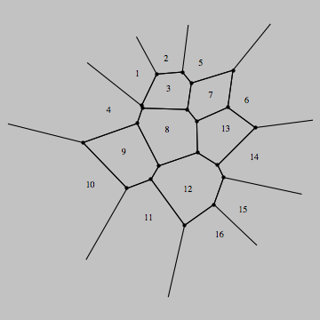


## MK-61/52

```mk-61/52
0  П4
  0  П5
    ИП0  1  -  x^2  ИП1  1  -  x^2  +  КвКор  П3
    9  П6
      КИП6  П8  {x}  2  10^x  *  П9
      [x]  ИП5  -  x^2  ИП9  {x}  2  10^x  *  ИП4  -  x^2  +  КвКор  П9
      ИП3  -  x<0  47  ИП9  П3  ИП6  П7
    ИП6  ИП2  -  9  -  x>=0  17
    КИП7  [x]  С/П
  КИП5  ИП5  ИП1  -  x>=0  04
КИП4  ИП4  ИП0  -  x>=0  02
```


''Input'': Р0 - diagram width; Р1 - diagram height;
Р0 - number of the points;
РA - РE - coordinates and colors of the points in format ''C,XXYY'' (example: 3,0102).

Example of the manually compiled output (graphical output from this class of devices is missing):

{| border="0" width="250"
 |- align="center" bgcolor="#F0C0C0"
 |·||·||·||·||·||·||·||·||·||·
 |- align="center" bgcolor="#F0C0C0"
 |·||·||·||·||·||·||·||·||·||·
 |- align="center" bgcolor="#F0C0C0"
 |·||·||·||·||·||·||·||·||·||·
 |- align="center" bgcolor="#F0C0C0"
 |·||·||·||•||·||·||·||·|| bgcolor="#C0C0F0" |·|| bgcolor="#C0C0F0" |·
 |- align="center" bgcolor="#F0C0C0"
 | bgcolor="#C0F0C0" |·|| bgcolor="#C0F0C0" |·||·||·||·||·|||·|| bgcolor="#C0C0F0" |·|| bgcolor="#C0C0F0" |·|| bgcolor="#C0C0F0" |·
 |- align="center" bgcolor="#C0F0C0"
 |·||·||·||·|| bgcolor="#F0C0C0" |·|| bgcolor="#F0C0C0" |·|| bgcolor="#C0C0F0" |·|| bgcolor="#C0C0F0" |·|| bgcolor="#C0C0F0" |·|| bgcolor="#C0C0F0" |·
 |- align="center" bgcolor="#C0F0C0"
 |·||·||•||·||·|| bgcolor="#C0C0F0" |·|| bgcolor="#C0C0F0" |·|| bgcolor="#C0C0F0" |·|| bgcolor="#C0C0F0" |·|| bgcolor="#C0C0F0" |·
 |- align="center" bgcolor="#C0F0C0"
 |·||·||·||·||·|| bgcolor="#C0C0F0" |·|| bgcolor="#C0C0F0" |·|| bgcolor="#C0C0F0" |·|| bgcolor="#C0C0F0" |·|| bgcolor="#C0C0F0" |·
 |- align="center" bgcolor="#C0C0F0"
 | bgcolor="#C0F0C0" |·|| bgcolor="#C0F0C0" |·|| bgcolor="#C0F0C0" |·|| bgcolor="#C0F0C0" |·|| bgcolor="#C0F0C0" |·||·||·||•||·||·
 |- align="center" bgcolor="#C0C0F0"
 | bgcolor="#C0F0C0" |·|| bgcolor="#C0F0C0" |·|| bgcolor="#C0F0C0" |·|| bgcolor="#C0F0C0" |·||·||·||·||·||·||·
|}


## Nim

Works with nim 0.19.4.

```nim
from sequtils import newSeqWith
from random import rand, randomize
from times import now
import libgd

const
  img_width  = 400
  img_height = 300
  nSites = 20

proc dot(x, y: int): int = x * x + y * y

proc generateVoronoi(img: gdImagePtr) =

  randomize(cast[int64](now()))

  # random sites
  let sx = newSeqWith(nSites, rand(img_width))
  let sy = newSeqWith(nSites, rand(img_height))

  # generate a random color for each site
  let sc = newSeqWith(nSites, img.setColor(rand(255), rand(255), rand(255)))

  # generate diagram by coloring each pixel with color of nearest site
  for x in 0 ..< img_width:
    for y in 0 ..< img_height:
      var dMin = dot(img_width, img_height)
      var sMin: int
      for s in 0 ..< nSites:
        if (let d = dot(sx[s] - x, sy[s] - y); d) < dMin:
          (sMin, dMin) = (s, d)

      img.setPixel(point=[x, y], color=sc[sMin])

  # mark each site with a black box
  let black = img.setColor(0x000000)
  for s in 0 ..< nSites:
    img.drawRectangle(
      startCorner=[sx[s] - 2, sy[s] - 2],
      endCorner=[sx[s] + 2, sy[s] + 2],
      color=black,
      fill=true)

proc main() =

  withGd imageCreate(img_width, img_height, trueColor=true) as img:
    img.generateVoronoi()

    let png_out = open("outputs/voronoi_diagram.png", fmWrite)
    img.writePng(png_out)
    png_out.close()

main()
```


## OCaml

Works with OCaml 4.07.1.


```ocaml
let n_sites = 220

let size_x = 640
let size_y = 480

let sq2 ~x ~y =
  (x * x + y * y)

let rand_int_range a b =
  a + Random.int (b - a + 1)

let nearest_site ~site ~x ~y =
  let ret = ref 0 in
  let dist = ref 0 in
  Array.iteri (fun k (sx, sy) ->
    let d = sq2 (x - sx) (y - sy) in
    if k = 0 || d < !dist then begin
      dist := d;
      ret := k;
    end
  ) site;
  !ret

let gen_map ~site ~rgb =
  let nearest = Array.make (size_x * size_y) 0 in
  let buf = Bytes.create (3 * size_x * size_y) in

  for y = 0 to pred size_y do
    for x = 0 to pred size_x do
      nearest.(y * size_x + x) <-
        nearest_site ~site ~x ~y;
    done;
  done;

  for i = 0 to pred (size_y * size_x) do
    let j = i * 3 in
    let r, g, b = rgb.(nearest.(i)) in
    Bytes.set buf (j+0) (char_of_int r);
    Bytes.set buf (j+1) (char_of_int g);
    Bytes.set buf (j+2) (char_of_int b);
  done;

  Printf.printf "P6\n%d %d\n255\n" size_x size_y;
  print_bytes buf;
;;

let () =
  Random.self_init ();
  let site =
    Array.init n_sites (fun i ->
      (Random.int size_x,
       Random.int size_y))
  in
  let rgb =
    Array.init n_sites (fun i ->
      (rand_int_range 160 255,
       rand_int_range  40 160,
       rand_int_range  20 140))
  in
  gen_map ~site ~rgb
```


## Perl

Translated from Perl 6.

```perl
use strict;
use warnings;
use Imager;

my %type = (
     Taxicab   => sub { my($px, $py, $x, $y) = @_; abs($px - $x)    + abs($py - $y)    },
     Euclidean => sub { my($px, $py, $x, $y) = @_;    ($px - $x)**2 +    ($py - $y)**2 },
     Minkowski => sub { my($px, $py, $x, $y) = @_; abs($px - $x)**3 + abs($py - $y)**3 },
);

my($xmax, $ymax) = (400, 400);
my @domains;
for (1..30) {
    push @domains, {
        x   => int 5 + rand $xmax-10,
        y   => int 5 + rand $ymax-10,
        rgb => [int rand 255, int rand 255, int rand 255]
    }
}

for my $type (keys %type) {
    our $img = Imager->new(xsize => $xmax, ysize => $ymax, channels => 3);
    voronoi($type, $xmax, $ymax, @domains);
    dot(1,@domains);
    $img->write(file => "voronoi-$type.png");

    sub voronoi {
        my($type, $xmax, $ymax, @d) = @_;
        for my $x (0..$xmax) {
            for my $y (0..$ymax) {
                my $i = 0;
                my $d = 10e6;
                for (0..$#d) {
                    my $dd = &{$type{$type}}($d[$_]{'x'}, $d[$_]{'y'}, $x, $y);
                    if ($dd < $d) { $d = $dd; $i = $_ }
                }
                $img->setpixel(x => $x, y => $y, color => $d[$i]{rgb} );
            }
        }
    }

    sub dot {
        my($radius, @d) = @_;
        for (0..$#d) {
            my $dx = $d[$_]{'x'};
            my $dy = $d[$_]{'y'};
            for my $x ($dx-$radius .. $dx+$radius) {
                for my $y ($dy-$radius .. $dy+$radius) {
                    $img->setpixel(x => $x, y => $y, color => [0,0,0]);
                }
            }
        }
    }
}
```

[Euclidean Voronoi diagram](
  https://github.com/SqrtNegInf/Rosettacode-Perl5-Smoke/blob/master/ref/voronoi-Euclidean.png)


## Perl 6

Works with Rakudo 2018.09
Translated from Python.
Perhaps "Inspired by Python" would be more accurate.

Generates a Euclidean, a Taxicab and a Minkowski Voronoi diagram
using the same set of domain points and colors.

```perl6
use Image::PNG::Portable;

my @bars = '▁▂▃▅▆▇▇▆▅▃▂▁'.comb;

my %type = ( # Voronoi diagram type distance calculation
    'Taxicab'   => sub ($px, $py, $x, $y) { ($px - $x).abs  + ($py - $y).abs  },
    'Euclidean' => sub ($px, $py, $x, $y) { ($px - $x)²     + ($py - $y)²     },
    'Minkowski' => sub ($px, $py, $x, $y) { ($px - $x)³.abs + ($py - $y)³.abs },
);

my $width  = 400;
my $height = 400;
my $dots   = 30;

my @domains = map { Hash.new(
    'x' => (5..$width-5).roll,
    'y' => (5..$height-5).roll,
    'rgb' => [(64..255).roll xx 3]
) }, ^$dots;

for %type.keys -> $type {
    print "\nGenerating $type diagram...    ", ' ' x @bars;
    my $img = voronoi(@domains, :w($width), :h($height), :$type);
    @domains.map: *.&dot($img);
    $img.write: "Voronoi-{$type}-perl6.png";
}

sub voronoi (@domains, :$w, :$h, :$type) {
    my $png = Image::PNG::Portable.new: :width($w), :height($h);
    (^$w).race.map: -> $x {
        print "\b" x 2+@bars, @bars.=rotate(1).join , '  ';
        for ^$h -> $y {
            my ($, $i) = min @domains.map: { %type{$type}(%($_)<x>, %($_)<y>, $x, $y), $++ };
            $png.set: $x, $y, |@domains[$i]<rgb>
        }
    }
    $png
}

sub dot (%h, $png, $radius = 3) {
    for (%h<x> X+ -$radius .. $radius) X (%h<y> X+ -$radius .. $radius) -> ($x, $y) {
            $png.set($x, $y, 0, 0, 0) if ( %h<x> - $x + (%h<y> - $y) * i ).abs <= $radius;
    }
}
```

See [Euclidean](https://github.com/thundergnat/rc/blob/master/img/Voronoi-Euclidean-perl6.png),
[Taxicab](https://github.com/thundergnat/rc/blob/master/img/Voronoi-Taxicab-perl6.png), and
[Minkowski](https://github.com/thundergnat/rc/blob/master/img/Voronoi-Minkowski-perl6.png)
Voronoi diagram example images.


## Phix

Translated from Liberty_BASIC.
Lifted the calculation strategy from Liberty Basic.
Can resize, double or halve sites (press +/-),
and toggle between Euclid, Manhattan, and Minkowski (press e/m/w).

```Phix
--
-- demo\rosetta\VoronoiDiagram.exw
--
include pGUI.e

Ihandle dlg, canvas, timer
cdCanvas cddbuffer, cdcanvas

-- Stop any current drawing process before starting a new one:
-- Without this it /is/ going to crash, if it tries to finish
-- drawing all 100 sites, when there are now only 50, for eg.
integer timer_active = 0

integer nsites = 200
integer last_width = -1, last_height
sequence siteX, siteY, siteC

enum EUCLID, MANHATTAN, MINKOWSKI

constant dmodes = {"Euclid", "Manhattan", "Minkowski"}

integer dmode = EUCLID,
        drawn = 0       -- (last dmode actually shown)

function distance(integer x1,y1, x2,y2)
atom d
    x1 -= x2
    y1 -= y2
    switch dmode do
        case EUCLID:    d = x1*x1+y1*y1                       -- (no need for sqrt)
        case MANHATTAN: d = abs(x1)+abs(y1)
        case MINKOWSKI: d = power(abs(x1),3)+power(abs(y1),3) -- ("" power(d,1/3))
    end switch
    return d
end function

sequence nearestIndex, dist

function checkRow(integer site, integer x, integer height)
bool res = false
atom dxSquared
    integer x1 = siteX[site]-x
    switch dmode do
        case EUCLID:    dxSquared = x1*x1
        case MANHATTAN: dxSquared = abs(x1)
        case MINKOWSKI: dxSquared = power(abs(x1),3)
    end switch
    for y=1 to height do
--      atom dSquared = distance(siteX[site],siteY[site],x,y)   -- (sub-optimal..)
        atom dSquared
        integer y1 = siteY[site]-y
        switch dmode do
            case EUCLID:    dSquared = dxSquared + y1*y1
            case MANHATTAN: dSquared = dxSquared + abs(y1)
            case MINKOWSKI: dSquared = dxSquared + power(abs(y1),3)
        end switch
        if dSquared<=dist[x,y] then
            dist[x,y] = dSquared
            nearestIndex[x,y] = site
            res = true
        end if
    end for
    return res
end function

function redraw_cb(Ihandle /*ih*/, integer /*posx*/, integer /*posy*/)
integer {width, height} = IupGetIntInt(canvas, "DRAWSIZE")
    if width!=last_width
    or height!=last_height
    or nsites!=length(siteX) then
        if nsites<1 then nsites = 1 end if
        siteX = sq_rand(repeat(width,nsites))
        siteY = sq_rand(repeat(height,nsites))
        siteC = sq_rand(repeat(#FFFFFF,nsites))
        last_width = width
        last_height = height
        drawn = 0
    end if
    if drawn!=dmode             -- (prevent double-draw, and)
    and not timer_active then   -- (drawing when rug moved..)
        drawn = dmode
        cdCanvasActivate(cddbuffer)
        atom t0 = time(), t1
        t1 = time()+0.25
        nearestIndex = repeat(repeat(1,height),width)
        dist = repeat(repeat(0,height),width)
        -- fill distance table with distances from the first site
        integer x1 = siteX[1], y1 = siteY[1]
        for x=1 to width do
            for y=1 to height do
                dist[x,y] = distance(x1,y1,x,y)
            end for
            if timer_active then exit end if
        end for
        --for other towns
        for i=2 to nsites do
            -- look left
            for x=siteX[i] to 1 by -1 do
                if not checkRow(i, x, height) then exit end if
            end for
            -- look right
            for x=siteX[i]+1 to width do
                if not checkRow(i, x, height) then exit end if
            end for
            if timer_active then exit end if
            if time()>t1 then
                IupSetStrAttribute(dlg, "TITLE", "Voronoi diagram (generating - %3.2f%%)",{100*i/nsites})
                IupFlush()
                t1 = time()+0.25
            end if
        end for
        t1 = time()
        for y=1 to height do
            integer nearest = nearestIndex[1,y]
            integer s = 1
            for x=2 to width do
                if nearestIndex[x,y]<>nearest then
                    cdCanvasSetForeground(cddbuffer, siteC[nearest])
                    cdCanvasLine(cddbuffer, s-1, y-1, x-2, y-1)
                    nearest = nearestIndex[x,y]
                    s = x
                end if
            end for
            if timer_active then exit end if
            cdCanvasSetForeground(cddbuffer, siteC[nearest])
            cdCanvasLine(cddbuffer, s-1, y-1, width-1, y-1)
        end for
        if not timer_active then
            cdCanvasSetForeground(cddbuffer, CD_BLACK)
            for i=1 to nsites do
                cdCanvasSector(cddbuffer, siteX[i], siteY[i], 2, 2, 0, 360)
            end for
            cdCanvasFlush(cddbuffer)
            IupSetStrAttribute(dlg, "TITLE", "Voronoi diagram - %s, %dx%d, %d sites, %3.2fs",{dmodes[dmode],width,height,nsites,time()-t0})
        end if
    end if
    return IUP_DEFAULT
end function

function map_cb(Ihandle ih)
    cdcanvas = cdCreateCanvas(CD_IUP, ih)
    cddbuffer = cdCreateCanvas(CD_DBUFFER, cdcanvas)
    cdCanvasSetBackground(cddbuffer, CD_WHITE)
    cdCanvasSetForeground(cddbuffer, CD_BLACK)
    return IUP_DEFAULT
end function

function esc_close(Ihandle /*ih*/, atom c)
    if c=K_ESC then return IUP_CLOSE end if
    integer wasdmode = dmode
    switch c do
        case '+': nsites *= 2
        case '-': nsites = max(floor(nsites/2),1)
        case 'E','e': dmode = EUCLID
        case 'M','m': dmode = MANHATTAN
        case 'W','w': dmode = MINKOWSKI
    end switch
    if dmode!=wasdmode
    or nsites!=length(siteX) then
        -- give any current drawing process 0.1s to abandon:
        timer_active = 1
        IupStoreAttribute(timer, "RUN", "YES")
--      IupUpdate(canvas)
    end if
    return IUP_CONTINUE
end function

function timer_cb(Ihandle /*ih*/)
    timer_active = 0
    IupStoreAttribute(timer, "RUN", "NO")
    IupUpdate(canvas)
    return IUP_IGNORE
end function

procedure main()
    IupOpen()

    canvas = IupCanvas(NULL)
    IupSetAttribute(canvas, "RASTERSIZE", "600x400") -- initial size
    IupSetCallback(canvas, "MAP_CB", Icallback("map_cb"))

    timer = IupTimer(Icallback("timer_cb"), 100, 0) -- (inactive)

    dlg = IupDialog(canvas)
    IupSetAttribute(dlg, "TITLE", "Voronoi diagram")
    IupSetCallback(dlg, "K_ANY",     Icallback("esc_close"))
    IupSetCallback(canvas, "ACTION", Icallback("redraw_cb"))

    IupMap(dlg)
    IupSetAttribute(canvas, "RASTERSIZE", NULL) -- release the minimum limitation
    IupShowXY(dlg,IUP_CENTER,IUP_CENTER)
    IupMainLoop()
    IupClose()
end procedure
main()
```


## Prolog

Works with SWI-Prolog and XPCE.

3 Voronoi diagrams are given for the same sites, one with the Manhattan distance,
one with the Euclidean distance and the last with the Minkowski distance (order 3).

```Prolog
:- dynamic pt/6.
voronoi :-
  V is random(20) + 20,
  retractall(pt(_,_,_,_)),
  forall(between(1, V, I),
         ( X is random(390) + 5,
           Y is random(390) + 5,
     R is random(65535),
     G is random(65535),
     B is random(65535),
     assertz(pt(I,X,Y, R, G, B))
         )),
  voronoi(manhattan, V),
  voronoi(euclide, V),
  voronoi(minkowski_3, V).

voronoi(Distance, V) :-
  sformat(A, 'Voronoi 400X400 ~w ~w', [V, Distance]),
  new(D, window(A)),
  send(D, size, size(400,400)),
  new(Img, image(@nil, width := 400, height := 400 , kind := pixmap)),

        % get the list of the sites
  bagof((N, X, Y), R^G^B^pt(N, X, Y, R, G, B), L),

  forall(between(0,399, I),
         forall(between(0,399, J),
       (  get_nearest_site(V, Distance, I, J, L, S),
          pt(S, _, _, R, G, B),
          send(Img, pixel(I, J, colour(@default, R, G, B)))))),

  new(Bmp, bitmap(Img)),
  send(D, display, Bmp, point(0,0)),
  send(D, open).

% define predicatea foldl (functionnal spirit)
foldl([], _Pred, R, R).

foldl([H | T], Pred, Acc, R) :-
  call(Pred, H, Acc, R1),
  foldl(T, Pred, R1, R).

% predicate for foldl
compare(Distance, XP, YP, (N, X, Y), (D, S), R) :-
  call(Distance, XP, YP, X, Y, DT),
  (   DT < D -> R = (DT, N) ; R = (D, S)).

% use of a fake site for the init of foldl
get_nearest_site(Distance, I, J, L, S) :-
  foldl(L, compare(Distance, I, J),  (65535, nil), (_, S)).


manhattan(X1, Y1, X2, Y2, D) :-
  D is abs(X2 - X1) + abs(Y2-Y1).

euclide(X1, Y1, X2, Y2, D) :-
  D is sqrt((X2 - X1)**2 + (Y2-Y1)**2).

minkowski_3(X1, Y1, X2, Y2, D) :-
  D is (abs(X2 - X1)**3 + abs(Y2-Y1)**3)**0.33.

```


## PureBasic

### Euclidean

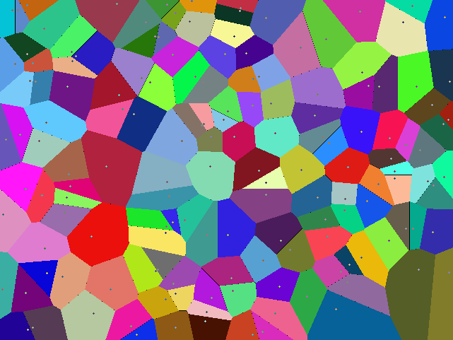

```PureBasic
Structure VCoo
  x.i:  y.i
  Colour.i: FillColour.i
EndStructure

Macro RandInt(MAXLIMIT)
  Int(MAXLIMIT*(Random(#MAXLONG)/#MAXLONG))
EndMacro

Macro SQ2(X, Y)
  ((X)*(X) + (Y)*(Y))
EndMacro

Procedure GenRandomPoints(Array a.VCoo(1), xMax, yMax, cnt)
  Protected i, j, k, l
  cnt-1
  Dim a(cnt)
  For i=0 To cnt
    a(i)\x = RandInt(xMax): a(i)\y = RandInt(yMax)
    j = RandInt(255): k = RandInt(255): l = RandInt(255)
    a(i)\Colour = RGBA(j, k, l, 255)
    a(i)\FillColour = RGBA(255-j, 255-k, 255-l, 255)
  Next i
  ProcedureReturn #True
EndProcedure

Procedure MakeVoronoiDiagram(Array a.VCoo(1),xMax, yMax) ; Euclidean
  Protected i, x, y, img, dist.d, dt.d
  img = CreateImage(#PB_Any, xMax+1, yMax+1)
  If StartDrawing(ImageOutput(img))
    For y=0 To yMax
      For x=0 To xMax
        dist = Infinity()
        For i=0 To ArraySize(a())
          dt = SQ2(x-a(i)\x, y-a(i)\y)
          If dt > dist
            Continue
          ElseIf dt < dist
            dist = dt
            Plot(x,y,a(i)\FillColour)
          Else ; 'Owner ship' is unclear, set pixel to transparent.
            Plot(x,y,RGBA(0, 0, 0, 0))
          EndIf
        Next
      Next
    Next
    For i=0 To ArraySize(a())
      Circle(a(i)\x, a(i)\y, 1, a(i)\Colour)
    Next
    StopDrawing()
  EndIf
  ProcedureReturn img
EndProcedure

; Main code
Define img, x, y, file$
Dim V.VCoo(0)
x = 640: y = 480
If Not GenRandomPoints(V(), x, y, 150): End: EndIf
img = MakeVoronoiDiagram(V(), x, y)
If img And OpenWindow(0, 0, 0, x, y, "Voronoi Diagram in PureBasic", #PB_Window_SystemMenu)
  ImageGadget(0, 0, 0, x, y, ImageID(img))
  Repeat: Until WaitWindowEvent() = #PB_Event_CloseWindow
EndIf

UsePNGImageEncoder()
file$ = SaveFileRequester("Save Image?", "Voronoi_Diagram_in_PureBasic.png", "PNG|*.png", 0)
If file$ <> ""
  SaveImage(img, file$, #PB_ImagePlugin_PNG)
EndIf
```


### Taxicab

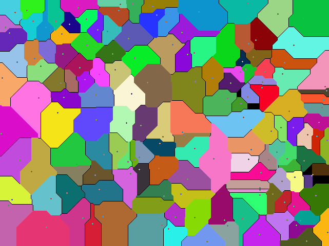

```PureBasic
Structure VCoo
  x.i:  y.i
  Colour.i: FillColour.i
EndStructure

Macro RandInt(MAXLIMIT)
  Int(MAXLIMIT*(Random(#MAXLONG)/#MAXLONG))
EndMacro

Procedure GenRandomPoints(Array a.VCoo(1), xMax, yMax, cnt)
  Protected i, j, k, l
  cnt-1
  Dim a(cnt)
  For i=0 To cnt
    a(i)\x = RandInt(xMax): a(i)\y = RandInt(yMax)
    j = RandInt(255): k = RandInt(255): l = RandInt(255)
    a(i)\Colour = RGBA(j, k, l, 255)
    a(i)\FillColour = RGBA(255-j, 255-k, 255-l, 255)
  Next i
  ProcedureReturn #True
EndProcedure

Procedure MakeVoronoiDiagram(Array a.VCoo(1),xMax, yMax)
  Protected i, x, y, img, dist, dt, dx, dy
  img = CreateImage(#PB_Any, xMax+1, yMax+1, 32)
  If StartDrawing(ImageOutput(img))
    For y=0 To yMax
      For x=0 To xMax
        dist = #MAXLONG
        For i=0 To ArraySize(a())
          dx = x-a(i)\x
          dy = y-a(i)\y
          dt = Sign(dx)*dx + Sign(dy)*dy
          If dt > dist ; no update
            Continue
          ElseIf dt < dist  ; an new 'owner' is found
            dist = dt
            Plot(x,y,a(i)\FillColour)
          Else ; dt = dist
            Plot(x,y,RGBA(0,0,0,0)) ; no clear 'owner', make the pixel transparent
          EndIf
        Next
      Next
    Next
    For i=0 To ArraySize(a())
      Circle(a(i)\x, a(i)\y, 1, a(i)\Colour)
    Next
    StopDrawing()
  EndIf
  ProcedureReturn img
EndProcedure

; Main code
Define img, x, y, file$
Dim V.VCoo(0)
x = 640: y = 480
If Not GenRandomPoints(V(), x, y, 150): End: EndIf
img = MakeVoronoiDiagram(V(), x, y)
If img And OpenWindow(0, 0, 0, x, y, "Voronoi Diagram in PureBasic", #PB_Window_SystemMenu)
  ImageGadget(0, 0, 0, x, y, ImageID(img))
  Repeat: Until WaitWindowEvent() = #PB_Event_CloseWindow
EndIf

UsePNGImageEncoder()
file$ = SaveFileRequester("Save Image?", "Voronoi_Diagram_in_PureBasic.png", "PNG|*.png", 0)
If file$ <> ""
  SaveImage(img, file$, #PB_ImagePlugin_PNG)
EndIf
```


## Python

This implementation takes in a list of points,
each point being a tuple and returns a dictionary
consisting of all the points at a given site.

```python
from PIL import Image
import random
import math

def generate_voronoi_diagram(width, height, num_cells):
  image = Image.new("RGB", (width, height))
  putpixel = image.putpixel
  imgx, imgy = image.size
  nx = []
  ny = []
  nr = []
  ng = []
  nb = []
  for i in range(num_cells):
    nx.append(random.randrange(imgx))
    ny.append(random.randrange(imgy))
    nr.append(random.randrange(256))
    ng.append(random.randrange(256))
    nb.append(random.randrange(256))
  for y in range(imgy):
    for x in range(imgx):
      dmin = math.hypot(imgx-1, imgy-1)
      j = -1
      for i in range(num_cells):
        d = math.hypot(nx[i]-x, ny[i]-y)
        if d < dmin:
          dmin = d
          j = i
      putpixel((x, y), (nr[j], ng[j], nb[j]))
  image.save("VoronoiDiagram.png", "PNG")
        image.show()

generate_voronoi_diagram(500, 500, 25)
```

Output:


## R

One of the R's great powers is its unlimited number of packages, virtually thousands of them.
For any applications big or small you can find a package.
In case of Voronoi diagram there are many of packages, e.g.:
deldir, alphahull, dismo, ggplot, ggplot2, tripack, CGAL, etc.
Not to mention all linked packages.
Do you need random colors? Again, find a few packages more...

So, I've decided to use proven algorithms instead. Result - small compact code and
beautiful diagrams with any reasonable amount of sites.
A few custom helper functions simplified code, and they can be used for any other applications.

If you have not a super fast computer,
you can watch animation of plotting in "R Graphics" sub-window of the "RGui" window.
Translated from JavaScript v.#2.
Works with R|3.3.3 and above


```r
## HF#1 Random Hex color
randHclr <- function() {
  m=255;r=g=b=0;
  r <- sample(0:m, 1, replace=TRUE);
  g <- sample(0:m, 1, replace=TRUE);
  b <- sample(0:m, 1, replace=TRUE);
  return(rgb(r,g,b,maxColorValue=m));
}
## HF#2 Metrics: Euclidean, Manhattan and Minkovski
Metric <- function(x, y, mt) {
  if(mt==1) {return(sqrt(x*x + y*y))}
  if(mt==2) {return(abs(x) + abs(y))}
  if(mt==3) {return((abs(x)^3 + abs(y)^3)^0.33333)}
}

## Plotting Voronoi diagram. aev 3/12/17
## ns - number of sites, fn - file name, ttl - plot title.
## mt - type of metric: 1 - Euclidean, 2 - Manhattan, 3 - Minkovski.
pVoronoiD <- function(ns, fn="", ttl="",mt=1) {
  cat(" *** START VD:", date(), "\n");
  if(mt<1||mt>3) {mt=1}; mts=""; if(mt>1) {mts=paste0(", mt - ",mt)};
  m=640; i=j=k=m1=m-2; x=y=d=dm=0;
  if(fn=="") {pf=paste0("VDR", mt, ns, ".png")} else {pf=paste0(fn, ".png")};
  if(ttl=="") {ttl=paste0("Voronoi diagram, sites - ", ns, mts)};
  cat(" *** Plot file -", pf, "title:", ttl, "\n");
  plot(NA, xlim=c(0,m), ylim=c(0,m), xlab="", ylab="", main=ttl);
  X=numeric(ns); Y=numeric(ns); C=numeric(ns);
  for(i in 1:ns) {
    X[i]=sample(0:m1, 1, replace=TRUE);
    Y[i]=sample(0:m1, 1, replace=TRUE);
    C[i]=randHclr();
  }
  for(i in 0:m1) {
    for(j in 0:m1) {
      dm=Metric(m1,m1,mt); k=-1;
      for(n in 1:ns) {
        d=Metric(X[n]-j,Y[n]-i, mt);
        if(d<dm) {dm=d; k=n;}
      }
      clr=C[k]; segments(j, i, j, i, col=clr);
    }
  }
  points(X, Y, pch = 19, col = "black", bg = "white")
  dev.copy(png, filename=pf, width=m, height=m);
  dev.off(); graphics.off();
  cat(" *** END VD:",date(),"\n");
}
## Executing:
pVoronoiD(150)          ## Euclidean metric
pVoronoiD(10,"","",2)   ## Manhattan metric
pVoronoiD(10,"","",3)   ## Minkovski metric
```

Output:

```txt
> pVoronoiD(150)          ## Euclidean metric
 *** START VD: Sun Mar 12 19:04:26 2017
 *** Plot file - VDR1150.png title: Voronoi diagram, sites - 150
 *** END VD: Sun Mar 12 19:11:03 2017
> pVoronoiD(10,"","",2)   ## Manhattan metric
 *** START VD: Mon Mar 20 13:57:46 2017
 *** Plot file - VDR210.png title: Voronoi diagram, sites - 10, mt - 2
 *** END VD: Mon Mar 20 13:59:42 2017
 > pVoronoiD(10,"","",3)   ## Minkovski metric
 *** START VD: Mon Mar 20 14:45:15 2017
 *** Plot file - VDR310.png title: Voronoi diagram, sites - 10, mt - 3
 *** END VD: Mon Mar 20 14:47:21 2017
```


## Racket

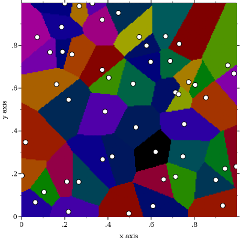

First approach:

```racket

#lang racket

(require plot)

;; Performs clustering of points in a grid
;; using the nearest neigbour approach and shows
;; clusters in different colors
(define (plot-Voronoi-diagram point-list)
  (define pts
    (for*/list ([x (in-range 0 1 0.005)]
                [y (in-range 0 1 0.005)])
      (vector x y)))

  (define clusters (clusterize pts point-list))

  (plot
   (append
    (for/list ([r (in-list clusters)] [i (in-naturals)])
      (points (rest r) #:color i #:sym 'fullcircle1))
    (list (points point-list #:sym 'fullcircle5 #:fill-color 'white)))))

;; Divides the set of points into clusters
;; using given centroids
(define (clusterize data centroids)
  (for*/fold ([res (map list centroids)]) ([x (in-list data)])
    (define c (argmin (curryr (metric) x) centroids))
    (dict-set res c (cons x (dict-ref res c)))))

```

Different metrics:

```racket
(define (euclidean-distance a b)
  (for/sum ([x (in-vector a)] [y (in-vector b)])
    (sqr (- x y))))

(define (manhattan-distance a b)
  (for/sum ([x (in-vector a)] [y (in-vector b)])
    (abs (- x y))))

(define metric (make-parameter euclidean-distance))
```

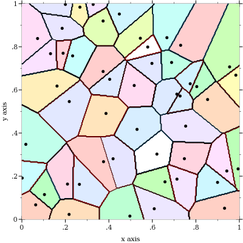

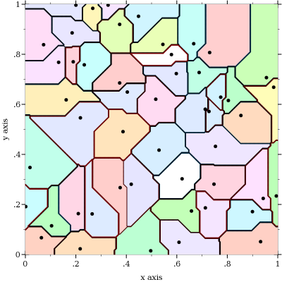

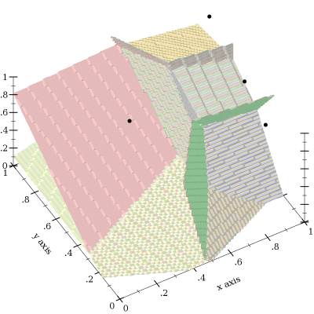

Alternative approach:

```racket
;; Plots the Voronoi diagram as a contour plot of
;; the classification function built for a set of points
(define (plot-Voronoi-diagram2 point-list)
  (define n (length point-list))
  (define F (classification-function point-list))
  (plot
   (list
    (contour-intervals (compose F vector) 0 1 0 1
                       #:samples 300
                       #:levels n
                       #:colors (range n)
                       #:contour-styles '(solid)
                       #:alphas '(1))
    (points point-list #:sym 'fullcircle3))))

;; For a set of centroids returns a function
;; which finds the index of the centroid nearest
;; to a given point
(define (classification-function centroids)
  (define tbl
    (for/hash ([p (in-list centroids)] [i (in-naturals)])
      (values p i)))
  (λ (x)
    (hash-ref tbl (argmin (curry (metric) x) centroids))))
```

Output:

```racket
(define pts
  (for/list ([i 50]) (vector (random) (random))))

(display (plot-Voronoi-diagram pts))

(display (plot-Voronoi-diagram2 pts))

(parameterize ([metric manhattan-distance])
  (display (plot-Voronoi-diagram2 pts)))

;; Using the classification function it is possible to plot Voronoi diagram in 3D.
(define pts3d (for/list ([i 7]) (vector (random) (random) (random))))
(plot3d (list
         (isosurfaces3d (compose (classification-function pts3d) vector)
                        0 1 0 1 0 1
                        #:line-styles '(transparent)
                        #:samples 100
                        #:colors (range 7)
                        #:alphas '(1))
         (points3d pts3d #:sym 'fullcircle3)))
```


## Ring

```ring
# Project : Voronoi diagram

load "guilib.ring"
load "stdlib.ring"
paint = null

new qapp
        {
        spots  = 100
        leftside = 400
        rightside = 400

        locx = list(spots)
        locy = list(spots)
        rgb = newlist(spots,3)
        seal = newlist(leftside, rightside)
        reach = newlist(leftside, rightside)

        win1 = new qwidget() {
                  setwindowtitle("Voronoi diagram")
                  setgeometry(100,100,800,600)
                  label1 = new qlabel(win1) {
                              setgeometry(10,10,800,600)
                              settext("")
                  }
                  new qpushbutton(win1) {
                          setgeometry(150,550,100,30)
                          settext("draw")
                          setclickevent("draw()")
                  }
                  show()
        }
        exec()
        }

func draw
        p1 = new qpicture()
               color = new qcolor() {
               setrgb(0,0,255,255)
        }
        pen = new qpen() {
                 setcolor(color)
                 setwidth(1)
        }
        paint = new qpainter() {
                  begin(p1)
                  setpen(pen)

        for i =1 to spots
             locx[i] = floor(leftside  * randomf())
             locy[i] = floor(rightside * randomf())
             rgb[i][1] = floor(256 * randomf())
             rgb[i][2] = floor(256 * randomf())
             rgb[i][3] = floor(256 * randomf())
        next
        for x = 1 to leftside
             for y = 1 to rightside
                 reach[x][y] = pow((locx[1] - x),2) + pow((locy[1] - y),2)
                 seal[x][y] = 1
             next
        next
        for i = 2 to spots
             for x = locx[i] to 0 step -1
                 if not (chkpos(i,x,1, rightside-1))
                   exit
                 ok
             next
             for x = locx[i] + 1 to leftside - 1
                  if not (chkpos(i, x, 1, rightside-1))
                     exit
                  ok
             next
        next
        for x = 1 to leftside
             for y = 1 to rightside
               c1 = rgb[seal[x][y]][1]
            c2 = rgb[seal[x][y]][2]
            c3 = rgb[seal[x][y]][3]
                  color = new qcolor() { setrgb(c1,c2,c3,255) }
                  pen = new qpen()   { setcolor(color) setwidth(10) }
                  setpen(pen)
                  starty = y
                  nearest = seal[x][y]
                  for y = (y + 1)  to rightside
                       if seal[x][y] != nearest
                          y = y - 1
                          exit
                       ok
                  next
                  paint.drawline(x,starty,x,y + 1)
             next
        next
        endpaint()
        }
        label1 { setpicture(p1) show() }
        return

func chkpos(site,x,starty,endy)
        chkpos = 0
        dxsqr = 0
  dxsqr = pow((locx[site]- x),2)
  for y = starty to endy
       dsqr = pow((locy[site] - y),2) + dxsqr
             if x <= leftside and y <= leftside and x > 0 and y > 0
       if dsqr <= reach[x][y]
    reach[x][y]  = dsqr
    seal[x][y] = site
    chkpos = 1
             ok
       ok
  next
        return chkpos

func randomf()
       decimals(10)
       str = "0."
       for i = 1 to 10
            nr = random(9)
            str = str + string(nr)
       next
       return number(str)
```

Output image:

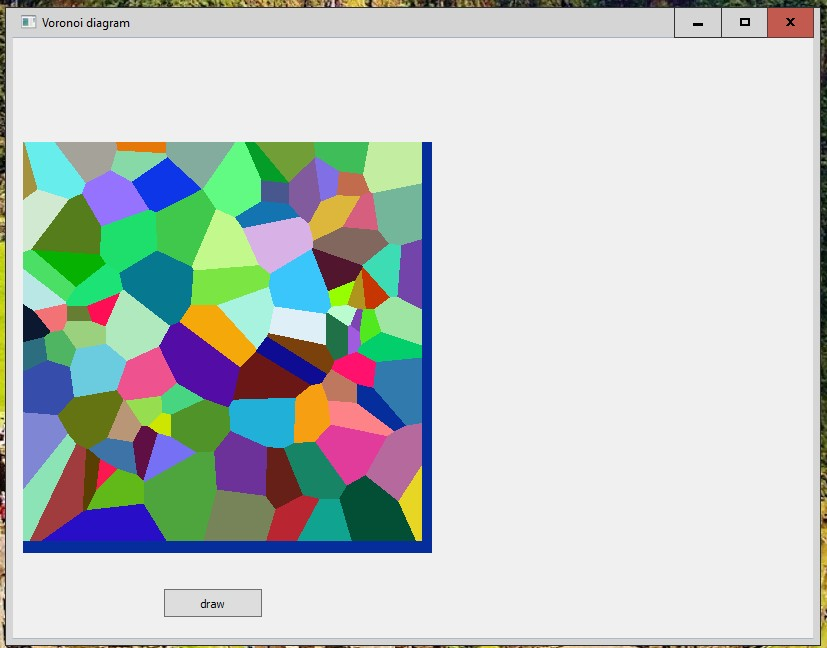


## Ruby

Uses [[Raster graphics operations/Ruby]]

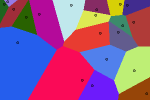

```ruby
load 'raster_graphics.rb'

class ColourPixel < Pixel
  def initialize(x, y, colour)
    @colour = colour
    super x, y
  end
  attr_accessor :colour

  def distance_to(px, py)
    Math::hypot(px - x, py - y)
  end
end

width, height = 300, 200
npoints = 20
pixmap = Pixmap.new(width,height)

@bases = npoints.times.collect do |i|
  ColourPixel.new(
      3+rand(width-6), 3+rand(height-6),  # provide a margin to draw a circle
      RGBColour.new(rand(256), rand(256), rand(256))
  )
end

pixmap.each_pixel do |x, y|
  nearest = @bases.min_by {|base| base.distance_to(x, y)}
  pixmap[x, y] = nearest.colour
end

@bases.each do |base|
  pixmap[base.x, base.y] = RGBColour::BLACK
  pixmap.draw_circle(base, 2, RGBColour::BLACK)
end

pixmap.save_as_png("voronoi_rb.png")
```


## Run BASIC

```runbasic
graphic #g, 400,400
#g flush()
spots    = 100
leftSide  = 400
rightSide  = 400

dim locX(spots)
dim locY(spots)
dim rgb(spots,3)
dim seal(leftSide, rightSide)
dim reach(leftSide, rightSide)

for i =1 to spots
    locX(i)  = int(leftSide  * rnd(1))
    locY(i)  = int(rightSide * rnd(1))
    rgb(i,1)  = int(256 * rnd(1))
    rgb(i,2)  = int(256 * rnd(1))
    rgb(i,3)  = int(256 * rnd(1))
    #g color(rgb(i,1),rgb(i,2),rgb(i,3))
    #g set(locX(i),locY(i))
next i
#g size(1)
' find reach to the first site
for x = 0 to leftSide - 1
    for y = 0 to rightSide - 1
        reach(x, y) = (locX(1) - x) ^ 2 + (locY(1) - y) ^ 2
        seal(x, y) = 1
    next y
next x
#g color("darkblue")

' spots other than 1st spot
for i = 2 to spots
    for x = locX(i) to 0 step -1    ' looking left
        if not(chkPos(i,x,0, rightSide - 1)) then exit for
    next x
    for x = locX(i) + 1 to leftSide - 1    ' looking right
        if not(chkPos(i, x, 0, rightSide - 1)) then exit for
    next x
next i

for x = 0 to leftSide - 1
    for y = 0 to rightSide - 1
  c1  = rgb(seal(x, y),1)
  c2  = rgb(seal(x, y),2)
  c3  = rgb(seal(x, y),3)
        #g color(c1,c2,c3)
        startY  = y
        nearest  = seal(x, y)
        for y = y + 1 to rightSide
            if seal(x, y) <> nearest then y = y - 1 : exit for
        next y
        #g line(x,startY,x,y + 1)
    next y
next x

#g color("black")
#g size(4)
for i =1 to spots
    #g set(locX(i),locY(i))
next i
render #g
end

function chkPos(site, x, startY, endY)
  dxSqr = (locX(site) - x) ^ 2
  for y = startY to endY
    dSqr = (locY(site) - y) ^ 2 + dxSqr
    if dSqr <= reach(x, y) then
      reach(x,y)  = dSqr
      seal(x,y)  = site
      chkPos    = 1
    end if
  next y
end function
```


## Rust

This implementation uses SDL to display the diagram.
The actual implementation of the Voronoi diagram is very fast because it's not pixel based,
it's vector based, using [Fortune's Linesweep algorithm](https://en.wikipedia.org/wiki/Fortune%27s_algorithm).
It can be found in the crate [voronoi](https://crates.io/crates/voronoi).

The entire code, including the Crate.toml and a precompiled binary for Windows x86_64,
can be found at <https://github.com/ctrlcctrlv/interactive-voronoi/>

```Rust
extern crate piston;
extern crate opengl_graphics;
extern crate graphics;
extern crate touch_visualizer;

#[cfg(feature = "include_sdl2")]
extern crate sdl2_window;

extern crate getopts;
extern crate voronoi;
extern crate rand;

use touch_visualizer::TouchVisualizer;
use opengl_graphics::{ GlGraphics, OpenGL };
use graphics::{ Context, Graphics };
use piston::window::{ Window, WindowSettings };
use piston::input::*;
use piston::event_loop::*;
#[cfg(feature = "include_sdl2")]
use sdl2_window::Sdl2Window as AppWindow;
use voronoi::{voronoi, Point, make_polygons};
use rand::Rng;

static DEFAULT_WINDOW_HEIGHT: u32 = 600;
static DEFAULT_WINDOW_WIDTH:  u32 = 600;

struct Settings {
    lines_only: bool,
    random_count: usize
}

fn main() {
    let args: Vec<String> = std::env::args().collect();
    let mut opts = getopts::Options::new();
    opts.optflag("l", "lines_only", "Don't color polygons, just outline them");
    opts.optopt("r", "random_count", "On keypress \"R\", put this many random points on-screen", "RANDOMCOUNT");
    let matches = opts.parse(&args[1..]).expect("Failed to parse args");

    let settings = Settings{
        lines_only: matches.opt_present("l"),
        random_count: match matches.opt_str("r") {
            None => { 50 },
            Some(s) => { s.parse().expect("Random count of bad format") }
        }
    };

    event_loop(&settings);

}

fn random_point() -> [f64; 2] {
    [rand::thread_rng().gen_range(0., DEFAULT_WINDOW_HEIGHT as f64), rand::thread_rng().gen_range(0., DEFAULT_WINDOW_WIDTH as f64)]
}

fn random_color() -> [f32; 4] {
    [rand::random::<f32>(), rand::random::<f32>(), rand::random::<f32>(), 1.0]
}

fn random_voronoi(dots: &mut Vec<[f64;2]>, colors: &mut Vec<[f32;4]>, num: usize) {
    dots.clear();
    colors.clear();

    for _ in 0..num {
        dots.push(random_point());
        colors.push(random_color());
    }
}

fn event_loop(settings: &Settings) {
    let opengl = OpenGL::V3_2;
    let mut window: AppWindow = WindowSettings::new("Interactive Voronoi", [DEFAULT_WINDOW_HEIGHT, DEFAULT_WINDOW_WIDTH])
        .exit_on_esc(true).opengl(opengl).build().unwrap();

    let ref mut gl = GlGraphics::new(opengl);
    let mut touch_visualizer = TouchVisualizer::new();
    let mut events = Events::new(EventSettings::new().lazy(true));
    let mut dots = Vec::new();
    let mut colors = Vec::new();

    let mut mx = 0.0;
    let mut my = 0.0;

    while let Some(e) = events.next(&mut window) {
        touch_visualizer.event(window.size(), &e);
        if let Some(button) = e.release_args() {
            match button {
                Button::Keyboard(key) => {
                    if key == piston::input::keyboard::Key::N { dots.clear(); colors.clear(); }
                    if key == piston::input::keyboard::Key::R { random_voronoi(&mut dots, &mut colors, settings.random_count); }
                }
                Button::Mouse(_) => {
                    dots.push([mx, my]);
                    colors.push(random_color());
                },
                _ => ()
            }
        };
        e.mouse_cursor(|x, y| {
            mx = x;
            my = y;
        });
        if let Some(args) = e.render_args() {
            gl.draw(args.viewport(), |c, g| {
                graphics::clear([1.0; 4], g);
                let mut vor_pts = Vec::new();
                for d in &dots {
                    vor_pts.push(Point::new(d[0], d[1]));
                }
                if vor_pts.len() > 0 {
                    let vor_diagram = voronoi(vor_pts, DEFAULT_WINDOW_WIDTH as f64);
                    let vor_polys = make_polygons(&vor_diagram);
                    for (i, poly) in vor_polys.iter().enumerate() {
                        if settings.lines_only {
                            draw_lines_in_polygon(poly, &c, g);
                        } else {
                            draw_polygon(poly, &c, g, colors[i]);
                        }
                    }
                }
                for d in &dots {
                    draw_ellipse(&d, &c, g);
                }
            });
        }
    }

}

fn draw_lines_in_polygon<G: Graphics>(
    poly: &Vec<Point>,
    c: &Context,
    g: &mut G,
)
{
    let color = [0.0, 0.0, 1.0, 1.0];

    for i in 0..poly.len()-1 {
        graphics::line(
            color,
            2.0,
            [poly[i].x.into(), poly[i].y.into(), poly[i+1].x.into(), poly[i+1].y.into()],
            c.transform,
            g
        )
    }
}

fn draw_polygon<G: Graphics>(
    poly: &Vec<Point>,
    c: &Context,
    g: &mut G,
    color: [f32; 4]
) {
    let mut polygon_points: Vec<[f64; 2]> = Vec::new();

    for p in poly {
        polygon_points.push([p.x.into(), p.y.into()]);
    }

    graphics::polygon(
        color,
        polygon_points.as_slice(),
        c.transform,
        g
    )
}

fn draw_ellipse<G: Graphics>(
    cursor: &[f64; 2],
    c: &Context,
    g: &mut G,
) {
    let color = [0.0, 0.0, 0.0, 1.0];
    graphics::ellipse(
        color,
        graphics::ellipse::circle(cursor[0], cursor[1], 4.0),
        c.transform,
        g
    );
}
```


## Scala

### Java Swing Interoperability

Works with Scala 2.13

```Scala
import java.awt.geom.Ellipse2D
import java.awt.image.BufferedImage
import java.awt.{Color, Graphics, Graphics2D}

import scala.math.sqrt

object Voronoi extends App {
  private val (cells, dim) = (100, 1000)
  private val rand = new scala.util.Random
  private val color = Vector.fill(cells)(rand.nextInt(0x1000000))
  private val image = new BufferedImage(dim, dim, BufferedImage.TYPE_INT_RGB)
  private val g: Graphics2D = image.createGraphics()
  private val px = Vector.fill(cells)(rand.nextInt(dim))
  private val py = Vector.fill(cells)(rand.nextInt(dim))

  for (x <- 0 until dim;
       y <- 0 until dim) {
    var n = 0

    def distance(x1: Int, x2: Int, y1: Int, y2: Int) =
      sqrt((x1 - x2) * (x1 - x2) + (y1 - y2) * (y1 - y2).toDouble) // Euclidian

    for (i <- px.indices
         if distance(px(i), x, py(i), y) < distance(px(n), x, py(n), y))
      n = i
    image.setRGB(x, y, color(n))
  }

  g.setColor(Color.BLACK)
  for (i <- px.indices) g.fill(new Ellipse2D.Double(px(i) - 2.5, py(i) - 2.5, 5, 5))

  new javax.swing.JFrame("Voronoi Diagram") {
    override def paint(g: Graphics): Unit = {g.drawImage(image, 0, 0, this); ()}

    setBounds(0, 0, dim, dim)
    setDefaultCloseOperation(javax.swing.WindowConstants.EXIT_ON_CLOSE)
    setLocationRelativeTo(null)
    setResizable(false)
    setVisible(true)
  }

}
```


## Seed7

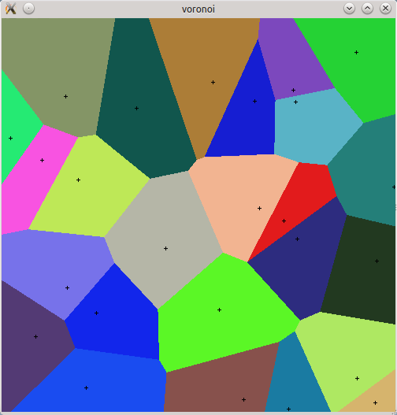

```seed7
$ include "seed7_05.s7i";
  include "draw.s7i";
  include "keybd.s7i";

const type: point is new struct
    var integer: xPos is 0;
    var integer: yPos is 0;
    var color: col is black;
  end struct;

const proc: generateVoronoiDiagram (in integer: width, in integer: height, in integer: numCells) is func
  local
    var array point: points is 0 times point.value;
    var integer: index is 0;
    var integer: x is 0;
    var integer: y is 0;
    var integer: distSquare is 0;
    var integer: minDistSquare is 0;
    var integer: indexOfNearest is 0;
  begin
    screen(width, height);
    points := numCells times point.value;
    for index range 1 to numCells do
      points[index].xPos := rand(0, width);
      points[index].yPos := rand(0, height);
      points[index].col := color(rand(0, 65535), rand(0, 65535), rand(0, 65535));
    end for;
    for y range 0 to height do
      for x range 0 to width do
        minDistSquare := width ** 2 + height ** 2;
        for index range 1 to numCells do
          distSquare := (points[index].xPos - x) ** 2 + (points[index].yPos - y) ** 2;
          if distSquare < minDistSquare then
            minDistSquare := distSquare;
            indexOfNearest := index;
          end if;
        end for;
        point(x, y, points[indexOfNearest].col);
      end for;
    end for;
    for index range 1 to numCells do
      line(points[index].xPos - 2, points[index].yPos, 4, 0, black);
      line(points[index].xPos, points[index].yPos - 2, 0, 4, black);
    end for;
  end func;

const proc: main is func
  begin
    generateVoronoiDiagram(500, 500, 25);
    KEYBOARD := GRAPH_KEYBOARD;
    readln(KEYBOARD);
  end func;
```

Original source: <http://seed7.sourceforge.net/algorith/graphic.htm#voronoi>


## Sidef

Translated from Python.

```ruby
require('Imager')

func generate_voronoi_diagram(width, height, num_cells) {
    var img = %O<Imager>.new(xsize => width, ysize => height)
    var (nx,ny,nr,ng,nb) = 5.of { [] }...

    for i in (^num_cells) {
        nx << rand(^width)
        ny << rand(^height)
        nr << rand(^256)
        ng << rand(^256)
        nb << rand(^256)
    }

    for y=(^height), x=(^width) {
        var j = (^num_cells -> min_by {|i| hypot(nx[i]-x, ny[i]-y) })
        img.setpixel(x => x, y => y, color => [nr[j], ng[j], nb[j]])
    }
    return img
}

var img = generate_voronoi_diagram(500, 500, 25)
img.write(file => 'VoronoiDiagram.png')
```

Output image:

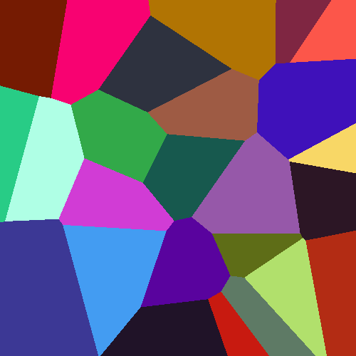


## Tcl

```tcl
package require Tk
proc r to {expr {int(rand()*$to)}};   # Simple helper

proc voronoi {photo pointCount} {
    for {set i 0} {$i < $pointCount} {incr i} {
  lappend points [r [image width $photo]] [r [image height $photo]]
    }
    foreach {x y} $points {
  lappend colors [format "#%02x%02x%02x" [r 256] [r 256] [r 256]]
    }
    set initd [expr {[image width $photo] + [image height $photo]}]
    for {set i 0} {$i < [image width $photo]} {incr i} {
  for {set j 0} {$j < [image height $photo]} {incr j} {
      set color black
      set d $initd
      foreach {x y} $points c $colors {
    set h [expr {hypot($x-$i,$y-$j)}]
    ### Other interesting metrics
    #set h [expr {abs($x-$i)+abs($y-$j)}]
    #set h [expr {(abs($x-$i)**3+abs($y-$j)**3)**0.3}]
    if {$d > $h} {set d $h;set color $c}
      }
      $photo put $color -to $i $j
  }
  # To display while generating, uncomment this line and the other one so commented
  #if {$i%4==0} {update idletasks}
    }
}

# Generate a 600x400 Voronoi diagram with 60 random points
image create photo demo -width 600 -height 400
pack [label .l -image demo]
# To display while generating, uncomment this line and the other one so commented
#update
voronoi demo 60
```


## XPL0


```XPL0
include c:\cxpl\codes;          \intrinsic 'code' declarations

def     N = 15;                 \number of sites
int     SiteX(N), SiteY(N),     \coordinates of sites
        Dist2, MinDist2, MinI,  \distance squared, and minimums
        X, Y, I;
[SetVid($13);                   \set 320x200x8 graphics
for I:= 0 to N-1 do             \create a number of randomly placed sites
        [SiteX(I):= Ran(160);  SiteY(I):= Ran(100)];
for Y:= 0 to 100-1 do           \generate Voronoi diagram
    for X:= 0 to 160-1 do       \for all points...
        [MinDist2:= -1>>1;      \find closest site
        for I:= 0 to N-1 do
                [Dist2:= sq(X-SiteX(I)) + sq(Y-SiteY(I));
                if Dist2 < MinDist2 then
                        [MinDist2:= Dist2;  MinI:= I];
                ];
        if MinDist2 then Point(X, Y, MinI+1);   \leave center black
        ];
I:= ChIn(1);                    \wait for keystroke
SetVid($03);                    \restore normal text screen
]
```


## Yabasic

```Yabasic
clear screen

sites = 200
xEdge = 600
yEdge = 400

open window xEdge, yEdge

dim townX(sites), townY(sites), col$(sites)

for i =1 to sites
    townX(i) =int(xEdge *ran(1))
    townY(i) =int(yEdge *ran(1))
    col$(i) = str$(int(256 * ran(1))) + ", " + str$(int(256 * ran(1))) + ", " + str$(int(256 * ran(1)))
    color col$(i)
    fill circle townX(i), townY(i), 2
next i

dim nearestIndex(xEdge, yEdge)
dim dist(xEdge, yEdge)

//fill distance table with distances from the first site
for x = 0 to xEdge - 1
    for y = 0 to yEdge - 1
        dist(x, y) = (townX(1) - x) ^ 2 + (townY(1) - y) ^ 2
        nearestIndex(x, y) = 1
    next y
next x

color 0,0,255
//for other towns
for i = 2 to sites
    //display some progress
    //print at(0,20) "computing: ", (i/sites*100) using "###.#", " %"

    //look left
    for x = townX(i) to 0 step -1
        if not(checkRow(i, x,0, yEdge - 1)) break
    next x
    //look right
    for x = townX(i) + 1 to xEdge - 1
        if not(checkRow(i, x, 0, yEdge - 1)) break
    next x
next i

for x = 0 to xEdge - 1
    for y =0 to yEdge - 1
      color col$(nearestIndex(x, y))
        startY = y
        nearest = nearestIndex(x, y)
        for y = y + 1 to yEdge
            if nearestIndex(x, y) <> nearest then y = y - 1 : break : end if
        next y
        line x, startY, x, y + 1
    next y
next x

color 0,0,0
for i =1 to sites
    fill circle townX( i), townY( i), 2
next i
print peek("millisrunning"), " ms"

sub checkRow(site, x, startY, endY)
    local dxSquared, y, check

    dxSquared = (townX(site) - x) ^ 2
    for y = startY to endY
         dSquared = (townY(site) - y) ^ 2 + dxSquared
         if dSquared <= dist(x, y) then
             dist(x, y) = dSquared
             nearestIndex(x, y) = site
             check = 1
         end if
    next y
    return check
end sub
```

Translated from Python.

```Yabasic
width = 500 : height = 500
open window width, height

export sub hypot(a, b)
   return (sqrt(a^2+b^2))
end sub

sub generate_voronoi_diagram(width, height, num_cells)
    local nx(num_cells), ny(num_cells), nr(num_cells), ng(num_cells), nb(num_cells)

    for i = 1 to num_cells
        nx(i) = ran(width)
        ny(i) = ran(height)
        nr(i) = ran(256)
        ng(i) = ran(256)
        nb(i) = ran(256)
    next
    for y = 1 to height
        for x = 1 to width
            dmin = hypot(width-1, height-1)
            j = -1
            for i = 1 to num_cells
                d = hypot(nx(i)-x, ny(i)-y)
                if d < dmin dmin = d : j = i
            next
            color nr(j), ng(j), ng(j)
            dot x, y
        next
    next

end sub

generate_voronoi_diagram(width, height, 25)
```


## zkl

Uses the PPM class from [Bresenham's line algorithm#zkl](bitmap_bresenhams_line_algorithm)

Translated from Python.

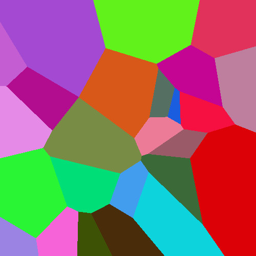

```zkl
fcn generate_voronoi_diagram(width,height,num_cells){
   image,imgx,imgy:=PPM(width,height),width,height;
   nx:=num_cells.pump(List,(0).random.fp(imgx));
   ny:=num_cells.pump(List,(0).random.fp(imgy));
   nr:=num_cells.pump(List,(0).random.fp(256));  // red
   ng:=num_cells.pump(List,(0).random.fp(256));  // blue
   nb:=num_cells.pump(List,(0).random.fp(256));  // green

   foreach y,x in (imgy,imgx){
      dmin:=(imgx-1).toFloat().hypot(imgy-1);
      j:=-1;
      foreach i in (num_cells){
         d:=(nx[i] - x).toFloat().hypot(ny[i] - y);
   if(d<dmin) dmin,j = d,i
      }
      image[x,y]=(nr[j]*0xff00 + ng[j])*0xff00 + nb[j];
   }
   image
}
```

```zkl
generate_voronoi_diagram(500,500,25).write(File("VoronoiDiagram.ppm","wb"));
```
